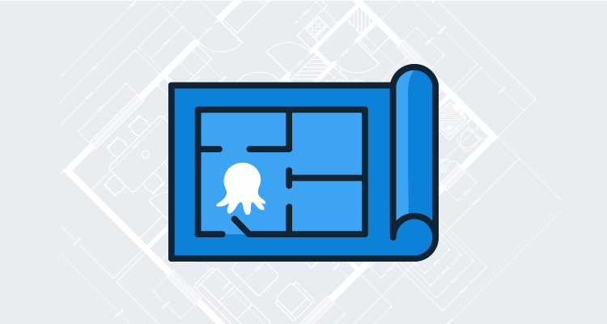
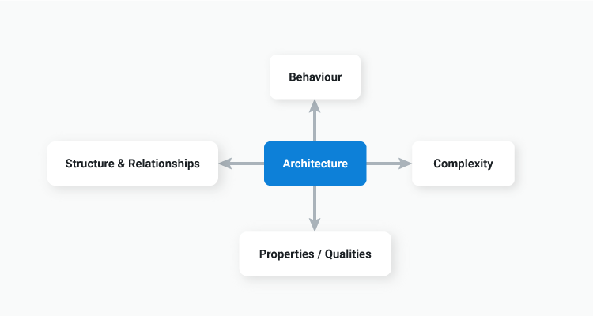
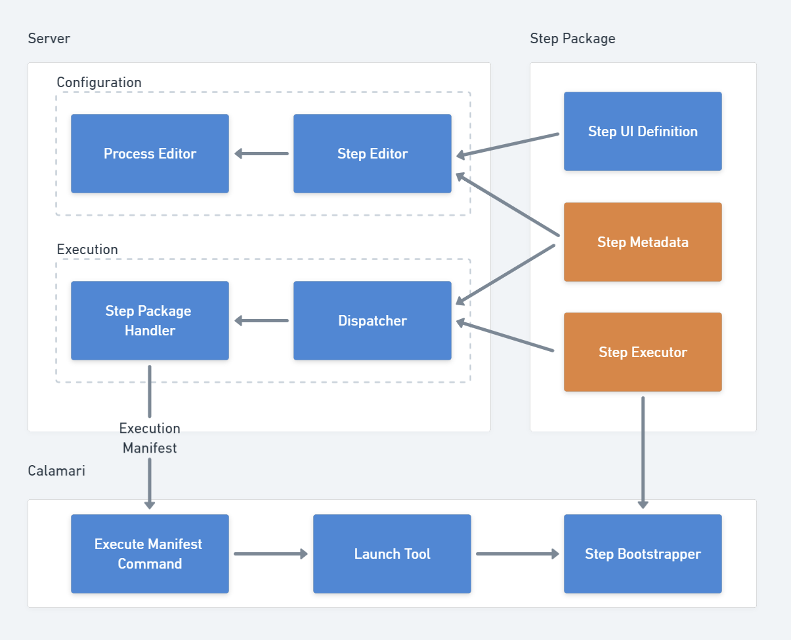
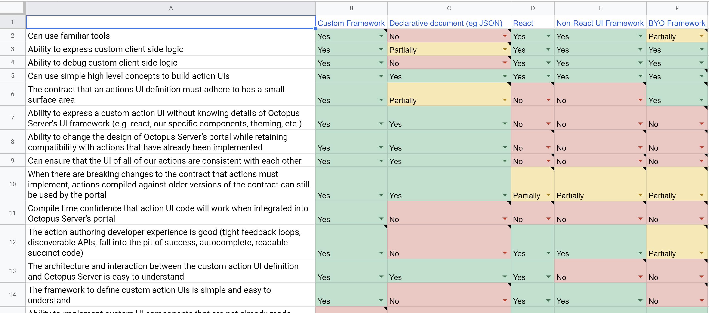

In software, architecture encompasses:

- The structure of the system
- The relationships between its components
- The properties the system emits (sometimes referred to as the "ilities")
- The behaviors the system encodes

Some systems may comprise a single, large piece of software. Others may be decomposed into smaller sub-systems that work together to accomplish goals.

Creating a new architecture is always an interesting challenge:

- Where do you start?
- What problems do you need to solve?
- How do you actually deliver something and not get lost down endless rabbit holes?

In this article we will explore how to approach defining and building a new software architecture in a way that increases your chances of success.

## Why architecture matters

Good architecture helps you make decisions and changes with speed and confidence. Want to add a new behavior? Good architecture will make it easy to reason about doing that, and to execute on it. Poor architecture will have you reasoning about how the world came to be before you can write a single line of code.

Carl Sagan once said, "If you wish to make apple pie from scratch, you must first create the universe." You _don't_ want to have to perform that sort of reasoning in software - you just want to have to reason your way up from a good set of apple pie ingredients.

Making changes with speed and confidence is a must at Octopus. The landscape of release management is growing at an unprecedented rate. New technology ecosystems are being created in which workloads can be developed. New cloud services are arriving all of the time, providing new, novel ways to host workloads. Octopus's goal is to make deploying those workloads onto those new platforms world-class, and we want to enable those experiences in Octopus as rapidly as possible.

To ensure we can achieve that goal, at Octopus we have been investing time and effort into creating a brand new architecture for developing steps within Octopus. After all, steps are the things that do the work of deployment!

### Goals

Success in software comes from knowing where the finish line is. How will you know if you've succeeded? Success isn't just having some new software. This holds true if you are defining a whole new architecture, or just building a small feature. If you don't know where you are going, any road will get you there, and we don't want to arrive just anywhere, we want to succeed!

After initial collaboration with our primary stakeholders, and with Paul, our CEO, we agreed on the following goals for the new steps architecture:

- We should be able to ship steps out-of-band of Octopus Server releases.
- Steps should be simple and easy to develop.
- It should be possible to develop steps in a technology other than C#/.NET.

These goals underpin Octopus's business goals of building up a high-performing team to deliver new deployment capabilities, and to more rapidly enable new deployment scenarios for Octopus's customers.

Goals are a must-have, as they help you reason about decisions and avoid rabbit holes. They provide a great _litmus test_ when deciding whether you should do something one way, or another. If something takes you toward one of the goals, it is probably a good thing. If it leads you away from a goal, it might be a bad thing. If it doesn't contribute to a goal at all, it's probably not needed.

### Constraints

Once we have an agreed set of goals that define success, we can begin defining the architecture itself. Once again, architecture refers to a lot of things:

> Architecture encompasses the structure of the system, the relationships between its components, the properties the system emits (sometimes referred to as the "ilities"), and the behaviors the system encodes.

For steps, we started by defining structures and relationships by breaking down what "steps" actually are into sub-systems, so that we could reason and make decisions about them.

These included:

- The Step UI
- The Step Executor
- Inputs and Outputs
- The Programming Model
- Server Integration (The packaging model)
- Deployment Execution

Initial conversations can be challenging when defining new architecture. It can be hard to "land the plane" on conversations, as you will circle how a decision in one sub-system will impact the others, exploring different viewpoints such as user experience, developer experience, and product experience with each lap. One line of conversation could take you on a full-circle lap of sub-systems, until you arrive again at the starting point you were trying to decide on.

If you're struggling to make decisions early on, and conversations feel circular or never-ending, you're likely missing a key ingredient: **constraints**.

Constraints limit the freedom of choice we have when defining and developing architecture.

This is exactly what we want early on. We want to make strong decisions about constraints we can impose, as it limits our choices and makes decisions easier.

Some of our goals already impose strict constraints, e.g. "It should be possible to develop steps in a technology other than C#/.NET."

Others are not as strict. For example, "simple and easy to develop" provides context, but is not a hard-and-fast constraint, it's a qualitative goal.

In the early stages of designing our new architecture, we struggled to gain clarity and consensus around the programming and composition model for steps. If a user wanted a step to behave "just a bit differently" and re-order the logical inner sequencing of the steps behavior, or perhaps inject some of their own unique behavior within the step, is that something we should support?

By taking a stand on the above potential requirement, we can establish a clear constraint. This constraint impacts many of the architecture's sub-systems, the UI, the executor, the programming model. It even ventures outside of our architecture's boundaries and could impact other areas of Octopus.

Working together, we decided that we don't need to enable arbitrary composition within steps. If you pursue this line of thinking, eventually you'll end up needing to produce a DSL or programming language to build up deployment processes, as that would be the only thing flexible enough to satisfy all use cases.

Instead of pursuing that, we made a decision to focus on providing high-leverage, high-value steps to our users, and give users a frictionless way to progress from opinionated steps to more flexible steps (i.e., run a template, run a script/cli) should they require their own unique behaviors.

This constraint had an immediate impact, and we could reason more clearly about our UI, our executors, our programming model, and the impact on Octopus itself, thanks to the clear limitations this constraint imposed.

### Names

Another challenging aspect in those initial conversations is that you're talking about emerging concepts that are yet to be named.

Talking about things that don't have names can quickly become frustrating. You tend to make up your own name for things based on your own context that others don't understand, and you will spend inordinate amounts of energy in conversations just ensuring everyone is talking about the same things, rather than focusing on more important details.

It is surprising how easily conversations start to flow once you have established a common language, and are no longer falling over yourselves just trying to explain which logical component or sub-system within an architecture you are talking about.

The best way forward here is to get your team together, bring up a whiteboard (virtual or physical), draw up your conceptual model, and start brainstorming names.

When we did this, we established some guidelines to ensure the names made sense not only within our team, but to a wider audience:

> Guidelines
>
> - We want to name things in a way that it makes sense to our customers
> - Naming should be simple and self-describing
> - Examples: "I want to develop a custom step!" "I want to develop a step to deploy to X Cloud."

We described each _thing_ in abstract, for example _"the thing that provides the step's UI"_. Then we attempted to name each of the abstract things.

At the end of the process, we had a clear map of sub-systems and components, and we could more freely talk about them when discussing our architecture:

### Decision making

At Octopus, we're strong believers in creating _consensus_ when we make decisions, and then executing with confidence. Almost all impactful decisions are deeply scrutinized.

When defining architecture, this scrutiny allows you to foresee system-level impacts of architectural choices. This is one of the _hardest_ things to do when building new architecture, but it is also the _most important_.

The first step toward making high-quality decisions is to collaborate closely with your team to arrive at a decision. You've worked through the candidate solutions with them, and you have established a shared understanding of their impacts. In any sufficiently complex system, you will always need to get input from others to ensure you have visibility across all potential impacts a new architecture may have, and your team is the best starting point for this.

One tool we use at Octopus to solicit input is the [straw-man proposal](https://en.wikipedia.org/wiki/Straw_man_proposal). You present your team with your proposed design for a given component or sub-system, and explain it in enough detail that the team can reason about it. With a straw-man you don't want your team to agree to it, you want them to _challenge_ it, to point out its flaws, to suggest alternatives and improvements. This type of conversation generates great insights and solution options that can lead you towards a high-quality decision.

After your team has given input, you also need to ensure the right experts have provided input on your architectural decisions.

For example, within our new architecture an overlap was identified with Project Bento, which is our new project import/export system. By talking with the team developing Bento, we discovered there was a shared piece of the system under both of our initiatives - the input model for steps. Bento needed to know if a given set of inputs contained an account, or other domain-specific resources within Octopus. It would use this knowledge to _crawl_ the set of resources it needs to export/import across spaces. We were proposing to redefine how inputs were modeled within Octopus, so we needed to make sure our proposed architecture would still satisfy Bento's requirements.

Seeking input widely does not mean design-by-committee. Ownership is important, and you as an architect should own the architecture you develop. However, it means you have a responsibility to widely seek input into your architectural designs, and find experts in other sub-systems outside of your sphere of expertise that may need to influence your designs.

> Goals and decisions
>
> Another thing that assists decision making is keeping goals front-of-mind. Whilst constraints limit our choices, so we know which things we don't need to make decisions about, goals can help us decide between multiple potentially valid options.
>
> Goals can be used as a litmus test. Does this decision take us toward achieving this goal, or does it push us further away from achieving it? Ensure they are considered for all fundamental decisions. We have revisited our goal of steps being "simple and easy to develop" numerous times when deciding how to implement the various APIs that underpin the new architecture.

### Complexity

Complexity within architecture tends to come in two categories:

- Static complexity, which deals with the system's components and their relationships.
- Emergent complexity, which comes from users using your software in novel and unique ways, and overall changes in the impact of usage on the systems.

Architectural decisions need to take both into account.

#### Static complexity

Static complexity tends to impact sense-making; it's hard to make a decision if the area you are working within is very complex. It can be hard to reason about all the ways your decision might impact various sub-systems.

The solution to this problem is diving into analysis. We use [Whimsical](https://whimsical.com/) heavily at Octopus, but other diagramming tools can be helpful in these scenarios. You need a tool that allows you to build flowcharts and visualize connections between various sub-systems in specific contexts. This will help you identify all the places you need to consider when making a decision.

There is no avoiding this type of analysis. If you don't do it, you'll make wrong assumptions that will bite you later. It's also hard to "outsource" this type of analysis. Someone might be able to describe the inner workings of a particular sub-system, but if they don't have a detailed map to provide you, it's likely you're going to need to pull the code and get diagramming.

#### Emergent complexity

Emergent complexity comes with attempting to anticipate how humans may interact with the system once built, or how the usage of the system may change over time, and how you will need to accommodate that change.

We can either attempt to limit emergent complexity within our architecture, or acknowledge and control it.

To limit it, we can go back to constraints. Can we constrain the ways we will enable users to use our system? This will limit the emergent complexity that is possible, and it will also simplify our decision making.

If we have constraints in place, we can look at how certain implementation decisions may help us control emergent complexity.

When we were deciding how a step's UI should be expressed, we were faced with a decision: should we let users bring their own HTML, JavaScript, and framework to express the step UI? What about having them just provide some HTML? What if it were an API written in code? What about just plain old declarative JSON? Each of these solutions would have a very different impact on emergent complexity.

To tackle this complexity and help make a decision, we created a decision matrix to help visualize how each option would either solve or not solve each piece of complexity.

By enumerating the properties a solution might contribute for us, and evaluating each solution candidate against these properties, we could make a decision that took our emergent complexity into account.

We decided to implement a custom UI framework, that is, code that could be used to express a step's UI. This gives people the power and flexibility of implementing the UI in code and familiar tooling, but it avoids the emergent complexity that comes with people supplying arbitrary HTML and JavaScript.

### "ilities"

Ilities, or [system quality attributes](https://en.wikipedia.org/wiki/List_of_system_quality_attributes), refer to non-functional requirements that a system may need to adhere to.

A good architecture will emit properties that support the "ilities" that you've identified as important. These "ilities" tend to cut across all of the sub-systems within an architecture.

An example of an "ility" that is high on our mind for the new steps architecture is **maintainability**.

If we need to make changes on one side of an interface boundary between steps and Octopus itself, we want to make sure we don't need to force the propagation of that change across hundreds of steps (or require step authors to do the same).

Knowing this is something that's important to our architecture, we are focusing with great detail on our API surfaces which form the interfaces between steps and Octopus, on versioning, and on compatibility.

There are many compatibility surfaces within the steps architecture. Making sure these surfaces have explicit versioning in-place will allow us to make changes to them over time, and make deliberate decisions about their compatibility as they evolve.

It's important to brainstorm the various "ilities" that might be important to your architecture early on, so that you can take them into account as your architecture evolves.

## Conclusion

Good software architecture allows you to tame the complexity of software as it grows, enabling you to develop new functionality, or change existing functionality, with speed and confidence.

Good architecture:

- Is founded on a set of clear goals that can be tied to business goals.
- Expresses strong constraints that limit the complexity the architecture needs to support.
- Establishes a common language for sub-systems and components.
- Is developed on the back of many high-quality decisions, which have had the appropriate analysis, scrutiny, and expert input applied.
- Acknowledges complexity, by ensuring it is understood with deep analysis, and is designed for when it is emergent.
- Addresses the important "ilities", making sure they are considered and designed for within all of the sub-systems defined within the architecture.
