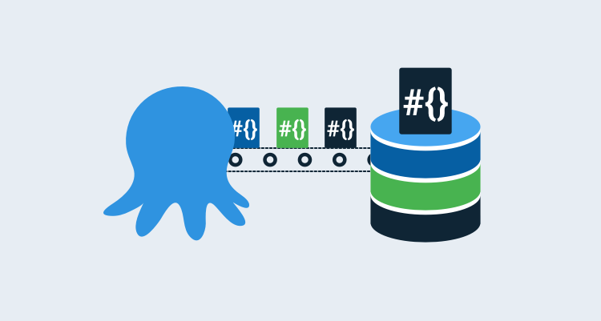

In a [previous post](https://octopus.com/blog/deploying-ssis), I walked through how to deploy SQL Server Integration Services (SSIS) packages using Octopus Deploy.  In this post, I discuss a problem I encountered after the package was deployed to the server, due to using a newer version of Visual Studio to develop the SSIS package, but deploying to an older version of SQL Server.

## The error
After a successful deployment, the developer attempted to run the SSIS package but received the following error message:

```
Failed to configure a connection property that has the following path: \Package.Connections [WWI_Source_DB].Properties[ConnectByProxy]. Element "ConnectByProxy" does not exist in collection "Properties".
```

To investigate, I first looked at the environment variable mapping:


The property exists and is mapped to the appropriate environment variable.

As an experiment, I had the developer publish the SSIS package directly from Visual Studio and the package worked correctly.  The main difference between the two methods was that Visual Studio publish didn't map package parameters to environment variables.  Instead, they were set to **Use default value from package**.  In this case, the default value was displayed as `False`.


:::hint
To get to this window:

1. Right-click the package and choose **Configure**.
1. Change the scope drop-down to **All packages and projects**.
1. Click the **Connection Managers** tab
:::

I redeployed the SSIS package using Octopus Deploy.  Once deployed, I edited the package and chose **Edit value** and selected `False`.  The package failed again with the same error, however, setting the value to **Use default value from package** succeeded.

## The problem

After several hours of research, I discovered the developer was using the most recent version of Visual Studio to develop the SSIS package, but it was deploying to an older version of SQL Server.  

The newer version of Visual Studio introduced additional properties to the connection manager that the older version of SQL Server didn't know about. The error was trying to tell us this, but it was unclear.

`Element "ConnectByProxy" does not exist in collection "Properties"` was saying that `ConnectByProxy` didn't exist in the Server collection of `Properties` for a package, not the package itself.  The selection of **Use default value from package** was also misleading.  

From the UI, this selection displayed a value of `False`, however, the actual value was `null` (discovered in reading the XML of the package).

## The solution
There are two solutions:

- Manually update the package parameters to **Use value from package** setting.
- Use PowerShell to update the package parameters for you.

### Manual method
The hint above describes how to navigate to the package parameters and manually update them.  However, this is inefficient as it would need to be repeated after each deployment.

### PowerShell
A better solution is to add a Run a Script task to your deployment process to perform the edits for you.

The following script should get you most of the way there:

```PowerShell
# define functions
Function Import-Assemblies
{
    # display action
    Write-Host "Importing assemblies..."

    # get folder we're executing in
    $WorkingFolder = Split-Path $script:MyInvocation.MyCommand.Path
    Write-Host "Execution folder: $WorkingFolder"

    # Load the IntegrationServices Assembly
    [Reflection.Assembly]::LoadWithPartialName("Microsoft.SqlServer.Management.IntegrationServices") | Out-Null # Out-Null suppresses a message that would normally be displayed saying it loaded out of GAC
}

Function Get-Catalog
{
    # define parameters
    Param ($CatalogName, $IntegrationServices)

    # define working variables
    $Catalog = $null

    # check to see if there are any catalogs
    if($integrationServices.Catalogs.Count -gt 0 -and $integrationServices.Catalogs[$CatalogName])
    {
        # get reference to catalog
        $Catalog = $integrationServices.Catalogs[$CatalogName]
    }
    else
    {
        Write-Error  "Catalog $CataLogName does not exist or the Tentacle account does not have access to it."

        # throw error
        throw
    }

    # return the catalog
    return $Catalog
}

Function Get-Folder
{
    # parameters
    Param($FolderName, $Catalog)

    # try to get reference to folder
    $Folder = $Catalog.Folders[$FolderName]

    # check to see if $Folder has a value
    if(!$Folder)
    {
        Write-Error "Folder not found."
        throw
    }

    # return the folder reference
    return $Folder
}

Function Clear-Parameter
{
    # define parameters
    Param($ParameterName)

    # Create a connection to the server
    $sqlConnectionString = "Data Source=$SQLServer;Initial Catalog=master;Integrated Security=SSPI;"
    $sqlConnection = New-Object System.Data.SqlClient.SqlConnection $sqlConnectionString
    $ISNamespace = "Microsoft.SqlServer.Management.IntegrationServices"

    # create integration services object
    $integrationServices = New-Object "$ISNamespace.IntegrationServices" $sqlConnection

    try
    {
        # get catalog reference
        $Catalog = Get-Catalog -CatalogName $CataLogName -IntegrationServices $integrationServices
        $Folder = Get-Folder -FolderName $FolderName -Catalog $Catalog

        # get reference to project
        $Project = $Folder.Projects[$ProjectName]

        # find specific parameter
        $Parameter = $Project.Parameters | Where-Object {$_.Name -eq $ParameterName}

        # set parameter to design time default value
        Write-Host "Clearing parameter $ParameterName"
        $Parameter.Clear()

        # set value
        $Project.Alter()
    }
    finally
    {
        # close connection
        $sqlConnection.Close()
    }
}


# get reference to assemblies needed
Import-Assemblies

$SQLServer = "#{Project.Database.Server.Name}"
$CataLogName = "SSISDB"
$FolderName = "#{Project.SSISDB.Folder.Name}"
$ProjectName = "#{Project.SSISDB.Project.Name}"


# fix the problem
Clear-Parameter -ParameterName "CM.WWI_Source_DB.ConnectByProxy"
```

With this script, you can call `Clear-Parameter` for whatever parameters that need to be set to `Use default value from package` on.

## Conclusion

While automating SSIS deployments, I discovered a newer version of Visual Studio was introducing additional properties to the connection manager that an older version of SQL Server didn't know about. I hope this blog saves you from encountering the same issue.

Happy deployments!
