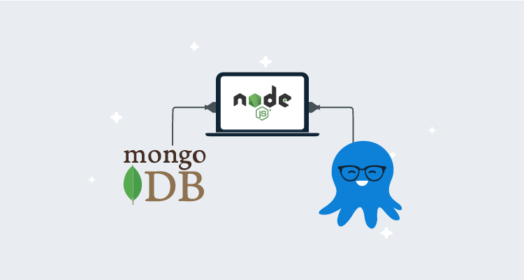
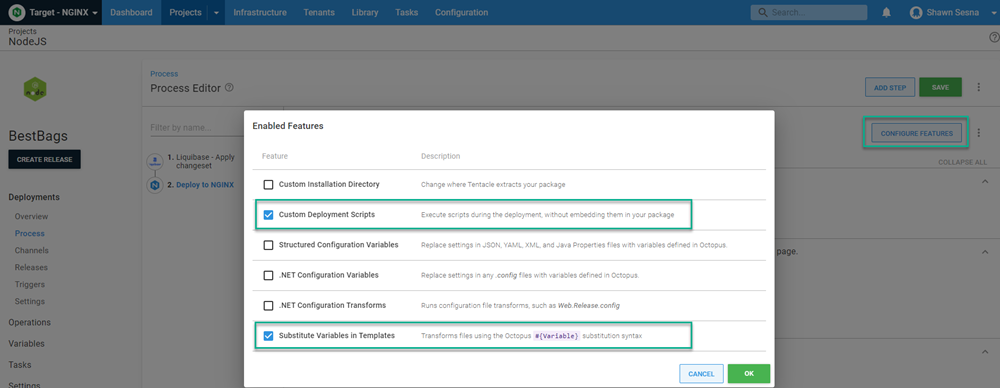
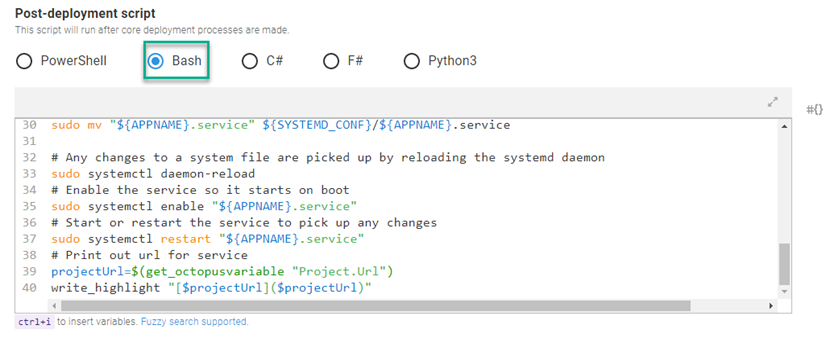
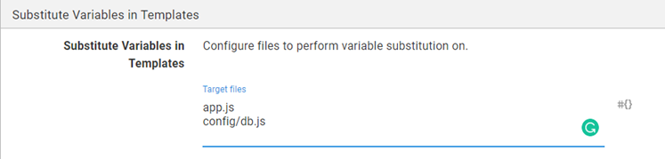
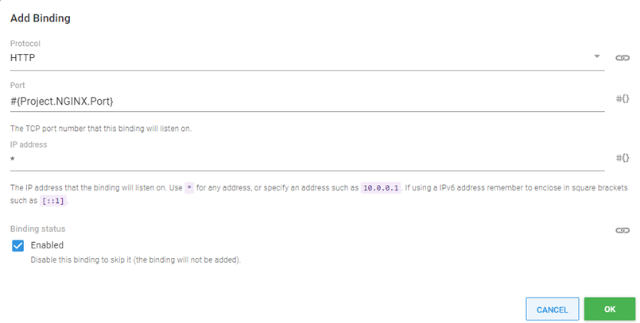
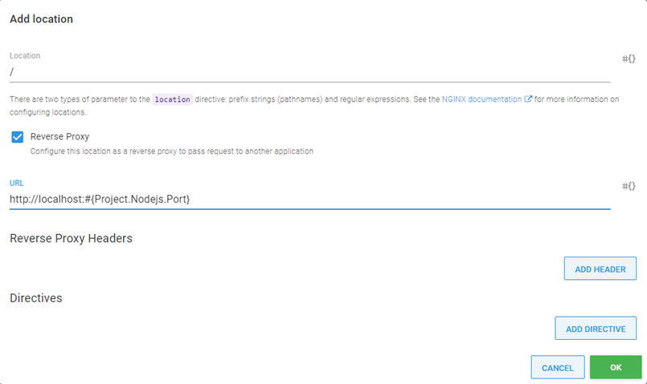
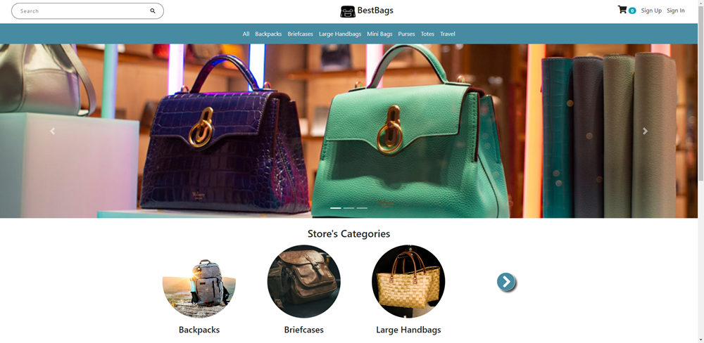

Initially, JavaScript only executed on client browsers, to do things like manipulate the Document Object Model (DOM) or perform input validation to save a trip to the server.  Node.js, however, is a technology that developers can use to write client-side _and_ server-side code using the JavaScript language.  

In this post, I demonstrate how to deploy applications written in Node.js using Octopus Deploy.

## Sample application
For this post, I chose the [BestBags](https://github.com/maryamaljanabi/bestbags-nodejs-ecommerce) e-commerce sample application.  This sample includes everything you need to get it up and running quickly, even files to create and seed the MongoDB database that it uses as a back-end.  

### Modifications
To make this project more configurable, I made some minor modifications.  The original project hard-coded values that could change as the application moves from environment to environment:

- Port to listen on
- Database connection string


#### Port
The port that the application listens on is defined in the `app.js` file.  It checks if an environment variable has been set, and if it hasn't, it uses a static value.  

I changed this to use Octostache syntax instead so I could take advantage of the [Substitute Variables in Templates](https://octopus.com/docs/projects/steps/configuration-features/substitute-variables-in-templates) feature:

```javascript
var port = process.env.PORT || #{Project.Nodejs.Port};
```

#### Database connection
The database connection string is located in the `config/db.js` file.  Similar to `app.js`, the code tests for an environment variable and uses a default value if it's not set.  

I replaced the default value with Octostache so that I can use the Substitute Variables in Templates feature :

```javascript
const uri = process.env.MONGO_URI || "mongodb://#{MongoDB.Admin.User.Name}:#{MongoDB.Admin.User.Password}@#{MongoDB.Server.Name}:#{MongoDB.Server.Port}/#{Project.Database.Name}?authSource=admin";
```

#### Liquibase changelog for MongoDB
As mentioned, the sample application includes some files in the `seedDb` folder that will create collections in MongoDB and populate the collections with documents.  While it's possible to use the method of instructing `Node` to execute files to manipulate the database, it's not very scalable. [Liquibase](https://liquibase.org) is compatible with MongoDB and is built to handle database deployments. I added `dbchangelog.xml` which contains the same information as the files in `seedDb` in the format that Liquibase expects.

:::hint
The changelog can be in several file formats (XML, JSON, or YAML).  It may be necessary to URL encode characters like `&` as `&amp;` to ensure they're valid.
:::

<details>
	<summary>dbchangelog.xml</summary>

```xml
<?xml version="1.0" encoding="UTF-8"?>
<databaseChangeLog
xmlns="http://www.liquibase.org/xml/ns/dbchangelog"
xmlns:xsi="http://www.w3.org/2001/XMLSchema-instance"
xmlns:ext="http://www.liquibase.org/xml/ns/dbchangelog-ext"
xsi:schemaLocation="http://www.liquibase.org/xml/ns/dbchangelog http://www.liquibase.org/xml/ns/dbchangelog/dbchangelog-4.0.xsd
      http://www.liquibase.org/xml/ns/dbchangelog-ext http://www.liquibase.org/xml/ns/dbchangelog/dbchangelog-ext.xsd">

    <changeSet id="1" author="Shawn Sesna">
        <ext:createCollection collectionName="categories">
        </ext:createCollection>
    </changeSet>
    <changeSet id="2" author="Shawn Sesna">
        <ext:createCollection collectionName="products">
        </ext:createCollection>
    </changeSet>
    <changeSet id="3" author="Shawn Sesna">
        <ext:insertMany collectionName="categories">
            <ext:documents>
                [
                    {"_id":{"$oid":"6080461b3167675d2819ad18"},"title":"Backpacks","slug":"backpacks","__v":0},
                    {"_id":{"$oid":"6080461b3167675d2819ad19"},"title":"Briefcases","slug":"briefcases","__v":0},
                    {"_id":{"$oid":"6080461b3167675d2819ad1a"},"title":"Mini Bags","slug":"mini-bags","__v":0},
                    {"_id":{"$oid":"6080461b3167675d2819ad1b"},"title":"Large Handbags","slug":"large-handbags","__v":0},
                    {"_id":{"$oid":"6080461b3167675d2819ad1c"},"title":"Travel","slug":"travel","__v":0},
                    {"_id":{"$oid":"6080461b3167675d2819ad1d"},"title":"Totes","slug":"totes","__v":0},
                    {"_id":{"$oid":"6080461b3167675d2819ad1e"},"title":"Purses","slug":"purses","__v":0}
                ]
            </ext:documents>
        </ext:insertMany>
    </changeSet>
    <changeSet id="4" author="Shawn Sesna">
        <ext:insertMany collectionName="products">
            <ext:documents>
[{
  "_id": {
    "$oid": "6080462bee0e8361b4a82e96"
  },
  "productCode": "2202-3592423009",
  "title": "Classic Blue Backpack",
  "imagePath": "https://images.unsplash.com/photo-1553062407-98eeb64c6a62?ixlib=rb-1.2.1&amp;ixid=eyJhcHBfaWQiOjEyMDd9&amp;auto=format&amp;fit=crop&amp;w=334&amp;q=80",
  "description": "Optio accusamus itaque consequuntur eius laudantium laborum nobis. Ratione optio animi corrupti. Sit veniam voluptatem iure.",
  "price": 25,
  "manufacturer": "Kutch and Sons",
  "available": true,
  "category": {
    "$oid": "6080461b3167675d2819ad18"
  },
  "createdAt": {
    "$date": "2021-04-21T15:35:07.056Z"
  },
  "__v": 0
},{
  "_id": {
    "$oid": "6080462bee0e8361b4a82e97"
  },
  "productCode": "4085-4774696701",
  "title": "Black Fjallraven Backpack",
  "imagePath": "https://images.unsplash.com/photo-1562546106-b9cb3a76a206?ixlib=rb-1.2.1&amp;ixid=eyJhcHBfaWQiOjEyMDd9&amp;auto=format&amp;fit=crop&amp;w=1534&amp;q=80",
  "description": "Repellat at minima labore sapiente. Vitae qui voluptatem fugiat sint hic sapiente et in. Et corporis eius dolor eos velit sed. Placeat incidunt consectetur ducimus optio delectus modi est et sint. Quos quasi quo corporis consequatur fugiat voluptates perferendis.",
  "price": 31,
  "manufacturer": "Swift Group",
  "available": true,
  "category": {
    "$oid": "6080461b3167675d2819ad18"
  },
  "createdAt": {
    "$date": "2021-04-21T15:35:07.141Z"
  },
  "__v": 0
},{
  "_id": {
    "$oid": "6080462bee0e8361b4a82e98"
  },
  "productCode": "6645-0000839345",
  "title": "Brown and Green Leather Backpack",
  "imagePath": "https://images.unsplash.com/photo-1577733966973-d680bffd2e80?ixlib=rb-1.2.1&amp;ixid=eyJhcHBfaWQiOjEyMDd9&amp;auto=format&amp;fit=crop&amp;w=1500&amp;q=80",
  "description": "Dignissimos aut aut et. Accusantium qui repellendus ut sit sapiente consequatur. Rerum odit expedita hic tempora.",
  "price": 14,
  "manufacturer": "Greenfelder LLC",
  "available": true,
  "category": {
    "$oid": "6080461b3167675d2819ad18"
  },
  "createdAt": {
    "$date": "2021-04-21T15:35:07.145Z"
  },
  "__v": 0
},{
  "_id": {
    "$oid": "6080462bee0e8361b4a82e99"
  },
  "productCode": "3334-9549765845",
  "title": "Grey Stylish Backpack",
  "imagePath": "https://images.unsplash.com/photo-1546938576-6e6a64f317cc?ixlib=rb-1.2.1&amp;ixid=eyJhcHBfaWQiOjEyMDd9&amp;auto=format&amp;fit=crop&amp;w=1400&amp;q=80",
  "description": "Tenetur sed porro magnam a rem deserunt tempore aut. Aspernatur et ex quia laborum magnam temporibus. Eum architecto molestias. Ad voluptas velit sunt.",
  "price": 27,
  "manufacturer": "Kshlerin LLC",
  "available": true,
  "category": {
    "$oid": "6080461b3167675d2819ad18"
  },
  "createdAt": {
    "$date": "2021-04-21T15:35:07.149Z"
  },
  "__v": 0
},{
  "_id": {
    "$oid": "6080462bee0e8361b4a82e9a"
  },
  "productCode": "5558-3659233580",
  "title": "Elegant Black Backpack",
  "imagePath": "https://images.unsplash.com/photo-1585916420730-d7f95e942d43?ixlib=rb-1.2.1&amp;ixid=eyJhcHBfaWQiOjEyMDd9&amp;auto=format&amp;fit=crop&amp;w=1534&amp;q=80",
  "description": "Voluptatem accusamus sequi quasi atque et molestiae in reiciendis. Quia voluptas quis. Non inventore distinctio molestiae amet maxime fugiat voluptas saepe. Et doloribus ut enim provident cumque quibusdam. Quo mollitia eos voluptatem vero dolores nostrum.",
  "price": 12,
  "manufacturer": "Brekke Inc",
  "available": true,
  "category": {
    "$oid": "6080461b3167675d2819ad18"
  },
  "createdAt": {
    "$date": "2021-04-21T15:35:07.153Z"
  },
  "__v": 0
},{
  "_id": {
    "$oid": "6080462bee0e8361b4a82e9b"
  },
  "productCode": "5318-3250673094",
  "title": "Practical Blue Backpack With Leather Straps",
  "imagePath": "https://images.pexels.com/photos/2905238/pexels-photo-2905238.jpeg?auto=compress&amp;cs=tinysrgb&amp;dpr=3&amp;h=750&amp;w=1260",
  "description": "Eos dolores voluptatum voluptates laborum nesciunt aut. Dolorum doloribus iste. Atque sint fugiat qui.",
  "price": 30,
  "manufacturer": "Wisoky and Sons",
  "available": true,
  "category": {
    "$oid": "6080461b3167675d2819ad18"
  },
  "createdAt": {
    "$date": "2021-04-21T15:35:07.156Z"
  },
  "__v": 0
},{
  "_id": {
    "$oid": "6080462bee0e8361b4a82e9c"
  },
  "productCode": "0362-0259508669",
  "title": "Soft Classic Biege Backpack",
  "imagePath": "https://images.pexels.com/photos/2422476/pexels-photo-2422476.png?auto=compress&amp;cs=tinysrgb&amp;dpr=3&amp;h=750&amp;w=1260",
  "description": "Molestias sed provident voluptatem corporis. Et asperiores neque magnam eaque amet. Consectetur impedit dicta magnam aut nobis hic sed et. Ad nihil aliquid porro.",
  "price": 17,
  "manufacturer": "Jacobi and Sons",
  "available": true,
  "category": {
    "$oid": "6080461b3167675d2819ad18"
  },
  "createdAt": {
    "$date": "2021-04-21T15:35:07.161Z"
  },
  "__v": 0
},{
  "_id": {
    "$oid": "6080462bee0e8361b4a82e9d"
  },
  "productCode": "3728-3730819531",
  "title": "Practical Durable Backpack",
  "imagePath": "https://images.pexels.com/photos/1545998/pexels-photo-1545998.jpeg?auto=compress&amp;cs=tinysrgb&amp;dpr=3&amp;h=750&amp;w=1260",
  "description": "Et ea ratione qui omnis repellat neque quae. Autem qui officiis. Hic deserunt quia illum ea omnis voluptatem rem.",
  "price": 42,
  "manufacturer": "Gottlieb Inc",
  "available": true,
  "category": {
    "$oid": "6080461b3167675d2819ad18"
  },
  "createdAt": {
    "$date": "2021-04-21T15:35:07.165Z"
  },
  "__v": 0
},{
  "_id": {
    "$oid": "6080462bee0e8361b4a82e9e"
  },
  "productCode": "3556-8442757269",
  "title": "Comfortable Laptop Backpack",
  "imagePath": "https://live.staticflickr.com/3428/3361015646_303a2d0571_b.jpg",
  "description": "Corporis omnis omnis dolorem. Eum qui perspiciatis earum. Delectus modi aut hic id laborum adipisci. Eligendi natus neque quis.",
  "price": 32,
  "manufacturer": "Schamberger LLC",
  "available": true,
  "category": {
    "$oid": "6080461b3167675d2819ad18"
  },
  "createdAt": {
    "$date": "2021-04-21T15:35:07.168Z"
  },
  "__v": 0
},{
  "_id": {
    "$oid": "6080462bee0e8361b4a82e9f"
  },
  "productCode": "1252-2377230172",
  "title": "Extra Large Grey Backpack",
  "imagePath": "https://storage.needpix.com/rsynced_images/backpack-2634622_1280.jpg",
  "description": "Ut vitae sequi consequatur provident esse facere molestiae. Harum nemo quos. Reiciendis voluptatum saepe reiciendis veniam quas. Et sunt nobis aperiam necessitatibus dicta vel placeat nam tenetur. Quae alias quia repudiandae eum fugit.",
  "price": 37,
  "manufacturer": "Balistreri Group",
  "available": true,
  "category": {
    "$oid": "6080461b3167675d2819ad18"
  },
  "createdAt": {
    "$date": "2021-04-21T15:35:07.172Z"
  },
  "__v": 0
},{
  "_id": {
    "$oid": "6080462bee0e8361b4a82ea0"
  },
  "productCode": "9680-8294649346",
  "title": "Aluminium Metal Suitcase",
  "imagePath": "https://upload.wikimedia.org/wikipedia/commons/6/6d/Aluminium_Briefcase.jpg",
  "description": "Dolor voluptas necessitatibus architecto voluptatem ut voluptate accusantium. Ea ut dolorem voluptatem iusto et vero fuga et. Commodi earum molestiae.",
  "price": 33,
  "manufacturer": "Breitenberg Inc",
  "available": true,
  "category": {
    "$oid": "6080461b3167675d2819ad19"
  },
  "createdAt": {
    "$date": "2021-04-21T15:35:07.179Z"
  },
  "__v": 0
},{
  "_id": {
    "$oid": "6080462bee0e8361b4a82ea1"
  },
  "productCode": "0306-0419633387",
  "title": "Black Leather Durable Suitcase",
  "imagePath": "http://res.freestockphotos.biz/pictures/1/1751-black-leather-briefcase-on-a-white-background-pv.jpg",
  "description": "Iste numquam animi impedit sint. Rerum sed dolore est est esse ut aut omnis sed. Facilis non et. Explicabo quaerat quae facere praesentium ut tempora. Cumque aut natus dolores quia laudantium necessitatibus. Dolores sint reiciendis sit aut occaecati veniam.",
  "price": 10,
  "manufacturer": "Stehr Group",
  "available": true,
  "category": {
    "$oid": "6080461b3167675d2819ad19"
  },
  "createdAt": {
    "$date": "2021-04-21T15:35:07.183Z"
  },
  "__v": 0
},{
  "_id": {
    "$oid": "6080462bee0e8361b4a82ea2"
  },
  "productCode": "4001-0940276285",
  "title": "Stylish Pastel Pink Travel Bag",
  "imagePath": "https://p1.pxfuel.com/preview/899/786/420/travel-bag-hard-and-bag.jpg",
  "description": "Quos corporis aliquid sit doloremque eos culpa quibusdam dolor sed. Quam sint illo adipisci omnis dignissimos tempora. Commodi libero est repellat quasi non maiores expedita qui ea. Esse molestiae eum odio molestiae repellendus magnam.",
  "price": 43,
  "manufacturer": "Hayes Inc",
  "available": true,
  "category": {
    "$oid": "6080461b3167675d2819ad1c"
  },
  "createdAt": {
    "$date": "2021-04-21T15:35:07.189Z"
  },
  "__v": 0
},{
  "_id": {
    "$oid": "6080462bee0e8361b4a82ea3"
  },
  "productCode": "8778-9620671594",
  "title": "A Fahionable Set of Two Pink Travel Bags",
  "imagePath": "https://p1.pxfuel.com/preview/479/120/981/luggage-metallic-luguagge-case.jpg",
  "description": "Deleniti rerum voluptas cumque impedit reiciendis officia. Amet ipsam voluptatem aspernatur totam enim culpa doloribus. Et quo temporibus ad amet a alias.",
  "price": 28,
  "manufacturer": "Schneider Group",
  "available": true,
  "category": {
    "$oid": "6080461b3167675d2819ad1c"
  },
  "createdAt": {
    "$date": "2021-04-21T15:35:07.193Z"
  },
  "__v": 0
},{
  "_id": {
    "$oid": "6080462bee0e8361b4a82ea4"
  },
  "productCode": "0793-8515385442",
  "title": "White and Black Hard Luggage",
  "imagePath": "https://images.unsplash.com/photo-1565026057447-bc90a3dceb87?ixlib=rb-1.2.1&amp;ixid=eyJhcHBfaWQiOjEyMDd9&amp;auto=format&amp;fit=crop&amp;w=1534&amp;q=80",
  "description": "Nisi officiis aut debitis perferendis qui. Dolorem sequi aut ea labore. Eos incidunt autem ea veritatis quo aperiam minima. Consequuntur expedita voluptatibus a perspiciatis dicta nesciunt dolores laboriosam sint. Rem hic alias eaque. Velit repellendus voluptates est quisquam dolore rerum eveniet dicta.",
  "price": 15,
  "manufacturer": "Johns LLC",
  "available": true,
  "category": {
    "$oid": "6080461b3167675d2819ad1c"
  },
  "createdAt": {
    "$date": "2021-04-21T15:35:07.196Z"
  },
  "__v": 0
},{
  "_id": {
    "$oid": "6080462bee0e8361b4a82ea5"
  },
  "productCode": "4604-6034994643",
  "title": "Rainbow Dotted Duffle Bag Luggage",
  "imagePath": "https://cdn.pixabay.com/photo/2019/06/20/16/10/duffle-bag-4287485_960_720.png",
  "description": "Aperiam fuga illum culpa nesciunt illum. Est animi neque ipsa ut consectetur suscipit. Autem mollitia aut et.",
  "price": 19,
  "manufacturer": "Schiller Group",
  "available": true,
  "category": {
    "$oid": "6080461b3167675d2819ad1c"
  },
  "createdAt": {
    "$date": "2021-04-21T15:35:07.199Z"
  },
  "__v": 0
},{
  "_id": {
    "$oid": "6080462bee0e8361b4a82ea6"
  },
  "productCode": "1070-5263957636",
  "title": "Blue and Gray Classic Suitcase",
  "imagePath": "https://p0.pikrepo.com/preview/74/133/blue-and-gray-suede-rolling-luggage-thumbnail.jpg",
  "description": "Aut inventore dolores magnam omnis. Rem eaque qui fugit ratione eaque maiores et qui odio. Ut harum omnis quod ipsum omnis cupiditate mollitia cupiditate nihil. Voluptas aliquam nam soluta incidunt voluptate voluptatem et qui. Optio eos harum accusantium. Quo accusantium molestiae voluptate.",
  "price": 30,
  "manufacturer": "Weber LLC",
  "available": true,
  "category": {
    "$oid": "6080461b3167675d2819ad1c"
  },
  "createdAt": {
    "$date": "2021-04-21T15:35:07.202Z"
  },
  "__v": 0
},{
  "_id": {
    "$oid": "6080462bee0e8361b4a82ea7"
  },
  "productCode": "6934-6545730771",
  "title": "A Set of Three Hard Durable Suitcases",
  "imagePath": "https://cdn.pixabay.com/photo/2019/01/22/15/53/suitcases-3948389_960_720.png",
  "description": "Cupiditate dolorem illo. Consequuntur qui dignissimos est fuga. Consequatur laudantium qui.",
  "price": 30,
  "manufacturer": "Glover LLC",
  "available": true,
  "category": {
    "$oid": "6080461b3167675d2819ad1c"
  },
  "createdAt": {
    "$date": "2021-04-21T15:35:07.206Z"
  },
  "__v": 0
},{
  "_id": {
    "$oid": "6080462bee0e8361b4a82ea8"
  },
  "productCode": "2974-9628270546",
  "title": "Light Blue Hard Luggage",
  "imagePath": "https://cdn.pixabay.com/photo/2019/07/09/11/52/travel-bag-4326738_960_720.jpg",
  "description": "Eligendi nihil amet. Id sint voluptatum et omnis quia sapiente. Sed delectus delectus corrupti qui quia est qui qui culpa. Numquam temporibus debitis dolor ut animi molestiae quisquam. Placeat dolores deleniti excepturi possimus est. Facere minus quod saepe distinctio at itaque debitis dignissimos.",
  "price": 27,
  "manufacturer": "Gutkowski Inc",
  "available": true,
  "category": {
    "$oid": "6080461b3167675d2819ad1c"
  },
  "createdAt": {
    "$date": "2021-04-21T15:35:07.209Z"
  },
  "__v": 0
},{
  "_id": {
    "$oid": "6080462bee0e8361b4a82ea9"
  },
  "productCode": "7467-1990168016",
  "title": "Black Leather Vintage Suitcase",
  "imagePath": "https://p0.pxfuel.com/preview/942/496/984/various-bag-bags-luggage.jpg",
  "description": "Quam expedita mollitia et commodi quae consequuntur sunt. At at aperiam itaque vel sequi totam. Est a fuga.",
  "price": 16,
  "manufacturer": "Kohler Group",
  "available": true,
  "category": {
    "$oid": "6080461b3167675d2819ad1c"
  },
  "createdAt": {
    "$date": "2021-04-21T15:35:07.212Z"
  },
  "__v": 0
},{
  "_id": {
    "$oid": "6080462bee0e8361b4a82eaa"
  },
  "productCode": "1046-4500322571",
  "title": "A Set of Three Large Travel Bags",
  "imagePath": "https://p0.pxfuel.com/preview/273/580/962/travelvarious-bag-bags-holiday.jpg",
  "description": "Delectus porro et sit aliquid rerum velit. Voluptatem quod fugit pariatur. Ea sed fugiat reprehenderit rerum sed ipsum maiores et omnis. Tenetur possimus autem totam rerum. Animi eaque et maiores cum cupiditate qui odio mollitia et. Ut ut veritatis.",
  "price": 13,
  "manufacturer": "Schmitt Group",
  "available": true,
  "category": {
    "$oid": "6080461b3167675d2819ad1c"
  },
  "createdAt": {
    "$date": "2021-04-21T15:35:07.216Z"
  },
  "__v": 0
},{
  "_id": {
    "$oid": "6080462bee0e8361b4a82eab"
  },
  "productCode": "4356-2358381178",
  "title": "Two Stylish Light Green Travel Bags With Different Sizes",
  "imagePath": "https://p1.pxfuel.com/preview/926/897/247/travel-bag-hard-and-bag.jpg",
  "description": "Quia qui saepe quisquam rerum natus. Vel enim fuga itaque placeat ut odit. Odit cupiditate nemo quos quia non explicabo quam repellat eveniet. Consequatur nulla blanditiis quibusdam et error voluptate rem sed repellat. Unde explicabo harum temporibus.",
  "price": 14,
  "manufacturer": "Deckow and Sons",
  "available": true,
  "category": {
    "$oid": "6080461b3167675d2819ad1c"
  },
  "createdAt": {
    "$date": "2021-04-21T15:35:07.220Z"
  },
  "__v": 0
},{
  "_id": {
    "$oid": "6080462bee0e8361b4a82eac"
  },
  "productCode": "2683-2539802762",
  "title": "Simple Blue Luggage with Many Compartments",
  "imagePath": "https://p0.pxfuel.com/preview/963/699/697/bag-blue-handbag-white.jpg",
  "description": "Vel sed quo tenetur adipisci delectus dolor porro illum. Quia similique debitis eos voluptatem. Voluptas repudiandae alias dolor quis voluptatem deleniti harum explicabo architecto. Facere nostrum accusantium similique temporibus reiciendis.",
  "price": 17,
  "manufacturer": "Orn Group",
  "available": true,
  "category": {
    "$oid": "6080461b3167675d2819ad1c"
  },
  "createdAt": {
    "$date": "2021-04-21T15:35:07.224Z"
  },
  "__v": 0
},{
  "_id": {
    "$oid": "6080462bee0e8361b4a82ead"
  },
  "productCode": "1634-4331635389",
  "title": "Pink Leather Crossbody Bag",
  "imagePath": "https://images.unsplash.com/photo-1566150905458-1bf1fc113f0d?ixlib=rb-1.2.1&amp;ixid=eyJhcHBfaWQiOjEyMDd9&amp;auto=format&amp;fit=crop&amp;w=1502&amp;q=80",
  "description": "Libero repellendus sunt eius blanditiis qui. Quibusdam libero et dolore nesciunt aut repellat. Ut placeat quod accusamus ducimus.",
  "price": 37,
  "manufacturer": "Mann Inc",
  "available": true,
  "category": {
    "$oid": "6080461b3167675d2819ad1a"
  },
  "createdAt": {
    "$date": "2021-04-21T15:35:07.229Z"
  },
  "__v": 0
},{
  "_id": {
    "$oid": "6080462bee0e8361b4a82eae"
  },
  "productCode": "5023-0310457026",
  "title": "Stylish Pink Crossbody Bag",
  "imagePath": "https://upload.wikimedia.org/wikipedia/commons/b/bc/DKNY_Mini_Flap_Crossbody_W_-_SS_Crossbody_R1513004_Kalbsleder_beige_%281%29_%2816080518124%29.jpg",
  "description": "Molestias et expedita debitis quos ea officiis. Quae reprehenderit earum aut. Praesentium eum neque exercitationem eveniet dolore autem quam reiciendis est.",
  "price": 44,
  "manufacturer": "Bailey Inc",
  "available": true,
  "category": {
    "$oid": "6080461b3167675d2819ad1a"
  },
  "createdAt": {
    "$date": "2021-04-21T15:35:07.233Z"
  },
  "__v": 0
},{
  "_id": {
    "$oid": "6080462bee0e8361b4a82eaf"
  },
  "productCode": "4513-1645617349",
  "title": "Mini Black Carra Shoulder Bag",
  "imagePath": "https://p1.pxfuel.com/preview/177/215/691/handbag-bag-today-the-postwoman-fashion-style-skin.jpg",
  "description": "Aut laborum dignissimos. Maxime est voluptatum veritatis qui dolor. Error natus autem molestiae voluptatum quae laudantium dolores. Hic alias eos corporis sit. Dicta voluptas ex est quo consequuntur consequuntur fugit ut. Laborum incidunt eaque reprehenderit.",
  "price": 38,
  "manufacturer": "Morissette Inc",
  "available": true,
  "category": {
    "$oid": "6080461b3167675d2819ad1a"
  },
  "createdAt": {
    "$date": "2021-04-21T15:35:07.236Z"
  },
  "__v": 0
},{
  "_id": {
    "$oid": "6080462bee0e8361b4a82eb0"
  },
  "productCode": "9364-2868491933",
  "title": "White Leather Mini Bag with Crossbody Strap",
  "imagePath": "https://p2.piqsels.com/preview/392/1016/905/handbags-white-fashion-bag-shoulder-bag.jpg",
  "description": "Nisi hic autem deleniti veniam amet rerum. Ab sit placeat. Dolor explicabo veritatis consectetur quod quasi nulla.",
  "price": 35,
  "manufacturer": "Jast Inc",
  "available": true,
  "category": {
    "$oid": "6080461b3167675d2819ad1a"
  },
  "createdAt": {
    "$date": "2021-04-21T15:35:07.239Z"
  },
  "__v": 0
},{
  "_id": {
    "$oid": "6080462bee0e8361b4a82eb1"
  },
  "productCode": "0731-7173723339",
  "title": "Blue Jeans Mini Bag",
  "imagePath": "https://c.pxhere.com/photos/37/cb/camera_bag_scene_package_fashion-900156.jpg!d",
  "description": "Voluptatum eaque aut ratione dolor tempora et quis possimus repudiandae. Et id voluptatum nihil. Corrupti cum repellendus qui adipisci quisquam vel. Ab consequatur placeat quia sint provident exercitationem ut ratione non. Alias veritatis provident. Quidem omnis sed sed.",
  "price": 41,
  "manufacturer": "Brakus Inc",
  "available": true,
  "category": {
    "$oid": "6080461b3167675d2819ad1a"
  },
  "createdAt": {
    "$date": "2021-04-21T15:35:07.242Z"
  },
  "__v": 0
},{
  "_id": {
    "$oid": "6080462bee0e8361b4a82eb2"
  },
  "productCode": "2135-3735671015",
  "title": "Biege Be Dior Mini Bag with Crossbody Strap",
  "imagePath": "https://c.pxhere.com/photos/94/0e/bag_dior_x_n-867928.jpg!d",
  "description": "Eius sunt eius beatae nihil repellat quia pariatur neque est. Rem modi voluptatibus corrupti fugit ullam quis. Ducimus vel quidem et tenetur nihil natus id corporis. Optio quia id deleniti hic.",
  "price": 18,
  "manufacturer": "Jacobson Inc",
  "available": true,
  "category": {
    "$oid": "6080461b3167675d2819ad1a"
  },
  "createdAt": {
    "$date": "2021-04-21T15:35:07.245Z"
  },
  "__v": 0
},{
  "_id": {
    "$oid": "6080462bee0e8361b4a82eb3"
  },
  "productCode": "7372-3279604268",
  "title": "Red Be Dior Mini Bag with Crossbody Strap",
  "imagePath": "https://c.pxhere.com/photos/92/ad/bag_dior_u-867943.jpg!d",
  "description": "Nemo omnis eos corrupti. Minima laudantium vitae magni non voluptate ut rem. Assumenda id laboriosam ratione at. Sint ut aut numquam libero fugit vel repellendus. Quas est ipsum veniam rerum qui aut perspiciatis ab eius.",
  "price": 42,
  "manufacturer": "Thompson LLC",
  "available": true,
  "category": {
    "$oid": "6080461b3167675d2819ad1a"
  },
  "createdAt": {
    "$date": "2021-04-21T15:35:07.249Z"
  },
  "__v": 0
},{
  "_id": {
    "$oid": "6080462bee0e8361b4a82eb4"
  },
  "productCode": "9963-0026172561",
  "title": "Light Blue Mini Bag with Golden Strap",
  "imagePath": "https://c.pxhere.com/photos/5b/ea/bag_fashion_style-518819.jpg!d",
  "description": "Impedit iusto fugit nam facilis aut cupiditate est. Totam aut odit alias a possimus at est atque. Soluta veritatis esse dignissimos enim quos eos itaque corporis. Qui dolorem at reprehenderit et quidem.",
  "price": 38,
  "manufacturer": "Torphy and Sons",
  "available": true,
  "category": {
    "$oid": "6080461b3167675d2819ad1a"
  },
  "createdAt": {
    "$date": "2021-04-21T15:35:07.252Z"
  },
  "__v": 0
},{
  "_id": {
    "$oid": "6080462bee0e8361b4a82eb5"
  },
  "productCode": "6113-8986664637",
  "title": "Light Green Mini Bag with Golden Strap",
  "imagePath": "https://c.pxhere.com/photos/19/aa/bag_fashion_style-518820.jpg!d",
  "description": "Minus et non. Fugit facere laborum repudiandae ut quia tempora aliquid et ex. Sunt optio pariatur vel dolorum iusto rem. Sed explicabo ea inventore non nam.",
  "price": 19,
  "manufacturer": "Farrell and Sons",
  "available": true,
  "category": {
    "$oid": "6080461b3167675d2819ad1a"
  },
  "createdAt": {
    "$date": "2021-04-21T15:35:07.255Z"
  },
  "__v": 0
},{
  "_id": {
    "$oid": "6080462bee0e8361b4a82eb6"
  },
  "productCode": "3566-2372429210",
  "title": "Pastel Pink Mini Bag with Golden Strap",
  "imagePath": "https://c.pxhere.com/photos/41/9e/bag_fashion_style-518821.jpg!d",
  "description": "Et laboriosam consectetur ut. Aut iure sit sed eos quasi qui. Neque ut natus ut atque tempore explicabo dolor. Earum a quod ipsam labore nihil eveniet est ullam consequatur. Ipsum ea facilis exercitationem sit vero numquam ea molestias.",
  "price": 22,
  "manufacturer": "Lakin Group",
  "available": true,
  "category": {
    "$oid": "6080461b3167675d2819ad1a"
  },
  "createdAt": {
    "$date": "2021-04-21T15:35:07.258Z"
  },
  "__v": 0
},{
  "_id": {
    "$oid": "6080462bee0e8361b4a82eb7"
  },
  "productCode": "5276-5141118088",
  "title": "Biege Leather Crossbody Bag",
  "imagePath": "https://c.pxhere.com/photos/24/f9/bag_fashion_style-518803.jpg!d",
  "description": "Eos ut ut nam voluptatem quibusdam. Hic sed molestias natus. Nostrum minima quia. Quae molestiae in eos asperiores.",
  "price": 43,
  "manufacturer": "Bechtelar Inc",
  "available": true,
  "category": {
    "$oid": "6080461b3167675d2819ad1a"
  },
  "createdAt": {
    "$date": "2021-04-21T15:35:07.261Z"
  },
  "__v": 0
},{
  "_id": {
    "$oid": "6080462bee0e8361b4a82eb8"
  },
  "productCode": "1552-5848046475",
  "title": "White Leather Crossbody Bag",
  "imagePath": "https://c.pxhere.com/photos/16/e8/bag_fashion_style-518804.jpg!d",
  "description": "Harum corporis quae minus ut cupiditate architecto. Voluptatibus aliquid voluptatem vero ducimus dolor. Modi reiciendis cumque ut et. Facilis iste dolores doloribus laudantium autem aliquid.",
  "price": 36,
  "manufacturer": "Adams LLC",
  "available": true,
  "category": {
    "$oid": "6080461b3167675d2819ad1a"
  },
  "createdAt": {
    "$date": "2021-04-21T15:35:07.266Z"
  },
  "__v": 0
},{
  "_id": {
    "$oid": "6080462bee0e8361b4a82eb9"
  },
  "productCode": "2159-7763512374",
  "title": "Elegant White Mini Bag with Silver Strap",
  "imagePath": "https://images.unsplash.com/photo-1564422167509-4f8763ff046e?ixlib=rb-1.2.1&amp;ixid=eyJhcHBfaWQiOjEyMDd9&amp;auto=format&amp;fit=crop&amp;w=1534&amp;q=80",
  "description": "Dolores voluptatibus quos aut reiciendis vitae aut molestiae explicabo. Unde ut in voluptatem eum. Autem fugiat corrupti enim a magnam.",
  "price": 25,
  "manufacturer": "Kling and Sons",
  "available": true,
  "category": {
    "$oid": "6080461b3167675d2819ad1a"
  },
  "createdAt": {
    "$date": "2021-04-21T15:35:07.272Z"
  },
  "__v": 0
},{
  "_id": {
    "$oid": "6080462bee0e8361b4a82eba"
  },
  "productCode": "9565-0822944521",
  "title": "Simple Red Mini Bag",
  "imagePath": "https://c.pxhere.com/photos/87/f0/bag_crimson_product_photos_padlock_bag_women_bags_dot_white-1000331.jpg!d",
  "description": "Voluptate neque quas officiis. Atque voluptates ut voluptatem quos et saepe. Voluptatem cupiditate odit incidunt quia pariatur porro. Debitis voluptas maiores ut.",
  "price": 47,
  "manufacturer": "Anderson Group",
  "available": true,
  "category": {
    "$oid": "6080461b3167675d2819ad1a"
  },
  "createdAt": {
    "$date": "2021-04-21T15:35:07.276Z"
  },
  "__v": 0
},{
  "_id": {
    "$oid": "6080462bee0e8361b4a82ebb"
  },
  "productCode": "9166-3970912858",
  "title": "Elegant Shiny Brown Leather Handbag",
  "imagePath": "https://c.pxhere.com/photos/a8/b7/handbag_purse_fashion_bag_female_style_women_elegance-703150.jpg!d",
  "description": "Quo consequatur minus totam ut odit officiis omnis. Debitis doloremque consequuntur omnis reiciendis voluptas accusamus fugiat ducimus. Quam iusto labore veniam et in possimus qui eos. Vero quibusdam nobis voluptatum consequatur quia. Et autem quae ut sint maxime quidem. Qui non odit est cum commodi impedit sunt.",
  "price": 20,
  "manufacturer": "Grimes and Sons",
  "available": true,
  "category": {
    "$oid": "6080461b3167675d2819ad1b"
  },
  "createdAt": {
    "$date": "2021-04-21T15:35:07.282Z"
  },
  "__v": 0
},{
  "_id": {
    "$oid": "6080462bee0e8361b4a82ebc"
  },
  "productCode": "1723-4668870077",
  "title": "Black Leather Handbag with Golden Chains",
  "imagePath": "https://c.pxhere.com/photos/b6/5c/handbag_purse_fashion_bag_female_women_accessory_modern-703145.jpg!d",
  "description": "Animi odit earum corporis facilis dolores quod qui. Ea iusto iste est eveniet perferendis. Sed temporibus quidem possimus.",
  "price": 44,
  "manufacturer": "Hudson Inc",
  "available": true,
  "category": {
    "$oid": "6080461b3167675d2819ad1b"
  },
  "createdAt": {
    "$date": "2021-04-21T15:35:07.286Z"
  },
  "__v": 0
},{
  "_id": {
    "$oid": "6080462bee0e8361b4a82ebd"
  },
  "productCode": "0198-1897823728",
  "title": "Elegant Black Leather Handbag",
  "imagePath": "https://c.pxhere.com/photos/4b/82/handbag_purse_fashion_bag_female_style_women_lady-703156.jpg!d",
  "description": "Eos iusto dolore maxime doloremque. Accusantium nisi molestiae vel quos excepturi est harum placeat. Expedita atque ad rerum.",
  "price": 34,
  "manufacturer": "Batz Group",
  "available": true,
  "category": {
    "$oid": "6080461b3167675d2819ad1b"
  },
  "createdAt": {
    "$date": "2021-04-21T15:35:07.289Z"
  },
  "__v": 0
},{
  "_id": {
    "$oid": "6080462bee0e8361b4a82ebe"
  },
  "productCode": "8803-0521316102",
  "title": "Stylish Blue Handbag with its Purse",
  "imagePath": "https://images.unsplash.com/photo-1564422170194-896b89110ef8?ixlib=rb-1.2.1&amp;ixid=eyJhcHBfaWQiOjEyMDd9&amp;auto=format&amp;fit=crop&amp;w=1534&amp;q=80",
  "description": "Nisi possimus omnis temporibus et repudiandae doloremque rerum et. Temporibus ut odit minima ipsa incidunt in sapiente aliquid dolorem. Voluptates culpa voluptatem ipsa voluptas dicta reprehenderit aut et quidem.",
  "price": 44,
  "manufacturer": "Predovic Inc",
  "available": true,
  "category": {
    "$oid": "6080461b3167675d2819ad1b"
  },
  "createdAt": {
    "$date": "2021-04-21T15:35:07.293Z"
  },
  "__v": 0
},{
  "_id": {
    "$oid": "6080462bee0e8361b4a82ebf"
  },
  "productCode": "4932-1409156275",
  "title": "A set of Two Elegant Handbags",
  "imagePath": "https://images.unsplash.com/photo-1564222256577-45e728f2c611?ixlib=rb-1.2.1&amp;auto=format&amp;fit=crop&amp;w=1500&amp;q=80",
  "description": "Sit ut magnam explicabo saepe adipisci est. Nostrum sed eveniet natus. Corporis doloremque assumenda exercitationem ipsa velit vitae doloribus ipsum. Natus delectus voluptas id tempora consequuntur accusamus recusandae molestias. Modi aliquam laboriosam harum.",
  "price": 37,
  "manufacturer": "Funk and Sons",
  "available": true,
  "category": {
    "$oid": "6080461b3167675d2819ad1b"
  },
  "createdAt": {
    "$date": "2021-04-21T15:35:07.297Z"
  },
  "__v": 0
},{
  "_id": {
    "$oid": "6080462bee0e8361b4a82ec0"
  },
  "productCode": "3417-1201909429",
  "title": "Practical Blue Leather Handbag with its Purse",
  "imagePath": "https://p1.pxfuel.com/preview/680/478/429/online-shopping-lisaswardrobe-handbags-shopping.jpg",
  "description": "Illum provident ut. Est asperiores asperiores qui minus voluptatum tempore eaque deserunt cumque. Iusto error accusamus ea. Ratione quisquam debitis incidunt molestiae officia magnam. Quia delectus at ducimus. Dolor ratione non.",
  "price": 25,
  "manufacturer": "Miller LLC",
  "available": true,
  "category": {
    "$oid": "6080461b3167675d2819ad1b"
  },
  "createdAt": {
    "$date": "2021-04-21T15:35:07.300Z"
  },
  "__v": 0
},{
  "_id": {
    "$oid": "6080462bee0e8361b4a82ec1"
  },
  "productCode": "4217-0275762969",
  "title": "Simple Black Leather Handbag",
  "imagePath": "https://p1.pxfuel.com/preview/762/878/334/handbag-black-gold.jpg",
  "description": "Quibusdam quia porro aliquam id at earum aut. Consequuntur dolores id. Eum non temporibus optio qui consequatur non omnis. Praesentium explicabo eveniet.",
  "price": 12,
  "manufacturer": "Vandervort Group",
  "available": true,
  "category": {
    "$oid": "6080461b3167675d2819ad1b"
  },
  "createdAt": {
    "$date": "2021-04-21T15:35:07.303Z"
  },
  "__v": 0
},{
  "_id": {
    "$oid": "6080462bee0e8361b4a82ec2"
  },
  "productCode": "9560-1908876031",
  "title": "Golden Leather Handbag",
  "imagePath": "https://p1.pxfuel.com/preview/550/178/484/bag-handbag-haberdashery.jpg",
  "description": "Accusamus sit qui qui laboriosam et excepturi vero. Ut voluptas voluptas non enim tenetur quia sint qui. Sed iste quia ea voluptates rerum a. Omnis illum sint magni eius sapiente officia. Aut optio officia accusantium.",
  "price": 31,
  "manufacturer": "Morar and Sons",
  "available": true,
  "category": {
    "$oid": "6080461b3167675d2819ad1b"
  },
  "createdAt": {
    "$date": "2021-04-21T15:35:07.306Z"
  },
  "__v": 0
},{
  "_id": {
    "$oid": "6080462bee0e8361b4a82ec3"
  },
  "productCode": "9834-9433988843",
  "title": "Shiny Black Leather Handbag",
  "imagePath": "https://p1.pxfuel.com/preview/5/396/904/package-briefcase-leather-bags.jpg",
  "description": "Repellendus quam minima. In amet eveniet amet dolores distinctio dolores vitae eligendi modi. Cupiditate sit deleniti adipisci quas voluptates nesciunt expedita nam magni.",
  "price": 40,
  "manufacturer": "Bechtelar Inc",
  "available": true,
  "category": {
    "$oid": "6080461b3167675d2819ad1b"
  },
  "createdAt": {
    "$date": "2021-04-21T15:35:07.309Z"
  },
  "__v": 0
},{
  "_id": {
    "$oid": "6080462bee0e8361b4a82ec4"
  },
  "productCode": "8372-8525525927",
  "title": "Gray and Yellow Flowery Shoulder Bag",
  "imagePath": "https://p1.pxfuel.com/preview/843/210/542/vera-bradley-purse-handbag-shoulder-bag.jpg",
  "description": "Amet eveniet dolores quis earum quaerat. Quibusdam qui repellat qui et odio deserunt optio perferendis officia. Ut officiis consectetur voluptatem eos omnis.",
  "price": 11,
  "manufacturer": "Hirthe and Sons",
  "available": true,
  "category": {
    "$oid": "6080461b3167675d2819ad1b"
  },
  "createdAt": {
    "$date": "2021-04-21T15:35:07.312Z"
  },
  "__v": 0
},{
  "_id": {
    "$oid": "6080462bee0e8361b4a82ec5"
  },
  "productCode": "4032-5897742259",
  "title": "Blue and Brown Leather Handbag with Shoulder Strap",
  "imagePath": "https://p1.pxfuel.com/preview/57/634/392/purse-bag-handbag-fashion.jpg",
  "description": "Et reiciendis ipsum optio perferendis. Assumenda distinctio iure iste accusantium omnis sit sint esse. Mollitia esse iure. Labore dolorum magnam facere similique tempore ut est. Distinctio et et dolore est laborum ducimus.",
  "price": 13,
  "manufacturer": "Boyle Inc",
  "available": true,
  "category": {
    "$oid": "6080461b3167675d2819ad1b"
  },
  "createdAt": {
    "$date": "2021-04-21T15:35:07.316Z"
  },
  "__v": 0
},{
  "_id": {
    "$oid": "6080462bee0e8361b4a82ec6"
  },
  "productCode": "1245-0706667105",
  "title": "Hot Pink Leather Purse",
  "imagePath": "https://c.pxhere.com/photos/c2/fc/bag_fashion_style-518806.jpg!d",
  "description": "Sunt et vitae. Ut et natus eaque doloremque aperiam et deleniti laudantium. Sit impedit tempora libero aut corrupti dolores ut. Eligendi culpa suscipit est at non id qui quae dolorum. Temporibus atque ullam eligendi minus blanditiis maxime consequatur.",
  "price": 19,
  "manufacturer": "Becker Inc",
  "available": true,
  "category": {
    "$oid": "6080461b3167675d2819ad1e"
  },
  "createdAt": {
    "$date": "2021-04-21T15:35:07.322Z"
  },
  "__v": 0
},{
  "_id": {
    "$oid": "6080462bee0e8361b4a82ec7"
  },
  "productCode": "2570-0425995968",
  "title": "Glittery Black Purse with Golden Strap",
  "imagePath": "https://images.unsplash.com/photo-1564222195116-8a74a96b2c8c?ixlib=rb-1.2.1&amp;ixid=eyJhcHBfaWQiOjEyMDd9&amp;auto=format&amp;fit=crop&amp;w=1534&amp;q=80",
  "description": "Ut est omnis quod aut impedit nulla rem repudiandae neque. Vero beatae dolore libero. Odio at minima doloribus in ducimus odio a. Voluptatibus et non voluptatum eum recusandae. Saepe quaerat aut ut unde nam consequatur.",
  "price": 27,
  "manufacturer": "Stracke LLC",
  "available": true,
  "category": {
    "$oid": "6080461b3167675d2819ad1e"
  },
  "createdAt": {
    "$date": "2021-04-21T15:35:07.325Z"
  },
  "__v": 0
},{
  "_id": {
    "$oid": "6080462bee0e8361b4a82ec8"
  },
  "productCode": "9182-0347942666",
  "title": "Practical Black Leather Purse",
  "imagePath": "https://c.pxhere.com/photos/cb/9e/wallet_black_clutch_purse_leather_fashion_style_accessory-952715.jpg!d",
  "description": "Animi reprehenderit aut. Voluptatem pariatur dolores est nesciunt illum quia. Consequuntur quo porro ipsa et qui. Quisquam sequi impedit nihil ut doloremque ea harum. Molestiae consequatur animi odit qui ut hic vel sint dignissimos. Amet reprehenderit eveniet inventore exercitationem maxime.",
  "price": 13,
  "manufacturer": "Will Inc",
  "available": true,
  "category": {
    "$oid": "6080461b3167675d2819ad1e"
  },
  "createdAt": {
    "$date": "2021-04-21T15:35:07.328Z"
  },
  "__v": 0
},{
  "_id": {
    "$oid": "6080462bee0e8361b4a82ec9"
  },
  "productCode": "7333-0820395680",
  "title": "Red Leather Pouche with Free Earrings",
  "imagePath": "https://c.pxhere.com/photos/63/90/purse_handbag_fashion_bag_style_design_leather_accessory-780266.jpg!d",
  "description": "Non voluptas incidunt amet quis non. Et voluptas aut. Rem amet eligendi nihil. Dignissimos modi nulla sed enim nulla quae quisquam. Id id molestiae perferendis molestias tempore ipsa et dignissimos.",
  "price": 10,
  "manufacturer": "Romaguera Inc",
  "available": true,
  "category": {
    "$oid": "6080461b3167675d2819ad1e"
  },
  "createdAt": {
    "$date": "2021-04-21T15:35:07.332Z"
  },
  "__v": 0
},{
  "_id": {
    "$oid": "6080462bee0e8361b4a82eca"
  },
  "productCode": "1026-2429105576",
  "title": "Lavender Leather Purse",
  "imagePath": "https://c.pxhere.com/photos/2d/da/wallet_purple_wallet_purple_money_purse_billfold_lavender_fashion-863005.jpg!d",
  "description": "Praesentium iusto quisquam eos voluptatem. Deleniti dolorem non assumenda cum autem blanditiis quasi sunt. Ad repudiandae repellendus natus blanditiis qui natus. Et est at. Dolor voluptas quae iure dolores quisquam totam amet corrupti fuga.",
  "price": 24,
  "manufacturer": "Dicki LLC",
  "available": true,
  "category": {
    "$oid": "6080461b3167675d2819ad1e"
  },
  "createdAt": {
    "$date": "2021-04-21T15:35:07.335Z"
  },
  "__v": 0
},{
  "_id": {
    "$oid": "6080462bee0e8361b4a82ecb"
  },
  "productCode": "6343-8178024678",
  "title": "White and Black Snakeskin Purse",
  "imagePath": "https://images.unsplash.com/photo-1563904092230-7ec217b65fe2?ixlib=rb-1.2.1&amp;ixid=eyJhcHBfaWQiOjEyMDd9&amp;auto=format&amp;fit=crop&amp;w=1534&amp;q=80",
  "description": "Ut fugiat similique cum omnis et dolor. Expedita consequatur illo perferendis at. Velit eius ut est. Et quis veritatis dicta ex. Ut ipsam qui laudantium nihil.",
  "price": 34,
  "manufacturer": "Welch Group",
  "available": true,
  "category": {
    "$oid": "6080461b3167675d2819ad1e"
  },
  "createdAt": {
    "$date": "2021-04-21T15:35:07.339Z"
  },
  "__v": 0
},{
  "_id": {
    "$oid": "6080462bee0e8361b4a82ecc"
  },
  "productCode": "2014-9668734413",
  "title": "Dark Brown Simple Purse",
  "imagePath": "https://www.publicdomainpictures.net/pictures/60000/velka/leather-purse-isolated-background.jpg",
  "description": "Quasi iusto maxime est rem autem aut magni qui aut. Dicta sed praesentium optio quia dolore illum quia. Nisi numquam omnis at amet sapiente quidem. Alias vel totam. Tenetur culpa dolorem impedit ipsam non magnam id.",
  "price": 30,
  "manufacturer": "Considine Group",
  "available": true,
  "category": {
    "$oid": "6080461b3167675d2819ad1e"
  },
  "createdAt": {
    "$date": "2021-04-21T15:35:07.345Z"
  },
  "__v": 0
},{
  "_id": {
    "$oid": "6080462bee0e8361b4a82ecd"
  },
  "productCode": "9631-5237918134",
  "title": "Red Kipling Pouche",
  "imagePath": "https://c.pxhere.com/photos/94/29/bag_handbag_purse_pink_red_fashion_glamour_accessory-952105.jpg!d",
  "description": "Est ducimus consequatur. Qui labore non quam omnis suscipit saepe omnis ipsa. Aut aut provident commodi sed corporis. Rerum aliquam tempora iste facilis necessitatibus laborum quam. Maiores sit hic accusamus velit facilis inventore et occaecati. Est perferendis quaerat voluptas odio praesentium.",
  "price": 15,
  "manufacturer": "Boyer Inc",
  "available": true,
  "category": {
    "$oid": "6080461b3167675d2819ad1e"
  },
  "createdAt": {
    "$date": "2021-04-21T15:35:07.349Z"
  },
  "__v": 0
},{
  "_id": {
    "$oid": "6080462bee0e8361b4a82ece"
  },
  "productCode": "3401-7797391101",
  "title": "Biege Kipling Pouche",
  "imagePath": "https://c.pxhere.com/photos/9b/57/bag_purse_handbag_fashion_style_accessory_white-1336949.jpg!d",
  "description": "Eum ratione ut aut blanditiis. Perferendis totam neque aspernatur voluptatum et quidem. Ratione distinctio dolores autem ut dolores ut molestias non rerum. Explicabo aliquid tempore laborum facere sit doloremque aut consequatur. Omnis iure repellat.",
  "price": 42,
  "manufacturer": "Mitchell and Sons",
  "available": true,
  "category": {
    "$oid": "6080461b3167675d2819ad1e"
  },
  "createdAt": {
    "$date": "2021-04-21T15:35:07.353Z"
  },
  "__v": 0
},{
  "_id": {
    "$oid": "6080462bee0e8361b4a82ecf"
  },
  "productCode": "2576-0997693699",
  "title": "Plain White Cotton Tote",
  "imagePath": "https://p1.pxfuel.com/preview/1021/986/529/bag-cotton-cotton-bag-textile-wall-white.jpg",
  "description": "Et ea non nostrum et nisi atque similique. Eos quia porro nostrum repellendus. Cumque perspiciatis neque voluptatem autem. Enim minima minima dignissimos labore quod dolorem et eum. Molestias et est commodi dolores quia ut consequatur tempore ipsum.",
  "price": 23,
  "manufacturer": "Bahringer Group",
  "available": true,
  "category": {
    "$oid": "6080461b3167675d2819ad1d"
  },
  "createdAt": {
    "$date": "2021-04-21T15:35:07.359Z"
  },
  "__v": 0
},{
  "_id": {
    "$oid": "6080462bee0e8361b4a82ed0"
  },
  "productCode": "7162-3777068614",
  "title": "Elegant Red Leather Tote",
  "imagePath": "https://p1.pxfuel.com/preview/741/996/910/handbag-fashion-fashionable-woman.jpg",
  "description": "Asperiores ullam magni libero nihil cumque veniam corrupti magnam. Delectus inventore perspiciatis in. Sequi dolorem ut expedita id labore reprehenderit. Maxime laborum molestias voluptatem voluptas. Aut et dolores accusamus et quasi omnis rerum.",
  "price": 31,
  "manufacturer": "Yundt and Sons",
  "available": true,
  "category": {
    "$oid": "6080461b3167675d2819ad1d"
  },
  "createdAt": {
    "$date": "2021-04-21T15:35:07.362Z"
  },
  "__v": 0
},{
  "_id": {
    "$oid": "6080462bee0e8361b4a82ed1"
  },
  "productCode": "5513-1178610957",
  "title": "Handmade Embroided White Tote with Red Roses",
  "imagePath": "https://p1.pxfuel.com/preview/58/205/88/shop-bag-bags-sale.jpg",
  "description": "Cumque voluptatem optio. Repellat deserunt eum autem amet. Quae soluta corporis harum culpa fugit sint ipsam architecto. Voluptatum soluta aut.",
  "price": 21,
  "manufacturer": "Hettinger and Sons",
  "available": true,
  "category": {
    "$oid": "6080461b3167675d2819ad1d"
  },
  "createdAt": {
    "$date": "2021-04-21T15:35:07.366Z"
  },
  "__v": 0
},{
  "_id": {
    "$oid": "6080462bee0e8361b4a82ed2"
  },
  "productCode": "3782-4981260945",
  "title": "Multicolored White Tote",
  "imagePath": "https://p1.pxfuel.com/preview/367/279/652/bag-bag-elephant-cloth-bag.jpg",
  "description": "Vitae aut perspiciatis. Ad repellat quae sit. Laborum doloribus est rerum et qui et autem occaecati. Vel eum necessitatibus voluptas voluptatum. Facilis sit qui omnis labore est labore est eaque. Cumque possimus cum.",
  "price": 21,
  "manufacturer": "O'Kon and Sons",
  "available": true,
  "category": {
    "$oid": "6080461b3167675d2819ad1d"
  },
  "createdAt": {
    "$date": "2021-04-21T15:35:07.369Z"
  },
  "__v": 0
},{
  "_id": {
    "$oid": "6080462bee0e8361b4a82ed3"
  },
  "productCode": "7974-9824034609",
  "title": "Owl White Cotton Tote",
  "imagePath": "https://p0.pikrepo.com/preview/627/393/white-blue-and-red-owl-print-tote-bag.jpg",
  "description": "Quibusdam quas autem aut nesciunt sequi incidunt nesciunt doloremque non. Consequatur adipisci repellendus ipsa aut. Quia error et facere numquam est aut aut. Dolor explicabo iure. Fuga qui molestiae vero eius sint reprehenderit quo.",
  "price": 17,
  "manufacturer": "Hauck Inc",
  "available": true,
  "category": {
    "$oid": "6080461b3167675d2819ad1d"
  },
  "createdAt": {
    "$date": "2021-04-21T15:35:07.374Z"
  },
  "__v": 0
},{
  "_id": {
    "$oid": "6080462bee0e8361b4a82ed4"
  },
  "productCode": "5281-1847423429",
  "title": "Simple Grey Zipped Tote",
  "imagePath": "https://farm5.staticflickr.com/4022/4714518639_8d9e06be13_b.jpg",
  "description": "Quasi similique iste iusto dicta eaque corrupti corporis molestiae sed. Quod beatae eos laborum iusto nobis impedit exercitationem saepe. Error quod in cum occaecati sequi magnam architecto dolorum sequi. Beatae doloremque doloribus facere. Nihil nemo quaerat voluptatem laboriosam sit doloremque.",
  "price": 32,
  "manufacturer": "Hagenes Group",
  "available": true,
  "category": {
    "$oid": "6080461b3167675d2819ad1d"
  },
  "createdAt": {
    "$date": "2021-04-21T15:35:07.377Z"
  },
  "__v": 0
},{
  "_id": {
    "$oid": "6080462bee0e8361b4a82ed5"
  },
  "productCode": "7977-6231800644",
  "title": "Earth Positive Tote Bag",
  "imagePath": "https://live.staticflickr.com/3538/3674472019_727d8c4669.jpg",
  "description": "Reiciendis perspiciatis similique sint qui. Culpa quo doloribus voluptatem quae at et earum quasi. Id modi rem ipsum ratione nostrum consequatur vel maiores necessitatibus. Ullam accusamus numquam. Explicabo consequatur nam ducimus. Qui et eaque sit cupiditate.",
  "price": 48,
  "manufacturer": "Crona Inc",
  "available": true,
  "category": {
    "$oid": "6080461b3167675d2819ad1d"
  },
  "createdAt": {
    "$date": "2021-04-21T15:35:07.380Z"
  },
  "__v": 0
},{
  "_id": {
    "$oid": "6080462bee0e8361b4a82ed6"
  },
  "productCode": "3937-4823222947",
  "title": "Deep Purple Handstamped Tote",
  "imagePath": "https://live.staticflickr.com/5161/5342130557_7fa8cc5935_b.jpg",
  "description": "Et dolore doloremque officia et assumenda mollitia dignissimos provident quod. Aspernatur quidem beatae exercitationem rerum et consequuntur et. Aliquid dolores tenetur quam. Qui porro veniam debitis dignissimos nihil temporibus deleniti et sed.",
  "price": 45,
  "manufacturer": "Yundt LLC",
  "available": true,
  "category": {
    "$oid": "6080461b3167675d2819ad1d"
  },
  "createdAt": {
    "$date": "2021-04-21T15:35:07.384Z"
  },
  "__v": 0
},{
  "_id": {
    "$oid": "6080462bee0e8361b4a82ed7"
  },
  "productCode": "7879-0399481270",
  "title": "White Cotton Tote with Drawings",
  "imagePath": "https://p1.pxfuel.com/preview/368/540/34/bag-cotton-natural-cotton-bag-advertising-royalty-free-thumbnail.jpg",
  "description": "Nisi porro itaque inventore eum neque sint dignissimos doloribus tempore. Dolores quis vel. Excepturi similique asperiores nesciunt optio esse enim et suscipit. Voluptatibus ut nisi cupiditate temporibus error. Iste repellendus autem impedit temporibus qui et aut libero sunt.",
  "price": 45,
  "manufacturer": "Anderson and Sons",
  "available": true,
  "category": {
    "$oid": "6080461b3167675d2819ad1d"
  },
  "createdAt": {
    "$date": "2021-04-21T15:35:07.387Z"
  },
  "__v": 0
},{
  "_id": {
    "$oid": "6080462bee0e8361b4a82ed8"
  },
  "productCode": "5371-4022801793",
  "title": "Grey Wolf Tote",
  "imagePath": "https://p1.pxfuel.com/preview/726/975/813/bag-handbag-womans-bag-sport-bag.jpg",
  "description": "Placeat tenetur perferendis quia ratione error et. Et aut quia eius dicta iusto ex aut omnis qui. Illo id ipsum ut incidunt omnis et earum. Quos soluta nisi quisquam.",
  "price": 24,
  "manufacturer": "Champlin LLC",
  "available": true,
  "category": {
    "$oid": "6080461b3167675d2819ad1d"
  },
  "createdAt": {
    "$date": "2021-04-21T15:35:07.390Z"
  },
  "__v": 0
},{
  "_id": {
    "$oid": "6080462bee0e8361b4a82ed9"
  },
  "productCode": "5842-2034046934",
  "title": "Yellow and Green Bold Tote",
  "imagePath": "https://p1.pxfuel.com/preview/844/198/547/bag-burlap-advertising.jpg",
  "description": "Accusantium sapiente sed reprehenderit saepe laboriosam qui dolorem eligendi. Qui incidunt ut id totam. Qui distinctio perspiciatis sed et ea magnam. Quis assumenda vel. Voluptates rerum necessitatibus nisi neque.",
  "price": 34,
  "manufacturer": "Schmeler and Sons",
  "available": true,
  "category": {
    "$oid": "6080461b3167675d2819ad1d"
  },
  "createdAt": {
    "$date": "2021-04-21T15:35:07.393Z"
  },
  "__v": 0
}]
            </ext:documents>
        </ext:insertMany>
    </changeSet>
</databaseChangeLog>
```

</details>

You can view the [modified project on Bitbucket](https://bitbucket.org/octopussamples/bestbags/src/main/).


## Building your Node.js application
Node.js is a scripting language, which means it doesn't need to be compiled like a .NET or Java.  However, there are some advantages to using a build server, such as:

- Installing dependencies at build time, so they're not stored in source control.
- Using a build server integration/plugin for Octopus Deploy:
  - Packing the application
  - Pushing the package to Octopus Deploy or a third-party repository
  - Pushing build information to Octopus Deploy
  - Creating a release
  - Deploying or promoting a release through different environments

The build server I chose for this post is Bamboo. I configure the following steps:

- Source Code Checkout
- npm to install the dependencies
- PowerShell script to set the version number
- Inject Bamboo variables so the version number is available
- Octopus Deploy: Pack package to package the web front-end
- Octopus Deploy: Pack package to package database file
- Octopus Deploy: Push packages
- Octopus Deploy: Octopus Build Information

The first step is self-explanatory, so I won't detail that one.

### npm
Bamboo has a built-in step that will execute `npm` commands.  Select that step and enter `install` as the command to run.

:::warning
Though the step exists in Bamboo, you still need to install the Node _Executable_ on the build server and define its location in **{{Bamboo administration > Executables}}**.
:::

:::hint
An alternative approach to installing the dependencies during build is to run `npm install` as a post-deployment script on the web server.
:::

### PowerShell script
I used PowerShell to create the version number by combining major and minor Bamboo variables with the date, so each build has a unique number:
```PowerShell
$day = ([datetime] $(Get-Date)).DayOfYear
$day = ([string]$day).PadLeft(3, '0')
Add-Content -Path "version.txt" -Value "buildVersion=${bamboo.Major}.${bamboo.Minor}.$(Get-Date -Format "yy")$day.$(Get-Date -format "Hmmss")"
```

### Inject Bamboo variables
The **Inject Bamboo variables** step takes the version number we just created and makes it available to the rest of the build process by specifying the file (version.txt) we created in the `Add-Content` PowerShell statement from above.

### Package the front-end
The previous step of `npm install` will download and install the dependencies defined in `package.json` file of our project into a node_modules folder.  With all the necessary modules installed, we can package the application to be deployed:

- PackageId: `BestBags.Web`
- Version number: `${bamboo.inject.buildVersion}`
- Package format: `zip`
- Package base folder: `${bamboo.build.working.directory}`
- Package output folder: `${bamboo.build.working.directory}\artifacts`

:::warning
Similar to NPM, you will need to install the Octopus Deploy CLI on the build server and define its location in **{{Bamboo administration > Executables}}**
:::

### Package the changelog file
We need to package up the database changelog file to use the Liquibase product:

- PackageId: `BestBags.Db`
- Version number: `${bamboo.inject.buildVersion}`
- Package format: `zip`
- Package base folder: `${bamboo.build.working.directory}/seedDb`
- Package include paths: `dbchangelog.xml`
- Package output folder: `${bamboo.build.working.directory}\artifacts`

### Push packages
In my case, I pushed the packages to the local Octopus Deploy repository:

- Octopus URL: URL to your Octopus instance
- API Key: API key with sufficient permissions to upload packages
- Space name: Name of the space to upload to, leaving this blank will upload to the default space
- Package paths: `/Artifacts/*.zip`

### Build info
This step uploads the commit information to Octopus Deploy, so it can be included in the release notes information:

- Octopus URL: URL to your Octopus instance
- API Key: API key with sufficient permissions to upload packages
- Space name: Name of the space to upload to, leaving this blank will upload to the default space
- Package IDs:
  - `BestBags.Web`
  - `BestBags.Db`
- Version number: `${bamboo.inject.buildVersion}`

With our build complete, we can deploy our application.

## Octopus Deploy
This post assumes you're familiar with creating projects within Octopus Deploy, so we won't cover that. If you're not, please see our [Getting Started](https://octopus.com/docs/getting-started) guides.  

Our deployment process consists of the following steps:

- Liquibase apply changeset: this will deploy our changes to MongoDB
- Deploy to NGINX: we'll use NGINX as a reverse proxy to our Node app

### Liquibase: Apply changeset
This step takes the changelog file we packaged in our build and applies it to our MongoDB database server.  

Traditional database deployments usually require the database to be created before attempting to deploy against it.  MongoDB, however, will automatically create the referenced database if it doesn't already exist.  

This template is also [Worker](https://octopus.com/docs/infrastructure/workers) compatible. I chose `Run once on a worker` for the **Execution Location**.

Fill in the following inputs for the template:

- Database type: Select MongoDB
- Changelog file name: Name of the file for the changelog, `dbchangelog.xml` in our case
- Server name: Name of the MongoDB server
- Server port: Port number MongoDB is configured to listen on
- Database name: Name of the database to execute against
- Username: A user with sufficient permissions to create and or update the database
- Password: The password for the user account
- Connection query string parameters: `?authSource=admin`
- Download Liquibase?: I didn't include the Liquibase product, so I ticked this box to download it at deploy time
- Changeset package: Select the package with the changelog in it

### Deploy to NGINX
A popular method for running Node.js applications is to run it behind an NGINX reverse proxy.  Octopus Deploy contains a built-in step to deploy to NGINX, making this step easy.

After you've added the NGINX step to your process, click the **CONFIGURE FEATURES** button and enable both **Custom Deployment Scripts** and **Substitute Variables in Templates** features:



Scroll to the **Custom Deployment Scripts** section and enter the following for the **Post-deployment script**.  Ensure you select **Bash** for the language:

```bash
SYSTEMD_CONF=/etc/systemd/system
SERVICE_USER=$(whoami)
NODEJS=/usr/bin/node

# This is used to generate the systemd filename, so we remove any chars that might be problematic for filenames
APPNAME=#{Octopus.Action[Deploy to NGINX].Package.PackageId | Replace "[^a-zA-Z0-9]" -}
# This path is referenced by the systemd service in multiple places, and systemd treats the % char as special,
# so it is escaped with a second % char
ROOTDIR=#{Octopus.Action[Deploy to NGINX].Output.Package.InstallationDirectoryPath | Replace "%" "%%"}
SYSTEMD_SERVICE_FILE=${SYSTEMD_CONF}/${APPNAME}.service

# Application systemd service configuration
echo "Creating ${APPNAME} systemd service configuration"
cat > "${APPNAME}.service" <<-EOF
 [Unit]
 Description=${APPNAME} service
 After=network.target

 [Service]
 WorkingDirectory=${ROOTDIR}
 User=${SERVICE_USER}
 Group=${SERVICE_USER}
 ExecStart=${NODEJS} ${ROOTDIR}/app.js
 Restart=always
 RestartSec=10
 SyslogIdentifier=${APPNAME}
 [Install]
 WantedBy=multi-user.target
EOF
sudo mv "${APPNAME}.service" ${SYSTEMD_CONF}/${APPNAME}.service

# Any changes to a system file are picked up by reloading the systemd daemon
sudo systemctl daemon-reload
# Enable the service so it starts on boot
sudo systemctl enable "${APPNAME}.service"
# Start or restart the service to pick up any changes
sudo systemctl restart "${APPNAME}.service"
# Print out url for service
projectUrl=$(get_octopusvariable "Project.Url")
write_highlight "[$projectUrl]($projectUrl)"
```



Scroll to the **Substitute Variables in Templates** section and enter the following:

```
app.js
config/db.js
```



Scroll to the NGINX Web Server section, remove the default binding and add a new binding with the port you want.  I've bound mine to a variable:



Click on **ADD LOCATION**:

- Location: `/`
- Reverse Proxy: Check this box
- Url: Enter the URL and port for Node, I bound my to a variable:



And that's it!  Our process is now complete, and we're ready to deploy.

After the deployment is complete, we can click on the link displayed (last part of the post-deployment script) and see our application in action:



## Conclusion
In this post I demonstrated how to deploy a Node.js application with a MongoDB back-end using Octopus Deploy.  

Happy deployments!
