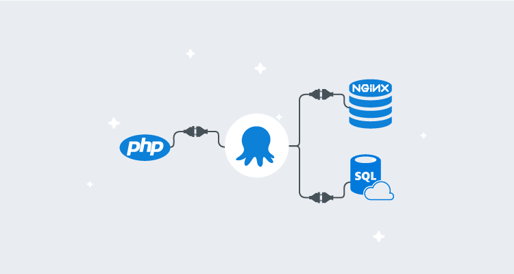
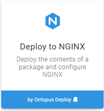
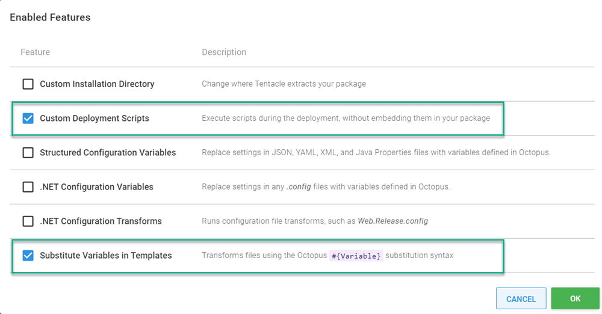
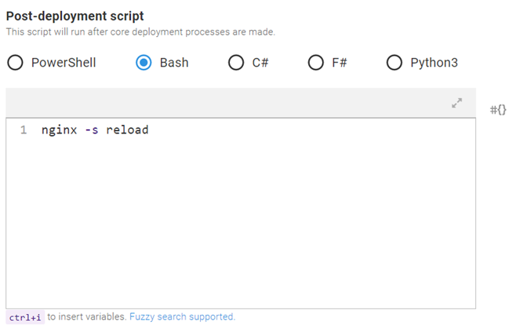
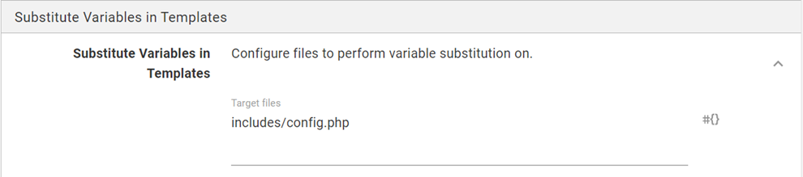
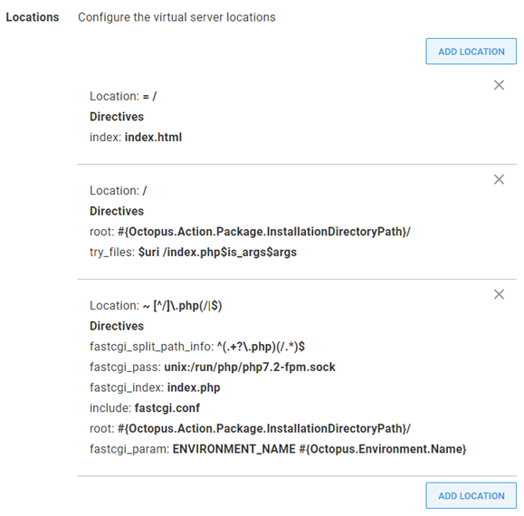
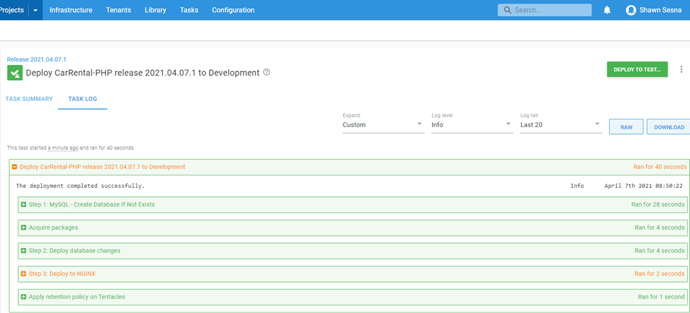
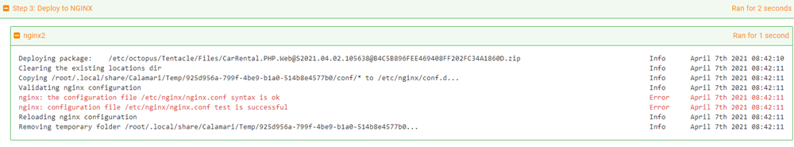
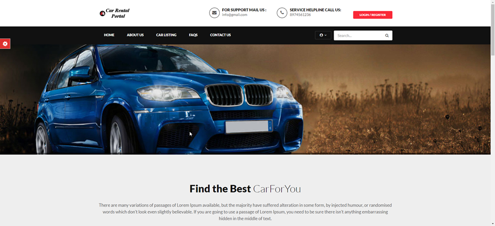

PHP is the most [popular](https://w3techs.com/technologies/market/programming_language) language for web-based applications.  This popularity has led to a wide availability of products that will deploy your PHP code but not necessarily your entire stack.  Applications often include components other than a web front-end, such as databases, APIs, and even containerized microservices.  

In this post, I demonstrate how to deploy a PHP application to an NGINX web server that uses MySQL as a database back-end.

## Sample application

The sample application application I chose for this post is the [Car Rental Project](https://projectnotes.org/php/car-rental-project-in-php-and-mysqli-with-source-code/).  

With minor modifications to a single file, this application worked out of the box and is a perfect fit for this demonstration.  The source code includes a database script for MySQL that will create the table schema and seeds the database with data.  I'll go over the required modifications later in this post.  Here's the link to the [modified project](https://bitbucket.org/octopussamples/carrental/src/main/).

## Building your PHP application
PHP is a scripting language, meaning it doesn't need to be compiled to be deployed.  However, there are benefits to using a build server with a PHP application:
  
- If your PHP application uses [Composer](https://getcomposer.org/) as a dependency manager, you can include it in the build of the application to gather the latest version of the dependencies when the build runs.
- Use the build server Octopus Deploy plugin for ease of integration, such as:
  - Packing the application
  - Pushing the package to the Octopus Deploy server or third-party package solution (Nexus, Artifactory, etc.)
  - Pushing build information to Octopus Deploy
  - Creating the release
  - Deploying and or promoting releases

For this post, I chose Jenkins as my build server and there were three steps:

- Package web front-end
- Package database script
- Push packages to Octopus Deploy

### Package web front-end
First, let's go over the modifications I made for this project.  As mentioned, the Car Rental application uses MySQL as its database back-end.  The database connection information is located in `src/includes/config.php`.  Using Octostache and the [substitute variables in templates](https://octopus.com/docs/projects/steps/configuration-features/substitute-variables-in-templates#:~:text=The%20Substitute%20Variables%20in%20Files,Octopus%20Variables%20into%20any%20file.) feature, we can parameterize the connection info:

```php
<?php 
// DB credentials.
define('DB_HOST','#{MySQL.Server.Name}:#{MySQL.Server.Port}');
define('DB_USER','#{MySQL.Admin.User.Name}');
define('DB_PASS','#{MySQL.Admin.User.Password}');
define('DB_NAME','#{Project.Database.Name}');
// Establish database connection.
try
{
$dbh = new PDO("mysql:host=".DB_HOST.";dbname=".DB_NAME,DB_USER, DB_PASS,array(PDO::MYSQL_ATTR_INIT_COMMAND => "SET NAMES 'utf8'",PDO::MYSQL_ATTR_SSL_CA => '/var/www/html/DigiCertGlobalRootG2.crt.pem',PDO::MYSQL_ATTR_SSL_VERIFY_SERVER_CERT => false));
}
catch (PDOException $e)
{
exit("Error: " . $e->getMessage());
}
?>
```

For this demonstration, I used Azure MySQL PaaS which requires an SSL connection to the database. I needed to add the following to the PDO options component array (as seen above):

```
PDO::MYSQL_ATTR_SSL_CA => '/var/www/html/DigiCertGlobalRootG2.crt.pem'
PDO::MYSQL_ATTR_SSL_VERIFY_SERVER_CERT => false
```

Using the Octopus Deploy Jenkins plugin, packaging an application for deployment is easy.  Simply choose the **Octopus Deploy: Package application** step and fill in the following:

- Octopus Deploy CLI: select the Octopus Deploy CLI that was configured in `Global Tool Configuration`
- Package ID: the name of the package, i.e., `CarRental.PHP.Web`
- Version Number: the version number of the package
- Package format: Zip or Nuget
- Package base folder: for my repo it was `${WORKSPACE}/src`
- Package output folder: `${WORKSPACE}`

### Package database script
Included in the source is a script that creates the schema and populates the database with data.  The database script file is named specifically to work with the Flyway database migrations product:
  
- Octopus Deploy CLI: select the Octopus Deploy CLI that was configured in `Global Tool Configuration`
- Package ID: the name of the package, i.e., `CarRental.PHP.Db`
- Version Number: the version number of the package
- Package format: Zip or Nuget
- Package base folder: for my repo it was `${WORKSPACE}`
- Package output folder: `${WORKSPACE}`
- Package include paths: `**/sql/*.*`

### Pushing packages to Octopus Deploy
Using the **Octopus Deploy: Push packages** plugin step, you can push both the web and database packages to Octopus Deploy in a single step:

- Octopus Deploy CLI: select the Octopus Deploy CLI that was configured in `Global Tool Configuration`
- Octopus Deploy Server: select the Octopus Deploy server to push to (defined in **{{ Manage Jenkins > Configure System}}**)
- Space: select the Space to push to (uses Default if left blank)
- Package paths: `/.zip`

Our PHP application is now packaged and ready for deployment.

## Deploying your PHP application
With the packages ready, we can define our deployment process.  

This post assumes you have familiarity creating Octopus Deploy projects, so I won't cover that part.  If you're not familiar with that topic, check out our [Getting Started](https://octopus.com/docs/getting-started) guide.

Our deployment process will consist of the following steps:

- Create the MySQL database if it doesn't exist
- Flyway Database Migrations (using execution containers)
- Deploy to NGINX

### Create MySQL database
This step will create a database on a MySQL server if the database doesn't already exist.  There are only a few inputs to fill in for this step:

- Server: Name or IP address of the MySQL server
- Username: Username that has sufficient permissions to create databases
- Password: Password for the user account
- Database Name: Name of the database to create
- Port: Port that MySQL is listening on (default 3306)
- Use SSL: Whether or not to use SSL when connecting to MySQL (this was required to be true for me because I was using Azure MySQL PaaS)

### Flyway Database Migrations
For this post, I used the newly created [Flyway template](https://library.octopus.com/step-templates/ccebac39-79a8-4ab4-b55f-19ea570d9ebc/actiontemplate-flyway-database-migrations) that can be used with [Execution Containers](https://octopus.com/docs/projects/steps/execution-containers-for-workers).

- Execution Location: Run once on a worker
- Worker Pool: Pool that contains workers with Docker installed
- Container image: `octopuslabs/flyway-workertools:latest` (You must have an external feed configured to use Docker Hub)

The step will need the following information:

- Flyway Package: `CarRental.PHP.Db`
- Flyway Command: `Migrate`
- -Url: JDBC connection URL, i.e. jdbc:mysql://`<ServerName>`:`<Port>`/`<DatabaseName>`}?serverTimezone=UTC&useSSL=true
- -User: User that can make updates to the database
- -Password: Password for user account

### Deploy Car Rental to NGINX
The third and final step is to deploy the Car Rental PHP application to an NGINX web server.  Add a step to the process, choosing the NGINX built-in step template:



Click on **CONFIGURE FEATURES** and enable:

- **Custom Deployment Scripts**
- **Substitute Variables in Templates**



#### Package Details
In the **Package Details** section, choose the `CarRental.PHP.Web` package.

#### Custom Deployment Scripts
Add the following in the post-deployment script window:
```
nginx -s reload
```

Be sure to select the appropriate language for the script. I chose Bash since I'm deploying to NGINX on Linux.



#### Substitute variables in templates
Specify the location of the `config.php` file that contains the database connection information, so that it gets updated with the appropriate values in the **Target files** input: `includes/config.php`



#### NGINX Web Server
This section will define the settings for the NGINX step.  For this post, I filled in Bindings and Locations.

##### Bindings
I only needed one binding for this sample application:

- Protocol: http
- Port: 8088 (or whatever port you wish)
- IP Address: *

##### Locations
To configure NGINX to run our PHP application, we'll need to define three locations:

```
Location: = /
Directives:
 
- index = `index.html`

Location: /
Directives:

- root = #{Octopus.Action.Package.InstallationDirectoryPath}/
- try_files = $uri /index.php$is_args$args

Location: ~ [^/]\.php(/|$)
Directives:

- fastcgi_split_path_info = ^(.+?\.php)(/.*)$
- fastcgi_pass = unix:/run/php/php7.2-fpm.sock
- fastcgi_index = index.php
- include = fastcgi.conf
- root = #{Octopus.Action.Package.InstallationDirectoryPath}/
- fastcgi_param = ENVIRONMENT_NAME #{Octopus.Environment.Name}
```



We've now configured the step to deploy our PHP application to NGINX.  All that's left is to create a release and deploy.

### Deploy
After you've deployed your release, you should receive output that looks similar to this:



You may notice that the NGINX step displays warnings, however, this is normal.  NGINX writes information messages to the stderr stream which Octopus interprets as a possible error and flags as a warning.



Accessing our server, we can see our PHP application is up and running.



## Conclusion
Much of the world runs their applications on PHP.  In this post, I demonstrated how you can easily deploy PHP applications with database back-ends using Octopus Deploy.  

Happy deployments!
