Octopus is great at managing the progression of your changes through the development, test, and production environments. It also handles branching strategies like hotfixes nicely through the use of channels, allowing you to bypass certain environments and push packages with matching versions rules (like having the word `hotfix` in the version release field) straight to production in an emergency.

But what about feature branches? In this blog post we'll break down exactly what a feature branch is, and how you can manage them in Octopus.

## What is a feature branch?

Before we can model a feature branch in Octopus, we need to understand what a feature branch is to most developers.

[Martin Fowler provides good description of a feature branch](https://martinfowler.com/bliki/FeatureBranch.html):

> A feature branch is a source code branching pattern where a developer opens a branch when she starts working on a new feature. She does all the work on the feature on this branch and integrates the changes with the rest of the team when the feature is done.

I suspect most developers are familiar with working in a feature branch, but it is the finer points, especially related to deployments, contained in the phrase *does all the work on the feature on this branch* that we are interested in.

Specifically, we want to give developers a way to deploy the code they are working on:

* To test it in an environment that can't be easily replicated locally, such as cloud Platform as a Service (PaaS) offerings.
* To easily share the current state of their work with the rest of the team
* Or to provide a stable target for additional testing like end-to-end, performance, or security tests.

Unlike deployments to fixed environments like test or production, feature branches are short lived. They exist while a feature is being developed, but once merged into a mainline branch, the feature branch should be deleted.

Also, a feature branch is not intended to be deployed to production. Unlike a hotfix, which is an emergency production deployment to quickly solve a critical issue, a feature branch is only used for testing.

An potential cost saving consequence of the limited audience a feature branch is exposed to is that you will likely be able to delete the deployments, and their underlying infrastructure, in the evening and redeploy the feature branches again in the morning. Doing so can mean you no longer pay to host applications no one will ever use overnight.

Feature branches are typically processed by a CI system as a convenient way to ensure the tests pass and then produce deployable artifacts. There is a compelling argument to be made that a CI system should produce a deployable artifact (if the code compiles) regardless of the test results given processes like Test Driven Design (TDD) encourage failing tests as a normal part of the design workflow. A question then is how are feature branch artifacts versioned?

Tools like GitVersion [provide examples showing feature branch names included in a SemVer prerelease field](https://gitversion.net/docs/learn/branching-strategies/gitflow/examples), resulting in versions like `1.3.0-myfeature`. Most package management tools have versioning strategies that include components to accommodate a feature branch name. Where a package manager has no versioning guidelines, like Docker repositories, adopting a versioning scheme like SemVer is a good choice.

:::hint
The Maven versioning scheme has a quirk where a version with a qualifier, like `1.0.0-myfeature`, is considered to be a later version that an unqualified version, like `1.0.0`. However, using channel versions rules means qualified versions representing feature branches are not eligible for deployment to production environments, so the ordering of qualified and unqualified versions does not present an issue in Octopus.
:::

With all the above in mind, we can define a feature branch as having the following qualities:

* They are for testing only, and are not exposed in a production environment.
* They are short lived, existing only while a corresponding branch in the version control system exists.
* They may not be needed outside of business hours, providing cost savings if deployments can be shut down overnight.
* They don't get promoted anywhere, and so have a lifecycle that includes a single deployment to a test environment, and eventual clean up.
* They product artifacts versioned in such a way as to identify the source feature branch.

The next step is to model the rules above in Octopus.

## Octopus meta-steps

Octopus includes a limited notion of meta-steps, which is a term we'll use to categorize steps that modify Octopus itself. The **Deploy a release** step is one example, which (as the name suggests) can be used to deploy a release created for an other project. [Script steps can also dynamically generate some Octopus resources](https://octopus.com/docs/infrastructure/deployment-targets/dynamic-infrastructure).

But meta-step functionality is somewhat ad-hoc and limited. What we need is a more comprehensive solution to create and destroy resources within Octopus to reflect the short lived nature of feature branches.

The [Octopus CLI provides some additional functionality](https://octopus.com/docs/octopus-rest-api/octopus-cli), with the ability to create many Octopus resources like releases, channels, and environments. Unfortunately it does not include all the corresponding options to delete these resources, so it is not a complete solution.

Another option is to use the REST API, which exposes every action that the web UI can perform. However, I'd prefer to avoid writing a second CLI tool to manage the complete lifecycle of Octopus resources if possible.

Fortunately the [Octopus Terraform provider](https://registry.terraform.io/providers/OctopusDeployLabs/octopusdeploy/latest/docs) provides exactly what we need. Combining this provider with the existing Terraform deployment steps in Octopus allows us to create our own meta-steps, which in turn means we can manage the ephemeral Octopus resources we need to represent feature branches.

## Runbooks to manage feature branches

We'll make use of runbooks to support the creation and deletion of ephemeral Octopus resources. This allows us to separate the management of the underlying infrastructure from the deployment of our applications.

We'll create six runbooks. Three runbooks will create, delete and suspend resources for a single feature branch, and those will be paired with three more runbooks to execute them based on the presence or absence of branches in GIT:

* Create Branch Infrastructure, which will create the resources required to deploy a single branch.
* Resume Branches, which will (re)create branch infrastructure based on those present in the GIT repository.
* Destroy Branch Infrastructure, which will destroy the feature branch resources.
* Destroy Branches, which will remove any feature branch resources for branch resources deleted in GIT.
* Suspend Branch Infrastructure, which will turn off or destroy costly feature branch resources when it isn't used.
* Suspend Branches, which will suspend all branches.

## Mapping Octopus resources to feature branches

Octopus has a number of resources that can be used to facilitate feature branch deployments, but there are no hard and fast rules as to how these resources relate to a feature branch. We'll offer some opinions here that will dictate how we construct the runbooks listed above.

We'll use environments to encapsulate the resources used to host feature branches. Environments provide a nice scoping and security boundary, and clearly separate feature branches from static environments like production.

To prevent feature branches from being promoted to production environments, or being promoted at all, we'll create a lifecycle per feature branch that includes the single environment above.

To ensure the appropriate feature branch artifacts are deployed to the correct environment, we'll use a channel. The channel rules will ensure the feature branch artifact versions are selected and directed to the correct lifecycle, which in turn ensures the correct environment receives the feature branch deployment.

Of these three resources, we'll treat the channel as the representation of the feature branch. You select the channel during a deployment, and it is the only resource local to the Octopus project (lifecycles and environments are scoped to a space). This makes it the natural choice to represent a feature branch in a project.

:::hint
Tenants could also have been used to represent a feature branch. I found though that environments, channels, and lifecycles were a more natural fit.
:::

The web apps we deploy to will be represented by targets. These targets will be scoped to their associated feature branch environment.

:::hint
Web apps have the notion of slots, which could also have been used to deploy feature branches. However, slots are a limited resource on Azure service plans, meaning you would be limited to the number of feature branches that could be deployed at any time. For this reason this post uses new web apps for each feature branch.
:::

## The initial Azure account

To deploy feature branch web apps in Azure, we need an initial "seed" Azure account to manage the cloud resources. This is the account the Terraform scripts will be run under:

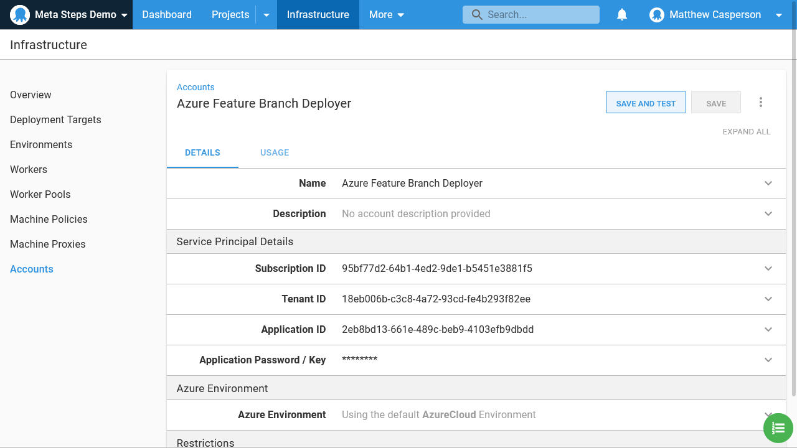

## Completing the meta-step round journey

Our meta-steps will be executed as if they were any other Terraform deployment, which means even though Octopus is managing itself, we need to create the variables to allow a Terraform deployment to reach back into the Octopus server.

Create a new Octopus project, and define two variables called **ApiKey** and **ServerUrl**. The API key will be a secret variable holding an [Octopus API key](https://octopus.com/docs/octopus-rest-api/how-to-create-an-api-key), and the server URL will be the URL of the Octopus server. I'm using a [cloud instance](https://octopus.com/docs/octopus-cloud) in this example with the URL https://mattc.octopus.app.

In addition, create a prompted variable called **FeatureBranch**. This will be used to pass the name of a feature branch into the runbooks.

Finally, create a variable called **Azure** that points to the Azure account created in the pervious section:

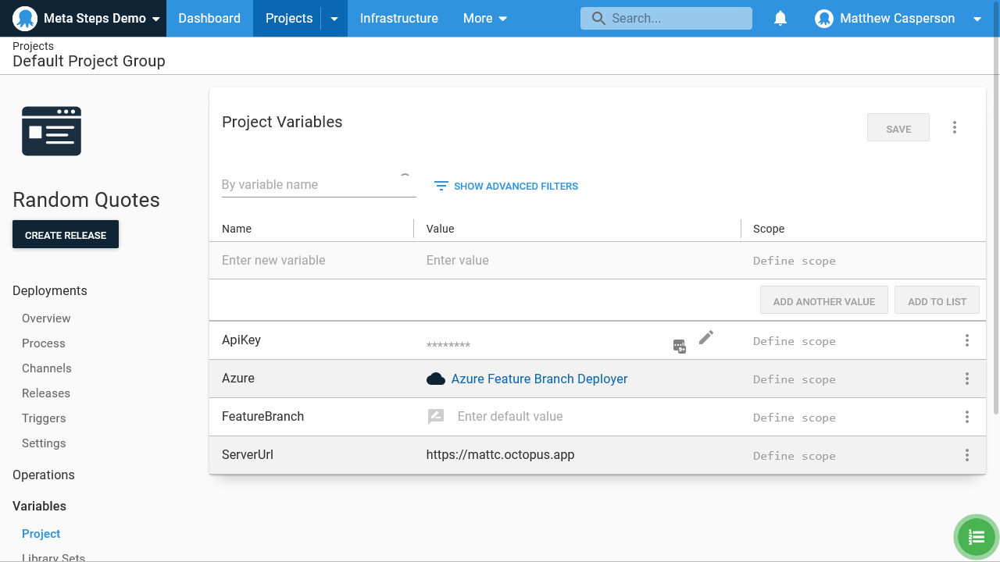

## The deployment project

Our deployment project will make use of the **Deploy an Azure App Service** step to deploy a Docker image from the **octopussamples/randomquotesjava** Docker repository. The [repository](https://hub.docker.com/r/octopussamples/randomquotesjava) contains images built with [this code hosted on GitHub](https://github.com/OctopusSamples/RandomQuotes-Java).

Call the step **Deploy Web App**. We'll reference this step name when creating the channel in the next section.

## The Create Branch Infrastructure runbook

We'll start by creating the runbook that builds all the resources, both in Octopus and in Azure, to deploy a feature branch.

This template creates the Azure web app infrastructure. We keep this in a separate template to allow us to destroy these resources individually, without destroying the Octopus resources. This template will be deployed in a step called **Feature Branch Web App** (we'll use the step name later to reference the output variables):

```
provider "azurerm" {
version = "=2.0.0"
features {}
}

variable "apiKey" {
    type = string
}

variable "space" {
    type = string
}

variable "serverURL" {
    type = string
}

terraform {
  backend "azurerm" {
    resource_group_name  = "mattc-test"
    storage_account_name = "storageaccountmattc8e9b"
    container_name       = "terraformstate"
    key                  = "#{FeatureBranch}.azure.terraform.tfstate"
  }
}

resource "azurerm_resource_group" "resourcegroup" {
  name     = "mattc-test-webapp-#{FeatureBranch}"
  location = "West Europe"
  tags = {
  	OwnerContact = "@matthew.casperson"
  	Environment = "Dev"
    Lifetime = "15/5/2021"
  }
}

resource "azurerm_app_service_plan" "serviceplan" {
  name                = "#{FeatureBranch}"
  location            = azurerm_resource_group.resourcegroup.location
  resource_group_name = azurerm_resource_group.resourcegroup.name
  kind                = "Linux"
  reserved            = true

  sku {
    tier = "Standard"
    size = "S1"
  }
}

resource "azurerm_app_service" "webapp" {
  name                = "mattctestapp-#{FeatureBranch}"
  location            = azurerm_resource_group.resourcegroup.location
  resource_group_name = azurerm_resource_group.resourcegroup.name
  app_service_plan_id = azurerm_app_service_plan.serviceplan.id
}

output "ResourceGroupName" {
  value = "${azurerm_resource_group.resourcegroup.name}"
}

output "WebAppName" {
  value = "${azurerm_app_service.webapp.name}"
}

```

This next Terraform template will create an environment, place it in a lifecycle, and configure it in a channel. It also creates a web app target

```
variable "apiKey" {
    type = string
}

variable "space" {
    type = string
}

variable "serverURL" {
    type = string
}

terraform {
  required_providers {
    octopusdeploy = {
      source  = "OctopusDeployLabs/octopusdeploy"
    }
  }

  backend "azurerm" {
    resource_group_name  = "mattc-test"
    storage_account_name = "storageaccountmattc8e9b"
    container_name       = "terraformstate"
    key                  = "#{FeatureBranch}.terraform.tfstate"
  }
}

provider "octopusdeploy" {
  address  = var.serverURL
  api_key   = var.apiKey
  space_id = var.space
}

resource "octopusdeploy_environment" "environment" {
  allow_dynamic_infrastructure = true
  description                  = "Feature branch environment for #{FeatureBranch}"
  name                         = "#{FeatureBranch}"
  use_guided_failure           = false
}

resource "octopusdeploy_lifecycle" "lifecycle" {
  description = "The lifecycle holding the feature branch #{FeatureBranch}"
  name        = "#{FeatureBranch}"

  release_retention_policy {
    quantity_to_keep    = 1
    should_keep_forever = true
    unit                = "Days"
  }

  tentacle_retention_policy {
    quantity_to_keep    = 30
    should_keep_forever = false
    unit                = "Items"
  }

  phase {
    name                        = "#{FeatureBranch}"
    is_optional_phase           = false
	optional_deployment_targets = ["${octopusdeploy_environment.environment.id}"]

    release_retention_policy {
      quantity_to_keep    = 1
      should_keep_forever = true
      unit                = "Days"
    }

    tentacle_retention_policy {
      quantity_to_keep    = 30
      should_keep_forever = false
      unit                = "Items"
    }
  }
}

resource "octopusdeploy_channel" "channel" {
  name       = "Feature branch #{FeatureBranch}"
  project_id = "#{Octopus.Project.Id}"
  lifecycle_id = "${octopusdeploy_lifecycle.lifecycle.id}"
  description = "Repo: https://github.com/OctopusSamples/RandomQuotes-Java Branch: #{FeatureBranch}"
  rule {
  	id = "#{FeatureBranch}"
    tag = "^#{FeatureBranch}.*$"
    action_package {
      deployment_action = "Deploy Web App"
    }
  }
}

resource "octopusdeploy_azure_service_principal" "azure_service_principal_account" {
  application_id  = "#{Azure.Client}"
  name            = "Azure account for #{FeatureBranch}"
  password        = "#{Azure.Password}"
  subscription_id = "#{Azure.SubscriptionNumber}"
  tenant_id       = "#{Azure.TenantId}"
}

resource "octopusdeploy_azure_web_app_deployment_target" "webapp" {
  account_id                        = "${octopusdeploy_azure_service_principal.azure_service_principal_account.id}"
  name                              = "Azure Web app #{FeatureBranch}"
  resource_group_name               = "#{Octopus.Action[Feature Branch Web App].Output.TerraformValueOutputs[ResourceGroupName]}"
  roles                             = ["Web Application", "Web Application #{FeatureBranch}"]
  tenanted_deployment_participation = "Untenanted"
  web_app_name                      = "#{Octopus.Action[Feature Branch Web App].Output.TerraformValueOutputs[WebAppName]}"
  environments                      = ["${octopusdeploy_environment.environment.id}"]
  endpoint {
  	default_worker_pool_id          = "WorkerPools-762"
    communication_style				= "None"
  }
}
```

There are a few important things to call out in this template.

The Octopus provider is an official plugin that can be downloaded by Terraform automatically:

```
  required_providers {
    octopusdeploy = {
      source  = "OctopusDeployLabs/octopusdeploy"
    }
  }
```

We have made use of the Octopus template syntax to build up various parts of the Terraform template. A backend block [cannot make use of Terraform variables](https://www.terraform.io/docs/language/settings/backends/configuration.html#using-a-backend-block), but because Octopus processes the file before it is passed to Terraform, we can work around this limitation to essentially inject variables into key name:

```
  backend "azurerm" {
    resource_group_name  = "mattc-test"
    storage_account_name = "storageaccountmattc8e9b"
    container_name       = "terraformstate"
    key                  = "#{FeatureBranch}.terraform.tfstate"
  }
```

The description given to the channel indicates the GIT repository and branch that the channel represents. Because we have decided that the channel is the representation of a feature branch in a channel, the details required to link it back to the code repository it came from will be captured here.

Also note that we reference the step created earlier called **Deploy Web App** to apply the channel rules to:

```
resource "octopusdeploy_channel" "channel" {
  name       = "Feature branch #{FeatureBranch}"
  project_id = "#{Octopus.Project.Id}"
  lifecycle_id = "${octopusdeploy_lifecycle.lifecycle.id}"
  description = "Repo: https://github.com/OctopusSamples/RandomQuotes-Java Branch: #{FeatureBranch}"
  rule {
  	id = "#{FeatureBranch}"
    tag = "^#{FeatureBranch}.*$"
    action_package {
      deployment_action = "Deploy Web App"
    }
  }
```

To create the Azure account, we have created a new account with the same details as the Azure account that is defined on the Terraform step:

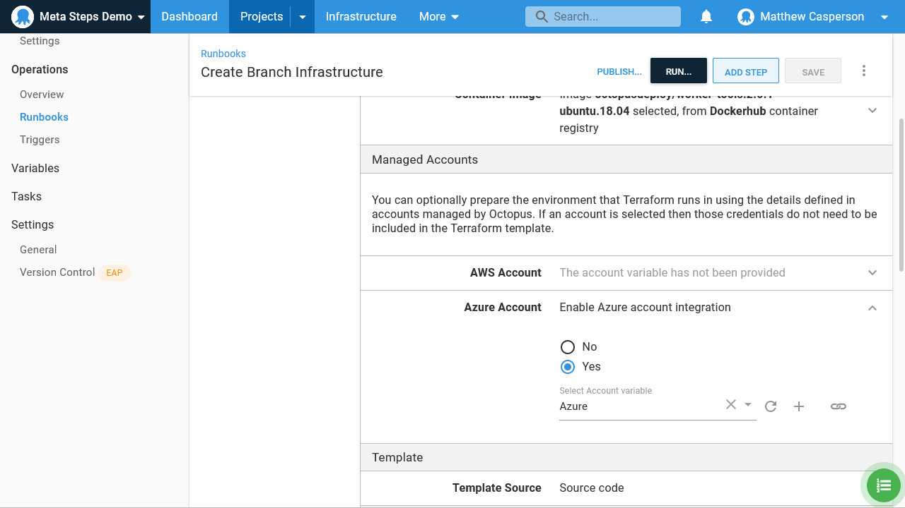

 In a more secure environment these details would be replaced with an account that was limited to only the necessary resources. In a less secure environment, you may omit creating a feature branch specific account all together, and simply share an existing account:

```
resource "octopusdeploy_azure_service_principal" "azure_service_principal_account" {
  application_id  = "#{Azure.Client}"
  name            = "Azure account for #{FeatureBranch}"
  password        = "#{Azure.Password}"
  subscription_id = "#{Azure.SubscriptionNumber}"
  tenant_id       = "#{Azure.TenantId}"
}
```

When creating the target, we make use of the output variables created by the first terraform script. The resource group name was output as `#{Octopus.Action[Feature Branch Web App].Output.TerraformValueOutputs[ResourceGroupName]}`, and the web app name was output as `#{Octopus.Action[Feature Branch Web App].Output.TerraformValueOutputs[WebAppName]}`.

This target also specifically defines a Windows worker pool (with the ID `WorkerPools-762` in my case) for the health checks. This is because Azure web app targets require a Windows worker to run a health check:

```
resource "octopusdeploy_azure_web_app_deployment_target" "webapp" {
  account_id                        = "${octopusdeploy_azure_service_principal.azure_service_principal_account.id}"
  name                              = "Azure Web app #{FeatureBranch}"
  resource_group_name               = "#{Octopus.Action[Feature Branch Web App].Output.TerraformValueOutputs[ResourceGroupName]}"
  roles                             = ["Web Application", "Web Application #{FeatureBranch}"]
  tenanted_deployment_participation = "Untenanted"
  web_app_name                      = "#{Octopus.Action[Feature Branch Web App].Output.TerraformValueOutputs[WebAppName]}"
  environments                      = ["${octopusdeploy_environment.environment.id}"]
  endpoint {
  	default_worker_pool_id          = "WorkerPools-762"
    communication_style				= "None"
  }
```

The final step in this runbook is to call the Octopus CLI to create and deploy a release to the new environment. By running the deployment we can be assured that when we recreate the feature branches in the morning, they will have their latest application code deployed.

We allow this call to fail in the event that a branch has been created with no artifact deployed:

```
octo create-release \
	--project="Random Quotes" \
    --channel="Feature branch #{FeatureBranch}" \
    --deployTo="#{FeatureBranch}" \
    --space="#{Octopus.Space.Name}" \
    --server="#{ServerUrl}" \
    --apiKey="#{ApiKey}"

# allow failure if the a package is not available
exit 0
```

By running this runbook, Octopus will be populated with all the feature branch resources, a web app is created in Azure, and the latest version of the feature branch application is deployed (if it exists). 

Because Terraform is idempotent, we can rerun this runbook multiple times, and any missing resources will be recreated. We'll take advantage of this later on when we destroy the web apps overnight to save costs.

## The Resume Branches runbook

The **Create Branch Infrastructure** runbook can create the resources for a branch, but it has not idea what branches exist in GIT. The **Resume Branches** runbook scans a GIT repo for branches and executes the **Create Branch Infrastructure** runbook to reflect those branches in Octopus.

The Powershell below parses the results of a call to `ls-remote --heads https://repo` and use the resulting list to call the **Create Branch Infrastructure** runbook:

```powershell
$octopusURL = "https://mattc.octopus.app"
$octopusAPIKey = "#{ApiKey}"
$spaceName = "#{Octopus.Space.Name}"
$projectName = "#{Octopus.Project.Name}"
$environmentName = "#{Octopus.Environment.Name}"
$repos = @("https://github.com/OctopusSamples/RandomQuotes-Java.git")
$ignoredBranches = @("master", "main")

# Get all the branches for the repos listed in the channel descriptions    
$branches = $repos | 
    % {PortableGit\bin\git ls-remote --heads $_} | 
    % {[regex]::Match($_, "\S+\s+(\S+)").captures.groups[1].Value} |
    % {$_.Replace("refs/heads/", "")} |
    ? {-not $ignoredBranches.Contains($_)}

# Clean up the old branch infrastructure
$branches | 
    % {Write-Host "Creating branch $_"; 
    	octo run-runbook `
          --apiKey $octopusAPIKey `
          --server $octopusURL `
          --project $projectName `
          --runbook "Create Branch Infrastructure" `
          -v "FeatureBranch=$_" `
          --environment $environmentName `
          --space $spaceName}
```

:::hint
The `git` executable in the `PortableGit` directory was supplied as an additional package reference that bundled up a [portable copy of GIT for Windows](https://git-scm.com/download/win):

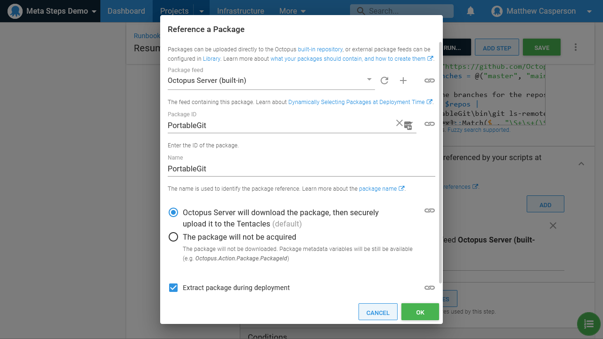
:::

## The Destroy Branch Infrastructure runbook

The **Destroy Branch Infrastructure** is the opposite of the **Create Branch Infrastructure** in that it removes all the resources instead of creating them. This is achieved by using the same Terraform templates as defined in the **Create Branch Infrastructure** runbook, but executing them with the **Destroy Terraform resources** step instead.

## The Destroy Branches runbook

The **Destroy Branches** runbook is the opposite of the **Resume Branches** runbook. It queries Octopus for all the channels, queries GIT for all the branches, and where a channel does not have a matching branch, calls the **Destroy Branch Infrastructure** runbook:

```powershell
Install-Module -Force PowershellOctopusClient
Import-Module PowershellOctopusClient

$channelDescriptionRegex = "Repo:\s*(\S+)\s*Branch:\s*(\S+)"

# Octopus variables
$octopusURL = "#{OctopusUrl}"
$octopusAPIKey = "#{ApiKey}"
$spaceName = "#{Octopus.Space.Name}"
$projectName = "#{Octopus.Project.Name}"

$endpoint = New-Object Octopus.Client.OctopusServerEndpoint $octopusURL, $octopusAPIKey
$repository = New-Object Octopus.Client.OctopusRepository $endpoint
$client = New-Object Octopus.Client.OctopusClient $endpoint

$space = $repository.Spaces.FindByName($spaceName)
$repositoryForSpace = $client.ForSpace($space)

$project = $repositoryForSpace.Projects.FindByName($projectName)
$channels = $repositoryForSpace.Channels.GetAll() | ? {$_.ProjectId -eq $project.Id}

# Get all the project channels whose description is in the format "Repo: http://blah Branch: blah"
$repos = $channels | 
    % {[regex]::Match($_.Description, $channelDescriptionRegex)} | 
    ? {$_.Success} | 
    % {$_.captures.groups[1]} |
    Get-Unique

# Get all the branches for the repos listed in the channel descriptions    
$branches = $repos | 
    % {@{Repo = $_; Branch = $(PortableGit\bin\git ls-remote --heads $_)}} | 
    % {$repo = $_.Repo; [regex]::Match($_.Branch, "\S+\s+(\S+)").captures.groups[1].Value.Replace("refs/heads/", "") | %{"Repo: $repo Branch: $_"}}

# Get all the branches that have a channel but have been removed from the repo
$oldChannels = $channels | 
    ? {[regex]::Match($_.Description, $channelDescriptionRegex).Success} |
    ? {-not $branches.Contains($_.Description)} |
    % {[regex]::Match($_.Description, $channelDescriptionRegex).captures.groups[2]}

# Clean up the old branch infrastructure
$oldChannels | 
    % {Write-Host "Deleting branch $_"; 
    	octo run-runbook `
          --apiKey $octopusAPIKey `
          --server $octopusURL `
          --project $projectName `
          --runbook "Destroy Branch Infrastructure" `
          -v "FeatureBranch=$_" `
          --environment $_ `
          --space $spaceName}
```

## The Suspend Branch Infrastructure runbook

To save money overnight we'll destroy the feature branch web apps in Azure. This is the [suggested solution from Microsoft](https://feedback.azure.com/forums/169385-web-apps/suggestions/13550325-ability-to-suspend-app-service-plans-without-charg) to "suspend" app service plans.

Deleting the Azure resources is again just a case of running the **Destroy Terraform resources** step instead with the template in the step called **Feature Branch Web App** from the **Create Branch Infrastructure** runbook. Because we only destroy the Azure resources, any existing Octopus releases, channels, environments, targets, and accounts will remain in place.

Since we use the same backend state file when deleting and creating these Azure resources, Terraform knows the state of any given Azure resource. This means we can call the **Suspend Branch Infrastructure**, **Create Branch Infrastructure**, and **Destroy Branch Infrastructure** as we need, and Terraform will leave Azure in the desired state.

## The Suspend Branches runbook

The **Suspend Branches** runbook scans Octopus for channels and calls the **Suspend Branch Infrastructure** runbook. This means any Azure resources relating to channels, and therefor feature branches, in Octopus will be destroyed and no longer cost money:

```powershell
Install-Module -Force PowershellOctopusClient
Import-Module PowershellOctopusClient

$channelDescriptionRegex = "Repo:\s*(\S+)\s*Branch:\s*(\S+)"

# Octopus variables
$octopusURL = "#{ServerUrl}"
$octopusAPIKey = "#{ApiKey}"
$spaceName = "#{Octopus.Space.Name}"
$projectName = "#{Octopus.Project.Name}"
$environment = "#{Octopus.Environment.Name}"

$endpoint = New-Object Octopus.Client.OctopusServerEndpoint $octopusURL, $octopusAPIKey
$repository = New-Object Octopus.Client.OctopusRepository $endpoint
$client = New-Object Octopus.Client.OctopusClient $endpoint

$space = $repository.Spaces.FindByName($spaceName)
$repositoryForSpace = $client.ForSpace($space)

$project = $repositoryForSpace.Projects.FindByName($projectName)
$channels = $repositoryForSpace.Channels.GetAll() | ? {$_.ProjectId -eq $project.Id}

# Get all the project channels whose description is in the format "Repo: http://blah Branch: blah"
$branches = $channels | 
    % {[regex]::Match($_.Description, $channelDescriptionRegex)} | 
    ? {$_.Success} | 
    % {$_.captures.groups[2].Value} |
    Get-Unique

# Clean up the old branch infrastructure
$branches | 
    % {Write-Host "Deleting branch $_"; 
    	octo run-runbook `
          --apiKey $octopusAPIKey `
          --server $octopusURL `
          --project $projectName `
          --runbook "Suspend Branch Infrastructure" `
          -v "FeatureBranch=$_" `
          --environment $environment `
          --space $spaceName}
```

## Synchronizing Octopus and GIT

We now have all the runbooks we need to manage feature branch resources. To keep Octopus and GIT in sync, the next step is to schedule triggers to remove old branches, shutdown resources, and create new branches.

We start by triggering the **Destroy Branches** runbook at various point during the day. This runbook will destroy the feature branch resources where the underlying feature branch has been removed from GIT.

Cleaning up these branches should not disrupt anyone, as we assume that deleting the underlying branch means the feature has been merged or abandoned. So we create a trigger to execute the **Destroy Branches** runbook every hour.

Likewise we want to catch any new branches that have been created throughout the day, so we schedule the **Create Branches** runbook to run regularly between 6 AM and 6 PM to catch the average working day.

To reduce our costs, we want to remove the cloud resources hosting our feature branches at the end of the day. To do this, we schedule the **Suspend Branches** runbook to run at 7 PM. This ensures it is run after the final **Create Branches** runbook trigger.

The end result is that throughout the day deleted branches are cleaned up via **Destroy Branches**, at the start of weekdays any new branches are detected and all Azure resources are recreated via **Create Branches**, and at night all Azure resources are destroyed via **Suspend Branches**:

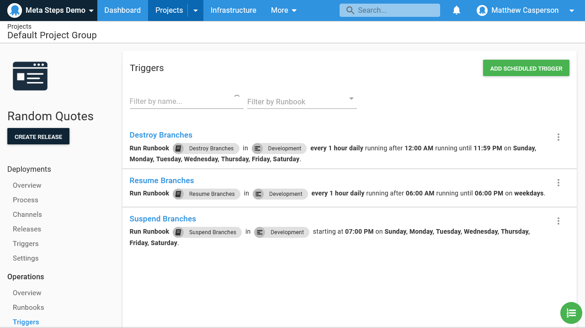

If using triggers is not responsive enough to catch new branches being created and destroyed, it is also possible to execute `octo run-runbook` directly from GIT itself. Popular hosting services like GitHub frequently offer tooling that allows scripts to be run as branches are created and destroyed, which would make the creation and cleanup of feature branches in Octopus almost instantaneous.

## A look at Octopus with feature branches

With these runbooks in places and triggered appropiately, we can now review the resources created in Octopus to represent our feature branches.

Here are the channels:

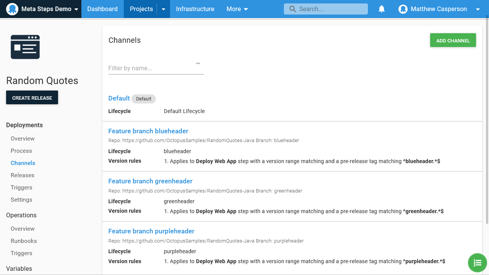

Here are the environments:

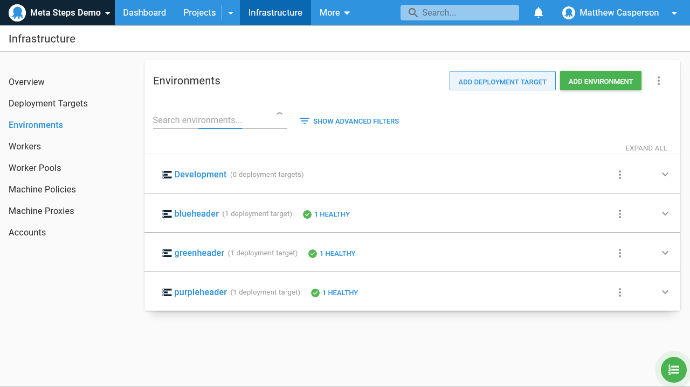

Here are the lifecycles:

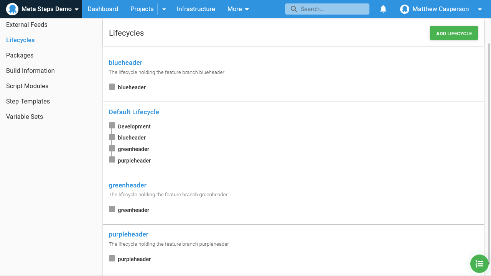

Here are the targets:

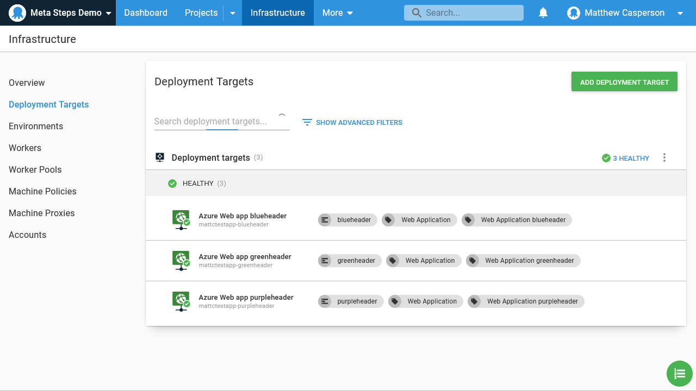

Here are the accounts:

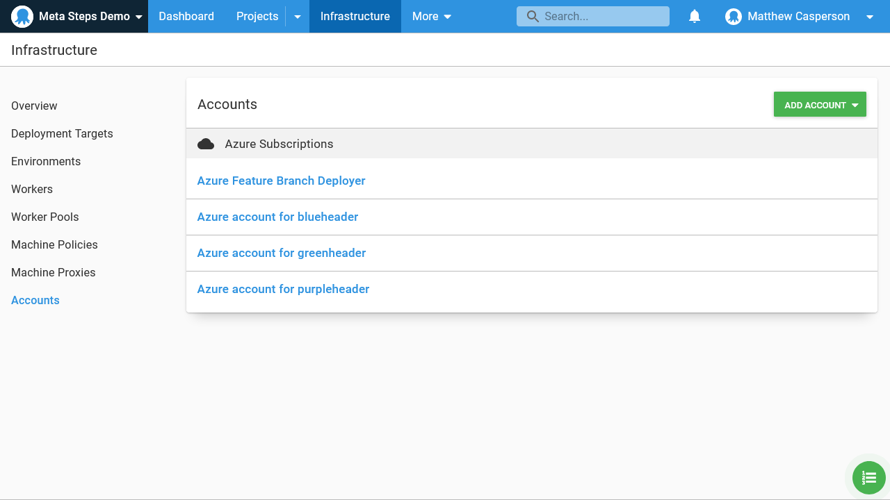

Here is the release creation, where we select a channel/feature branch to deploy to, and let Octopus match the channel rules to select the correct feature branch artifact for us:

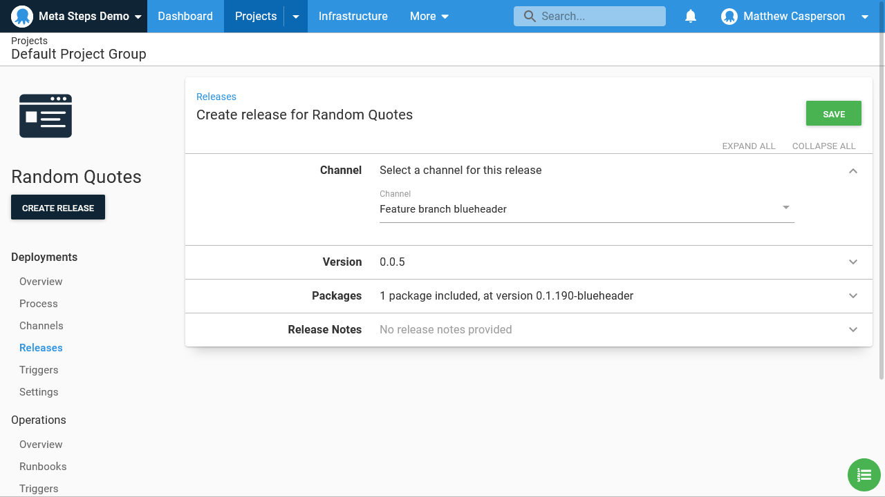

## Conclusion

The Terraform apply and destroy steps, in conjunction with the Octopus Terraform provider, gives us the tooling we need to create the kind of meta-steps required to implement short lived feature branches in Octopus. Thanks to the idempotent nature of Terraform, we have a robust set of steps that reliably manage our ephemeral Azure and Octopus resources.

With some custom scripting to synchronize Octopus with GIT branches, and scheduled triggers or direct triggers from a hosted platform like GitHub, we can ensure Octopus reflects the feature branches being developed in our code base.

Happy deployments!