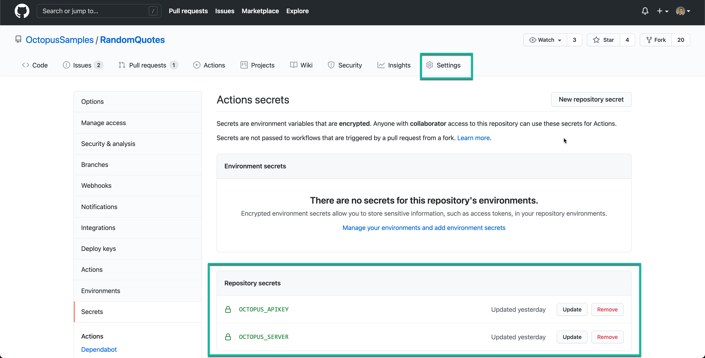

We're proud to announce we've shipped our first official GitHub Actions for Octopus Deploy. This is an initial batch of actions and they cover the core integration scenarios so you can connect your GitHub builds with your Octopus deploys and runbook runs. We plan to add additional GitHub Actions later in the year. 

- [Push packages](https://github.com/marketplace/actions/push-package-to-octopus-deploy) to Octopus Deploy. 
- [Create releases](https://github.com/marketplace/actions/create-release-in-octopus-deploy) in Octopus Deploy.
- [Execute a runbook](https://github.com/marketplace/actions/run-runbook-in-octopus-deploy) in Octopus Deploy.
- [Install](https://github.com/marketplace/actions/install-octopus-cli) the Octopus CLI.

In this blog post, I'll introduce GitHub Actions and share a concrete example of how you can get started with them to push build artifacts to Octopus, create a release and deploy it to a development environment.

## What are GitHub Actions? 

[GitHub Actions](https://docs.github.com/en/actions) are a popular new platform to automate software development workflows like CI/CD build around the GitHub ecosystem. Your define your workflow using a YAML configuration file and store it within your Git repository. You can compose your automation with resusable building blocks called actions. Workflows are executed in containers for a repeatable and reliable process.

Below is an example GitHub Action job workflow to build a simple .NET web application. GitHub provides examples for most programming languages and frameworks.

```yaml
name: Build

on:
  push:
    branches: [ master ]

jobs:
  build:

    runs-on: ubuntu-latest

    steps:
    - uses: actions/checkout@v2
    - name: Setup .NET
      uses: actions/setup-dotnet@v1
      with:
        dotnet-version: 5.0.x
    - name: Restore dependencies
      run: dotnet restore
    - name: Build
      run: dotnet publish -o build 
    - name: Test
      run: dotnet test --no-build --verbosity normal
```

The workflow is named **build** and it triggers a single job whenever changes are pushed to the parent Git repository on the `master` branch. The steps are straightforward in that they prepare and execute a continous integration build including restoring dependencies, executing the build and running all tests. 

I highly recommend reading [GitHub's docs](https://docs.github.com/en/actions/learn-github-actions) to learn more. This blog post assumes you are familiar with the basics of building a workflow with GitHub actions.

## Getting started with the GitHub Actions for Octopus Deploy

To illustrate how to use the new GitHub Actions for Octopus, we'll update the example build script above to install the Octopus CLI, package and push our build artifact to Octopus and then create a release and deploy it to our DEV environment.

The complete workflow file looks like the following and you can also view it in this [GitHub Samples repository](https://github.com/OctopusSamples/RandomQuotes/actions/workflows/dotnet.yml).

```yaml
name: Build

on:
  push:
    branches: [ master ]

jobs:
  build:

    runs-on: ubuntu-latest

    steps:
    - uses: actions/checkout@v2
    - name: Setup .NET
      uses: actions/setup-dotnet@v1
      with:
        dotnet-version: 5.0.x
    - name: Restore dependencies
      run: dotnet restore
    - name: Build
      run: dotnet publish -o build 
    - name: Test
      run: dotnet test --no-build --verbosity normal
    - name: Install Octopus CLI 🐙
      uses: OctopusDeploy/install-octopus-cli-action@v1.1.6
      with:
        version: latest
    - name: Package build artifacts
      run: octo pack --id="RandomQuotes" --format="zip" --version="1.0.${{github.run_number}}" --basePath="/home/runner/work/RandomQuotes/RandomQuotes/build/"
    - name: Push packages to Octopus Deploy 🐙
      uses: OctopusDeploy/push-package-action@v1.0.1
      with:
        api_key: ${{ secrets.OCTOPUS_APIKEY }}
        server: ${{ secrets.OCTOPUS_SERVER }}
        packages: "RandomQuotes.1.0.${{github.run_number}}.zip"
    - name: Create a release in Octopus Deploy 🐙
      uses: OctopusDeploy/create-release-action@v1.0.2
      with:
        api_key: ${{ secrets.OCTOPUS_APIKEY }}
        server: ${{ secrets.OCTOPUS_SERVER }}
        project: "Projects-141"
        deploy_to: "Dev"

```



I'll higlight the fact that we reference two secrets in this configuration. One is for the Octopus Server URL and the other is an API key which allows us to authenticate and integrate with our Octopus instance. In this case, I'm using an [Octopus Cloud instance](https://octopus.com/pricing/cloud) however you could also connect to a [self-hosted Octopus instance](https://octopus.com/pricing/server) if it's publicly accessible.

NOTE: This is building a Microsoft .NET 5 web application but it could easily be a Spring (Java) web app or NodeJS express service etc. The important parts are the usage of the GitHub Actions for Octopus that make it easy to integrate.

### Install the Octopus CLI

```yaml
    - name: Install Octopus CLI 🐙
      uses: OctopusDeploy/install-octopus-cli-action@v1.1.6
      with:
        version: latest
```

The first step to integrate with an Octopus Server in to install the Octopus CLI. This is a pre-requisite to use any of the other steps as it bootstraps the job runner with the appropriate dependencies to instal; the Octopus CLI.

### Push build artifacts to Octopus

```yaml
    - name: Pack
      run: octo pack --id="RandomQuotes" --format="zip" --version="1.0.${{github.run_number}}" --basePath="/home/runner/work/RandomQuotes/RandomQuotes/build/" --verbose
    - name: Push a package to Octopus Deploy 🐙
      uses: OctopusDeploy/push-package-action@v1.0.1
      with:
        api_key: ${{ secrets.OCTOPUS_APIKEY }}
        server: ${{ secrets.OCTOPUS_SERVER }}
        packages: "RandomQuotes.1.0.${{github.run_number}}.zip"
```

The next step is to package up our build artifacts and push it to a package repository. In this case, we're pushing it to the Octopus build-in package repository which is a very popular option for teams. 

There are two steps to package and push my build artifacts.
* The first step is packaging my build output as a ZIP file.
* The second step is pushing the package to my Octopus instance. 

As I previously mentioned, I am referencing two secrets stored in my repository configuration. One is for the Octopus Server URL and the other is an API key for my GitHub build. 

### Create a release and deploy it to the DEV environment

```yaml
    - name: Create a release in Octopus Deploy 🐙
      uses: OctopusDeploy/create-release-action@v1.0.2
      with:
        api_key: ${{ secrets.OCTOPUS_APIKEY }}
        server: ${{ secrets.OCTOPUS_SERVER }}
        project: "Projects-141"
        deploy_to: "Dev"
```

The final step in my build process is to create a release of my project and deploy it to my DEV environment. This is done with a single step and I supply my project ID and the environment name that I want to deploy to. And that's it.

### Success!


If we push a commit to our repository, we can see the GitHub Action run and see it's output. This might take a few iterations to fix syntax and get everything right but the outcome is that we have a success build! 

## Conclusion

GitHub Actions for Octopus Deploy are now available. This release includes actions to install the Octopus CLI, push packages to an Octopus instance and support to create and deploy releases as well as execute runbooks. You can now automate your builds with GitHub Actions and integrate with Octopus for all your deployment and runbook automation needs.

We plan to add additional actions for Octopus. Please add a comment if there there are any that you'd like to see us add. 
