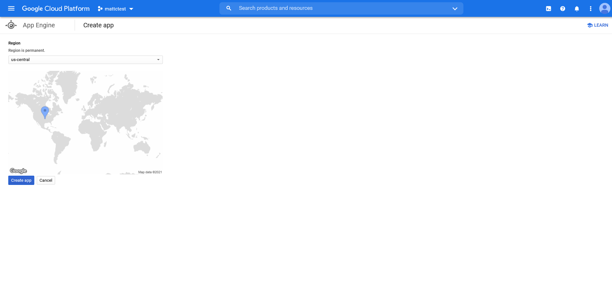
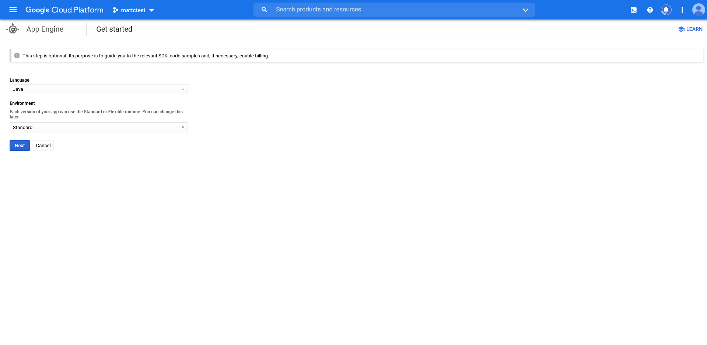
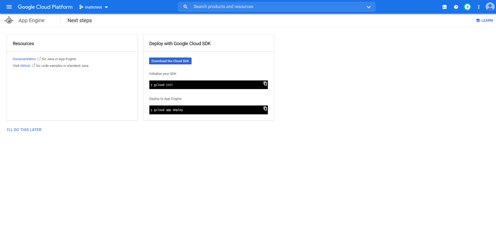
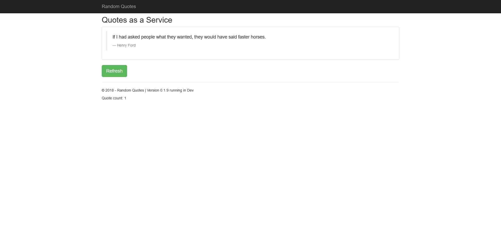

Google App Engine (GAE) is one of the original Platform as a Service (PasS) offerings provided by the Google Cloud Platform (GCP). GAE hosts web applications written in a variety of different languages, and also provides network routing, job scheduling, persistent data storage, and task queues.

In this post we'll look at how to deploy a sample application to GAE and manipulate the networking to implement common deployment scenarios like blue/green, canary, and feature branch deployments.

## A simple deployment

GAE offers two kinds of deployments: deploying source code to be compile by GAE, and deploying compiled applications. Allowing GAE to compile your source code is convenient, but can be hard to scale as the size of your team and the code base increases. For example, I wasn't able to find concrete documentation on how GAE compiled the source code it received (although [this blog post](https://cloud.google.com/blog/products/containers-kubernetes/google-cloud-now-supports-buildpacks) indicates that buildpacks are now the preferred solution), so debugging and build issues locally might present a challenge. Also most enterprise teams will already have a Continuous Integration (CI) server performing build and collecting test results. So for this post we'll focus on deploying compiled applications.

Our sample application will be a simple Java Spring web app called Random Quotes. The source code for this application can be found [here](https://github.com/OctopusSamples/RandomQuotes-Java). This application generates a self contained JAR file hosting the application and a built-in web server.

To deploy the application we need to create a corresponding application resource in the GAE service inside a GCP project. The steps below show an application resource being created via the web console. The first step is to select where the application resource will be hosted:



We then define the environment that will host our web app:



Some instructions on the next steps are provided while the GAE instance is being created.



The end result of this process is the creation of the **Application** shown in the diagram below:


Only one application resource can exist per project. If you attempt to create another application, say in a different region, you'll see an error like this:

```
ERROR: (gcloud.app.create) The project [mattctest] already contains an App Engine application. You can deploy your application using `gcloud app deploy`.
```

With our application resource created, we can deploy our web app. An application resource can host may services, where each service runs our own application. Services are (somewhat confusingly) defined in a file called `app.yaml`. Here is an example `app.yaml` file that we'll use to define and deploy our Java web app:

```yaml
runtime: java11
service: default
instance_class: F2
```

The runtime is a required field that defines the platform that will host our code. I couldn't find a definite list of runtimes, but `java`, `java8`, and `java11` are all included in various places in the documentation and examples. I've used `java11` here as Java 11 is part of the GAE [second generation](https://cloud.google.com/appengine/docs/standard/runtimes).

The first service that is deployed to GAE must be called `default`, so we have defined that name in the `service` field.

:::hint
If you try to deploy a service with a name other than default, you'll get the error:

```
The first service (module) you upload to a new application must be the 'default' service (module).
```
:::

We also need to use a slightly larger [instance](https://cloud.google.com/appengine/docs/standard#instance_classes) than what is provided by default. This is defined in the `instance_class` property. The F2 instance provides 512MB of memory, which we'll need for our web app.

Compile the Java application with the command:

```
./mvnw package
```

This will create a JAR file under the `target` directory. At the time of writing the sample application is at version 0.1.9, so the JAR file is called `target/randomquotes.0.1.9.jar`. To deploy the web app, run the command following command, replacing the name of the project to match your environment:

```
gcloud app deploy .\target\randomquotes.0.1.9.jar --appyaml .\app.yaml --project mattctest
```

Our compiled application is then deployed. The deployment logs will return a URL like https://<projectname>.uc.r.appspot.com/ to the live service, which we can then open in a web browser:

