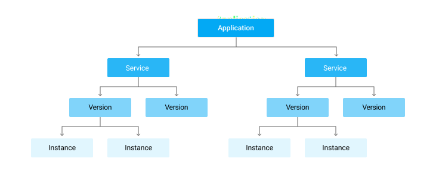
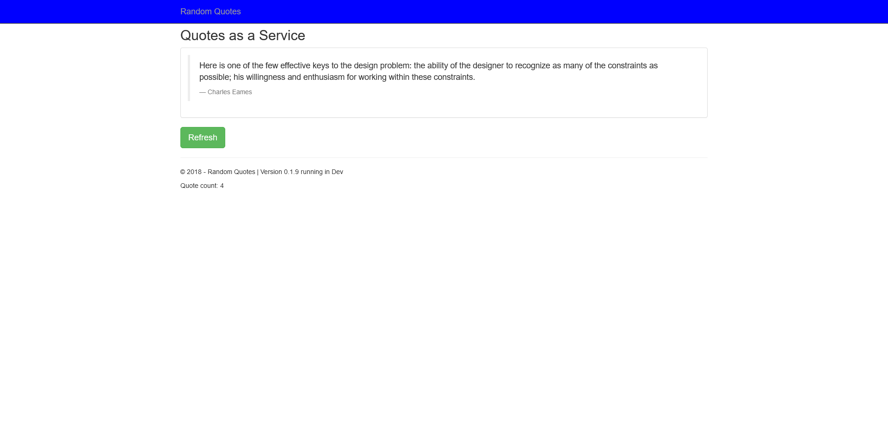
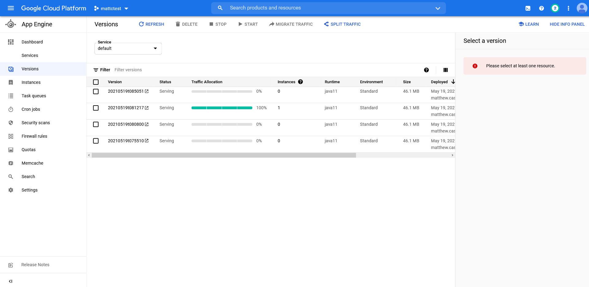
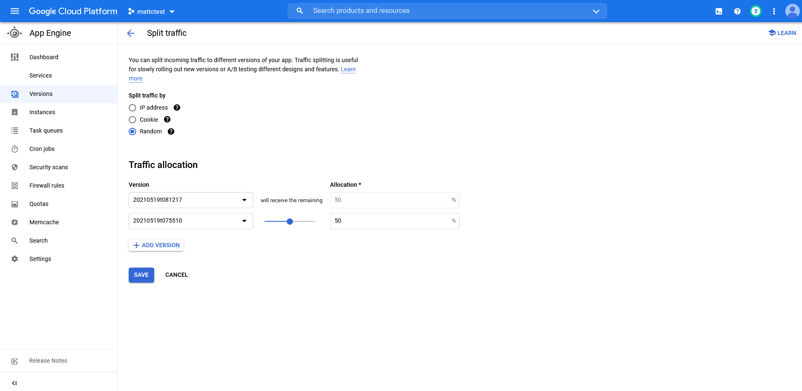

Google App Engine (GAE) is one of the original Platform as a Service (PasS) offerings provided by the Google Cloud Platform (GCP). GAE hosts web applications written in a variety of different languages, and also provides network routing, job scheduling, persistent data storage, and task queues.

In this post we'll look at how to deploy a sample application to GAE and manipulate the networking to implement common deployment scenarios like blue/green, canary, and feature branch deployments.

## A simple deployment

GAE offers two kinds of deployments for Java: deploying source code to be compile by GAE, and deploying compiled applications. Allowing GAE to compile your source code is convenient, although for this example we'll make use of a JAR file that has already been compiled by our CI system.

:::hint
The ability to deploy a compiled application is unique to Java in GAE. Other runtimes, like Node, Python, Ruby, and PHP don't typically produce compiled applications. Go is the notable exception, and in that case you do need to deploy your source code and allow GAE to compile it for you.
:::

Our sample application will be a simple Java Spring web app called Random Quotes. The source code for this application can be found [here](https://github.com/OctopusSamples/RandomQuotes-Java). This application generates a self contained JAR file hosting the application and a built-in web server.

To deploy the application we need to create a corresponding GAE application resource inside a GCP project. The steps below show an application resource being created via the web console. The first step is to select where the application resource will be hosted:


We then define the environment that will host our web app:


Some instructions on the next steps are provided while the GAE instance is being created.


The end result of this process is the creation of the **Application** shown in the diagram below:



:::hint
Only one application resource can exist per project. If you attempt to create another application, say in a different region, you'll see an error like this:

```
ERROR: (gcloud.app.create) The project [mattctest] already contains an App Engine application. You can deploy your application using `gcloud app deploy`.
```
:::

With our application resource created, we can deploy our web app. An application resource can host many services, where each service runs our own application. Services are (somewhat confusingly) defined in a file called `app.yaml`. Here is an example `app.yaml` file that we'll use to define and deploy our Java web app:

```yaml
runtime: java11
service: default
instance_class: F2
```

The runtime is a required defining the platform that will host our code. I couldn't find a definite list of runtimes, but `java`, `java8`, and `java11` are all included in various places in the documentation and examples. We've used `java11` here as Java 11 is part of the GAE [second generation](https://cloud.google.com/appengine/docs/standard/runtimes).

The first service that is deployed to GAE must be called `default`, so we have defined that name in the `service` field.

:::hint
If you try to deploy a service with a name other than default, you'll get the error:

```
The first service (module) you upload to a new application must be the 'default' service (module).
```
:::

We also need to use a slightly larger [instance](https://cloud.google.com/appengine/docs/standard#instance_classes) than what is provided by default. This is defined in the `instance_class` property. The F2 instance provides 512MB of memory, which we'll need for our web app.

Compile the Java application with the command:

```
./mvnw package
```

This will create a JAR file under the `target` directory. At the time of writing the sample application is at version 0.1.9, so the JAR file is called `target/randomquotes.0.1.9.jar`. To deploy the web app, run the following command, replacing the name of the project to match your environment:

```
gcloud app deploy .\target\randomquotes.0.1.9.jar --appyaml .\app.yaml --project mattctest
```

Our compiled application is then deployed. The deployment logs will return a URL like https://\[projectname\].uc.r.appspot.com/ to the live service, which we can then open in a web browser:


## Deploying a feature branch

A common deployment pattern is to have feature branches deployed side by side with the mainline branch. To simulate this we'll deploy the [blueheader](https://github.com/OctopusSamples/RandomQuotes-Java/tree/blueheader) branch of our web app, which will change the background color of the banner to blue.

The `app.yaml` file for this branch looks like this:

```yaml
runtime: java11
service: blueheader
instance_class: F2

env_variables:
  SERVER_SERVLET_CONTEXT_PATH: "/blueheader"
```

We have given this service a new name to match the name of the feature branch. We have also defined the `SERVER_SERVLET_CONTEXT_PATH` environment variable, setting it to `/blueheader`. This defines the context path that the web app expects to receive traffic from. This allows us to test some traffic routing rules that means we can access the new service from a URL like https://\[projectname\].uc.r.appspot.com/blueheader (as opposed to the unique service URL of https://blueheader-dot-\[projectname\].uc.r.appspot.com).

To route the subdirectory of `blueheader` to the new service, create a file called `displatch.yaml` with the following content. These dispatch rules are define how traffic is routed from a URL to a service:

```yaml
dispatch:
  - url: "*/"
    service: default

  - url: "*/blueheader"
    service: blueheader
    
  - url: "*/blueheader/*"
    service: blueheader
```

This is deployed with the command:

```
gcloud app deploy dispatch.yaml --project mattctest
```

We can now open the feature branch at the URL https://\[projectname\].uc.r.appspot.com/blueheader:



## Traffic splitting, canary, and blue/green deployments

Let's now look at how we can use traffic splitting to implement canary and blue/green deployments. For this we'll bump the version of the application in the `pom.xml` file to `0.1.10`:

```xml
<?xml version="1.0" encoding="UTF-8"?>
<project xmlns="http://maven.apache.org/POM/4.0.0" xmlns:xsi="http://www.w3.org/2001/XMLSchema-instance"
         xsi:schemaLocation="http://maven.apache.org/POM/4.0.0 https://maven.apache.org/xsd/maven-4.0.0.xsd">
    <version>0.1.10</version>
    ...
</project>
```

The app is then repackaged with the command:

```
./mvnw package
```

The new version is deployed with the command:

```
gcloud app deploy .\target\randomquotes.0.1.10.jar --appyaml .\app.yaml --project mattctest --no-promote
```

The `--no-promote` option ensures this new version does not receive any traffic, so opening https://\[projectname\].uc.r.appspot.com/ will still display the previous version of the web app.

In the **Versions** tab we have a button called **SPLIT TRAFFIC**:



Clicking this button allows us to direct traffic between the service versions. In the screenshot below you can see that the traffic has been split 50/50 between the latest two versions. We have split the traffic randomly, as this allows us to refresh the URL and see the two versions. However, if you were performing a production canary deployment, it is likely that you would direct users to the same version based on a cookie or IP address so each request didn't get routed to a random version:



Now 50% of the requests to https://\[projectname\].uc.r.appspot.com/ return version 0.1.9, and 50% return version 0.1.10.

A canary deployment is achieved by gradually increasing the traffic to the new version of the service. A blue/green deployment would simply switch traffic 100% to the new version once any tests were completed. We can test a specific version outside of any traffic splitting rules using a URL like https://\[version\]-dot-\[projectname\].uc.r.appspot.com/.

## Conclusion

Google app engine provides a flexible platform for hosting web applications, and the network routing and traffic splitting functionality allows complex deployment processes like feature branches, canary, and blue/green to be performed. In this blog post we deployed a simple Java web application, and demonstrated how advanced deployment patterns can be performed.

Happy deployments!