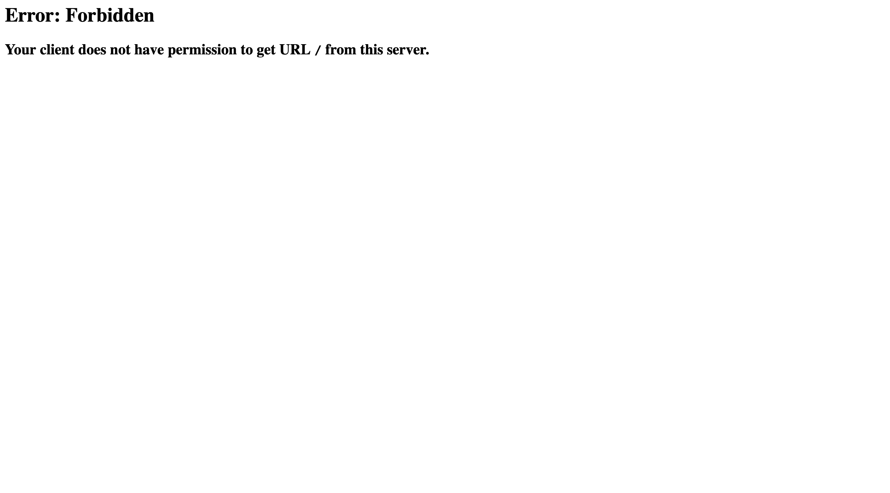
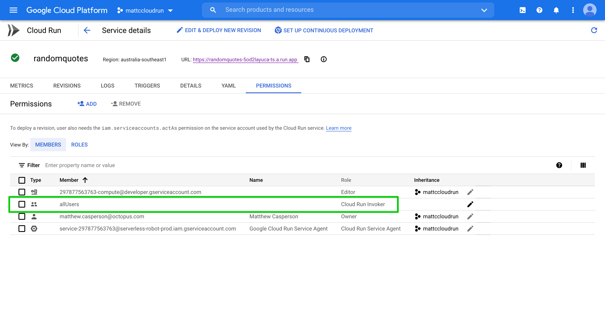
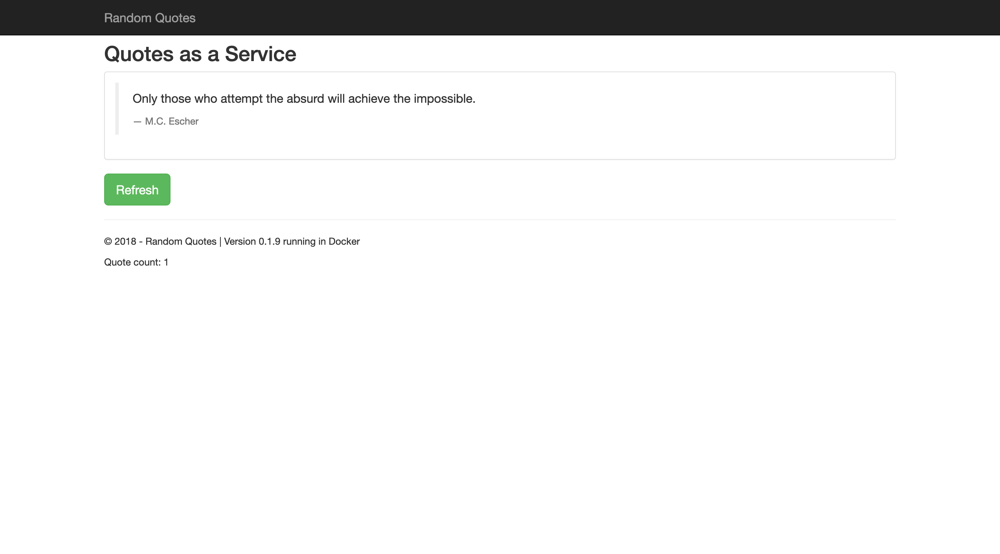
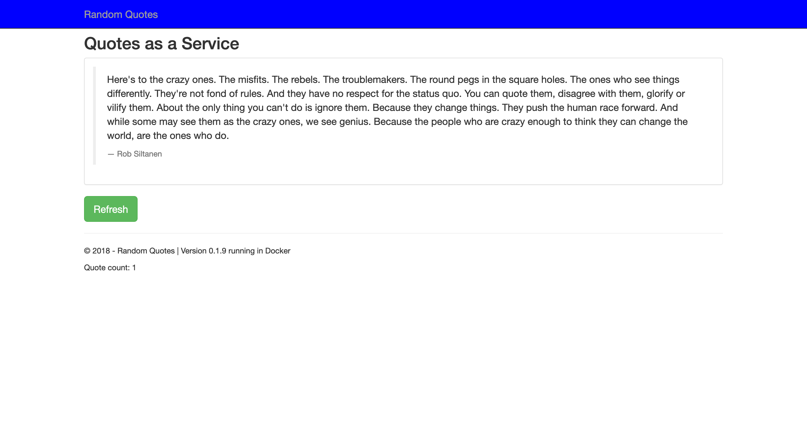
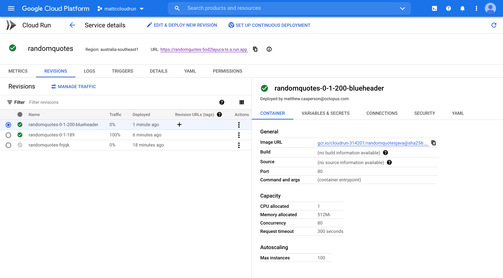
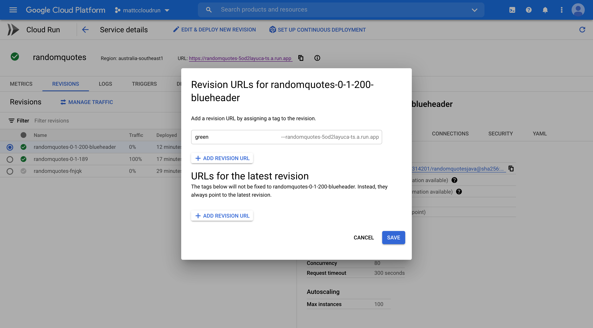

Google Cloud Run is a relatively new Platform as a Service (PaaS) offering on the Google Cloud Platform (GCP). It provides the ability to run and scale container images while only paying for the time that a request is being processed.

In this blog post we'll look at how to deploy a sample application cloud run, and use the traffic shaping rules to perform deployment strategies like feature branches, canary, and blue/green.

## Deploying a sample application

We'll start by deploying a sample application called Random Quotes. This Java Spring web application has been pushed to Docker Hub, and we'll use the latest tag at the time of writing which is `octopussamples/randomquotesjava:0.1.189`.

The first thing to do when deploying to cloud run is to push the Docker image to a Google Container Registry (GCR). Cloud run does not support external registries.

Using the traditional `docker` CLI tool, we can pull and push an image with the following commands, making sure to replace `cloudrun-314201` with the project ID that will hold your cloud run services:

```
docker pull octopussamples/randomquotesjava:0.1.189
docker tag octopussamples/randomquotesjava:0.1.189 gcr.io/cloudrun-314201/randomquotesjava:0.1.189
docker push gcr.io/cloudrun-314201/randomquotesjava:0.1.189
```

Other tools like `skopeo` have been developed to provide more a convenient means of copying Docker images. The command below will directly copy the image from the Docker Hub registry to GCR:

```
skopeo copy docker://octopussamples/randomquotesjava:0.1.189 docker://gcr.io/cloudrun-314201/randomquotesjava:0.1.189
```

:::hint
If you try to reference a Docker image from an external registry, you will receive the error:

```
ERROR: (gcloud.beta.run.services.replace) Expected a Container Registry image path like [region.]gcr.io/repo-path[:tag and/or @digest] or an Artifact Registry image path like [region-]docker.pkg.dev/repo-path[:tag and/or @digest], but obtained octopussamples/randomquotesjava:0.1.189
```
:::

The next step is to define a service YAML resource in a file called `service.yaml`. 

If you are familiar with Kubernetes, the structure of the following YAML will look familiar. It follows the `apiVersion`, `kind`, `metadata`, and `spec` layout that all Kubernetes resources use. In fact the service we are defining here is part of [Knative](https://knative.dev/docs/reference/api/serving-api/), because cloud run is a managed implementation of the Knative service:

```yaml
apiVersion: serving.knative.dev/v1
kind: Service
metadata:
  name: randomquotes
spec:
  template:
    spec:
      containers:
        - image: gcr.io/cloudrun-314201/randomquotesjava:0.1.189
          ports:
            - name: http1
              containerPort: 80
```

The `metadata.name` property defines the name of the service. The `spec.template.spec.containers[0].image` property references the Docker image we copied into GCR. The `spec.template.spec.containers[0].ports.name` property can either be set to `h2c` to indicate that the port is exposed by HTTP2, or `http1` to indicate that the port is exposed by HTTP1. The `spec.template.spec.containers[0].ports.containerPort` property defines the port that is exposed by the container to receive web traffic on.

To deploy this service, run the command:

```bash
gcloud beta run services replace service.yaml --platform managed
```

Once the service is deployed, you'll receive a URL like https://randomquotes-5od2layuca-ts.a.run.app that can be used to access it. Opening the URL will likely result in the the following error being displayed:



The solution is to give the `allUsers` user the `Cloud Run Invoker` permission:



We can then open our web app:



## Feature branch deployments

To deploy an image create from a feature branch, we first need to copy it into GCR. Here we have a feature branch image with the tag `0.1.200-blueheader`, which we copy into GCR with the command:

```
skopeo copy docker://octopussamples/randomquotesjava:0.1.200-blueheader docker://gcr.io/cloudrun-314201/randomquotesjava:0.1.200-blueheader
```

The URL assigned to our service is based on the service name. In the YAML below you can see that we change the name of the service to include the feature branch name:

```yaml
apiVersion: serving.knative.dev/v1
kind: Service
metadata:
  name: randomquotes-blueheader
spec:
  template:
    spec:
      containers:
        - image: gcr.io/cloudrun-314201/randomquotesjava:0.1.200-blueheader
          ports:
            - name: http1
              containerPort: 80
```

Again we deploy this service with the command:

```bash
gcloud beta run services replace service.yaml --platform managed
```

The returned URL will be something like https://randomquotes-blueheader-5od2layuca-ts.a.run.app. By renaming the service we can now run the feature branch side by side with the mainline deployment:



## Canary and blue/green deployments

To perform a canary or blue green deployment we'll make use of service revisions. The name of a revision is defined in the `spec.template.metadata.name` property. It must be prefixed with the name of the service, and can only use lower case letters, numbers, or the dash. Here we have defined a revision called `randomquotes-0-1-189`:

```yaml
apiVersion: serving.knative.dev/v1
kind: Service
metadata:
  name: randomquotes
spec:
  template:
    metadata:
      name: randomquotes-0-1-189
    spec:
      containers:
        - image: gcr.io/cloudrun-314201/randomquotesjava:0.1.189
          ports:
            - name: http1
              containerPort: 80
```

By default, this revision will receive 100% of the traffic. Let's now deploy a new revision:

```yaml
apiVersion: serving.knative.dev/v1
kind: Service
metadata:
  name: randomquotes
spec:
  template:
    metadata:
      name: randomquotes-0-1-200-blueheader
    spec:
      containers:
        - image: gcr.io/cloudrun-314201/randomquotesjava:0.1.200-blueheader
          ports:
            - name: http1
              containerPort: 80
  traffic:
  - revisionName: randomquotes-0-1-200-blueheader
    percent: 0
  - revisionName: randomquotes-0-1-189
    percent: 100
```

This time we deploy the service with a tag:

```
gcloud beta run services replace service.yaml --platform managed --tag randomquotes-0-1-200-blueheader
```

This new revision has been set to receive no traffic, instead redirecting 100% of the traffic to the previous revision:



If we consider the previous revision to be the blue half of a blue green deployment, the new revision will be the green half. We can access this new revision by assigning it a tag:



This new revision can be opened via a URL like https://green---randomquotes-5od2layuca-ts.a.run.app/ to test it before directing any main traffic to it.

A canary deployment can be achieved by slowing directing more traffic to the green stack. The command below directs 10% of traffic to the new revision:

```
gcloud run services update-traffic randomquotes --platform managed --to-revisions=randomquotes-0-1-200-blueheader=10,randomquotes-0-1-189=90
```

This command can be repeated until 100% of traffic is directed to the new revision. A more traditional blue/green deployment would see 100% of traffic cut over to the new revision immediately once any testing on the new stack is completed.

Once testing is complete, we can remove the `green` tag with the command:

```
gcloud run services update-traffic randomquotes --platform managed --remove-tags green
```