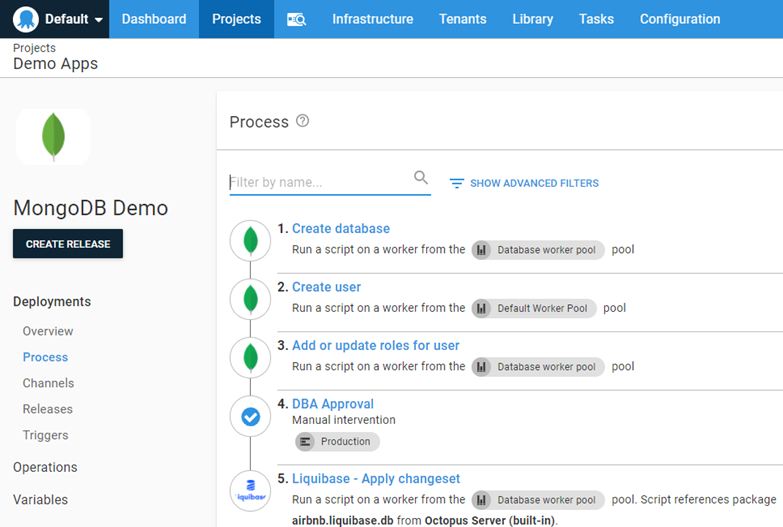
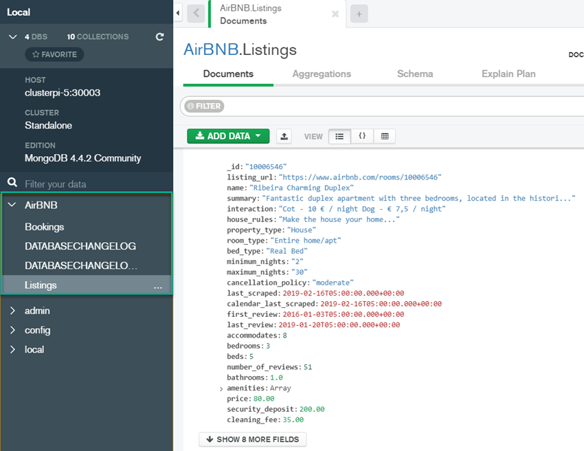

The use of NoSQL as a database backend has been gaining in popularity in recent years. Usage has been so high that Amazon, Microsoft, and Google all created their own cloud-based offerings.  One of the more recognizable names in the NoSQL world is MongoDB.  

In this post, I demonstrate how to automate deployments to MongoDB using Octopus Deploy and Liquibase.

## Liquibase

I previously demonstrated how to [deploy to Oracle using the Liquibase product](https://octopus.com/blog/octopus-oracle-liquibase).  However, Liquibase does not operate strictly in the relational database space, they also have solutions for deploying to NoSQL, including MongoDB.

### Changelog

Working with MongoDB differs significantly from its relational counter parts.  For example, where you would create a table in a relational database, in MongoDB you create a collection.  

Since they differ so greatly, the Liquibase changelog for MongoDB also differs.  

The following contains examples of how to create collections in MongoDB:

```xml
<databaseChangeLog
        xmlns="http://www.liquibase.org/xml/ns/dbchangelog"
        xmlns:xsi="http://www.w3.org/2001/XMLSchema-instance"
        xmlns:ext="http://www.liquibase.org/xml/ns/dbchangelog-ext"
        xsi:schemaLocation="http://www.liquibase.org/xml/ns/dbchangelog http://www.liquibase.org/xml/ns/dbchangelog/dbchangelog-3.6.xsd
        http://www.liquibase.org/xml/ns/dbchangelog-ext http://www.liquibase.org/xml/ns/dbchangelog/dbchangelog-ext.xsd">

    <changeSet id="1" author="alex">
            <ext:createCollection collectionName="createCollectionWithValidatorAndOptionsTest">
                <ext:options>
                    {
                    validator: {
                        $jsonSchema: {
                            bsonType: "object",
                            required: ["name", "address"],
                            properties: {
                                name: {
                                    bsonType: "string",
                                    description: "The Name"
                                },
                                address: {
                                    bsonType: "string",
                                    description: "The Address"
                                }
                            }
                        }
                    },
                    validationAction: "warn",
                    validationLevel: "strict"
                    }
                </ext:options>
            </ext:createCollection>
        <ext:createCollection collectionName="createCollectionWithEmptyValidatorTest">
            <ext:options>
            </ext:options>
        </ext:createCollection>
        <ext:createCollection collectionName="createCollectionWithNoValidator"/>
    </changeSet>
</databaseChangeLog>
```

Similarly, inserting data into a collection has an entirely different syntax to SQL.  Rather than inserting rows into a table, you insert documents into a collection.  

The biggest difference between a row and a document is that a document doesn't have to follow the same structure (or schema in the relational world), the exception being if there is a validator on the collection as shown above.  

This example inserts two documents with two different structures in to the same collection:

```xml
<databaseChangeLog
        xmlns="http://www.liquibase.org/xml/ns/dbchangelog"
        xmlns:xsi="http://www.w3.org/2001/XMLSchema-instance"
        xmlns:ext="http://www.liquibase.org/xml/ns/dbchangelog-ext"
        xsi:schemaLocation="http://www.liquibase.org/xml/ns/dbchangelog http://www.liquibase.org/xml/ns/dbchangelog/dbchangelog-3.6.xsd
        http://www.liquibase.org/xml/ns/dbchangelog-ext http://www.liquibase.org/xml/ns/dbchangelog/dbchangelog-ext.xsd">

    <changeSet id="1" author="alex">
        <ext:insertMany collectionName="insertManyTest1">
            <ext:documents>
                [
                { id: 2 },
                { id: 3,
                  address: { nr: 1, ap: 5}
                }
                ]
            </ext:documents>
        </ext:insertMany>
    </changeSet>
</databaseChangeLog>
```

:::hint
More examples of MongoDB operations with Liquibase can be found in this [GitHub repo](https://github.com/liquibase/liquibase-mongodb/tree/main/src/test/resources/liquibase/ext).
:::

For this post, I chose the [AirBnB](https://docs.atlas.mongodb.com/sample-data/sample-airbnb) example from the MongoDB samples documentation.  My deployment example inserts some data into the Listings collection and creates an additional collection called Bookings. The Listings collection is created during my deployment process, which is explained later in this post.

<details>
	<summary>dbchangelog.xml</summary>
	

```xml
<?xml version="1.1" encoding="UTF-8" standalone="no"?>
<databaseChangeLog
        xmlns="http://www.liquibase.org/xml/ns/dbchangelog"
        xmlns:xsi="http://www.w3.org/2001/XMLSchema-instance"
        xmlns:ext="http://www.liquibase.org/xml/ns/dbchangelog-ext"
        xsi:schemaLocation="http://www.liquibase.org/xml/ns/dbchangelog http://www.liquibase.org/xml/ns/dbchangelog/dbchangelog-3.6.xsd
        http://www.liquibase.org/xml/ns/dbchangelog-ext http://www.liquibase.org/xml/ns/dbchangelog/dbchangelog-ext.xsd">

    <changeSet id="1" author="Shawn.Sesna">
            <ext:createCollection collectionName="Bookings">
            </ext:createCollection>
    </changeSet>
    <changeSet id="2" author="Shawn.Sesna">
        <ext:insertMany collectionName="Listings">
            <ext:documents>
                [
                    {
                    "_id": "10006546",
                    "listing_url": "https://www.airbnb.com/rooms/10006546",
                    "name": "Ribeira Charming Duplex",
                    "summary": "Fantastic duplex apartment with three bedrooms, located in the historic area of Porto, Ribeira (Cube)...",
                    "interaction": "Cot - 10 € / night Dog - € 7,5 / night",
                    "house_rules": "Make the house your home...",
                    "property_type": "House",
                    "room_type": "Entire home/apt",
                    "bed_type": "Real Bed",
                    "minimum_nights": "2",
                    "maximum_nights": "30",
                    "cancellation_policy": "moderate",
                    "last_scraped": {
                        "$date": {
                        "$numberLong": "1550293200000"
                        }
                    },
                    "calendar_last_scraped": {
                        "$date": {
                        "$numberLong": "1550293200000"
                        }
                    },
                    "first_review": {
                        "$date": {
                        "$numberLong": "1451797200000"
                        }
                    },
                    "last_review": {
                        "$date": {
                        "$numberLong": "1547960400000"
                        }
                    },
                    "accommodates": {
                        "$numberInt": "8"
                    },
                    "bedrooms": {
                        "$numberInt": "3"
                    },
                    "beds": {
                        "$numberInt": "5"
                    },
                    "number_of_reviews": {
                        "$numberInt": "51"
                    },
                    "bathrooms": {
                        "$numberDecimal": "1.0"
                    },
                    "amenities": [
                        "TV",
                        "Cable TV",
                        "Wifi",
                        "Kitchen",
                        "Paid parking off premises",
                        "Smoking allowed",
                        "Pets allowed",
                        "Buzzer/wireless intercom",
                        "Heating",
                        "Family/kid friendly",
                        "Washer",
                        "First aid kit",
                        "Fire extinguisher",
                        "Essentials",
                        "Hangers",
                        "Hair dryer",
                        "Iron",
                        "Pack ’n Play/travel crib",
                        "Room-darkening shades",
                        "Hot water",
                        "Bed linens",
                        "Extra pillows and blankets",
                        "Microwave",
                        "Coffee maker",
                        "Refrigerator",
                        "Dishwasher",
                        "Dishes and silverware",
                        "Cooking basics",
                        "Oven",
                        "Stove",
                        "Cleaning before checkout",
                        "Waterfront"
                    ],
                    "price": {
                        "$numberDecimal": "80.00"
                    },
                    "security_deposit": {
                        "$numberDecimal": "200.00"
                    },
                    "cleaning_fee": {
                        "$numberDecimal": "35.00"
                    },
                    "extra_people": {
                        "$numberDecimal": "15.00"
                    },
                    "guests_included": {
                        "$numberDecimal": "6"
                    },
                    "images": {
                        "thumbnail_url": "",
                        "medium_url": "",
                        "picture_url": "https://a0.muscache.com/im/pictures/e83e702f-ef49-40fb-8fa0-6512d7e26e9b.jpg?aki_policy=large",
                        "xl_picture_url": ""
                    },
                    "host": {
                        "host_id": "51399391",
                        "host_url": "https://www.airbnb.com/users/show/51399391",
                        "host_name": "Ana Gonçalo",
                        "host_location": "Porto, Porto District, Portugal",
                        "host_about": "Gostamos de passear, de viajar, de conhecer pessoas e locais novos, gostamos de desporto e animais! Vivemos na cidade mais linda do mundo!!!",
                        "host_response_time": "within an hour",
                        "host_thumbnail_url": "https://a0.muscache.com/im/pictures/fab79f25-2e10-4f0f-9711-663cb69dc7d8.jpg?aki_policy=profile_small",
                        "host_picture_url": "https://a0.muscache.com/im/pictures/fab79f25-2e10-4f0f-9711-663cb69dc7d8.jpg?aki_policy=profile_x_medium",
                        "host_neighbourhood": "",
                        "host_response_rate": {
                        "$numberInt": "100"
                        },
                        "host_is_superhost": false,
                        "host_has_profile_pic": true,
                        "host_identity_verified": true,
                        "host_listings_count": {
                        "$numberInt": "3"
                        },
                        "host_total_listings_count": {
                        "$numberInt": "3"
                        },
                        "host_verifications": [
                        "email",
                        "phone",
                        "reviews",
                        "jumio",
                        "offline_government_id",
                        "government_id"
                        ]
                    },
                    "address": {
                        "street": "Porto, Porto, Portugal",
                        "suburb": "",
                        "government_area": "Cedofeita, Ildefonso, Sé, Miragaia, Nicolau, Vitória",
                        "market": "Porto",
                        "country": "Portugal",
                        "country_code": "PT",
                        "location": {
                        "type": "Point",
                        "coordinates": [
                            {
                            "$numberDouble": "-8.61308"
                            },
                            {
                            "$numberDouble": "41.1413"
                            }
                        ],
                        "is_location_exact": false
                        }
                    },
                    "availability": {
                        "availability_30": {
                        "$numberInt": "28"
                        },
                        "availability_60": {
                        "$numberInt": "47"
                        },
                        "availability_90": {
                        "$numberInt": "74"
                        },
                        "availability_365": {
                        "$numberInt": "239"
                        }
                    },
                    "review_scores": {
                        "review_scores_accuracy": {
                        "$numberInt": "9"
                        },
                        "review_scores_cleanliness": {
                        "$numberInt": "9"
                        },
                        "review_scores_checkin": {
                        "$numberInt": "10"
                        },
                        "review_scores_communication": {
                        "$numberInt": "10"
                        },
                        "review_scores_location": {
                        "$numberInt": "10"
                        },
                        "review_scores_value": {
                        "$numberInt": "9"
                        },
                        "review_scores_rating": {
                        "$numberInt": "89"
                        }
                    },
                    "reviews": [
                        {
                        "_id": "362865132",
                        "date": {
                            "$date": {
                            "$numberLong": "1545886800000"
                            }
                        },
                        "listing_id": "10006546",
                        "reviewer_id": "208880077",
                        "reviewer_name": "Thomas",
                        "comments": "Very helpful hosts. Cooked traditional..."
                        },
                        {
                        "_id": "364728730",
                        "date": {
                            "$date": {
                            "$numberLong": "1546232400000"
                            }
                        },
                        "listing_id": "10006546",
                        "reviewer_id": "91827533",
                        "reviewer_name": "Mr",
                        "comments": "Ana Goncalo were great on communication..."
                        },
                        {  - Server Name: Name or IP address of the MongoDB server
  - Server Port: Port MongoDB is listening on

                        "_id": "403055315",
                        "date": {
                            "$date": {
                            "$numberLong": "1547960400000"
                            }
                        },
                        "listing_id": "10006546",
                        "reviewer_id": "15138940",
                        "reviewer_name": "Milo",
                        "comments": "The house was extremely well located..."
                        }
                    ]
                    }                
                ]
            </ext:documents>
        </ext:insertMany>
    </changeSet>
</databaseChangeLog>
```
</details>

## Octopus Deploy

The step template used to deploy to MongoDB is the same template I used for  Oracle: [Liquibase - Apply changeset](https://library.octopus.com/step-templates/6a276a58-d082-425f-a77a-ff7b3979ce2e/actiontemplate-liquibase-apply-changeset).  This template has been updated to include MongoDB as a selectable database type.

My deployment project consists of the following steps:

- Create MongoDB Database
  - Server Name: Name or IP address of the MongoDB server
  - Server Port: Port MongoDB is listening on
  - Database Name: Name of the database to create 
  - Initial Collection: Name of a collection to create
  - Username: Username of an account that can create databases and collections
  - Password: Password for the username
- Create MongoDB User
  - Server Name: Name or IP address of the MongoDB server
  - Server Port: Port MongoDB is listening on
  - Admin Username: Username of an account that can create users
  - Admin Password: Password for the Admin Username
  - Username: Username for the account to create
  - Password: Password for the User to create
- Add or update roles for user
  - Server Name: Name or IP address of the MongoDB server
  - Server Port: Port MongoDB is listening on
  - Database Name: Name of the database to grant roles to
  - Admin Username: Username of an account that can create users
  - Admin Password: Password for the Admin Username
  - Roles: Comma-delimited list of Roles to assign
- DBA Approval
  - Scoped to production
- Liquibase - Apply changeset
  - Pro license key: Empty
  - Database type: MongoDB
  - Change Log file name: dbchangelog.xml
  - Server Name: Name or IP address of the MongoDB server
  - Server Port: Port MongoDB is listening on
  - Database name: Name of the database to apply updates to
  - Username: Username with rights to update database
  - Password: Password for the user account
  - Connection query string parameters: `?authSource=admin`
  - Database driver path: Empty
  - Executable file path: Empty
  - Report only?: Unchecked (not supported for NoSQL databases)
  - Download Liquibase: Checked
  - Liquibase Version: Empty
  - Changeset package: Package containing dbchangelog.xml



:::hint
MongoDB requires the `Connection query string parameters` parameter to be set to whatever database is providing [authentication](https://docs.mongodb.com/manual/reference/connection-string/) such as `?authSource=admin` shown above. 
:::

It is possible to create the database, collection, and user, as well as assign roles to the user within the Liquibase changelog. MongoDB will simply create the objects on the fly if they don't already exist.  Separating the steps is meant to make it easier to follow for those who aren't familiar with how MongoDB works.

### Deployment

After the deployment has completed, we can use MongoDB Compass, to verify that our database, collection, and data have been added.



## Conclusion

In this post, I demonstrated how easy it is to deploy to MongoDB using Liquibase and Octopus Deploy.  

## Watch the webinar

<iframe width="560" height="315" src="https://www.youtube.com/embed/1nrxnF4LxGw" title="YouTube video player" frameborder="0" allow="accelerometer; autoplay; clipboard-write; encrypted-media; gyroscope; picture-in-picture" allowfullscreen></iframe>


We host webinars regularly. See the [webinars page](https://octopus.com/events) for past webinars and details about upcoming webinars. 

Happy deployments!
