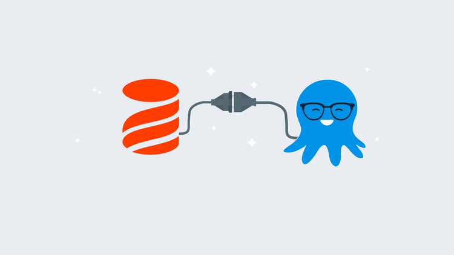
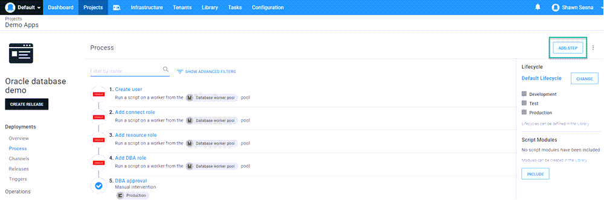
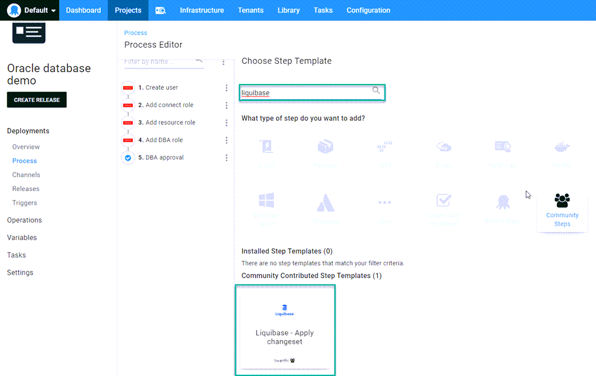
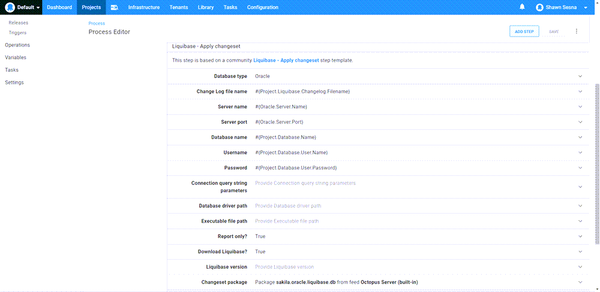
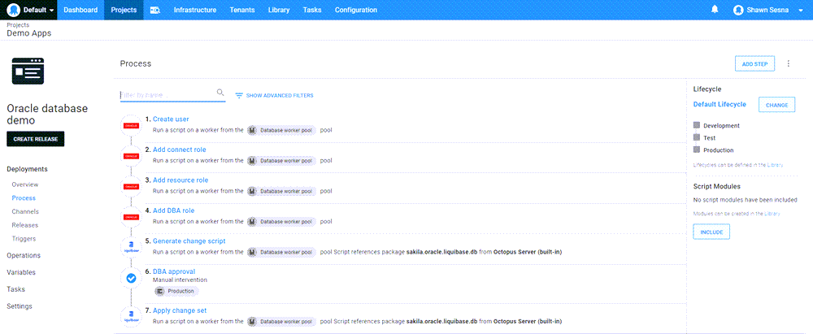
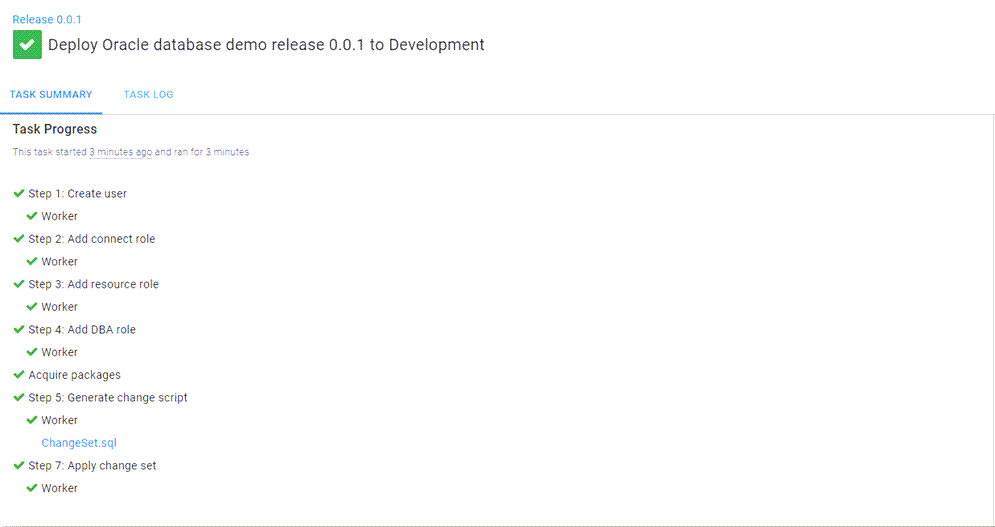
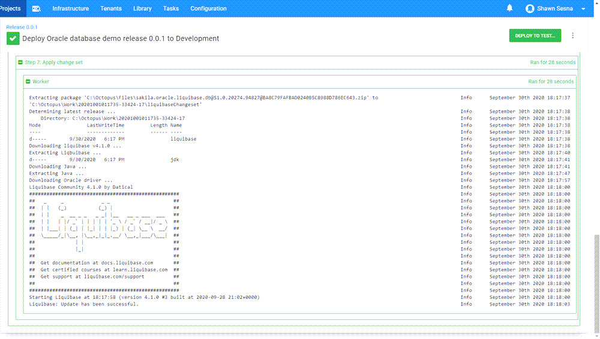
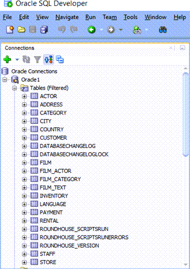

Database deployments are often the hardest part of deployments. In this post, I show you how to deploy an Oracle database with Liquibase using Octopus Deploy.

## Liquibase

[Liquibase](https://www.liquibase.org/) is a migrations-based database deployment tool similar to [Flyway](https://flywaydb.org/), [DbUp](https://dbup.readthedocs.io/en/latest/), and [RoundhousE](https://github.com/chucknorris/roundhouse).  The differentiating feature of Liquibase is how you define your migrations. 

Flyway, DbUp, and RoundhousE rely on the user writing the SQL scripts themselves, while Liquibase allows the user to define migrations in XML, JSON, YAML, as well as SQL in what is called a `changelog`.  Liquibase will convert the changelog to SQL statements during the deployment process.

### Sample project: Sakila

[Sakila](https://dev.mysql.com/doc/sakila/en/) is a sample database originally developed for MySQL.  This project contains a number of different database objects, including tables, views, stored procedures, and functions. This makes it a well-rounded example.  

To support other database technologies, I created a repo in our [Samples BitBucket instance](https://bitbucket.org/octopussamples/sakila/src/master/), which contains the Sakila project in a number of different database technologies and methods.

### Changelog

The [step template for Liquibase](https://library.octopus.com/step-templates/6a276a58-d082-425f-a77a-ff7b3979ce2e/actiontemplate-liquibase-apply-changeset) in Octopus Deploy works in one of two ways:

- With Liquibase included in the package.
- With only the changelog file.

For this post, we package the changelog file:

  
dbchangelog.xml

## Octopus Deploy

Using Octopus Deploy, you can include the Liquibase step template to automate your deployments to Oracle.  This post assumes you're already familiar with [creating a project](https://octopus.com/docs/projects#add-a-project) in Octopus Deploy and will cover the steps specific to Liquibase.

### Liquibase step template

To add the Liquibase template, click the **ADD STEP** button in the **Process** tab of your Octopus project:

Then filter by `liquibase`.  The template will appear in the **Community Contributed Step Templates** section.  Click **INSTALL AND ADD** (or **ADD** if it's already installed):

The Liquibase template is specifically designed to support running on a Worker with the capability to download everything it needs to run, including Java.  With the template added, fill in the fields for the template.

#### Database type

Select the database type that you're deploying to. The currently supported types are:

- MariaDB
- MongoDB
- MySQL
- Oracle
- PostgreSQL
- SqlServer

Liquibase itself supports [more types](https://www.liquibase.org/get-started/databases), but they have not been included in the template yet.

#### Changelog file name

This is the name and or relative location within the package of the changelog file.  For example:

- dbchangelog.xml
- /subfolder/mychangelog.JSON

#### Server name
Name, DNS, or IP address of the server to deploy to.

#### Server port
Port number the database server is listening on.

#### Database name
Name of the database to deploy to.

#### Username
Username of the account with permissions to the database.

#### Password
Password of the account with permissions to the database.

#### Connection query string parameters
Specify any additional query string parameters for the connection string.  For example: `?useUnicode=true`.

#### Database driver path
Path to the database driver jar file within the package to use for connecting to the database server.  Not used when the **Download Liquibase** option is checked.

#### Executable file path
Path to the Liquibase executable within the package.  Not used when **Download Liquibase** option is checked.

#### Report only?
This checkbox is used when you only want to see the SQL that is going to be used for the deployment.  

The step template will automatically attach the .sql file as an artifact of the deployment.  This is useful when you require someone to review the changes prior to deployment.

#### Download Liquibase?
Use this option if you're not including Liquibase in your deployment package.  

This option will download the community version of Liquibase, Java, and the database type .jar file necessary to perform the deployment.  This post uses this option.

#### Liquibase version
This option is only used with the **Download Liquibase** option.  

This specifies the version of Liquibase to download. Leave blank to use the latest.

#### Changeset package
This is the package selector for deployment.

When done, it should look something like this:

### Deployment process

For this post, I added a few other steps to the process to mimic a real-world deployment:

- **Create user**: Creates the database user if it doesn't exist.
- **Add connect role**: Adds the CONNECT role to the above user.
- **Add resource role**: Adds the RESOURCE role to the above user.
- **Add DBA role**: Adds the DBA role to the above user.
- **Generate change script**: Liquibase step with Report Only checked to generate what will be run.
- **DBA Approval**: Requests DBA approval only in production.
- **Apply change set**: Liquibase step that applies the changes.

### The deployment
When executed, the deployment results will look something like this:

As you can see, the Report Only step attached the `ChangeSet.sql` file as an artifact, which can be reviewed prior to approval.  Expanding the `Apply changeset` step shows:

### Oracle

If we log into Oracle, we can see that our database updates have been applied:

## Conclusion

Octopus Deploy supports deploying to many database technologies (Microsoft SQL Server, MariaDB, MySQL, Oracle, PostgreSQL, etc.) as well as many different deployment methods (DACPAC, DbUp, Flyway, Liquibase, RoundhousE, etc.).  I hope this post helps you understand how you can use Octopus to deploy to an Oracle database using Liquibase.

## Watch the webinar

<iframe width="560" height="315" src="https://www.youtube.com/embed/1nrxnF4LxGw" title="YouTube video player" frameborder="0" allow="accelerometer; autoplay; clipboard-write; encrypted-media; gyroscope; picture-in-picture" allowfullscreen></iframe>

We host webinars regularly. See the [webinars page](https://octopus.com/events) for past webinars and details about upcoming webinars. 

Happy deployments!
