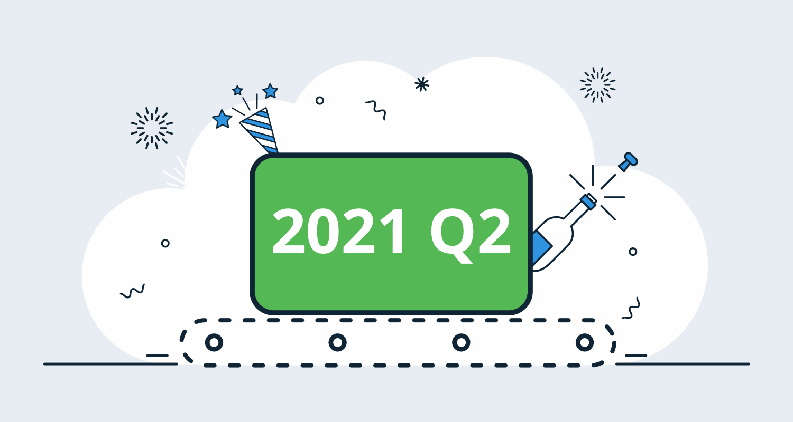
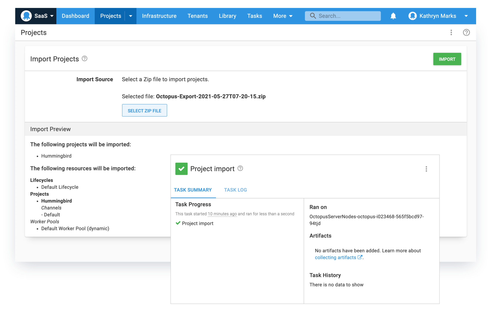
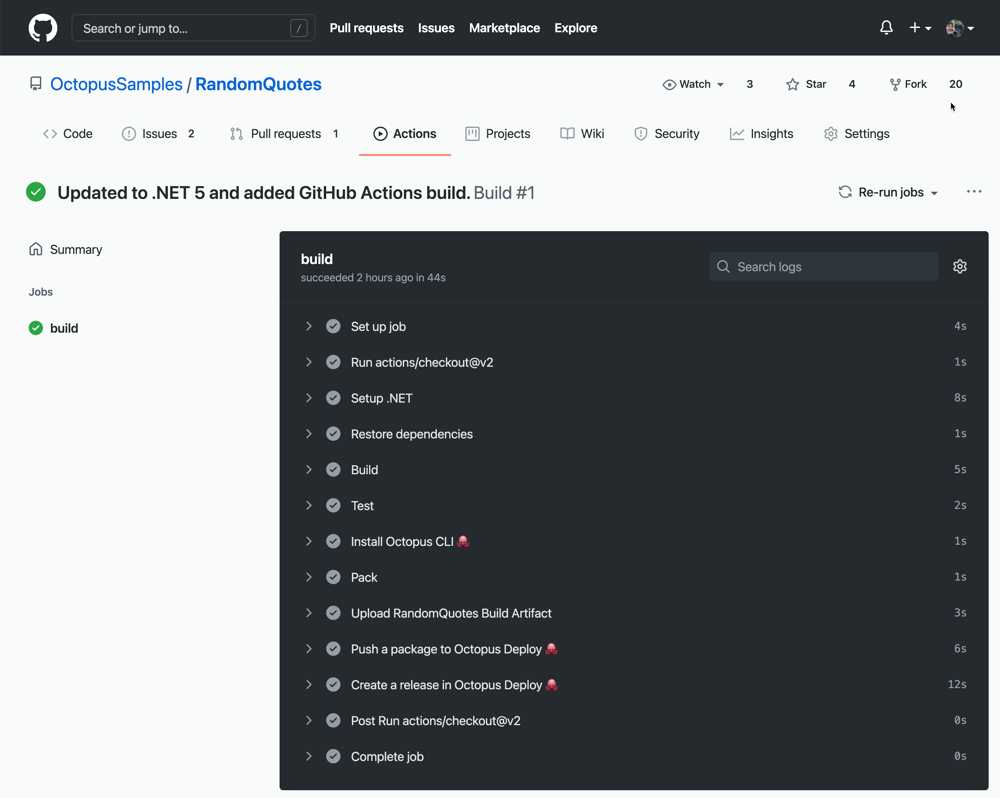
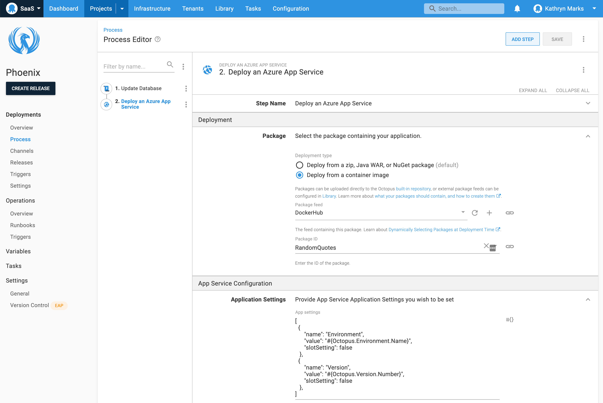

The Octopus 2021 Q2 release is now available and delivers a better cloud experience. With this release, you can:

- Migrate Octopus projects to Octopus Cloud with self-service export/import.
- Integrate Octopus more easily with GitHub Actions and HashiCorp's Terraform.
- Deploy your Azure web apps with our improved Azure App Service step.
- Scale Octopus Cloud as your needs grow:
   - Run more concurrent automation tasks.
   - Persist more build and automation artifacts with best-in-class storage.
- Configure the Tentacle agent without root or admin permissions.

Our [public roadmap](https://octopus.com/roadmap) outlines more cloud improvements to follow later in the year, including integration with Google Cloud Platform (GCP).

## Included in the Q2 release

- Octopus Server 2021.1 ([release notes](https://octopus.com/downloads/whatsnew/2021.1))
- Tentacle 6.1.670
- Terraform Provider for Octopus Deploy 0.7.36

## Long term support

The following table shows the Octopus Server releases with long term support. 

| Release               | Long term support           |
| --------------------- | --------------------------- |
| Octopus 2021.1        | Yes                         |
| Octopus 2020.6        | Yes                         |
| Octopus 2020.5        | Expired                     |

## Release Tour

<iframe width="560" height="315" src="https://www.youtube.com/embed/mQIeG3CwhP4" frameborder="0" allowfullscreen></iframe>

## Self-service migrations with Export/Import Projects (early access) {#project-export-import}

The [Export/Import Projects feature](https://octopus.com/blog/exporting-projects) allows you to move projects from one space to another. We nicknamed it Project Bento as our goal was to make a portable container for your Octopus data.

We designed Bento with cloud migrations in mind, to streamline the process of moving existing projects from on-premises to Octopus Cloud.

Project Export/Import can be used to:

- Move projects from a self-hosted Octopus Server to Octopus Cloud.
- Split a multi-project space into multiple spaces.
- Move a project from one space to another, in the same instance or another instance.

The feature is in early access so there may be few rough edges, but we've designed the process to abort without changes in the event of a problem or error. We'd love you to try Bento and provide feedback.

Learn more about [exporting and importing projects](https://octopus.com/docs/projects/export-import) in our documentation.

## GitHub Actions {#github-actions}

This quarter we joined the [GitHub Technology Partner](https://partner.github.com/technology-partners) program and became a verified creator in the [GitHub Marketplace](https://github.com/marketplace?type=actions&verification=verified_creator&query=OctopusDeploy).

We introduced native support for GitHub Actions so you can integrate your GitHub builds and other automated processes with your Octopus workflows.

To date, we've published four official GitHub Actions for Octopus Deploy, and there are more to come. From GitHub, you can now:

- [Push packages](https://github.com/marketplace/actions/push-package-to-octopus-deploy) to Octopus Deploy. 
- [Create releases](https://github.com/marketplace/actions/create-release-in-octopus-deploy) in Octopus Deploy.
- [Execute a runbook](https://github.com/marketplace/actions/run-runbook-in-octopus-deploy) in Octopus Deploy.
- [Install](https://github.com/marketplace/actions/install-octopus-cli) the Octopus CLI.

Learn how to get started in our post [Announcing GitHub Actions for Octopus Deploy](https://octopus.com/blog/github-actions-for-octopus-deploy). 

We look forward to bringing you more GitHub Actions as the year progresses.

## Improvements to Terraform integration {#terraform-integration}

We introduced our official [Terraform Provider](https://github.com/OctopusDeployLabs/terraform-provider-octopusdeploy) in January this year.

Since then we've applied incremental improvements to the provider itself and related steps built into Octopus Deploy. We also became a [HashiCorp Technology Partner](https://www.hashicorp.com/integrations).

Learn more about [getting started with the Terraform provider for Octopus Deploy](https://octopus.com/blog/octopusdeploy-terraform-provider) or read the [quick start guide](https://registry.terraform.io/providers/OctopusDeployLabs/octopusdeploy/latest/docs).

## Azure App Service deployments {#azure-deploy}

Azure App Service now supports many different types of applications (such as .NET, Java, and Node.js) and various ways to deploy and configure them.

We added a new step to Octopus so you can take advantage of these capabilities.

The **Deploy an Azure App Service** step:

- Deploys container images in addition to packages (zip, NuGet, and Java war files).
- Runs cross-platform, so it's available to customers who self-host Octopus Server on Linux.
- Deploys apps to Linux App Service plans without needing obscure configuration settings.
- Configures Azure app settings and connection strings.
- Performs configuration file transforms.

We tip our hats to our friends at [Clear Measure](https://clearmeasure.com/) for their help in developing these improvements to Azure App Service deployments.

Learn how to get started in our post [Improved Azure App Service deployments](https://octopus.com/blog/azure-app-service-step).

## Improvements to Octopus Cloud {#octopus-cloud}

We improved the compute and storage capabilities of Octopus Cloud so it can scale with you. Customers on paid plans will enjoy the following benefits:

- Best-in-class CI/CD file storage. You can store up to 1 TB of packages, artifacts, and task logs. 
- The ability to run more concurrent automation tasks as you scale your business.

All paying customers receive the storage increase with the release.

We're also working on migration guides to support your cloud journey. The [first guide](https://octopus.com/blog/iis-to-azure-app-service) in the series describes how to move an ASP.NET web app from IIS on-premises to an Azure App Service.

## Registering Tentacle agents {#octopus-tentacle-agents}

The Tentacle agent is now more compatible with high security, low trust environments.

From Tentacle version 6.1.648, you can configure the Tentacle agent via the Octopus CLI without root or administrator permissions.

The [create-instance](https://octopus.com/docs/octopus-rest-api/tentacle.exe-command-line/create-instance) command now creates the Tentacle configuration file in the current working directory without needing access to the shared registry. Subsequent commands to the Tentacle instance, such as [configure](https://octopus.com/docs/octopus-rest-api/tentacle.exe-command-line/configure), are run directly from that location without elevated permissions. 

You can learn more about [rootless instance creation](https://octopus.com/docs/infrastructure/deployment-targets/windows-targets/automating-tentacle-installation#rootless-instance-creation) in our documentation.

## Breaking changes

This release includes one breaking change.

### Change to support for Windows Docker images

We have deprecated Windows Docker images for **Octopus Server** and **Octopus CLI** as customer uptake was low and Microsoft no longer supports the OS versions we were publishing (Windows [1809](https://docs.microsoft.com/en-us/windows/release-health/status-windows-10-1809-and-windows-server-2019), [1903](https://docs.microsoft.com/en-us/lifecycle/announcements/windows-10-1903-end-of-servicing), and  [1909](https://docs.microsoft.com/en-us/windows/release-health/status-windows-10-1909)). 

Customers are encouraged to use the Linux Docker image instead. Existing Windows images for Octopus Server and Octopus CLI will remain available from our [Docker Hub repository](https://hub.docker.com/r/octopusdeploy/octopusdeploy), but those tagged as `latest` will no longer work on Windows. See our documentation for a guide to [Migrate to an Octopus Server Linux Container from a Windows Container](https://octopus.com/docs/installation/octopus-in-container/migrate-to-server-container-linux-from-windows-container).

Octopus CLI is available as an exe, a .NET Core global tool, or via chocolatey. Please refer to our [downloads page](https://octopus.com/downloads/octopuscli).

We will continue to publish Windows Docker images for **Tentacle**. Once we've updated the images for Tentacle to Windows 2019 and Windows 20H2, we will deprecate the existing Windows 1809/1903/1909 containers.

## Upgrade or get started

Octopus Cloud users are already running this release, and self-hosted Octopus customers can [download the latest version](https://octopus.com/downloads/2021.1.0) now.  

We encourage you to review the [steps for upgrading Octopus Server](https://octopus.com/docs/administration/upgrading). Please see the [release notes](https://octopus.com/downloads/compare?to=2021.1.0) for further information.

### Start your cloud journey

If you've never used Octopus Cloud before, [sign up](https://octopus.com/start) for a free account with support for ten deployment targets or [email our Sales team](mailto:sales@octopus.com) to see a demo and learn more.

## What's coming in future releases?

We're investing in Octopus Cloud to support your cloud migration initiatives. The Q2 release is the foundation for ongoing efforts to:

- Provide a smoother cloud migration experience.
- Improve the scalability and capability of Octopus Cloud.  
- Build new and improved integration between Octopus and CI/CD tools.

Check out our [public roadmap](https://octopus.com/roadmap) to stay informed and register for updates.

## Conclusion

Octopus 2021 Q2 delivers a better cloud experience. 

Now you can Export/Import Projects, scale Octopus Cloud as your needs grow, take advantage of Azure App Service capabilities, and integrate Octopus more easily with GitHub Actions and Terraform.

Please let us know what you think, by leaving a comment here or in our [Community Slack](https://octopus.com/slack).

## Watch the webinar

<iframe width="560" height="315" src="https://www.youtube.com/embed/Dm4vOwuo9GI" title="YouTube video player" frameborder="0" allow="accelerometer; autoplay; clipboard-write; encrypted-media; gyroscope; picture-in-picture" allowfullscreen></iframe>

We host webinars regularly. See the [webinars page](https://octopus.com/events) for past webinars and details about upcoming webinars. 

Happy deployments!
