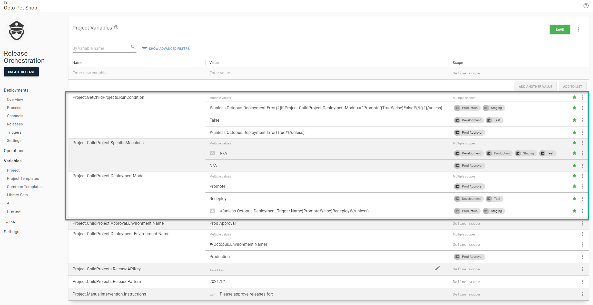
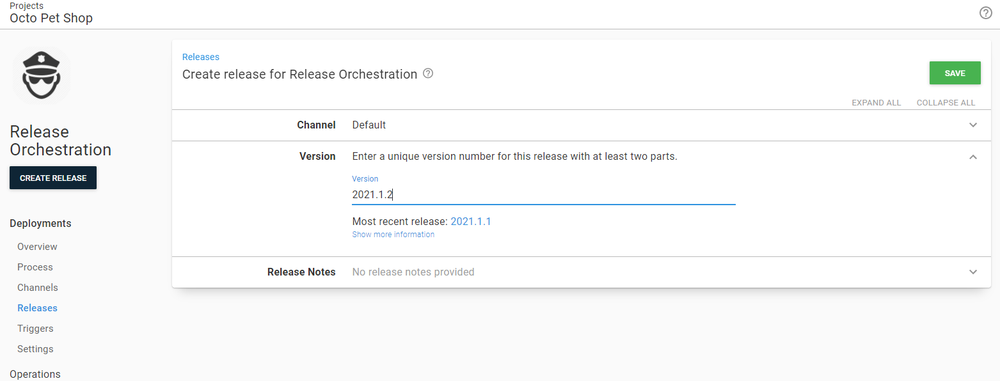
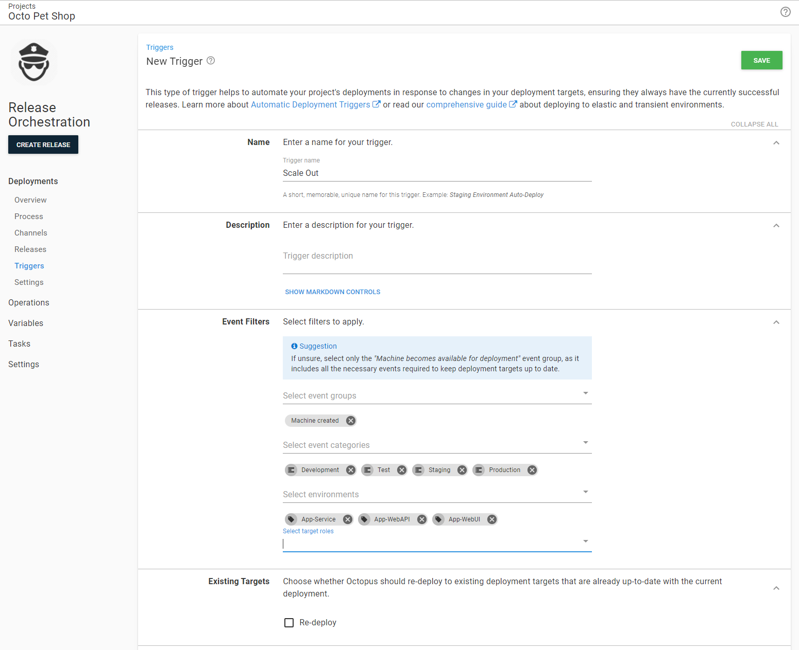
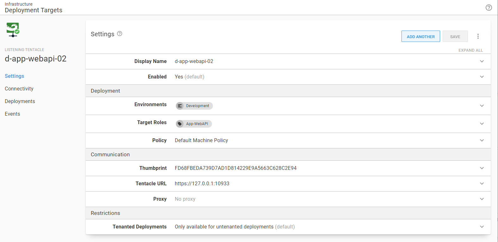
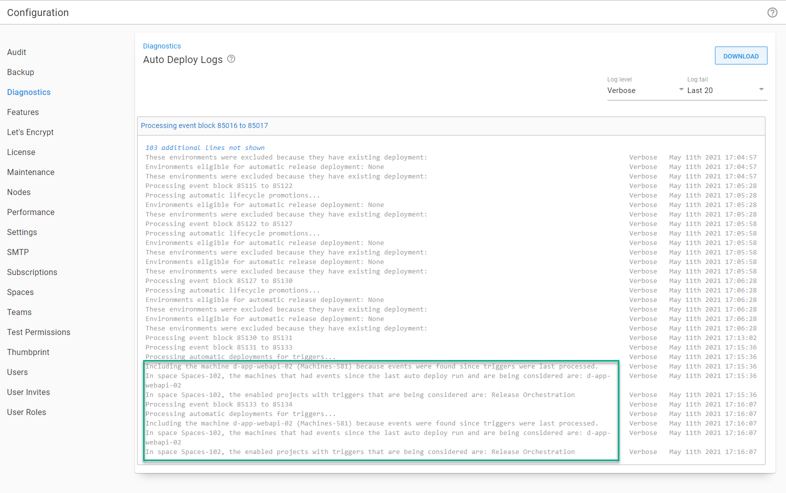

I'm back for the third blog post on the [Deploy Child Octopus Deploy Project][https://library.octopus.com/step-templates/0dac2fe6-91d5-4c05-bdfb-1b97adf1e12e/actiontemplate-deploy-child-octopus-deploy-project] step template.  The [first article](https://octopus.com/blog/release-management-with-octopus) covered common release management scenarios, while the [second article](https://octopus.com/blog/multi-tenancy-release-management) took those scenarios and added multi-tenancy into the mix.  In this article, I am going to cover release management with dynamic infrastructure.  

:::success
This article assumes you read the [previous articles](blog/2021-02/release-management-with-octopus/index.md).
:::

## Release Management and Dynamic Infrastructure

After my first article was published, a customer reached out and asked how they could use my step to _redeploy_ a suite of application components, not _promote_ from one environment to another.  I'll admit, none of the use cases I considered when writing that step template took that into account.  But I should have.  The customer was rebuilding their test servers periodically.  

After some discussion, we landed on the requirements:
- Redeploy the last successful release found in the destination environment.
- The rebuilt server won't host all the components, only run applicable child projects.
- The same project should be used to redeploy and promote.
- At first it is okay to manually enter the target name, later they'd like a deployment target trigger to automatically redeploy.

## Child Project Target Filter
A significant number of applications are not hosted on a single deployment target.  Consider this example for **staging**

- **Database**: no targets, only workers
- **Scheduling Service**: `s-app-service-01`
- **Web API**: `s-web-api-01` and `s-web-api-02`
- **Web UI**: `s-web-ui-01` and `s-web-ui-02`

If I were to rebuild `s-web-api-01` and `s-app-service-01` I'd only want to redeploy the **Scheduling Service** and **Web API** projects.  But only for the related project/server combination.  I wouldn't want to try to deploy the **Scheduling Service** to `s-web-api-01` or the **Web API** to `s-app-service-01`.  

One of my main goals with the Deploy Child Octopus Deploy Project step template is it "just works."  I wanted to remove as much psychological weight when it came to promoting/deploying an application suite.  That principle is applied in this scenario.  When the parent / release orchestration project is given a specific set of machines to deploy it will compare that list with the list of machines the child project can deploy to.  Using the same scenario:

- **Database**: no targets, project is skipped.
- **Scheduling Service**: deploys to only `s-app-service-01`.  It will remove `s-web-api-01` from the list of targets prior to redeploying the child project.
- **Web API**: deploys to only `s-web-api-01` and `s-web-api-02`.  It will remove `s-app-service-01` from the list of targets and will only deploy to `s-web-api-01` when the redeployment occurs.
- **Web UI**: The two rebuilt servers do not match any servers this project deploys to.  This project will be skipped.

This functionality is multi-tenant aware.  When filtering out the deployment targets for a multi-tenant child project it will filter out all unrelated targets for that tenant.

## Deployment Mode
The step template has been updated to support two deployment modes:

- **Promote**: Default behavior, promotes the latest successful release from the source environment to the target environment.
- **Redeploy**: Will take the most recent successful release found in the destination environment and redeploy it.

As much as I didn't want to add yet another parameter to the mammoth list of parameters I couldn't think of another way.  There are too many edge cases.  It made a lot more sense to let you choose the mode.

This functionality is also multi-tenant aware, if you are redeploying a multi-tenant project it will find the most recent successful release for that tenant in the destination environment.  

:::hint
I recommend setting this to a [prompted variable](https://octopus.com/docs/projects/variables/prompted-variables) with the default set to **Promote**.  This way you can change the behavior of the parent/release orchestration project on the fly.
:::

## Example
For this article, I am going to convert the project I created in the [first article](https://octopus.com/blog/release-management-with-octopus) of this series.  When we are done the project will be able to:

- Redeploy the latest release in **Development**, **Test**, **Staging** and **Production**.
- Redeploy to a specific target or all targets.
- Configuring a deployment target trigger to run when a new target is added.

### Current Configuration
When we finished, we had a release orchestration project that deployed to **Staging**, **Prod Approval**, and **Production**.

The deployment process will:
1. For each child project, determine the releases to promote and gather all the release notes.
2. Approve the the releases to promote (Prod Approval environment only).
3. Promote the child project releases from **Test** to **Staging** or from **Staging** to **Production**.

The Deploy Child Octopus Deploy Project step template has the following parameters set.  The only difference between each step is:

- What if is set to `Yes` on all the "Get [Child Project Name] Release" steps.
- The child project name is different on each step.

As you can see, this process makes heavy use of variables.  Those variable definitions are:

### Create new lifecycle

One of the goals is to be able to redeploy to all environments.  The current lifecycle only allows deployments to **Staging**, **Prod Approval**, and **Production**.  In this scenario I'd like to keep that lifecycle as is.

- If you recall from the early article, the build server is responsible for deploying new code to **Development** and **Test**.  
- The vast majority of the time the release orchestration project will be used to promote from **Test** to **Staging** and **Staging** to **Production**.
- I want a clear line in the sand.  Release orchestration for promotions / redeploys for **Staging** and **Production** deployments.  Redeploys only for everything else.  
- I don't want to have to create a new release and deploy it to **Development** and **Test** just so I can deploy to **Staging** and **Production**.

Let's create that new lifecycle and configure it to deploy to **Development** and **Test**.

:::hint
Using a custom lifecycle is for my specific use case.  There are legitimate reasons for updating the existing lifecycle or creating a "super lifecycle" that has all environments. 
:::

Now that the lifecycle has been created, I'm going to go ahead and add a channel to the project.

Finally, I am going to update **Discrete Channel Release** setting to be `Treat Independently of Other Channels`.  

### Update Variables
I am going to update my variables to:

- Only allow redeployments in **Development** and **Test**
- Only allow promotion in **Prod Approval**
- Allow both redeployments and promotion via a prompted variable in **Staging** and **Production**.  The default will be promote unless the deployment is triggered by a deployment target trigger.
- Allow the user to select the machine they want to redeploy to via a prompted variable for **Development**, **Test**, **Staging**, and **Production**.  **Prod Approval** does not allow that functionality.
- Create a variable to use as a run condition for the "Get [component] release" steps.  It will return True (the step will run) when in promotion mode.  It will return False (the step will be skipped) when in redeploy mode.

:::hint
My goal is to cover all possible use cases in this scenario.  In your instance you might not use triggers.
:::

You will notice the specific machine variable is set to `N/A`.  That is the default value for the step template, it sees that and it will ignore the specific machine functionality.  It was set to a value to make it easier for prompted variables.

### Deployment Process

In all the "Get [component] release steps" I am going to update the deployment mode, specific machines and run conditions to use the new variables created.

For the deployment steps only the deployment mode and specific machines were updated.

### Release for redeployment only

First, for **Development** and **Test** environments I am going to create a redeploy only release.  The step template ignores the version filter and just redeploys the latest release.  So really, I can put any release number I want in here.

When I specify a machine name in my prompted variable like this:

The step template will translate that into the appropriate Octopus ID and then make sure the child project deploys to it.  If it does, the deployment will be triggered but just for that machine.  If it does not the deployment will be skipped.

If I don't specify a machine then the redeployment will deploy to all machines for the child projects in that environment.

### Release for promotion or redeployment

The release for **Staging**, **Prod Approval** and **Production** will be the same as before.  It will have a specific version number without a pre-release tag.

Most of the time everyone will leave the prompted variables as is.

But the user can also opt to do a redeployment.  A common example is if the databases from **Production** were sanitized and copied down to **Staging**.  

The same behavior we saw in **Development** and **Test** we will see in **Staging** and **Production**.

## Deployment Target Triggers

So far, almost everything configured (outside of a few variables) has assumed a manual redeployment.  What about leveraging triggers to handle when a new machine is added?  The good news is that is entirely possible, the bad news is you have to add an additional step into the release orchestration deployment process.

The component projects all target specific roles, `App-Service`, `App-WebApi`, and `App-WebUI`.  I can create a trigger in the release orchestration project to fire when a new machine is added.

I add a new target for one of those roles in **Development**.

Octopus saw the new machine was added and it counted against the trigger, but nothing happened.  

That is because the release orchestration project doesn't have any steps that specifically target those roles.  You can see it in the deployment screen.  There are no targets.

To get around that limitation we an add a simple script step that targets all those roles.

Now when we are ready to deploy a release we can see all the deployment targets the script will run on.

When I add a new machine to staging the trigger will fire.  It will skip over projects the new machine won't deploy to, just like we saw when we manually selected a deployment target.

Not only that, it will only send in that specific machine to the component project.

