Storing sensitive values in Octopus Deploy solves many problems; the trade-off is, if your organisation has standardised on a secrets manager, that might mean storing them twice, making secrets management more complicated. Octopus has supported the concept of [sensitive variables](https://octopus.com/docs/projects/variables/sensitive-variables) since [Octopus 2.0](https://octopus.com/blog/new-in-2.0/sensitive-variables), but we're often asked by customers about support for Secret managers. One in particular is [HashiCorp Vault](https://www.vaultproject.io/).

In this post, I walk through a number of new [HashiCorp Vault step templates](https://library.octopus.com/listing/hashicorp%20vault) that are designed to enable you to retrieve secrets from Vault for use in your deployments or runbooks.

<h2>In this post</h2>

!toc

## Introduction

This post assumes some familiarity with [Custom step templates](https://octopus.com/docs/projects/custom-step-templates) and the Octopus [Community Library](https://octopus.com/docs/projects/community-step-templates). If you want to learn more about these, my colleague Ryan Rousseau wrote up an excellent [two-part series](https://octopus.com/blog/creating-an-octopus-deploy-step-template) on how to create your own step template and publish it to the Library. In addition, this post doesn't cover how to configure a Vault server, or its main concepts in great detail.

The step templates covered in this post perform both [Vault authentication](https://www.vaultproject.io/docs/concepts/auth) and Secret retrieval for both versions `1` and `2` of the [Key-Value (kv)](https://www.vaultproject.io/docs/secrets/kv) Secrets Engine. 

All of the step templates make use of the Vault [HTTP API](https://www.vaultproject.io/api-docs) so there are no additional dependencies required to use them, except being able to connect to your Vault server of course! They have all been tested using Vault version `1.7.1` and can run on both Windows and Linux (with `Powershell Core` installed).

## Authentication #{authentication}

Before you can interact with Vault, you must authenticate against an auth method. Vault offers a number of different authentication options. The following step templates have been created to support Vault authentication:

- [LDAP login](#ldap-login)
- [AppRole login](#approle-login)
- [AppRole Get wrapped SecretID](#get-wrapped-secretid)
- [AppRole Unwrap SecretID](#unwrap-secretid)
- [AppRole Unwrap SecretID and Login](#unwrap-secretid-login)

:::hint
The AppRole method is the recommended way to authenticate with Vault for Servers.
:::

Upon authentication with Vault, a [token](https://www.vaultproject.io/docs/concepts/tokens) is generated that can be used in further interactions with Vault.

### LDAP login step #{ldap-login}

The [HashiCorp Vault - Login with LDAP](https://library.octopus.com/step-templates/de807003-3b05-4649-9af3-11a2c7722b3f/actiontemplate-hashicorp-vault-ldap-login) step template authenticates with a Vault Server using the [LDAP](https://www.vaultproject.io/docs/auth/ldap) authentication method. This is useful as it allows Vault integration without having to duplicate username or password configuration.

You might choose to authenticate using LDAP if you already have an LDAP server available and make use of service accounts to control access to sensitive information.

:::hint
Microsoft's Active Directory supports LDAP using [Active Directory Lightweight Directory Services](https://docs.microsoft.com/en-us/previous-versions/windows/desktop/adam/what-is-active-directory-lightweight-directory-services).
:::

Once authenticated, the `client_token` from the Vault response will be made available as a [sensitive output variable](https://octopus.com/docs/projects/variables/output-variables#sensitive-output-variables) named `LDAPAuthToken` for use in other steps.

#### LDAP login parameters #{ldap-login-parameters}

The step template has the following parameters:

- `Vault Server URL`: The URL of the Vault instance you are connecting to, including the port (The default is `8200`).
- `API version`: Choose the API version to use from a drop-down list. Currently there is only one option: `v1`.
- `LDAP Auth Login path`: The path that the [LDAP method is mounted at](https://www.vaultproject.io/api-docs/auth/ldap). The default is `/auth/ldap`.
- `Username`: The LDAP username.
- `Password`: The LDAP password.

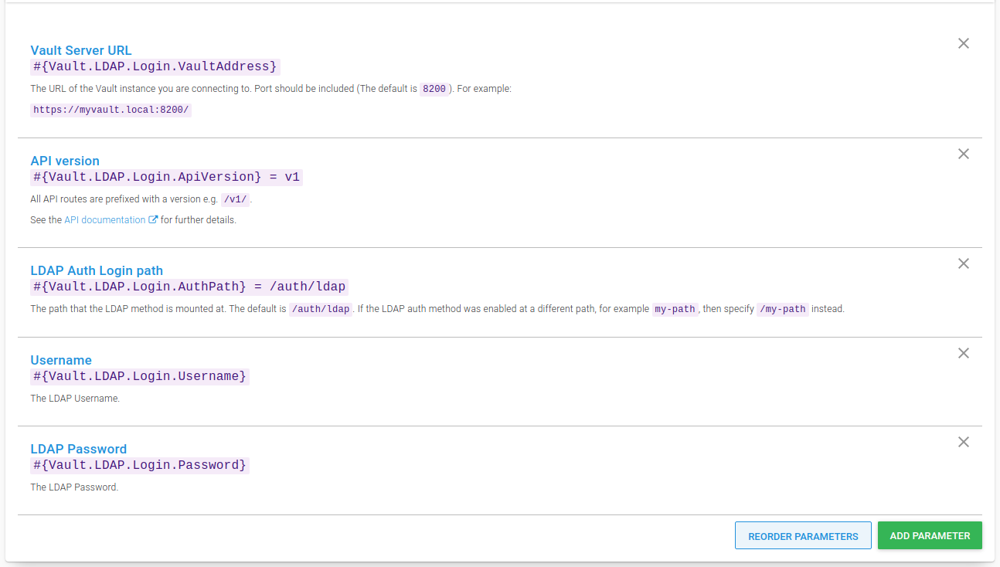

#### Using the LDAP login step #{ldap-login-use}

The **LDAP login** step is added to deployment and runbook processes in the [same way as other steps](https://octopus.com/docs/projects/steps#adding-steps-to-your-deployment-processes).

Once you have added the step to your process, fill out the parameters in the step:

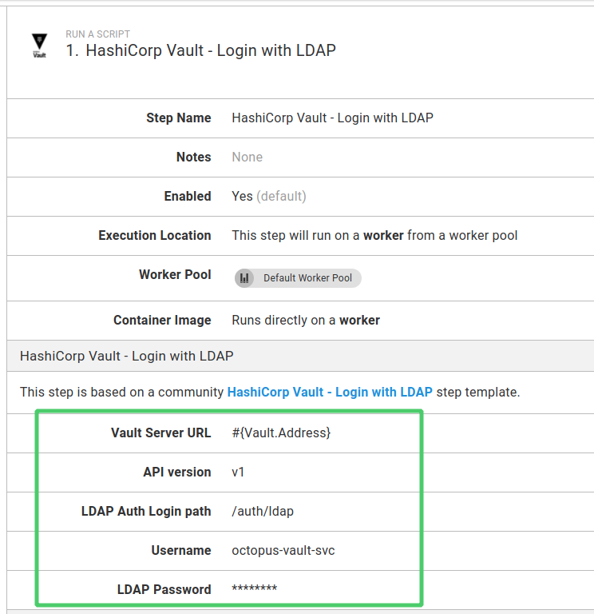

Once you've filled in the parameters, you can execute the step in a runbook or deployment process, and on successful execution, the sensitive output variable name containing the token is displayed in the Task log:

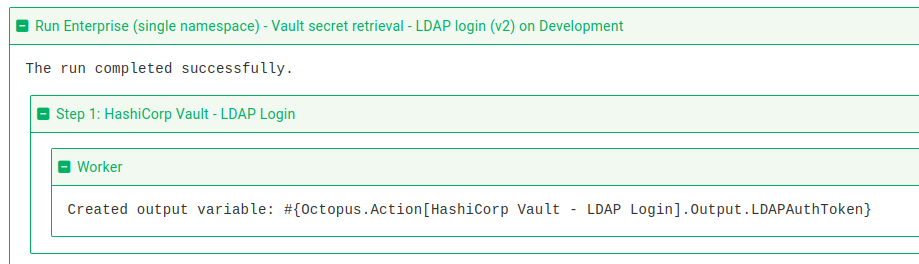

In subsequent steps, the output variable `#{Octopus.Action[HashiCorp Vault - Login with LDAP].Output.LDAPAuthToken}` can be used to authenticate, and retrieve secrets.

:::hint
**Tip:** Remember to replace `HashiCorp Vault - Login with LDAP` with the name of your step for any output variable names.
:::

### AppRole login step #{approle-login}

The [HashiCorp Vault - Login with AppRole](https://library.octopus.com/step-templates/e04a9cec-f04a-4da2-849b-1aed0fd408f0/actiontemplate-hashicorp-vault-approle-login) step template authenticates with a Vault Server using the [AppRole](https://www.vaultproject.io/docs/auth/approle) authentication method. This is perfect for use with Octopus. HashiCorp themselves recommend it for machines or apps:

> This auth method is oriented to automated workflows (machines and services), and is less useful for human operators.

With an AppRole, a machine can login with:

- A `RoleID` - think of this as the username in an authentication pair.
- A `SecretID` - think of this as the password in an authentication pair.

:::warning
**Don't store the SecretID:**
Storing the the RoleID in Octopus as a sensitive variable is a good way to ensure it remains encrypted until required. 

However, the same is **not recommended** for the SecretID.

A SecretID, just like a password is _designed to expire_. In addition storing the SecretID would provide the capabililty to potentially retrieve all secrets as both the RoleID and SecretID would be available.

We recommend that you consider the use of the more secure [Get wrapped SecretID](#get-wrapped-secretid) and [Unwrap SecretID and Login](#unwrap-secretid-login) step templates, as they use one of the [best practises](#approle-best-practises) - **response wrapping**.

If you do choose to use the AppRole login step template, we recommend you provide the SecretID at execution time using a sensitive [prompted variable](https://octopus.com/docs/projects/variables/prompted-variables).
:::

Once authenticated, the `client_token` from the Vault response will be made available as a [sensitive output variable](https://octopus.com/docs/projects/variables/output-variables#sensitive-output-variables) named `AppRoleAuthToken` for use in other steps.

#### AppRole login parameters #{approle-login-parameters}

The step template has the following parameters:

- `Vault Server URL`: The URL of the Vault instance you are connecting to, including the port (The default is `8200`).
- `API version`: Choose the API version to use from a drop-down list. Currently there is only one option: `v1`.
- `App Role Path`: The path where the [approle auth method is mounted](https://www.vaultproject.io/api-docs/auth/approle) at. 
- `Role ID`: The [RoleID](https://www.vaultproject.io/docs/auth/approle#roleid) of the AppRole.
- `Secret ID`: The [SecretID](https://www.vaultproject.io/docs/auth/approle#secretid) of the AppRole.

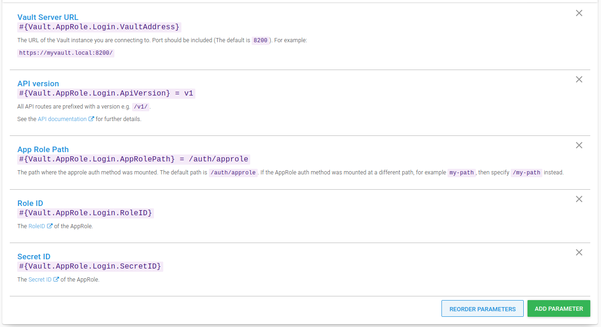

#### Using the AppRole login step #{approle-login-use}

The **AppRole login** step is added to deployment and runbook processes in the [same way as other steps](https://octopus.com/docs/projects/steps#adding-steps-to-your-deployment-processes).

Once you have added the step to your process, fill out the parameters in the step:

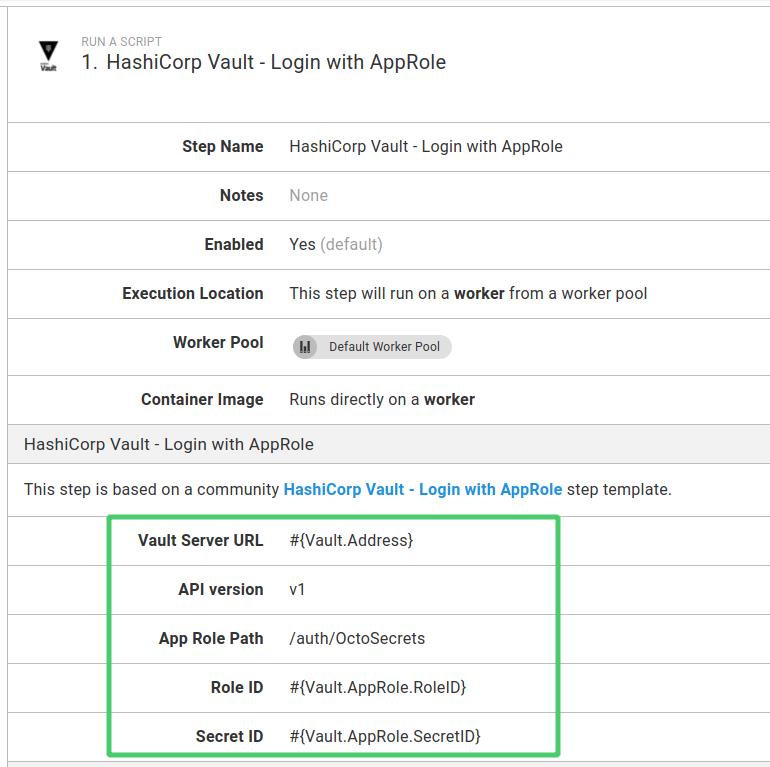

Once you've filled in the parameters, you can execute the step in a runbook or deployment process, and on successful execution, the sensitive output variable name containing the token is displayed in the Task log:

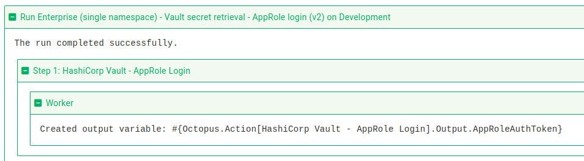

In subsequent steps, the output variable `#{Octopus.Action[HashiCorp Vault - Login with AppRole].Output.AppRoleAuthToken}` can be used to authenticate, and retrieve secrets.

:::hint
**Tip:** Remember to replace `HashiCorp Vault - Login with AppRole` with the name of your step for any output variable names.
:::

### AppRole best practises #{approle-best-practises}

The [AppRole](https://www.vaultproject.io/docs/auth/approle) authentication method is considered a _trusted-broker_ method. This means that the onus of trust rests in the system that acts as the authentication intermediary (the _broker_) between the client (typically an Octopus deployment target) and Vault.

One of the most important best practises to adopt is to avoid storing an AppRole SecretID. Instead use [response wrapping](https://www.vaultproject.io/docs/concepts/response-wrapping) to provide a [wrapping token](https://www.vaultproject.io/docs/concepts/response-wrapping#response-wrapping-tokens) that will provide an access mechanism to retrieve a SecretID when required. This method of obtaining a SecretID is also known as a [Pull mode](https://www.vaultproject.io/docs/auth/approle#pull-and-push-secretid-modes) as it requires the SecretID to be fetched or _pulled_ from the AppRole.

The Vault documentation contains [recommended patterns](https://learn.hashicorp.com/tutorials/vault/pattern-approle?in=vault/recommended-patterns) when using AppRole authentication.

The TL;DR of the recommendations are:
- Use a secured system to act as the broker for retrieving a wrapped SecretID.
- Use [response wrapping](https://www.vaultproject.io/docs/concepts/response-wrapping) to obtain a SecretID.
- Limit the number of uses and Time-to-live (TTL) value for a SecretID to prevent overuse.
- Avoid [anti-patterns](https://learn.hashicorp.com/tutorials/vault/pattern-approle?in=vault/recommended-patterns#anti-patterns) such as having the broker retrieve secrets.

:::warning
**Secure the broker:**
Since the trust rests on the broker, we strongly recommend using the Octopus Server's [built-in worker](https://octopus.com/docs/infrastructure/workers#built-in-worker), or a highly-secured [external worker](https://octopus.com/docs/infrastructure/workers#external-workers) to act as the broker. It would be responsible for retrieving a wrapped SecretID and passing that value to the machine (the client) that authenticates with Vault.
:::

To support these recommended practices, three additional `AppRole` step templates have been created:

- [AppRole Get wrapped SecretID](#get-wrapped-secretid)
- [AppRole Unwrap SecretID](#unwrap-secretid)
- [AppRole Unwrap SecretID and Login](#unwrap-secretid-login)

### AppRole Get wrapped SecretID step #{get-wrapped-secretid}

The [HashiCorp Vault - AppRole Get Wrapped Secret ID](https://library.octopus.com/step-templates/76827264-af27-46d0-913a-e093a4f0db48/actiontemplate-hashicorp-vault-approle-get-wrapped-secret-id) step template generates a [response-wrapped](https://www.vaultproject.io/docs/concepts/response-wrapping) SecretID for the [AppRole](https://www.vaultproject.io/docs/auth/approle) authentication method. 

The step template authenticates with a Vault Server using a token to retrieve a wrapped SecretID. The response contains a [wrapping token](https://www.vaultproject.io/docs/concepts/response-wrapping#response-wrapping-tokens) and other metadata such as the creation path for the token.
The creation path value can be used to validate [no malfeasance](https://www.vaultproject.io/docs/concepts/response-wrapping#response-wrapping-token-validation) has occurred. The wrapping token can then be used to retrieve the actual SecretID value.

:::warning
The token used to authenticate to retrieve a wrapped SecretID should be of limited scope and should only be allowed to retrieve wrapped SecretIDs. Consider creating a long-lived Vault token as this presents only a minor risk.
:::

Once the response has been received from the Vault server, two [sensitive output variables](https://octopus.com/docs/projects/variables/output-variables#sensitive-output-variables) are created for use in other steps.:

- `WrappedToken` - This is the wrapped `token` from the response, used to retrieve the actual SecretID value.
- `WrappedTokenCreationPath` - This is the creation path of the token to allow you to validate [no malfeasance](https://www.vaultproject.io/docs/concepts/response-wrapping#response-wrapping-token-validation) has occurred.

#### AppRole Get wrapped SecretID parameters #{get-wrapped-secretid-parameters}

The step template has the following parameters:

- `Vault Server URL`: The URL of the Vault instance you are connecting to, including the port (The default is `8200`).
- `API version`: Choose the API version to use from a drop-down list. Currently there is only one option: `v1`.
- `App Role Path`: The path where the [approle auth method is mounted](https://www.vaultproject.io/api-docs/auth/approle) at. 
- `Role Name`: The role name of the [AppRole](https://www.vaultproject.io/api/auth/approle).
- `Time-to-live (TTL)`: The TTL in seconds of the [response-wrapping token](https://www.vaultproject.io/docs/concepts/response-wrapping#response-wrapping-tokens) itself. The default is: `120s`
- `Auth Token`: The [token](https://www.vaultproject.io/docs/auth/token) used to authenticate with Vault to generate a [response-wrapped](https://www.vaultproject.io/docs/concepts/response-wrapping) SecretID.

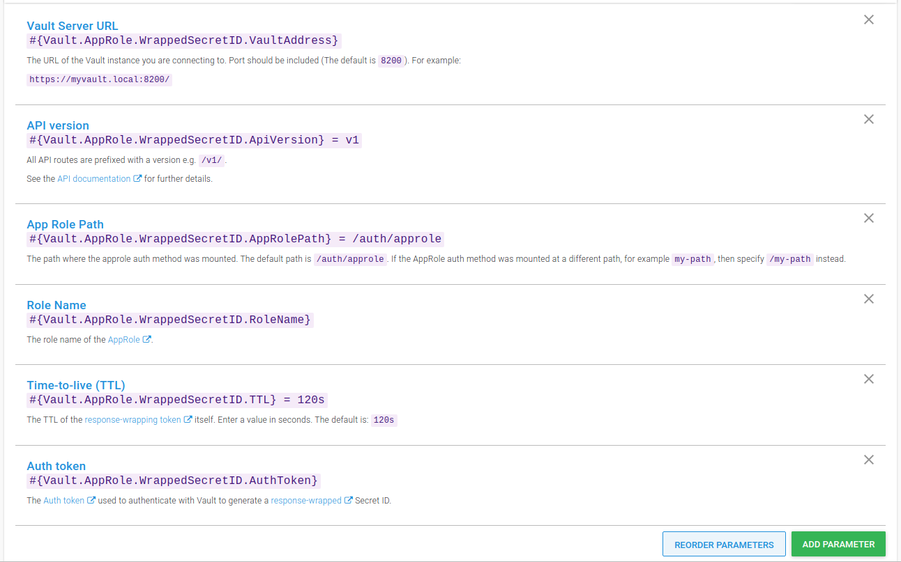

#### Using the AppRole Get wrapped SecretID step #{get-wrapped-secretid-use}

The **Get wrapped SecretID** step is added to deployment and runbook processes in the [same way as other steps](https://octopus.com/docs/projects/steps#adding-steps-to-your-deployment-processes).

Once you have added the step to your process, fill out the parameters in the step:

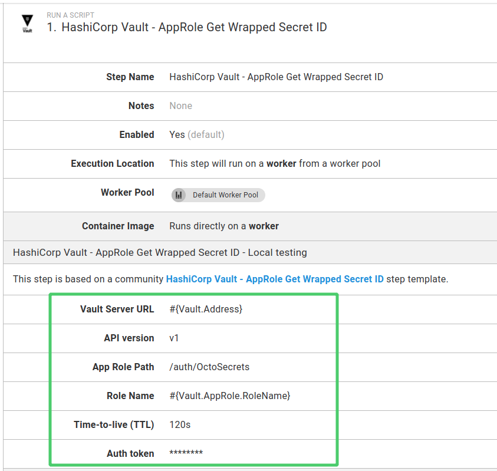

Once you've filled in the parameters, you can execute the step in a runbook or deployment process, and on successful execution, the sensitive output variable names are displayed in the Task log:

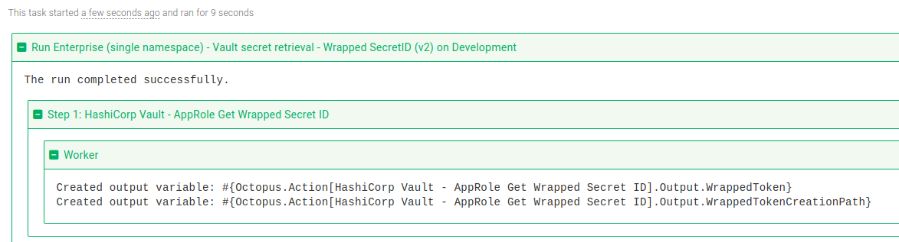

In subsequent steps, the output variables can be used to validate and retrieve the actual SecretID value:
- `#{Octopus.Action[HashiCorp Vault - AppRole Get Wrapped Secret ID].Output.WrappedToken}` 
- `#{Octopus.Action[HashiCorp Vault - AppRole Get Wrapped Secret ID].Output.WrappedTokenCreationPath}` 

:::hint
**Tip:** Remember to replace `HashiCorp Vault - AppRole Get Wrapped Secret ID` with the name of your step for any output variable names.
:::

### AppRole Unwrap SecretID step #{unwrap-secretid}

The [HashiCorp Vault - AppRole Unwrap Secret ID](https://library.octopus.com/step-templates/c1f56030-0bcd-458d-bc70-b4f43ec0d30f/actiontemplate-hashicorp-vault-approle-unwrap-secret-id) step template retrieves and unwraps a SecretID for an [AppRole](https://www.vaultproject.io/docs/auth/approle) using a [wrapping token](https://www.vaultproject.io/docs/concepts/response-wrapping#response-wrapping-tokens).

The `secret_id` from the Vault response will be made available as a [sensitive output variable](https://octopus.com/docs/projects/variables/output-variables#sensitive-output-variables) named `UnwrappedSecretID` for use in other steps.

#### AppRole Unwrap SecretID parameters #{unwrap-secretid-parameters}

The step template has the following parameters:

- `Vault Server URL`: The URL of the Vault instance you are connecting to, including the port (The default is `8200`).
- `API version`: Choose the API version to use from a drop-down list. Currently there is only one option: `v1`.
- `Wrapped Token`: The [wrapping token](https://www.vaultproject.io/docs/concepts/response-wrapping#response-wrapping-tokens) used to retrieve the actual Secret ID from Vault. 
- `Token Creation Path`: *Optional* - the creation path of the wrapped token. If this value is provided, the step template will perform a [wrapping lookup](https://www.vaultproject.io/api-docs/system/wrapping-lookup) to [validate no malfeasance](https://www.vaultproject.io/docs/concepts/response-wrapping#response-wrapping-token-validation) has occurred.

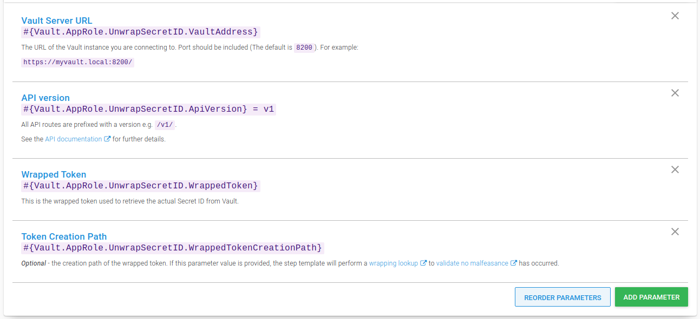

#### Using the Unwrap SecretID step #{unwrap-secretid-use}

The **Unwrap SecretID** step is added to deployment and runbook processes in the [same way as other steps](https://octopus.com/docs/projects/steps#adding-steps-to-your-deployment-processes).

Once you have added the step to your process, fill out the parameters in the step:

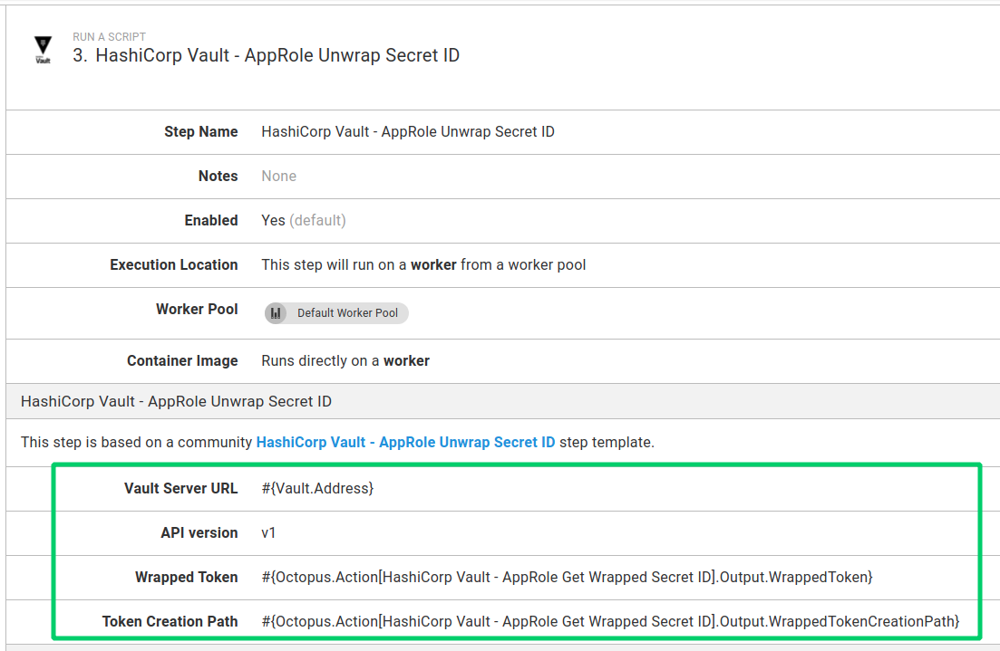

:::hint
Note the use of [sensitive output variables](https://octopus.com/docs/projects/variables/output-variables#sensitive-output-variables) in the step parameters. In this example, the values were created using the [Get Wrapped SecretID](#get-wrapped-secretid) step template named `HashiCorp Vault - AppRole Get Wrapped Secret ID`.
:::

Once you've filled in the parameters, you can execute the step in a runbook or deployment process, and on successful execution, the sensitive output variable names are displayed in the Task log:

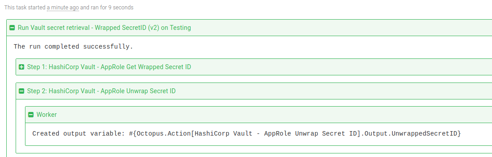

In subsequent steps, the output variable `#{Octopus.Action[HashiCorp Vault - AppRole Unwrap Secret ID].Output.UnwrappedSecretID}` can be used to authenticate with Vault and receive a token that can then be used to retrieve secrets.

:::hint
**Tip:** Remember to replace `HashiCorp Vault - AppRole Unwrap Secret ID` with the name of your step for any output variable names.
:::

### AppRole Unwrap SecretID and Login step #{unwrap-secretid-login}

The [HashiCorp Vault - AppRole Unwrap Secret ID and Login](https://library.octopus.com/step-templates/aa113393-e615-40ed-9c5a-f95f471d728f/actiontemplate-hashicorp-vault-approle-unwrap-secret-id-and-login) step template is provided as a convenient way to combine two step templates used with Vault into one:

- [AppRole Unwrap SecretID](#unwrap-secretid) - It retrieves and unwraps a SecretID for an [AppRole](https://www.vaultproject.io/docs/auth/approle) using a [wrapping token](https://www.vaultproject.io/docs/concepts/response-wrapping#response-wrapping-tokens).
- [AppRole login](#approle-login) - It authenticates with Vault using a supplied RoleID and the unwrapped SecretID.

It is designed to be used as the second part of a two-step workflow with Vault:

1. Get a wrapped SecretID using the [AppRole Get wrapped SecretID](#get-wrapped-secretid) step template.
2. Provide the wrapped SecretID stored in a sensitve output variable from the first step to this step template to unwrap and authenticate.

Once authenticated, the `client_token` from the Vault response will be made available as a [sensitive output variable](https://octopus.com/docs/projects/variables/output-variables#sensitive-output-variables) named `AppRoleAuthToken` for use in other steps.

#### AppRole Unwrap SecretID and Login parameters #{unwrap-secretid-login-parameters}

The step template has the following parameters:

- `Vault Server URL`: The URL of the Vault instance you are connecting to, including the port (The default is `8200`).
- `API version`: Choose the API version to use from a drop-down list. Currently there is only one option: `v1`.
- `App Role Path`: The path where the [approle auth method is mounted](https://www.vaultproject.io/api-docs/auth/approle) at. 
- `Role ID`: The [RoleID](https://www.vaultproject.io/docs/auth/approle#roleid) of the AppRole.
- `Wrapped Token`: The [wrapping token](https://www.vaultproject.io/docs/concepts/response-wrapping#response-wrapping-tokens) used to retrieve the actual Secret ID from Vault. 
- `Token Creation Path`: *Optional* - the creation path of the wrapped token. If this value is provided, the step template will perform a [wrapping lookup](https://www.vaultproject.io/api-docs/system/wrapping-lookup) to [validate no malfeasance](https://www.vaultproject.io/docs/concepts/response-wrapping#response-wrapping-token-validation) has occurred.

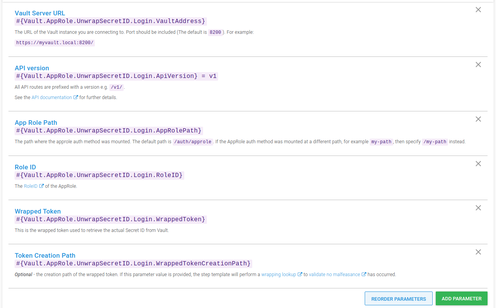

#### Using the Unwrap SecretID and Login step #{unwrap-secretid-login-use}

The **Unwrap SecretID and Login** step is added to deployment and runbook processes in the [same way as other steps](https://octopus.com/docs/projects/steps#adding-steps-to-your-deployment-processes).

Once you have added the step to your process, fill out the parameters in the step:

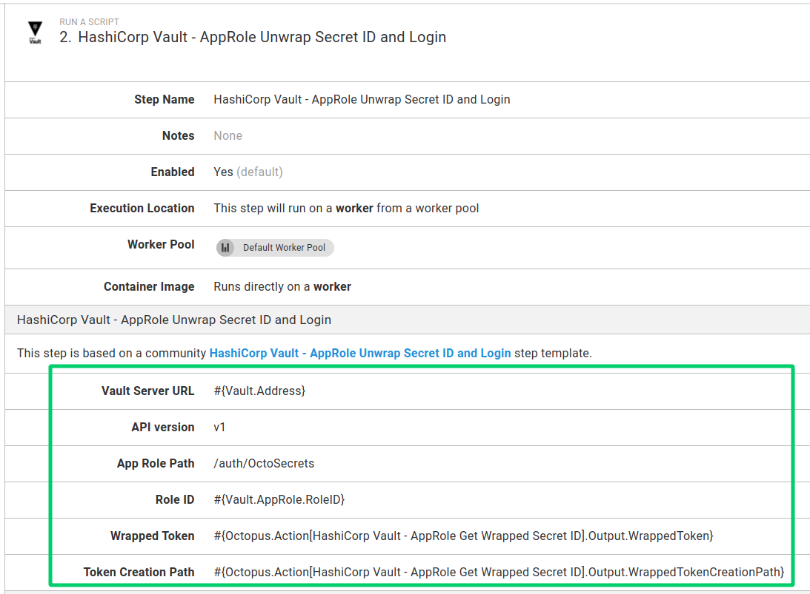

:::hint
Note the use of [sensitive output variables](https://octopus.com/docs/projects/variables/output-variables#sensitive-output-variables) in the step parameters. In this example, the values were created using the [Get Wrapped SecretID](#get-wrapped-secretid) step template named `HashiCorp Vault - AppRole Get Wrapped Secret ID`.
:::

Once you've filled in the parameters, you can execute the step in a runbook or deployment process, and on successful execution, the sensitive output variable names are displayed in the Task log:

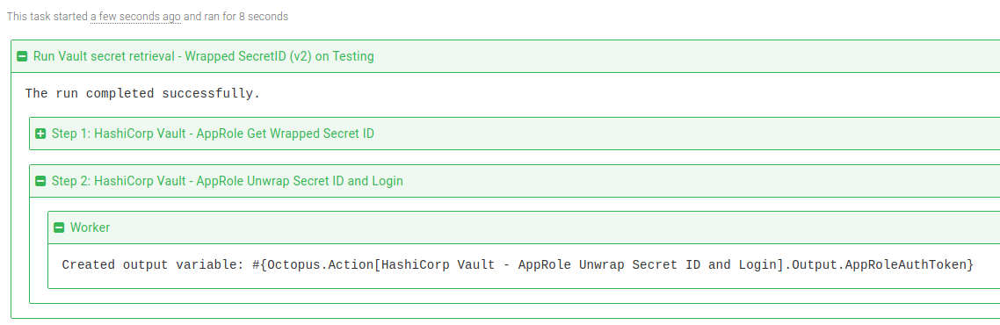

In subsequent steps, the output variable `#{Octopus.Action[HashiCorp Vault - AppRole Unwrap Secret ID and Login].Output.AppRoleAuthToken}` can be used to authenticate, and retrieve secrets.

:::hint
**Tip:** Remember to replace `HashiCorp Vault - AppRole Unwrap Secret ID and Login` with the name of your step for any output variable names.
:::

## Retrieving secrets #{retrieving-secrets}

Once you've authenticated with Vault, you receive an authentication token. This token can then be used to retrieve secrets. Secrets in Vault are stored in a [secrets engine](https://www.vaultproject.io/docs/secrets), of which there are many different types.

The step templates created to support retrieving secrets focus on the [Key-Value (kv)](https://www.vaultproject.io/docs/secrets/kv) Secrets Engine as it's a generic Key-Value store used to store arbitrary secrets:

- [Retrieve KV (v1) secrets step](#retrieve-kv-v1-secrets)
- [Retrieve KV (v2) secrets step](#retrieve-kv-v2-secrets)

### Retrieve KV (v1) secrets step #{retrieve-kv-v1-secrets}

The [HashiCorp Vault - Key Value (v1) retrieve secrets](https://library.octopus.com/step-templates/9aab9522-25e0-4539-841c-8b726e6b1520/actiontemplate-hashicorp-vault-key-value-(v1)-retrieve-secrets) step template retrieves one or more secrets stored in a `v1` Key-Value secrets engine.

Retrieving a single secret requires the path to the secret, an authentication token with permission to access the secret and _optionally_ a list of field names to retrieve.

An advanced feature of the step template offers support for retrieving multiple secrets at once. This requires changing the **Secrets retrieval method** parameter to `Multiple vault keys`. It's also possible to recursively retrieve secrets. This is useful when you want to retrieve all secrets for a given path.

For each secret retrieved, a [sensitive output variable](https://octopus.com/docs/projects/variables/output-variables#sensitive-output-variables) is created for use in subsequent steps. By default, only a count of the number of variables that were created will be shown in the Task log. To see the names of the variables in the Task log, Change the **Print output variable names** parameter to `True`.

#### Retrieve KV (v1) secrets parameters #{retrieve-kv-v1-secrets-parameters}

The step template has the following parameters:

- `Vault Server URL`: The URL of the Vault instance you are connecting to, including the port (The default is `8200`).
- `API version`: Choose the API version to use from a drop-down list. Currently there is only one option: `v1`.
- `Auth Token`: The [token](https://www.vaultproject.io/docs/auth/token) used to authenticate to retrieve secrets.
- `Secrets Path`: The full path to the secret(s) you want to retrieve. The value should include both the path 
where the secrets engine is mounted, as well as the path to the secret itself.
- `Secrets retrieval method`: Choose between retrieving a single secret or multiple secrets. Retrieving a single secret is the equivalent of a `vault kv get` command using the [Get](https://www.vaultproject.io/api-docs/secret/kv/kv-v1#read-secret) method. Retrieving multiple secrets is the equivalent of the combination of both a `vault kv list` command using the [List](https://www.vaultproject.io/api-docs/secret/kv/kv-v2#list-secrets) method and then subsequent `vault kv get` commands for each secret.
- `Recursive retrieval`: If multiple secrets are being retrieved, should any sub-folders also be enumerated and retrieved? The default is: `False`.
- `Field names`: Choose specific fields to be retrieved from identified secrets. This is useful when you only want to retrieve specific fields from one or more secret(s). You can optionally include a name for the output variable.
- `Print output variable names`: Write out the Octopus output variable names to the task log. The default is: `False`.

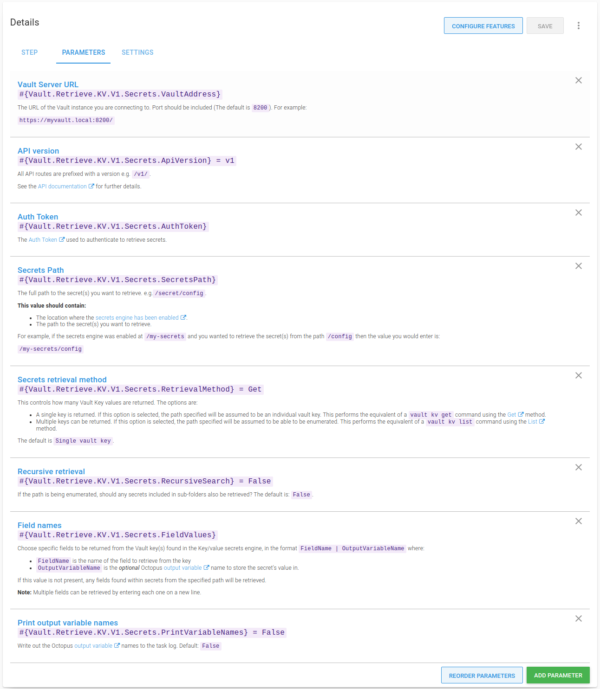

#### Using Retrieve KV (v1) secrets step #{retrieve-kv-v1-secrets-use}

The **Key Value (v1) retrieve secrets** step is added to deployment and runbook processes in the [same way as other steps](https://octopus.com/docs/projects/steps#adding-steps-to-your-deployment-processes).

Once you have added the step to your process, fill out the parameters in the step:

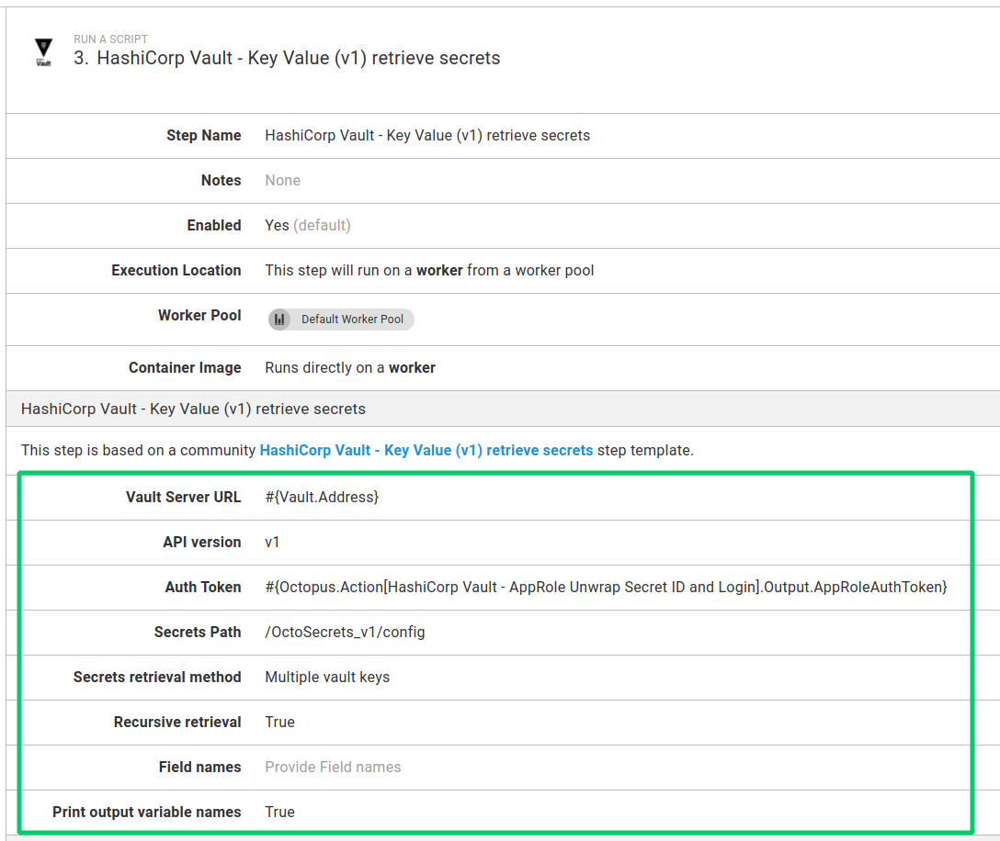

:::hint
Note the use of the [sensitive output variable](https://octopus.com/docs/projects/variables/output-variables#sensitive-output-variables) in the `Auth Token` parameter. In this example, the value was created using the [Unwrap SecretID and Login](#unwrap-secretid-login) step template named `HashiCorp Vault - AppRole Unwrap Secret ID and Login`.
:::

Once you've filled in the parameters, you can execute the step in a runbook or deployment process, and on successful execution, any matching secrets will be stored as sensitive output variables. If you've configured your step to print the variable names, they'll appear in the Task log:

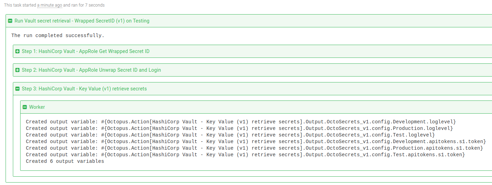

In subsequent steps, output variables created from matching secrets can be used in your deployment or runbook.

:::hint
**Tip:** Remember to replace `HashiCorp Vault - Key Value (v1) retrieve secrets` with the name of your step for any output variable names.
:::

### Retrieve KV (v2) secrets step #{retrieve-kv-v2-secrets}

The [HashiCorp Vault - Key Value (v2) retrieve secrets](https://library.octopus.com/step-templates/337f1b67-cdb0-4f33-9e08-6bf804f672d2/actiontemplate-hashicorp-vault-key-value-(v2)-retrieve-secrets) step template retrieves one or more secrets stored in a `v2` Key-Value secrets engine.

One of the key advantages of the `v2` Key-Value secrets engine is its support for [versioned secrets](https://learn.hashicorp.com/tutorials/vault/versioned-kv). This can be useful if you need to roll back secrets in the event of unintentional data loss.

Retrieving a single secret requires the path to the secret, an authentication token with permission to access the secret and _optionally_ a list of field names to retrieve.

This step template offers advanced features:
1. Support for retrieving multiple secrets at once. This requires changing the **Secrets retrieval method** parameter to `Multiple vault keys`. It's also possible to recursively retrieve secrets. This is useful when you want to retrieve all secrets for a given path.
2. Support for retrieving a specific version of a secret. This is only supported when retrieving a single secret.

For each secret retrieved, a [sensitive output variable](https://octopus.com/docs/projects/variables/output-variables#sensitive-output-variables) is created for use in subsequent steps. By default, only a count of the number of variables that were created will be shown in the Task log. To see the names of the variables in the Task log, Change the **Print output variable names** parameter to `True`.

#### Retrieve KV (v2) secrets parameters #{retrieve-kv-v2-secrets-parameters}

The step template has the following parameters:

- `Vault Server URL`: The URL of the Vault instance you are connecting to, including the port (The default is `8200`).
- `API version`: Choose the API version to use from a drop-down list. Currently there is only one option: `v1`.
- `Auth Token`: The [token](https://www.vaultproject.io/docs/auth/token) used to authenticate to retrieve secrets.
- `Secrets Path`: The full path to the secret(s) you want to retrieve. The value should include both the path 
where the secrets engine is mounted, as well as the path to the secret itself.
- `Secrets retrieval method`: Choose between retrieving a single secret or multiple secrets. Retrieving a single secret is the equivalent of a `vault kv get` command using the [Get](https://www.vaultproject.io/api-docs/secret/kv/kv-v1#read-secret) method. Retrieving multiple secrets is the equivalent of the combination of both a `vault kv list` command using the [List](https://www.vaultproject.io/api-docs/secret/kv/kv-v2#list-secrets) method and then subsequent `vault kv get` commands for each secret.
- `Recursive retrieval`: If multiple secrets are being retrieved, should any sub-folders also be enumerated and retrieved? The default is: `False`.
- `Secret Version`: _Optional_ When retrieving a single secret, choose the version of the secret to retrieve. For example, if you wanted version 2 of all field values in a secret, enter the value `2`.
- `Field names`: Choose specific fields to be retrieved from identified secrets. This is useful when you only want to retrieve specific fields from one or more secret(s). You can optionally include a name for the output variable.
- `Print output variable names`: Write out the Octopus output variable names to the task log. The default is: `False`.

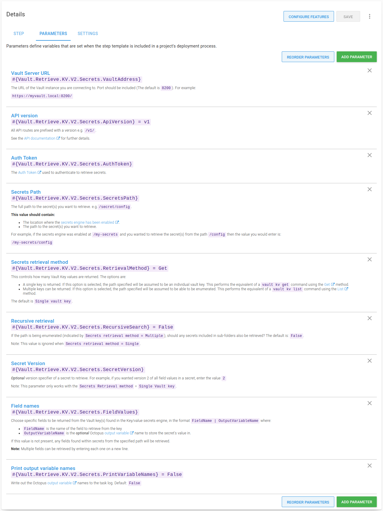

#### Using Retrieve KV (v2) secrets step #{retrieve-kv-v2-secrets-use}

The **Key Value (v2) retrieve secrets** step is added to deployment and runbook processes in the [same way as other steps](https://octopus.com/docs/projects/steps#adding-steps-to-your-deployment-processes).

Once you have added the step to your process, fill out the parameters in the step:

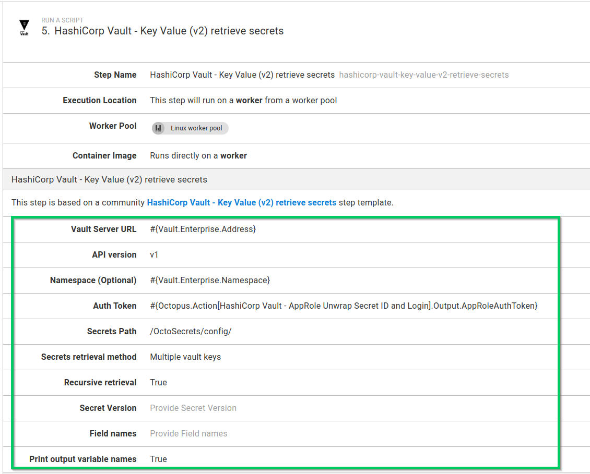

:::hint
Note the use of the [sensitive output variable](https://octopus.com/docs/projects/variables/output-variables#sensitive-output-variables) in the `Auth Token` parameter. In this example, the value was created using the [Unwrap SecretID and Login](#unwrap-secretid-login) step template named `HashiCorp Vault - AppRole Unwrap Secret ID and Login`.
:::

Once you've filled in the parameters, you can execute the step in a runbook or deployment process, and on successful execution, any matching secrets will be stored as sensitive output variables. If you've configured your step to print the variable names, they'll appear in the Task log:

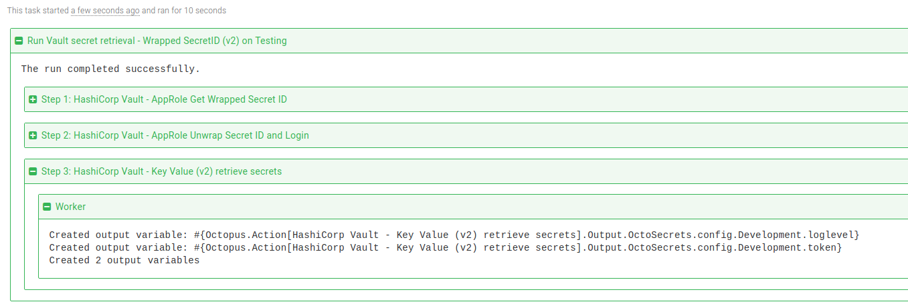

In subsequent steps, the output variables created from matching secrets can be used in your deployment or runbook.

:::hint
**Tip:** Remember to replace `HashiCorp Vault - Key Value (v2) retrieve secrets` with the name of your step for any output variable names.
:::

## Conclusion

The templates covered in this post show how it's possible to extend the functionality of Octopus and enable you to retrieve secrets from Vault, or any other secrets manager and use them in your deployments or runbooks.

Until next time, Happy Deployments!

## Learn more

- Read the [AppRole Pull Authentication](https://learn.hashicorp.com/tutorials/vault/approle) tutorial showing how to retrieve SecretIDs securely.
- HashiCorp Vault documentation for the [K/V v1 Secrets Engine](https://www.vaultproject.io/docs/secrets/kv/kv-v1).
- HashiCorp Vault documentation for the [K/V v2 Secrets Engine](https://www.vaultproject.io/docs/secrets/kv/kv-v2).
