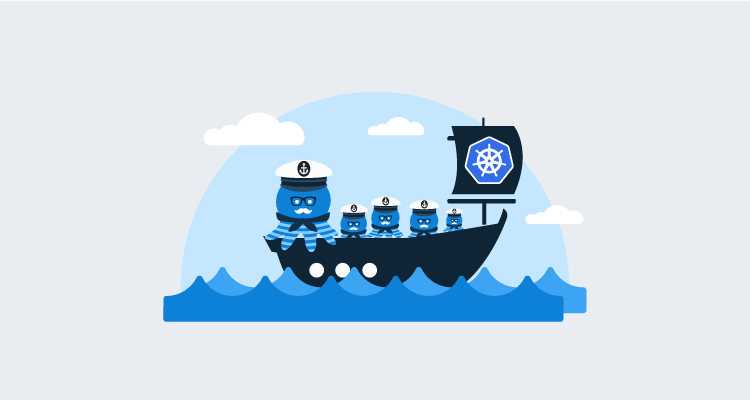
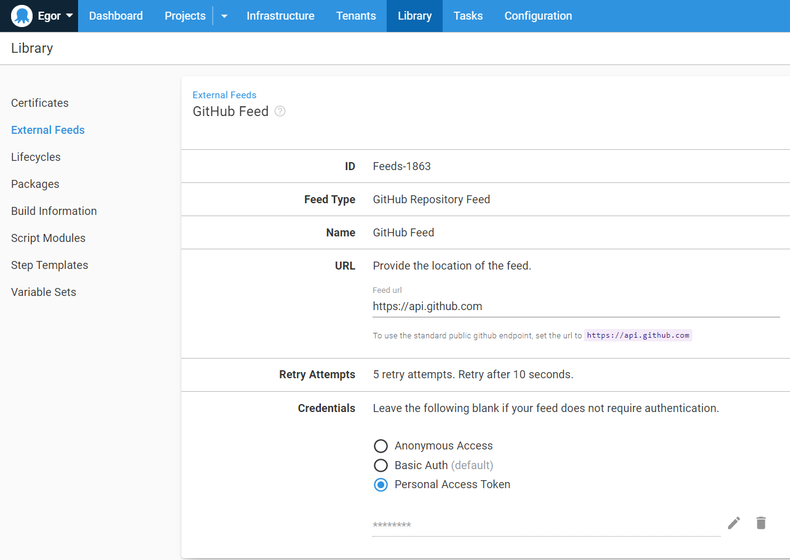
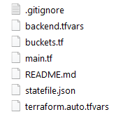
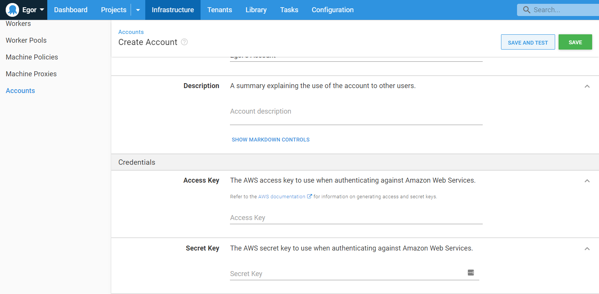
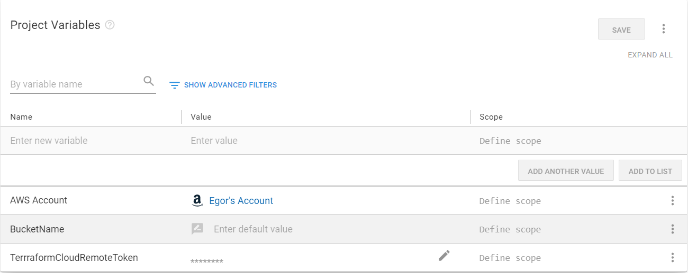
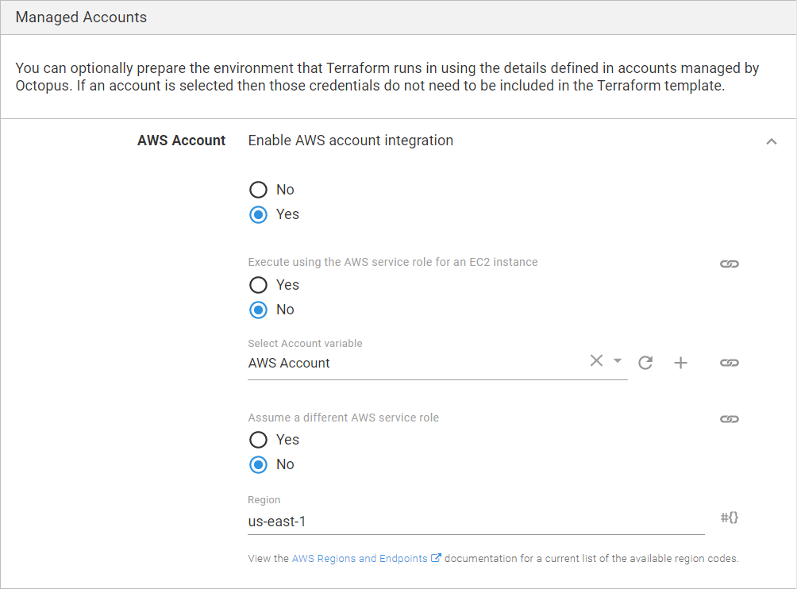
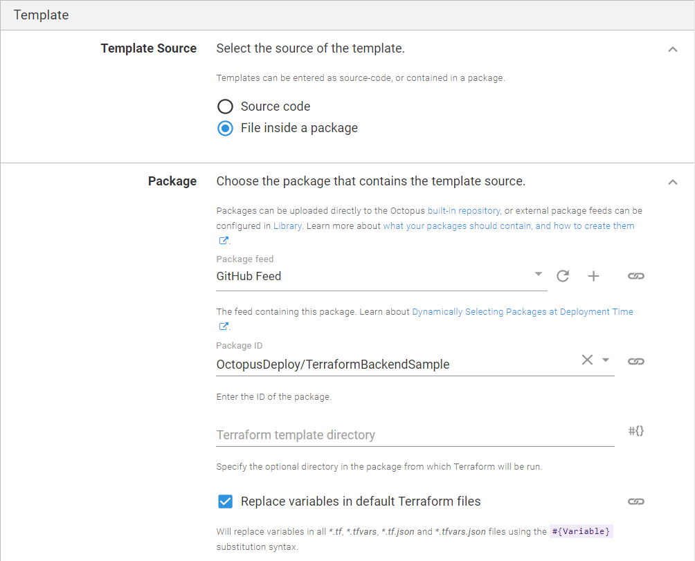
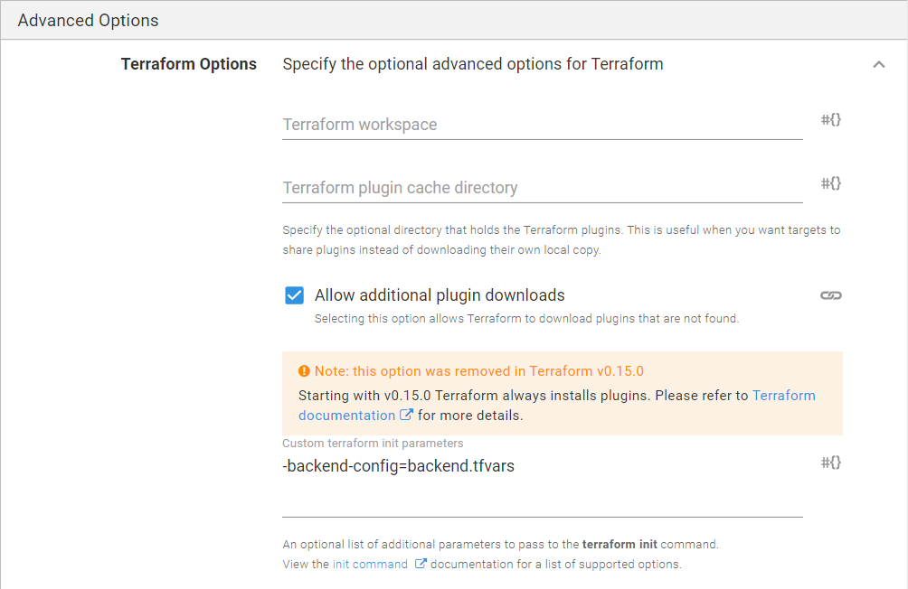
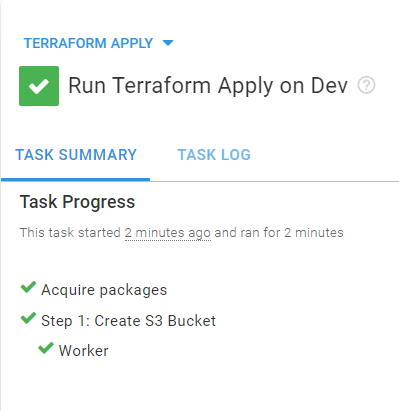
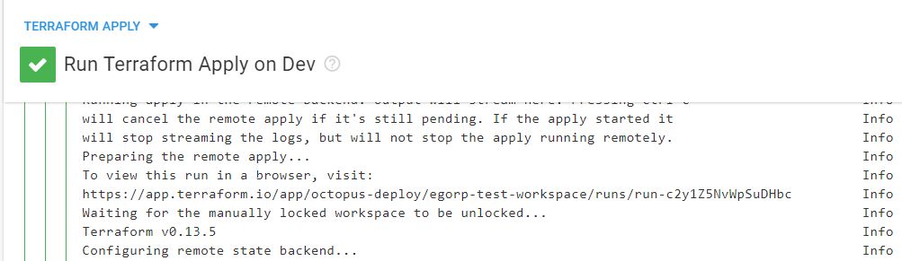

In this post, we will be using a GitHub repository as the source of Terraform templates.

## Create an external feed

First, we need to configure Octopus Deploy to use our GitHub repository as a [package feed](https://octopus.com/docs/packaging-applications/package-repositories/github-feeds).  



## GitHub Repository

For this post, I created a [sample repository](https://github.com/OctopusDeploy/TerraformBackendSample) that you can easily fork for your project. There are four files in the repository. You can structure these files differently if you like; the only important part is that your project and backend variables are kept as separate files.

Remember, only commits with tags will be available in the feed, so make sure to add a tag to your repository.

**main.tf** - here we specify global Terraform options, such as backend options and workspace that we want to use.
```
terraform {
  backend "remote" {
    organization = "octopus-deploy"
    workspaces {
      name = "egorp-test-workspace"
    }
  }
}

variable "aws_access_key" {
  type = string
}

variable "aws_secret_key" {
  type = string
}

provider "aws" {
  region     = "us-east-1"
  access_key = var.aws_access_key
  secret_key = var.aws_secret_key
}
```

**buckets.tf** - for this example we will be creating an empty S3 bucket.
```
variable "bucket_name" {
  description = "the bucket name to use"
}

resource "aws_s3_bucket" "mybucket" {
  bucket = var.bucket_name
  force_destroy = true
  acl    = "private"
  tags = {
      Name        = var.bucket_name
      Environment = "Dev"
  }
  cors_rule {
    allowed_headers = ["*"]
    allowed_methods = ["GET","PUT","HEAD","DELETE","POST"]
    allowed_origins = ["*"]
    max_age_seconds = 3000
  }
}
```

**terraform.auto.tfvars** - here we store variables used in other files. Octopus will perform [variable substitution](https://octopus.com/docs/projects/variables/variable-substitutions) before using the file. Note that this file must have the extension `.auto.tfvars` otherwise it will not be used by the remote backend.
``` 
bucket_name = "#{BucketName}"
aws_access_key = "#{AWS Account.AccessKey}"
aws_secret_key = "#{AWS Account.SecretKey}"
```

**backend.tfvars** - this file is supplied to the `-backend-config` parameter of the `terraform init` command. This allows us to store sensitive variables securely instead of having these values in the repository directly.
```
token = "#{TerrraformCloudRemoteToken}"
```

After the above is done, your workspace should look like this.



Now we need to configure "Apply a Terraform template" step to use our GitHub repository and perform the necessary variable substitution, providing us with the remote token and the bucket name.

Since the workspace is now stored in Terraform Cloud we can use it both by invoking Terraform CLI manually and as part of your deployment process in Octopus Deploy. Terraform will keep track of the [workspace state](https://www.terraform.io/docs/language/state/index.html) and ensure your local state matches the real infrastructure.

## Add AWS account

Navigate to Infrastructure -> Accounts and add your AWS account key and secret.



## Add variables
Now navigate to the **Variables** section on the left and add two variables (that you defined in your `.tfvars` files):

- **AWS Account**: Click on variable Value field, and **change type** to **AWS Account**, then select the account you have added to the Infrastructure tab.
- **BucketName**: The desired name of your S3 bucket (if you click **"Open editor"** and tick **"Prompt for value"** the value will have to be entered manually on every runbook run)
- **TerrraformCloudRemoteToken**: Change type to **Sensitive** and paste in the secret token for your Terraform Cloud workspace.



## Create a runbook

Infrastructure activities are often defined as [Runbooks](https://octopus.com/docs/runbooks). This post assumes you're familiar with creating [projects](https://octopus.com/docs/projects) within Octopus, so we'll skip that part.  

1. Create a runbook for your project. I called mine **Terraform Apply**.
1. Add a **Apply a Terraform template** step to your process.

This step template is large, so we'll go over the minimum components to get this working.

### Managed accounts
- **Enable AWS account integration**: Select **Yes**
- **Execute using the AWS service role for an EC2 instance**: Select **No**
- **Select account variable**: Pick the account variable you created in the previous section.
- **Region**: Type in the AWS region that will be used by default, in my case it's **us-east-1**



### Template section
Select **File inside a package** as the template source, and fill in the following:

- **Package feed**: Select the GitHub feed we created in the first step.
- **Package ID**: Type in your repository address, in my case it's `OctopusDeploy/TerraformBackendSample`.



The rest can be left as default.

### Advanced options
Expand **Terraform Options** and specify the following:

- **Custom terraform init parameters**: `-backend-config=backend.tfvars`



Click **RUN** to run the runbook in the environment of your choice.



You can find the url for your Terraform Cloud run in the logs of the Terraform Step.



Congratulations! You have just completed your deployment using a shared remote backend. Now you can collaborate on the same workspace and allow Terraform to manage the state of your infrastructure automatically.

## Note on Terraform versions

Be careful when running terraform commands locally and via Octopus from the same workspace, as different versions of Terraform have incompatible state formats. If you use Terraform Cloud you can specify the exact version of Terraform you want to use via `Settings > General`.

> The version of Terraform to use for this workspace. Upon creating this workspace, the latest version was selected and will be used until it is changed manually. It will not upgrade automatically.

You can use [tfenv tool](https://github.com/tfutils/tfenv) to manage multiple versions of Terraform.

You can also limit CLI versions that can be used with the workspace by specifying `required_version`
```
terraform {
  required_version = "= 0.13.5"
}
```

See [this issue](https://github.com/hashicorp/terraform/issues/23290) for more details.

## Conclusion

In this post I demonstrated how you could use Terraform Cloud backend for your Terraform workspace within Octopus Deploy.

Happy deployments!
