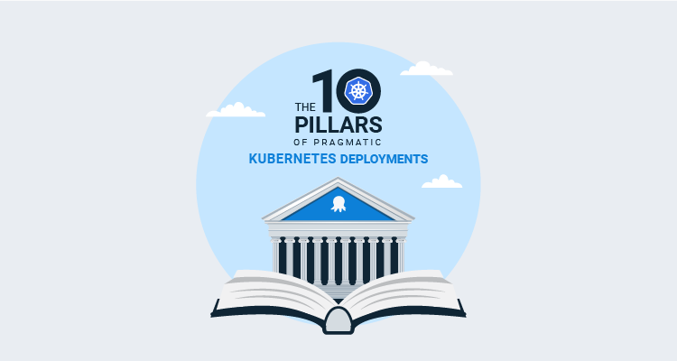

Following on from the [10 pillars of pragmatic deployments](https://octopus.com/blog/ten-pillars-of-pragmatic-deployments), Senior Product Manager, Matthew Casperson, has written an ebook about the [10 pillars of pragmatic **Kubernetes** deployments](https://github.com/OctopusDeploy/TenPillarsK8s/releases/latest) with Octopus Deploy.

The ten pillars speak to the needs of modern DevOps teams, always being asked to deliver more in less time. By understanding the value of each pillar, and learning practical implementations, DevOps teams can meet these challenges head-on.

## Who will benefit from the ebook?

The ebook is a comprehensive guide to building a repeatable deployment pipeline from Octopus to Kubernetes. 

It’s aimed at people looking to build deployment pipelines that scale as the following increases:

- The number of teams involved in deployments.
- The number of applications being deployed.
- The frequency of deployments.
- The expectation that code reaches customers faster.

## What you need to get started

To follow along with the exercises in the book, you need: 

- A Kubernetes cluster. The book uses a Kubernetes cluster hosted in Google Cloud, but beyond initial administration tasks, which rely on the administrative credentials exposed by a Google Cloud Kubernetes cluster, any Kubernetes cluster can be used.
- Access to administrative credentials. 
- An instance of Octopus. You can sign up for an [Octopus Cloud instance](https://octopus.com/start/cloud). A free instance gives you up to 10 targets, which is enough to follow most of the examples in the book.

The ebook assumes familiarity with concepts like pods, deployments, services, service accounts, secrets, configmaps, etc. However, all the Kubernetes resources created in the book provide detailed instructions on the values to enter into Octopus, so it is possible to get a sense of the deployment processes without a deep understanding of every setting. 

### [Download the ebook](https://github.com/OctopusDeploy/TenPillarsK8s/releases/latest)

Happy deployments!
