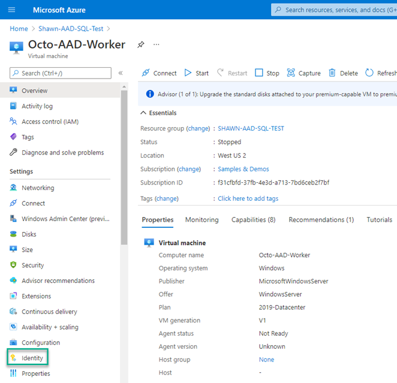
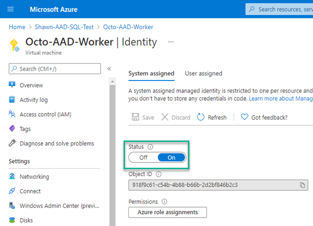
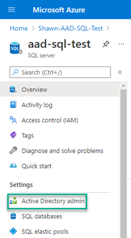
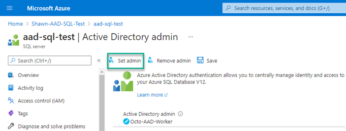
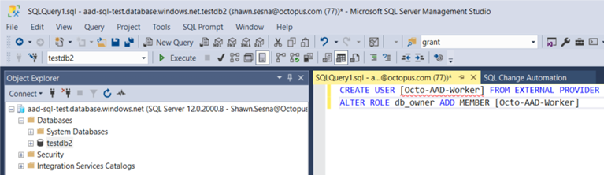
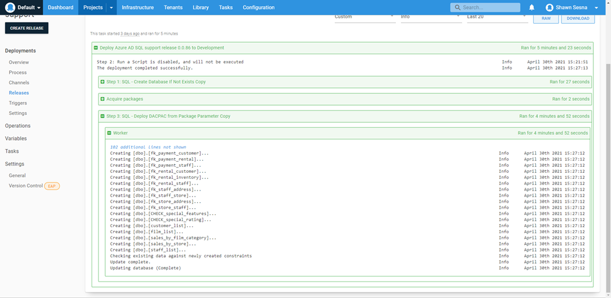

I recently decided to create a new [DACPAC](https://library.octopus.com/step-templates/ae9d0024-a5aa-4aa8-95a9-cba53c291054/actiontemplate-sql-deploy-dacpac-with-aad-auth-support) step template to support [Azure Active Directory Managed Identity](https://docs.microsoft.com/en-us/azure/active-directory/managed-identities-azure-resources/overview) for authentication (modifying the existing ones would have introduced breaking changes).  

In this post, I show you how I accomplished this with PowerShell and a custom class.

## Preparation
First, you need to provision an Azure SQL Server and an Azure VM.  This post assumes you're familiar with provisioning those types of resources and won't cover those topics.

### Configuring the VM for a Managed Identity
After the Azure VM has been created, you need to configure it to use the Managed Identity feature.  

Navigate to the VM resource and click **Identity** in the left hand pane.



On the Identity pane, switch the **Status** to **On**.



The VM can now authenticate to Azure resources such as Azure SQL Server.

### Configuring Azure SQL Server for managed identity authentication

There are two methods to grant authentication of the managed identity to SQL server:

- Configure the VM managed identity as the **Active Directory admin** for the Azure SQL Server.
- Add the managed identity as an external login to a database.

#### Configuring Active Directory admin
Navigate to the Azure SQL Server resource and click **Active Directory admin**.

:::warning
As you can only have one account configured as an **Active Directory admin**, I do not recommend this approach for production use.
:::



On the **Active Directory admin** screen, click **Set admin**.  Select your VM and click **Select**. The account will now show as the selected administrator account. Click **Save** to save your changes.



#### Adding managed identity as an external login to the database
Using something like SQL Server Management Studio (SSMS), you can execute a script that will grant permissions to the VM.  

Select the database to add permissions to, noting the `USER` is the name of the VM, and run the following:

``` sql
CREATE USER [Octo-AAD-Worker] FROM EXTERNAL PROVIDER
ALTER ROLE db_owner ADD MEMBER [Octo-AAD-Worker]
```

:::warning
Check you're executing the script against the correct database.
:::



Your VM now has the `db_owner` role for the selected database.

### Testing connectivity
To verify that the managed identity is working: 

1. Log on to the Azure VM and bring up PowerShell or PowerShell ISE.  
1.  Run the following script to verify that it's connecting:

``` PowerShell
$response = Invoke-WebRequest -Uri 'http://169.254.169.254/metadata/identity/oauth2/token?api-version=2018-02-01&resource=https%3A%2F%2Fdatabase.windows.net%2F' -Method GET -Headers @{Metadata="true"}
$content = $response.Content | ConvertFrom-Json
$AccessToken = $content.access_token

$connectionString = "Data Source=aad-sql-test.database.windows.net; Initial Catalog=TestDB2;"

$sqlConnection = New-Object System.Data.SqlClient.SqlConnection
$sqlConnection.ConnectionString = $connectionString
$sqlConnection.AccessToken = $AccessToken

$command = $sqlConnection.CreateCommand()
$command.CommandType = [System.Data.CommandType]'Text'
$command.CommandText = "SELECT @@VERSION"

$sqlConnection.Open()

$command.ExecuteNonQuery();

$sqlConnection.Close()
```

This script should succeed without error messages and will return a `-1` as a result, which in this case means success.

This script calls the internal Azure identity service to return the access token used to authenticate to the database server.

## DACPAC step template

The DACPAC step template uses .NET objects to interact with SQL Server instead of calling the `sqlpackage.exe` command-line program.  To establish a connection with the database server, the code creates a [DacServices](https://docs.microsoft.com/en-us/dotnet/api/microsoft.sqlserver.dac.dacservices?view=sql-dacfx-150) object passing a connection string to the constructor.  

Like the above script, authenticating with a managed identity requires an access token which cannot be added to the connection string itself.  The above script shows that the [SqlConnection](https://docs.microsoft.com/en-us/dotnet/api/system.data.sqlclient.sqlconnection?view=dotnet-plat-ext-5.0) object contains the property `AccessToken` which is assigned for authentication purposes. `DacServices`, however, contains no such property.  

To use a managed identity authentication method, you must instantiate a `DacServices` object using an [overloaded constructor](https://docs.microsoft.com/en-us/dotnet/api/microsoft.sqlserver.dac.dacservices.-ctor?view=sql-dacfx-150#Microsoft_SqlServer_Dac_DacServices__ctor_System_String_Microsoft_SqlServer_Dac_IUniversalAuthProvider_) that takes an object that implements the `Microsoft.SqlServer.Dac.IUniversalAuthProvider` interface.

### Creating classes in PowerShell
As of PowerShell version 5, you can create custom classes in PowerShell itself:

```PowerShell
class AzureADAuth : Microsoft.SqlServer.Dac.IUniversalAuthProvider
{
	[string] GetValidAccessToken()
    {
      # Call Azure API to retrieve the token
      $response = Invoke-WebRequest -Uri 'http://169.254.169.254/metadata/identity/oauth2/token?api-version=2018-02-01&resource=https%3A%2F%2Fdatabase.windows.net%2F' -Method GET -Headers @{Metadata="true"} -UseBasicParsing
      $content = $response.Content | ConvertFrom-Json
      $azureAccessToken = $content.access_token
      # Return access token
      return $azureAccessToken
    }
}
```

An issue can arise with *class* definitions that are evaluated before code execution.  Despite loading the appropriate assemblies prior to the class definition, PowerShell fails if it can't find the type.  If the DLL is in the Global Assembly Cache (GAC), it might work, however, you can't assume that for a step template.

```
+ class AzureADAuth : Microsoft.SqlServer.Dac.IUniversalAuthProvider
+                     ~~~~~~~~~~~~~~~~~~~~~~~~~~~~~~~~~~~~~~~~~~~~~~
Unable to find type [Microsoft.SqlServer.Dac.IUniversalAuthProvider].
    + CategoryInfo          : ParserError: (:) [], ParentContainsErrorRecordException
    + FullyQualifiedErrorId : TypeNotFound
```

#### Alternate class creation method
I discovered I could create classes by defining them first in a string variable using C# syntax! I could also pass in dependent assembly references when adding the type:

``` Powershell
# Define C# class
$authClass = @"
public class AzureADAuth : Microsoft.SqlServer.Dac.IUniversalAuthProvider
{
	public string GetValidAccessToken()
    {
    	System.Net.HttpWebRequest request = (System.Net.HttpWebRequest)System.Net.WebRequest.Create("http://169.254.169.254/metadata/identity/oauth2/token?api-version=2018-02-01&resource=https://database.windows.net/");
		request.Headers["Metadata"] = "true";
		request.Method = "GET";
		string accessToken = null;
        
        System.Net.HttpWebResponse response = (System.Net.HttpWebResponse)request.GetResponse();
        
        System.IO.StreamReader streamResponse = new System.IO.StreamReader(response.GetResponseStream());
        string stringResponse = streamResponse.ReadToEnd();
        System.Web.Script.Serialization.JavaScriptSerializer j = new System.Web.Script.Serialization.JavaScriptSerializer();
        System.Collections.Generic.Dictionary<string, string> list = (System.Collections.Generic.Dictionary<string, string>) j.Deserialize(stringResponse, typeof(System.Collections.Generic.Dictionary<string, string>));
        accessToken = list["access_token"];

		return accessToken;
    }
}
"@

# Create new object
Add-Type -TypeDefinition $authClass -ReferencedAssemblies @("$($DacDLL.FullName)", "System.Net", "System.Web.Extensions", "System.Collections")

$dacServices = New-Object Microsoft.SqlServer.Dac.DacServices $connectionString, $azureAuth
```

:::hint
As the DACPAC step template is long, only the relevant portions of code for class creation are included in this post.  Searching for the value for `$DacDLL` is not included here.
:::

### Deployment
Testing our code shows a successful deployment using the managed identity method.



## Conclusion
In this post I demonstrated creating custom classes in PowerShell, including implementation of an interface.  I hope this helps your work with PowerShell in the future.

Happy deployments!
