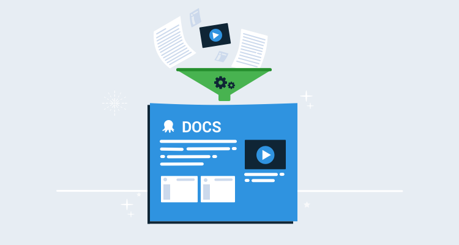
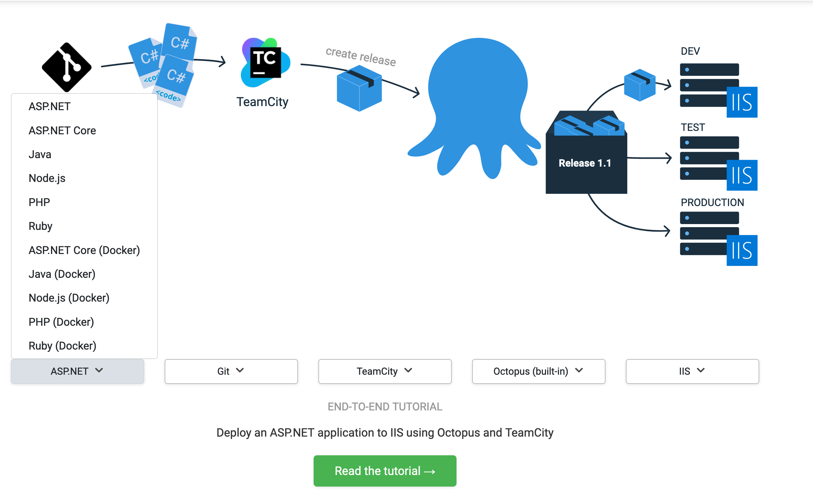

We have detailed end-to-end CI/CD guides to the [Octopus documentation](https://octopus.com/docs/guides) to help teams configure their delivery pipelines. We applied [DevOps principles](https://octopus.com/devops/) to the process of software documentation that allowed us to create useful step-by-step guides, with automated screenshots and screencasts of each scenario being documented.

If you’ve ever tried supporting a friend, colleague, or customer with a technical issue over the phone, you know how inefficient that conversation can be:

*Click the big green “OK” button. Scroll down the page. It’s in the bottom right-hand corner. No, not that button. No, not that one either. No, don’t click the back button. Sigh… OK, let’s start again.*

If you’ve ever provided the same support to somebody in person, the process is *much* more efficient as you get to point at the screen while issuing directions:

*Click that. Click that. Scroll down. Click that. No, not that. Yes, click that.*

The shared context provided by two people looking at the same screen instantly removes the ambiguity and the whole process is much smoother.

Octopus Deploy is an integration tool that sits in the middle of any of a dozen different (and equally complex) platforms and tools. When we started work on the end-to-end guides, we knew we needed to provide complete journeys rather than assuming people knew the big picture. We also needed to show users how to do things rather than tell them.

The result of this project is the [Octopus Guides](https://octopus.com/docs/guides). 

The [Octopus Guides](https://octopus.com/docs/guides) allows you to select your technology stack and see a dedicated guide that steps you through the process from compiling your code to deploying it to its destination. We haven’t completed every combination yet, but if you find a combination that hasn’t been written yet, you can vote for it.



## Creating tailored software documentation

To recreate the efficiency of two people looking at the same screen, each guide is illustrated with over 100 highlighted images, and the entire process is captured by a screencast that shows every mouse click. And because each guide is tailored to the selected software stack, you’re not left to Google the next step in the process.

Creating this suite of tailored software documentation is not a trivial task. At the time of writing, we have around 60 such individual guides with over 6,000 highlighted images, 25 hours of video, and close to 300,000 words documenting various combinations of around 16 technology stacks. 

Many of the applications included in the guides are released on a monthly or weekly schedule, and ideally, our screenshots will be kept up to date. This content was created and will be maintained by a team of two (myself as writer/developer and an editor to review and edit the content) over the course of a few months.  

To achieve this, we needed a solution that could scale up far beyond a traditional write, commit, transform, and publish workflow. Without the luxury of throwing more people at the problem, we leaned heavily on DevOps practices such as: 

- [Automated testing](https://octopus.com/devops/continuous-delivery/software-testing-in-continuous-delivery) (to ensure the process we were documenting worked as described).
- Infrastructure as code.
- Automated pipelines to generate screenshots and video.

## A simple example

To demonstrate how we created the guides, I’ll create a simple example that documents performing a Google search:

1. Open https://google.com.

2. Enter the search term into the text box and click the Google Search button:


3. The search results will then be displayed:


This is a trivial example, but it illustrates two features that we implemented:

1. We have a screencast showing the interaction with the browser, tracking each mouse click and form entry. This video is a big part of the *show, don’t tell* philosophy as it demonstrates exactly what the documentation describes.

1. The elements we interact with on the search screen are highlighted with a fluorescent green box in the screenshots. This is the equivalent of sitting over someone’s shoulder and pointing to the screen rather than relying on awkward written descriptions of visual user interfaces.

## Automating the process

This video and the screenshots could have been created and edited manually, but given that we’re building the foundation for a workflow that expanded to dozens (if not hundreds) of guides, we needed these assets to be created automatically.

Automating the creation and updating of these assets requires four services:

* A video hosting service, ideally that can update videos in-place.
* An image hosting service.
* A tool for scripting the interactions with a web browser.
* A service that executes the scripting.

For the Octopus Guides, we used:

* [Wistia](https://wistia.com) for our video hosting.
* [AWS S3](https://aws.amazon.com/s3/) for our image hosting.
* A custom tool using [Selenium WebDriver](https://selenium.dev/) for scripting a web browser.
* [GitHub Actions](https://github.com/features/actions) to execute everything.

To see this in action, take a look at a [sample project](https://github.com/OctopusSamples/GoogleAgileDocs). This project includes two workflows that are executed by GitHub Actions: one to capture the screencast, and another to generate the screenshots.

The code for the workflow that captures the screencast can be found in the [OctopusSamples GitHub repo](https://github.com/OctopusSamples/GoogleAgileDocs/blob/master/.github/workflows/video.yml). It starts with some boilerplate YAML that names the workflow, specifies when to run it, and defines a job called `build` that is executed on an Ubuntu virtual machine (VM).

The `push` option means each commit to the repository triggers a build, while the `schedule` option has been set to run the build at midnight UTC every day. 

Running the build on a schedule like this means we know that our screenshots and videos are current, even if the applications being used are updated. Or in the case of this example, it ensures our documentation captures the latest Google doodle.

This is important because we don’t want our documentation to be full of stale media.

```yaml
name: Google Agile Docs Video
on:
  push:
  schedule:
    - cron:  '0 0 * * *'
jobs:
  build:
    runs-on: ubuntu-latest
```

Next, we define a set of common environment variables to be shared with steps in the job. These variables define the AWS credentials that are used to upload images, Wista credentials, and the video ID for replacing the video, boolean flags to configure the WebDriver scripting tool, and a hardcoded offset that defines the number of pixels that the browser UI takes up before displaying the HTML content.

Because browsers can only report the position of an element relative to the browser window rather than the position on the screen, the vertical offset value is added to the relative window position to find the absolute screen position of an element, which in turn allows the WebDriver tool to move the mouse cursor to it:

```yaml
    env:
      AWS_ACCESS_KEY_ID: ${{ secrets.AWS_ACCESS_KEY_ID }}
      AWS_SECRET_ACCESS_KEY: ${{ secrets.AWS_SECRET_ACCESS_KEY }}
      AWS_DEFAULT_REGION: ${{ secrets.AWS_DEFAULT_REGION }}
      WISTIA_USERNAME: ${{ secrets.WISTIA_USERNAME }}
      WISTIA_PASSWORD: ${{ secrets.WISTIA_PASSWORD }}
      WISTIA_MEDIA_ID: eecl0uod01
      MOVE_TO_MOUSE_CURSOR: true
      DISABLE_HIGHLIGHTS: true
      DISABLE_SCREENSHOTS: true
      DISABLE_VIDEO: false
      DUMP_OPTIONS: true
      MOUSE_VERTICAL_OFFSET: 74
```

Next, we start defining the steps that make up the workflow. The first step checks out the code from the GitHub repo:

```yaml
    steps:
      - uses: actions/checkout@v1
```

The next step uses Puppet to install the tools we need, like the AWS CLI for uploading the images, and VLC and FFmpeg to process the video.

We use Puppet instead of the native GitHub Actions for a couple of reasons:

1. Puppet can run outside of GitHub Actions in a development VM to debug the process.
1. The scenarios documented by the Octopus Guides involve complex infrastructure initialization: CI servers, Octopus Deploy, package repositories like Artifactory, Kubernetes clusters with Minikube and web servers.

Puppet is well suited to deploy this infrastructure, while GitHub Actions tends to be limited to building and testing code.

```yaml
      - name: Configure VM
        run: ./puppet/install.sh setup.pp
```

The next step runs our custom Selenium WebDriver scripting tool. The code for this tool can be found in this [GitHub repo](https://github.com/OctopusDeploy/WebDriverTraining). If “WebDriverTraining” sounds like an odd name, it’s because this code was originally written as part of a [blog series](https://octopus.com/blog/selenium/0-toc/webdriver-toc) that describes the process of creating a WebDriver testing tool from scratch. That project was ideal for generating assets for the guides, and so we extended and bundled it into a [Docker image](https://hub.docker.com/r/mcasperson/webdriver) for integration with GitHub Actions.

Here you can see a number of the global environment variables are passed as Java properties via the `JAVA_OPTS` environment variable. These properties are defined with the `-D` argument, the name of the property, and the value of the property:

- `moveCursorToElement`: Enable the mouse cursor movement as part of the WebDriver script.
- `disableHighlights`: Disable the green highlights from being placed on elements.
- `disableScreenshots`: Disable screenshots.
- `mouseMoveVerticalOffset`: Define the height of the browser UI’s top widgets.
- `CucumberAlias-[Alias Name]`: Define some aliases to be used in the script.

Finally, the arguments to be passed to the Docker image are defined. The arguments are passed to the Cucumber CLI, which this Docker image implements. The first argument enables the progress plugin (`--plugin progress`), and passes the path of the feature file to be run (`/github/workspace/google.feature`):

```yaml
      - name: Run script
        uses: docker://mcasperson/webdriver
        env:
          JAVA_OPTS: >-
            -DmoveCursorToElement=${MOVE_TO_MOUSE_CURSOR}
            -DdisableHighlights=${DISABLE_HIGHLIGHTS}
            -DdisableScreenshots=${DISABLE_SCREENSHOTS}
            -DmouseMoveVerticalOffset=${MOUSE_VERTICAL_OFFSET}
            -DdisableVideoRecording=${DISABLE_VIDEO}
            -DdumpOptions=${DUMP_OPTIONS}
            -DCucumberAlias-ExternalVideoDir=/github/workspace
            -DCucumberAlias-ExternalScreenshotDir=/github/workspace
        with:
          args: --plugin progress /github/workspace/google.feature
```

After this step has run, we have one or more AVI files in the workspace directory. The next step uses VLC to convert the files to MP4 and combine them into a single video. It then uses FFmpeg to speed the videos up to make them easier to watch. The script that does this can be found in the [OctopusSamples Repo](https://github.com/OctopusSamples/GoogleAgileDocs/blob/master/process-video.sh):

```yaml
      - name: Process video
        run: ./process-video.sh
```

The final step is to replace a video that has already been uploaded to Wistia. Replacing the video means any existing HTML pages that embed it will display the new content without further edits.

Unfortunately, the Wistia API does not expose the ability to replace a video, but it can be done via the website. This is a perfect use case for the same WebDriver scripting we’re performing for our own documentation. In this case, we’re not generating any media assets from the script, so all screenshots and video recording has been disabled:

```yaml
      - name: Replace Wistia video
        uses: docker://mcasperson/webdriver
        env:
          JAVA_OPTS: >-
            -DmoveCursorToElement=false
            -DdisableHighlights=true
            -DdisableScreenshots=true
            -DdisableVideoRecording=true
            -DdumpOptions=${DUMP_OPTIONS}
            -DCucumberAlias-ExternalWistiaUsername=${WISTIA_USERNAME}
            -DCucumberAlias-ExternalWistiaPassword=${WISTIA_PASSWORD}
            -DCucumberAlias-ExternalMediaID=${WISTIA_MEDIA_ID}
            -DCucumberAlias-ExternalVideoDir=/github/workspace
        with:
          args: --plugin progress /github/workspace/replace-video.feature
```

The workflow for generating the screenshots is very similar, with the exception that the flags passed to the WebDriver Docker container disable video and enable highlighting and screenshots, and the final step is to upload the screenshots to AWS S3. The YAML for the screenshots workflow can be found in the [OctopusSamples Repo](https://github.com/OctopusSamples/GoogleAgileDocs/blob/master/.github/workflows/screenshots.yml).

## Selenium WebDriver example script

With the GitHub Actions workflows done, we have configured all the tooling we need to generate the screenshots and videos and upload the results to either Wistia or AWS S3. The final piece of the puzzle is the WebDriver scripts.

We mentioned the WebDriver Docker container was running Cucumber. Cucumber is a library that reads Gherkin scripts and executes code associated with the steps. But don’t worry if you're not familiar with Cucumber or Gherkin, as the scripts are easy enough to follow because they're designed to be written in something that resembles plain English.

The `google.feature` file is shown below:

```
Feature: Search with Google

  Scenario: Open Page
    And I open the shared browser "FirefoxNoImplicitWait"
    And I maximize the window
    And I open the URL "https://google.com"

  Scenario: Perform Search
    Given I set the following aliases:
      | Search        | //input[@name='q']              |
      | Google Search | //input[@value='Google Search'] |
    And I start recording the screen to the directory "ExternalVideoDir"

    When I populate the "Search" text box with "Octopus Deploy"

    And I highlight outside the "Search" text box with an offset of "2"
    And I highlight outside the "Google Search" button with an offset of "2"
    And I save a screenshot to "#{ExternalScreenshotDir}/google/010-search.png"

    And I click the "Google Search" button

    And I save a screenshot to "#{ExternalScreenshotDir}/google/020-search-results.png"

    Then I verify the current URL matches the regex "https://www.google.com/search.*"

  Scenario: Close browser
    Then I close the browser
```

The file is identified with a top-level feature and several child Scenarios. The first scenario opens the web browser, maximizes it, and opens the Google homepage:

```
  Scenario: Open Page
    And I open the shared browser "FirefoxNoImplicitWait"
    And I maximize the window
    And I open the URL "https://google.com"
```

The second scenario is where we perform the search. The first step in the scenario is to define aliases (which are key/value pairs) that assign a human-readable name to an XPath that identifies the elements on the page that we will interact with. For this example, there are two elements we will interact with, the search text box and the search button:

```
  Scenario: Perform Search
    Given I set the following aliases:
      | Search        | //input[@name='q']              |
      | Google Search | //input[@value='Google Search'] |
```

The next step starts recording to a directory defined in the alias called `ExternalVideoDir` (unless all recording has been disabled from the command-line).  Unlike the aliases defined above, this alias was defined as part of the `JAVA_OPTS` environment variable in the GitHub Actions workflow file with the setting `-DCucumberAlias-ExternalVideoDir=/github/workspace`:

```
    And I start recording the screen to the directory "ExternalVideoDir"
```

We now start interacting with the page by entering a query into the search text box. Notice here that we refer to the element that we are interacting with via the alias `Search`:

```
    When I populate the "Search" text box with "Octopus Deploy"
```

The next two steps add the fluorescent green highlights around elements on the page (unless all highlighting has been disabled from the command-line). These highlights are used to help readers quickly pinpoint the elements referenced in the documentation:

```
    And I highlight outside the "Search" text box with an offset of "2"
    And I highlight outside the "Google Search" button with an offset of "2"
```

With the highlights applied, we capture a screenshot. Here we have used interpolation to create the path of the screenshot from the value of the alias called `ExternalScreenshotDir` and the fixed path of `/google/010-search.png`:

```
    And I save a screenshot to "#{ExternalScreenshotDir}/google/010-search.png"
```

We then click the search button, referenced by the alias `Google Search`:

```
    And I click the "Google Search" button
```

We grab another screenshot of the search results:

```
    And I save a screenshot to "#{ExternalScreenshotDir}/google/020-search-results.png"
```

The final step in this scenario verifies that the URL of the resulting page matches a regular expression. This verification provides us with a guarantee that we filled the search form out correctly:

```
    Then I verify the current URL matches the regex "https://www.google.com/search.*"
```

The final scenario shuts down the browser. This will also stop any video recording:

```
  Scenario: Close browser
    Then I close the browser
```

This same script is run twice, once to capture the video with all highlights disabled, and once to capture the screenshots with video recording disabled. The output of these two passes gives us highlighted screenshots and a screencast, which we can reference in the final documentation.

## Bringing DevOps to software documentation

Although this was a trivial example, the workflow we created here is fundamentally the same process that we used to produce the thousands of screenshots and hours of video in the Octopus Guides. There are several key features that have been demonstrated here that allow us to scale up the production of documentation.

### Near infinite execution scale

The entire process is automated and scheduled using GitHub Actions. This allows us to scale out by running multiple workflows in parallel, only limited by how much you want to spend on compute costs and the limitations imposed by GitHub. 

GitHub takes care of provisioning and cleaning up the build environments, so all we need to do is set the appropriate schedule.

### Verifiable rather than aspirational documentation

Have you ever read technical documentation and thought the writer was describing how they thought the product *should* work rather than how it *does* work? Or maybe you hit a wall because the developer writing the docs forgot to mention a dependency they installed years ago and simply didn’t realize it was critical to the process?

By using Puppet and the blank-slate VMs (immutable infrastructure) provided by GitHub Actions, we force ourselves to rebuild the environment that we are documenting from scratch every time. 

Although this example didn’t install any local infrastructure and only accessed Google, the Octopus Guides workflows install the CI servers, databases, build tools, and web servers with each and every run. This means that the guides can verifiably demonstrate how Octopus and the associated tools actually work rather than describing how things are assumed to work.

### Automating testing and testable documentation

Although the documentation is still written by hand, there is now a one-to-one mapping between the steps outlined in the documentation to the Gherkin script that we execute and verify with GitHub Actions. This means we now have documentation that is backed by automated tests, which is essential when producing the amount of content that we include with the Octopus Guides. 

Scheduling regular runs of the workflows mean we can be notified of any product updates that might break our scripts, and therefore require the documentation to be updated.

### Software documentation that is always up to date

Although the purpose of these browser scripts is to generate the screenshots and videos consumed by our documentation, they are also essentially end-to-end tests. 

If the script fails, for example, if an HTML element is no longer available or a manual verification step does not succeed, the GitHub Action fails, we are notified, and can determine if some aspect of our documentation needs to be updated.

On the flip side, if the script passes, we can be confident that the screenshots and video we collected are valid, and they can be updated immediately.

In practice, this means if your Puppet scripts default to installing the latest versions of any software, and the scripts pass, the screenshots and video can be pushed to the live documentation without any manual intervention. This solves the issue of stale images being presented in the documentation and removes the cost of manually keeping this kind of media up to date.

So if Jenkins ever refreshes their UI, you can be assured that the Octopus Guides will be kept up to date.

## Conclusion

By adopting [DevOps best practices](https://octopus.com/devops/) like infrastructure as code, automated testing, and pipelines, it is possible to streamline some of the most manual, tedious, and expensive aspects of creating and maintaining significant volumes of high-quality documentation. 

With just a few months’ worth of work, a team of 2 produced thousands of screenshots, hours of video, and hundreds of thousands of words, all automatically generated and verified.

If you're an Octopus customer, we hope you find these new guides valuable. If you’re interested in producing similar content, the resources mentioned in this blog are listed below:

* [Octopus Guides](https://octopus.com/docs/guides/) homepage.
* The [GitHub repo](https://github.com/OctopusDeploy/OctopusGuides) that contains the code used to create the guides.
* [Creating a Selenium WebDriver test framework](https://octopus.com/blog/selenium/0-toc/webdriver-toc) - A 30 part blog series that explains the code behind the WebDriver scripting used in this post.
* The [Docker image](https://hub.docker.com/repository/docker/mcasperson/webdriver) called from GitHub Actions.
* The [WebDriver application source code](https://github.com/OctopusDeploy/WebDriverTraining).
* The [GitHub repo](https://github.com/OctopusSamples/GoogleAgileDocs) holding the example project described in this post.

Happy deployments!
