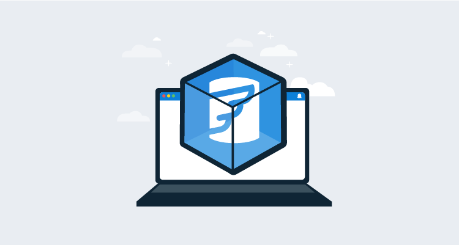

I recently used [Flyway](https://flywaydb.org) and Octopus Deploy to deploy database changes. I was impressed with Flyway, except that I had to either bundle the tool and the Java Runtime Engine (JRE) or pre-install them on a worker.  

In the **2020.2** release of Octopus Deploy, we introduced the [Execution Containers](https://octopus.com/blog/execution-containers) feature.  Execution containers use Docker Images to manage dependencies.  

This post walks through how to configure a database deployment in Octopus Deploy using execution containers and Flyway.

## Execution container basics

I prefer not having to include all the binaries to run Flyway in my package, as it leads to package bloat. In my examples, the difference was 10 KB versus 90 MB.  

As a developer, I'm also responsible for upgrading the binaries and including them in my Git repo. I also avoid pre-installing tools on the worker as this means everyone is on the same version, and an upgrade could break for everyone.  

Execution containers solve both problems by using Docker images to manage dependencies.  The Docker image has all the necessary tooling (JRE, Flyway, PowerShell, etc.) installed.  You specify the Docker image and the tag to use in the deployment process.  When a deployment runs using execution containers, Calamari executes a Docker run command.  Also, Calamari automatically mounts folders to the container.  

The task log shows a command similar to this:

```
docker run --rm  --env TentacleHome=/home/Octopus  -w /home/Octopus/Work/20210329204922-325128-24   -v /home/Octopus/Work/20210329204922-325128-24:/home/Octopus/Work/20210329204922-325128-24  -v /home/Octopus:/home/Octopus  index.docker.io/octopuslabs/flyway-workertools:latest 
```

Any packages you have are automatically extracted into the `/home/Octopus/Work/[DATETIME]` folder.  This happens behind the scenes. To change from running directly on the worker to running on an execution container, you simply click a radio button and provide the package name. Everything else is the same.

## The Flyway Execution Container

Octopus Deploy provides [official Docker images](https://octopus.com/docs/projects/steps/execution-containers-for-workers#worker-tools-images) you can use.  Unfortunately, these images cannot be used in this example for two reasons:

1. They include dozens of tools requiring gigabytes more data downloaded from Docker Hub.
1. None of the images include Flyway.  

To overcome this, I created a [Docker image](https://hub.docker.com/r/octopuslabs/flyway-workertools) you can use for this example. I also created a [GitHub Action](https://github.com/OctopusDeployLabs/flyway-workertools/blob/main/.github/workflows/docker-build-push.yml) that will run once a day and build a new image when a new version is detected.  

The [base image](https://hub.docker.com/r/octopuslabs/workertools) for this Docker image includes the most popular scripting languages we support: PowerShell and Python. The Ubuntu-based image also supports Bash.

## Scaffolding

There are two scaffolding steps to complete:
  
1. Install the [Flyway Database Migrations step template](https://library.octopus.com/step-templates/ccebac39-79a8-4ab4-b55f-19ea570d9ebc/actiontemplate-flyway-database-migrations).
1. Add a Docker Container Registry external feed and point it to `https://index.docker.io`.

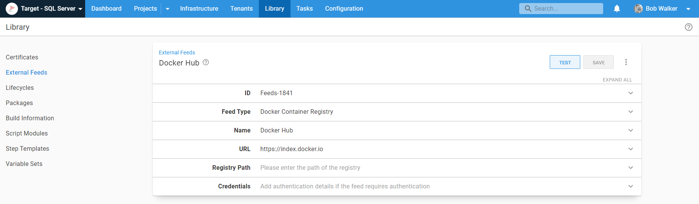

## Flyway Database Migrations step template

If you search `Flyway` in our [community step template library](https://library.octopus.com) you'll notice many Flyway step templates.  The **Flyway Database Migrations** step template is designed to replace the older step templates.

The primary differences with this new step template are:

1. You can choose from any of the commands (migrate, info, validate, etc.) that Flyway support.
1. I worked with the Flyway team at Redgate to find the popular command-line switches.
1. Both the free and paid versions of Flyway are supported, giving you access to dry run migrations and the ability to use the undo command.
1. It runs on either Linux or Windows.
1. It attempts to find the Flyway executable, making it easy to either include Flyway in the package (if that's your preference) or run it in an execution container.
1. SQL and JAR migrations are both supported.

I followed a similar pattern of including more parameters in other recent step templates, such as:

- [Deploy Child Octopus Deploy](https://library.octopus.com/step-templates/0dac2fe6-91d5-4c05-bdfb-1b97adf1e12e/actiontemplate-deploy-child-octopus-deploy-project)
- [Run Octopus Deploy Runbook](https://library.octopus.com/step-templates/0444b0b3-088e-4689-b755-112d1360ffe3/actiontemplate-run-octopus-deploy-runbook) 
- [Re-prioritize Octopus Deploy Tasks](https://library.octopus.com/step-templates/c9d5c96f-f731-4e6c-b9b3-d93f84a9bb74/actiontemplate-re-prioritize-octopus-deploy-tasks) 

I did this to ensure any parameter starting with a `-` is a [command-line switch](https://flywaydb.org/documentation/configuration/parameters/) in the Flyway command-line tool.

## Packaging migration scripts

Our docs instruct you to build your packages. If you only have SQL files, however, there isn't anything to build.  You just need to package the folder on your build server and push it to Octopus.

Consider this example:
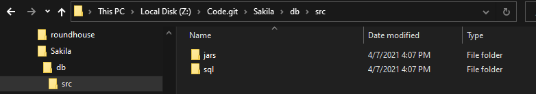

You need to run the Octo Pack command on the `db/src` folder on the build server.  The package will contain those folders and contents.

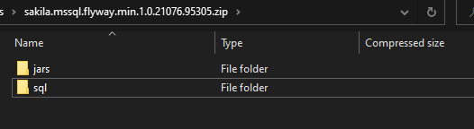

After the package is built, you need to publish it to Octopus Deploy.  For a proof of concept, you don't need a build server.  You can use a tool like 7-Zip to zip the folder to be `Flyway.Test.1.0.0.zip` and manually [upload the package](https://octopus.com/docs/packaging-applications/package-repositories/built-in-repository#pushing-packages-to-the-built-in-repository).  That's what I did for this post.

However, after the proof of concept, if it makes sense to integrate a build server, we have docs and blog posts to help you out.

Examples of build servers:

- [Jenkins](https://octopus.com/docs/packaging-applications/build-servers/jenkins#Jenkins-Packageapplication)
- [TeamCity](https://octopus.com/docs/packaging-applications/build-servers/teamcity#TeamCity-CreateAndPushPackageToOctopusCreatingandpushingpackagesfromTeamCitytoOctopus)
- [Azure DevOps/TFS](https://octopus.com/docs/packaging-applications/build-servers/tfs-azure-devops/using-octopus-extension#PackageyourApplicationandPushtoOctopus)
- [Bamboo](https://octopus.com/docs/packaging-applications/build-servers/bamboo#create-the-package)
- [GitHub Actions](https://octopus.com/blog/publishing-a-package-to-octopus-with-github-actions)

## Configuring the project

We can configure the project now that we've uploaded the step template, Docker feed, and package.  

First, create a project.  In this example, I'll be using the name [Flyway - Azure SQL Execution Containers](https://samples.octopus.app/app#/Spaces-106/projects/flyway-azure-sql-execution-containers/deployments).  See the Flyway example on our samples instance to see how to use execution containers.

### Variables

After the project is created, navigate to **Variables** and add the necessary variables.

:::hint
I recommend namespacing variables, for example `Project.[Component].[VariableName]` for project variables and `[VariableSetName].[Component].[VariableName]` for library variable set variables.  This will make it easier to find them when inserting variables into the process.
:::

- `Project.Database.ConnectionString`: The connection string to the database I want to deploy to.  **Please note:** this is the _only_ real difference between my example using SQL Server and changing it to Oracle, MySQL, PostgreSQL, Maria, Snowflake, etc.
- `Project.Database.Name`: The name of the database being deployed to.
- `Project.Database.Password`: The password of the database user doing the deployment.
- `Project.Database.UserName`: The username of the database user doing the deployment.
- `Project.Database.Server.Name`: The name of the server where the database is located.
- `Project.Flyway.LicenseKey`: The Flyway license key to required take advantage of features such as dry run deployments and undo.  **Please Note:** when a license key is not supplied Flyway will revert to the community edition.
- `Project.Worker.Pool`: The worker pool where the work will be done.

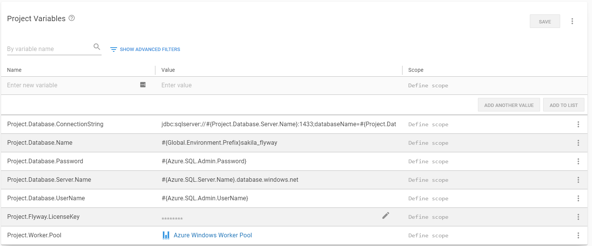

### Deployment process

In [our docs](https://octopus.com/docs/deployments/databases/common-patterns/manual-approvals), we recommend starting with the following process for database deployments:

1. Generate a delta script and attach it as an [artifact](https://octopus.com/docs/projects/deployment-process/artifacts).
2. Notify DBAs of pending approvals (only in Production).
3. DBAs approve the delta script [via manual intervention](https://octopus.com/docs/projects/built-in-step-templates/manual-intervention-and-approvals) (only in Production).
4. Deploy database changes.
5. Notify teams of success or failure.

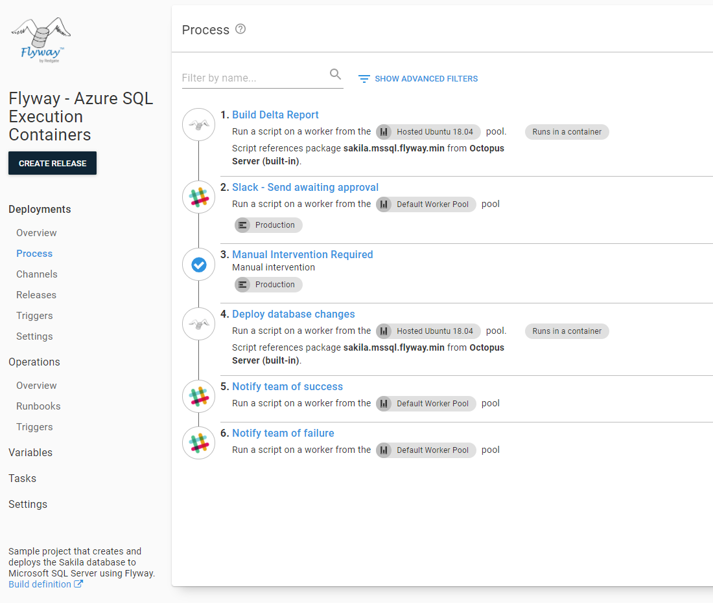

The notification steps can be email, Slack, Microsoft Teams, or any tool of your choice.  The manual interventions are self-explanatory and we cover that information in our docs.

### Using the Flyway Database Migrations step template

Generating the delta report and deploying the database changes is accomplished using the Flyway Database Migrations step template. When you add that into your process, make the following changes:

1. Update the name of the step.
1. Change it to run on a worker.
1. Select a worker pool.
1. Change the container image to `runs inside a container, on a worker`.
1. Enter `octopuslabs/flyway-workertools:latest` as the Docker image; Docker will automatically download the correct architecture (Ubuntu or Windows) based on what the host is running.

:::hint
The worker must have Docker installed to work.  Octopus Cloud provides hosted workers that are already running Docker.  If you want to self-host your workers, Linux workers have to run Linux containers, and Windows workers can only run Windows containers.  
:::

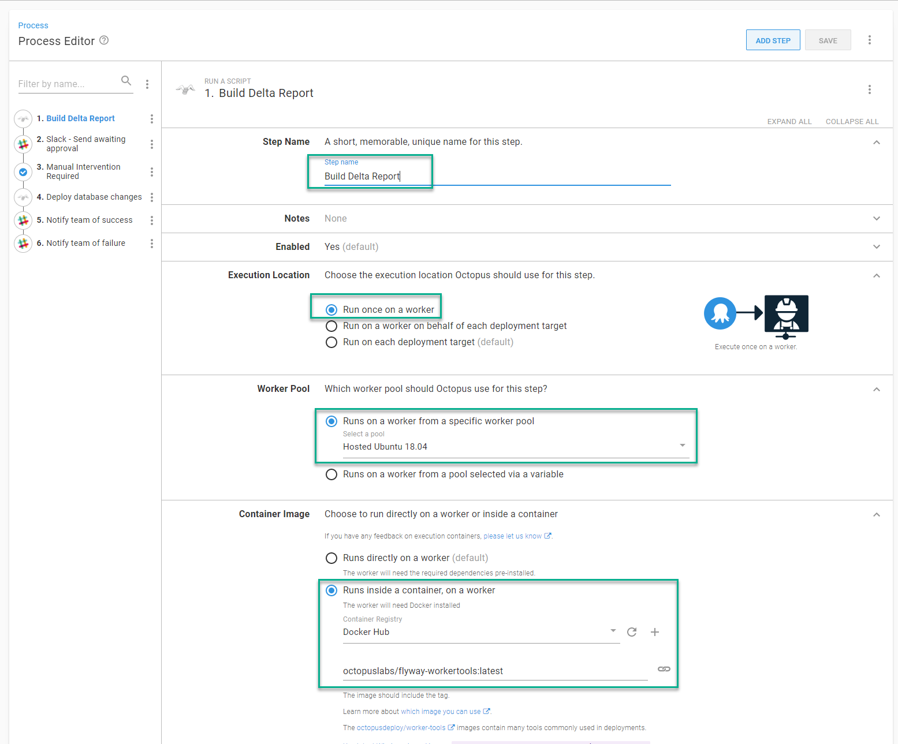

Where the step template will run is now configured. Next we configure the parameters:  

- Select the package containing the scripts you want Flyway to run.
- Optional: enter the path where Flyway is located.

:::hint
If you're running this on the `octopuslabs/flyway-workertools` execution container, you don't need to enter anything.  The step template will automatically find the executable to run. 
:::

- Select the command you want the step to run.

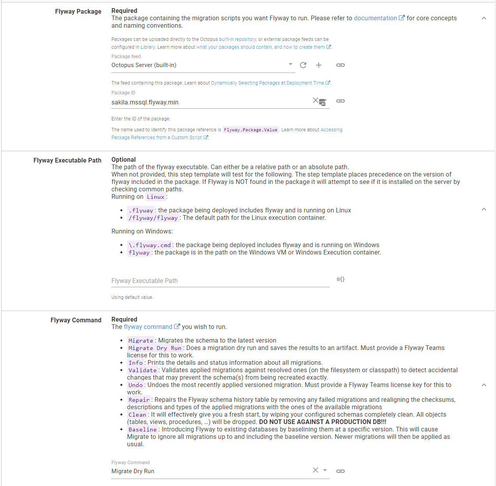

The most common commands used in Octopus are:

- `info`: This generates a list of all the scripts found and their state in relation to the database being deployed.  The info command is ideal when using the community edition, and you need to list the scripts that will run on the database.

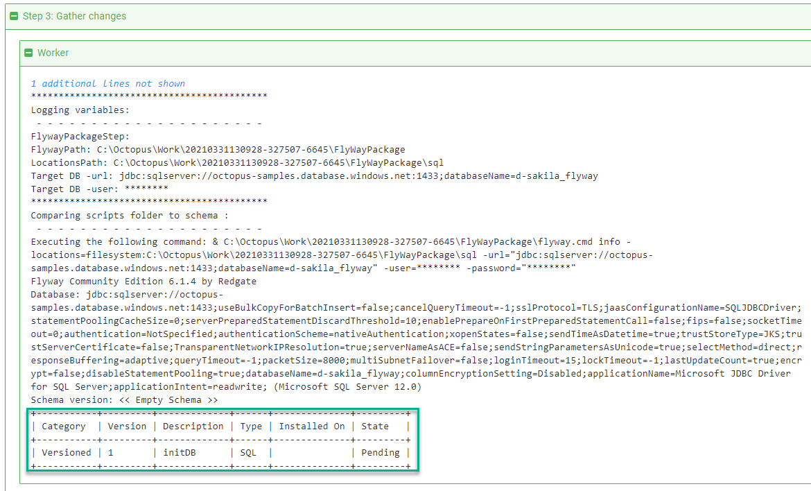

- `migrate dry run`: This generates a file containing all the pending SQL scripts, and it will be saved as an artifact a DBA can download and review.  This is preferred over `info` but is only supported when you supply a Flyway license key.

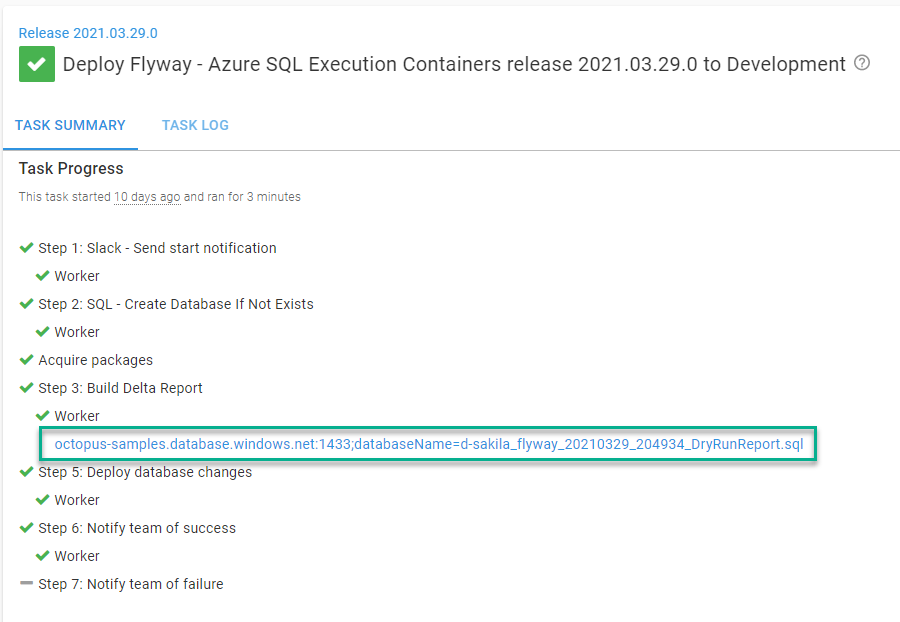

- `migrate`: This takes all the SQL scripts and JAR files in the package and runs them on the target database.  This is the command that does the actual work.

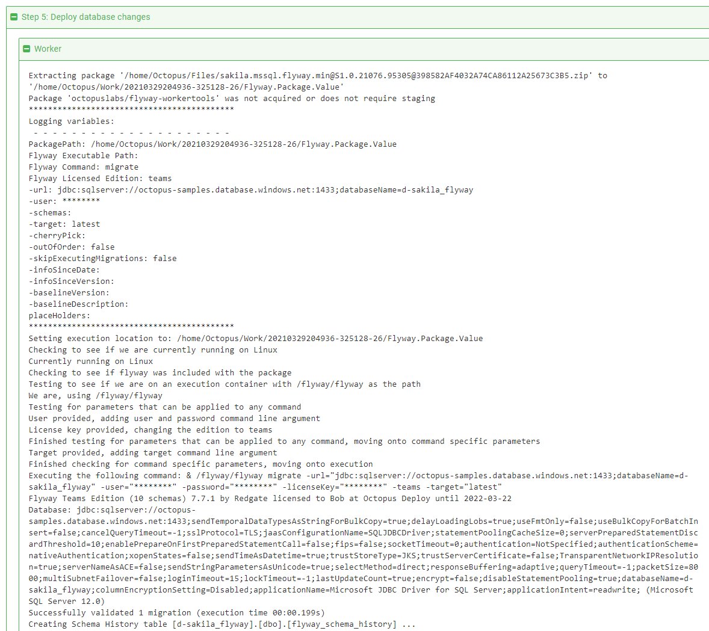

Next are the licensing parameters, followed by the connection parameters, and finally, the various command-line switches Flyway supports.

- Because I have a license key, I changed the edition to `Teams`.
- The next option is to pass in the license key.
- Then, provide the URL of the database using the connection string format.
- After that are the optional [parameters](https://flywaydb.org/documentation/configuration/parameters/) for Flyway to run.

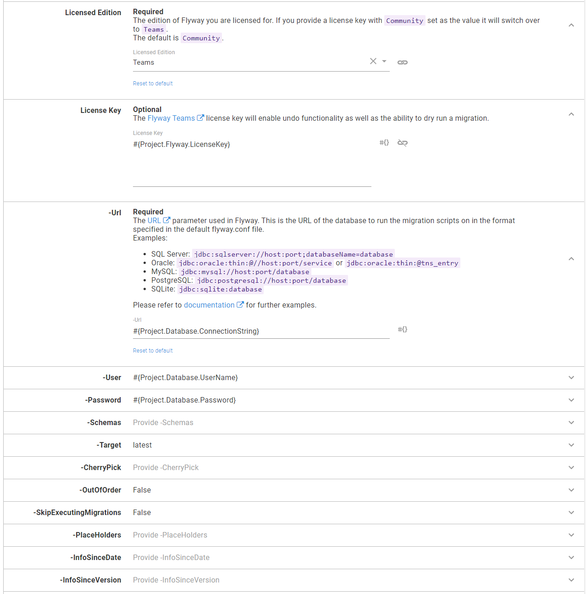

The step template includes detailed help text for each parameter and links to the appropriate documentation.

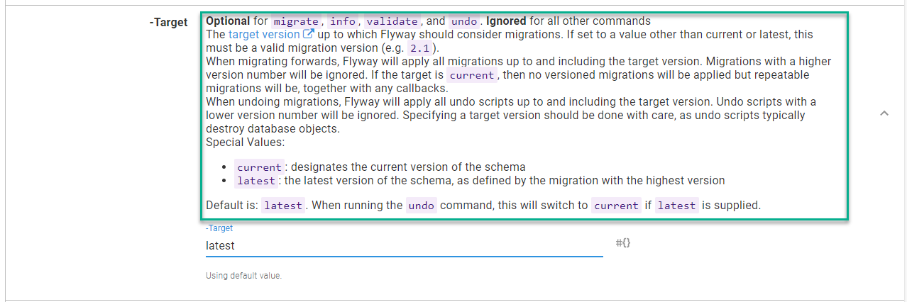

:::hint
Not all commands support all command-line parameters.  The step template is smart enough to exclude parameters not supported by the command.
:::

### Generate Delta Script step

The step to generate the delta script for the DBAs to approve has the following parameters set.  I have a license key, so I'm using the `migrate dry run` command.  If I didn't have a license key, I'd select `info` as the command.

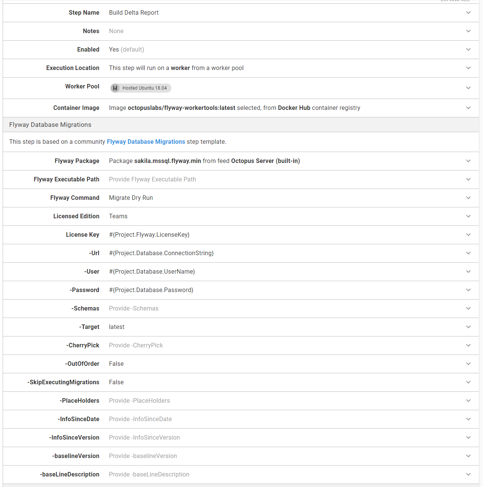

### Deploy Database Changes step

The step to deploy the database changes from the package is virtually identical to the **generate delta script** step.  The only difference is using the command `migrate` instead of `migrate dry run`.

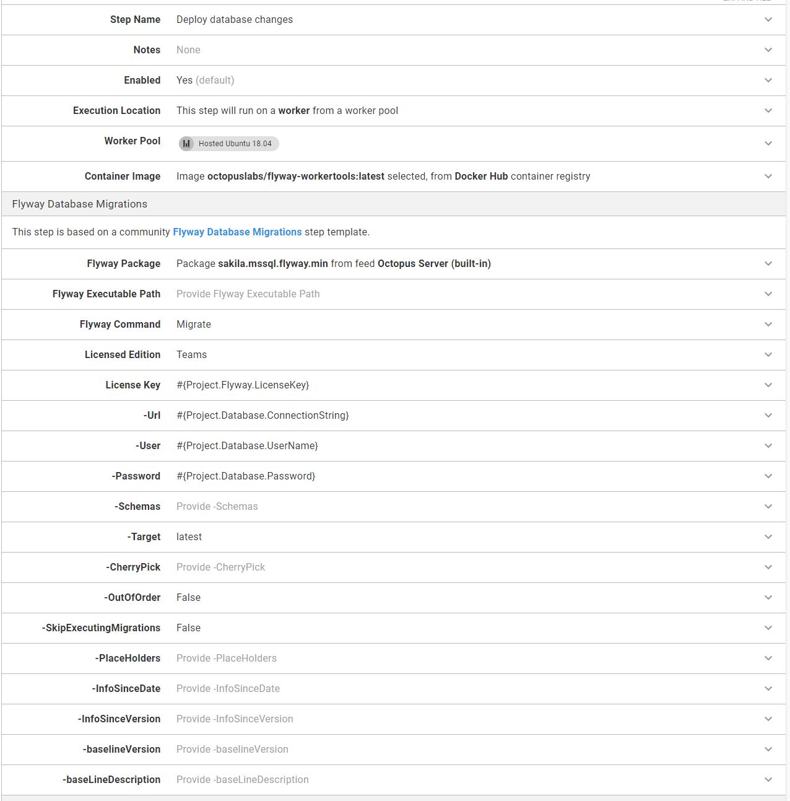

## Conclusion

As this post demonstrates, updating your process to run inside an execution container isn't very involved, especially if you're using Octopus Cloud.  After adding a Docker Container Registry external feed, you simply click a radio button for each step that should run on an execution container.  

It's a small change, but it makes the deployment process and pipeline more robust.  You can leverage a tool that's running the exact version of Flyway you need, without all the maintenance overhead.

Happy deployments!
