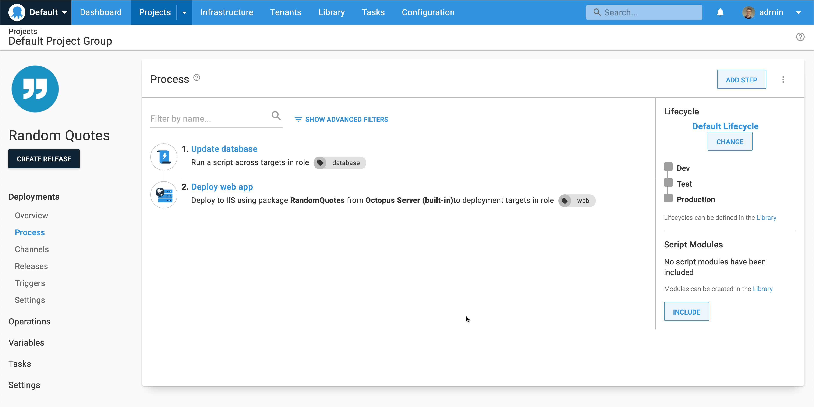
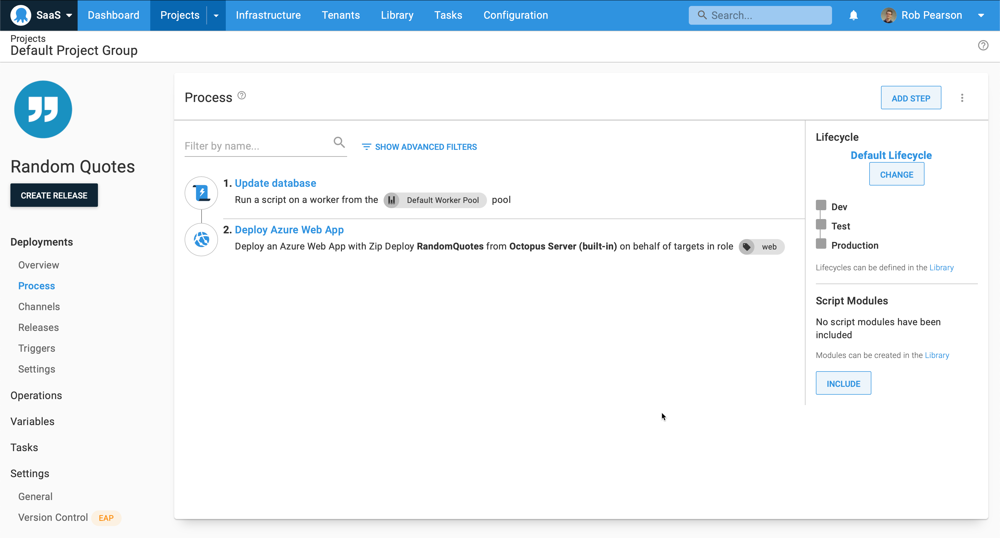
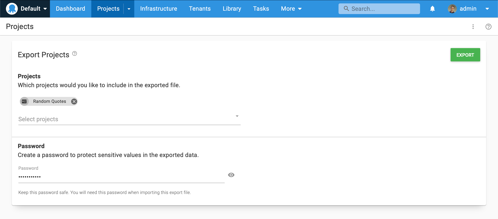
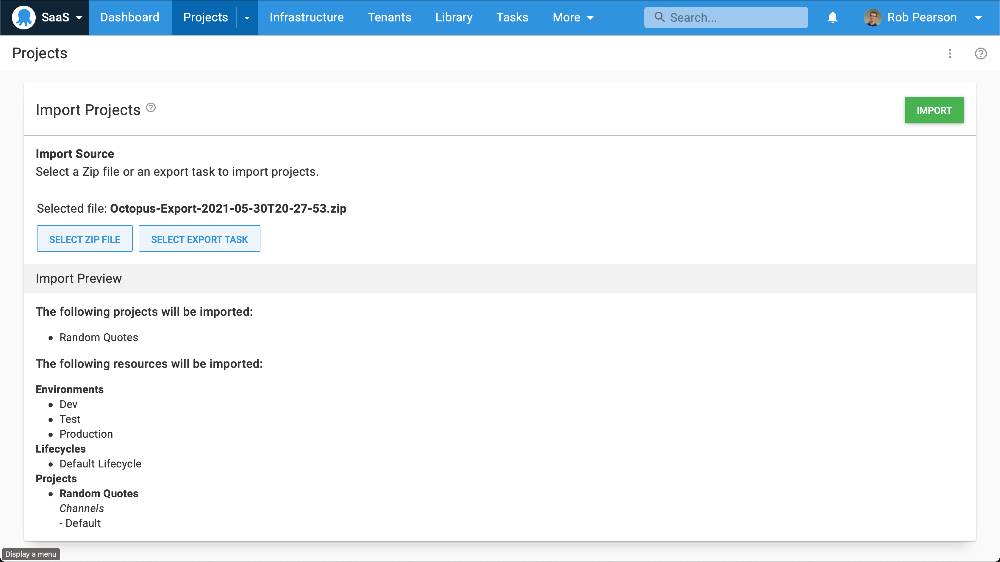
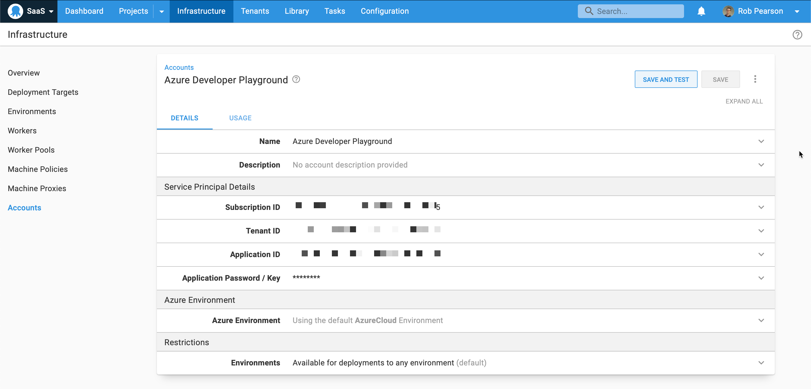
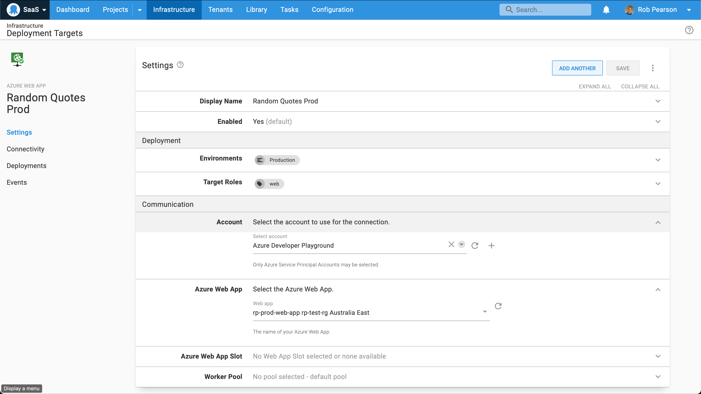
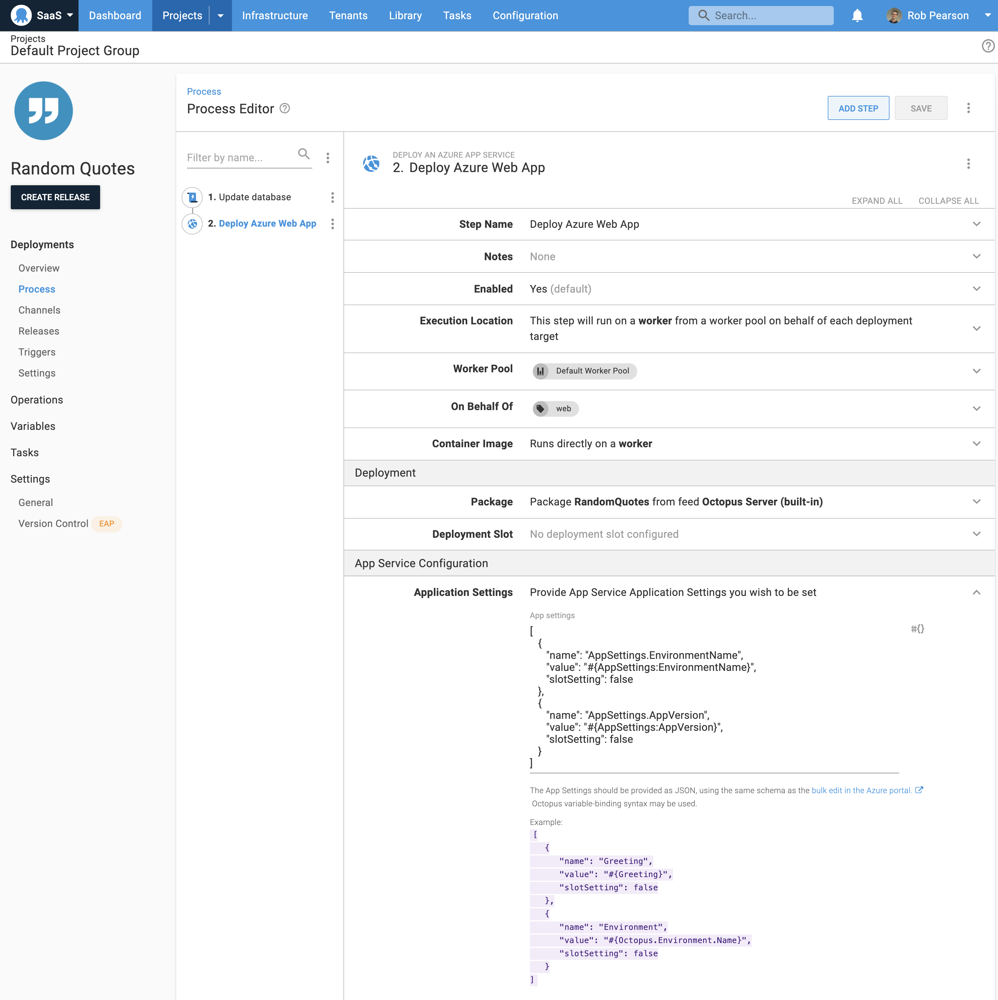
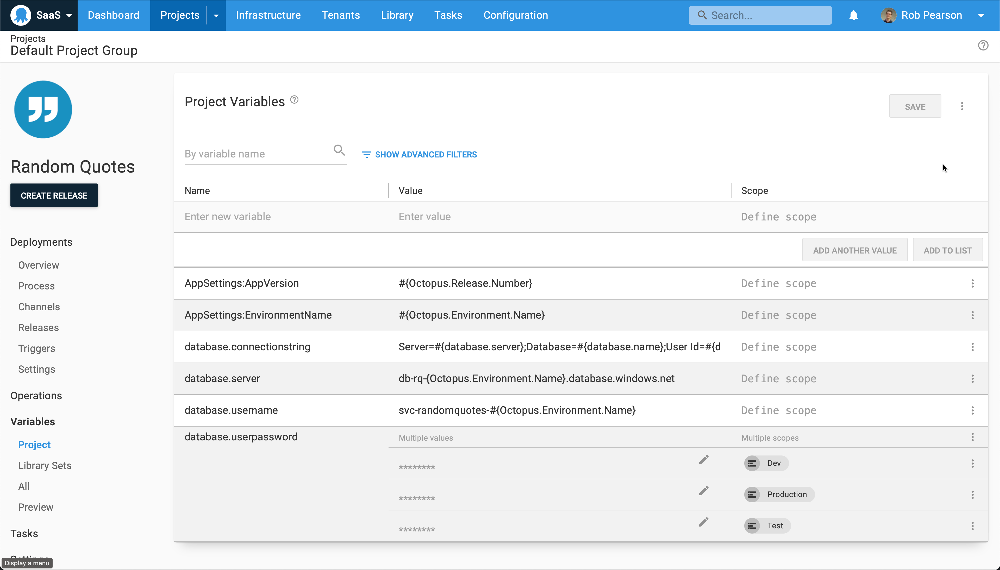

Teams are migrating their applications and infrastructure to the cloud. The natural migration path for an ASP.NET web app running on Microsoft's IIS web server on-premises is to App Services on Microsoft's Azure cloud platform. It's relatively straightforward to change the way your application is hosted, but it's also important to ensure your CI/CD process is still repeatable and reliable. 

In this blog post, I walk through how to update the deployment process of an existing web application with Octopus Deploy, moving it from on-premises to the cloud.

## Example application

We're using the [Random Quotes](https://github.com/octopussamples/randomquotes) web application as the example in this migration guide. This web application randomly retrieves and displays famous quotes. It's a simple application with an ASP.NET front end with a SQL Server back-end to help illustrate the changes required without being overwhelming. 

:::hint
NOTE: This is a web application built on ASP.NET but it could be a Spring Boot Java web app or Ruby on Rails application. We're focusing on the changes to the deployment process so the tech stack is less important.
:::

## Deployment process: before and after

Updating our deployment process is straightforward.



Our existing *on-premises based deployment process* has two steps:

1. A script step that executes a command line tool to update our database.
1. A second step to deploy our web application package to IIS and configure the bindings. 



Our new *cloud-based deployment process* is similar, however, it's updated to deploy to a cloud provider. Our first step still runs a script step to update our database. The second step has changed, and it's now a **Deploy an Azure App Service** step. It captures everything required to deploy our web application to an Azure App Service including updating our configuration file.

## Migrating to Octopus Cloud (optional)

With teams moving away from on-premises virtual machines, one common pattern is to move their CI/CD platform to the cloud. For example, companies might go from using [TeamCity](https://www.jetbrains.com/teamcity/) and Octopus on-premises to [TeamCity Cloud](https://www.jetbrains.com/teamcity/cloud/) and [Octopus Cloud](https://octopus.com/cloud). 

We recently launched [Project export and import support](https://octopus.com/blog/exporting-projects) to make it easy to move projects from one Octopus instance to another. This is self-service meaning that developers can do this themselves without help from system administrators. That said, we recommend involving the operations team to keep them in the loop.

:::hint
NOTE: This process requires both your Octopus instances to be running Octopus 2021.1 or newer.
:::

### On-premises Octopus instance:



1. Navigate to the Projects dashboard. Select the overflow menu (three vertical ellipsis points) and then click the **Export Projects** button. 
2. Select the project(s) that you'd like to export.
3. Set a password to protect the exported files.
4. Click the **Export** button and download the artifacts.

### Octopus Cloud instance:



1. Navigate to the **Projects** dashboard. Select the overflow menu (three vertical ellipsis points) and then click the **Import Projects** button. 
2. Select your exported ZIP file from your on-premises server and enter your password.
3. Review the Import Preview and click the **Import** button.

After this is complete, you should see your new projects imported into your Octopus Cloud instance. 

The final step is to import your application packages (i.e. NuGet, JAR, WAR, and ZIP files) into Octopus Cloud. This can be done [manually](https://octopus.com/docs/packaging-applications/package-repositories/built-in-repository#pushing-packages-to-the-built-in-repository) if you only want to move the latest packages or it can be [automated](https://octopus.com/docs/projects/export-import#packages) to preserve the history. 

:::hint
NOTE: I recommend reading our [documentation](https://octopus.com/docs/projects/export-import) to understand the limitations of the Export/Import Projects feature.
:::

## Configuring Octopus to move to cloud-based deployments

This section walks through the steps you'll need to take to transition to cloud-based deployments.

### Updating your infrastructure



To move to an Azure solution, we need to create cloud-based infrastructure and update Octopus to integrate with it. In the Azure portal, I created multiple [App Services](https://azure.microsoft.com/en-us/services/app-service/) and I [migrated](https://docs.microsoft.com/en-us/azure/azure-sql/database/database-import?tabs=azure-powershell) to an [Azure SQL Database](https://azure.microsoft.com/en-au/products/azure-sql/database/).

Next, we need to configure an Azure Account in Octopus and add one or more Azure Web App deployment targets. 

The Azure account in Octopus captures everything required to authenticate with an Azure subscription, which you can then use to configure your Azure web app targets. 

Navigate to **Infrastructure**, then **Accounts** to add one or more Azure accounts. Configuring an Azure account requires four specific IDs which are somewhat difficult to find. I won't go into detail here but recommend reviewing our [Azure account documentation](https://octopus.com/docs/infrastructure/deployment-targets/azure) to configure this integration.



Next, we need to add one or more Azure Web App deployment targets. These are the App Services that replace our on-premises virtual machines running IIS, that we're deploying our web application to. 

Add an Azure web app deployment target:

1. Navigate to **Infrastructure**, then **Deployment Targets**.
1. Click the **Add target** button and select Azure and then Azure Web App. 
1. Configure the name, role and select the Azure account and Azure Web App.
1. Click the **Save** button.

Repeat for your different subscriptions, as appropriate for your development, test, and production environments.

### Updating your deployment process

We need to update our deployment process to support our move to the cloud. We could use [Octopus channels](https://octopus.com/docs/releases/channels) to support the old and new deployment processes, but we're moving away from our on-premises infrastructure so I'll delete the old IIS based deployment step.

First, review the **Update database** step. This script step uses a database connection string to connect to a database, so no changes are required here. We do need to ensure that our Octopus instance can connect to our Azure SQL database though. I need to update the Azure SQL database firewall to allow the Octopus Cloud [Static IP addresses](https://octopus.com/docs/octopus-cloud/static-ip) to connect to it.

Next, we need to add a new **Azure App Service deployment** step. We've already configured our infrastructure so this isn't difficult. 



This screenshot shows our step configuration. We're using a worker to deploy to Azure web app targets with the `web` role, and we specify the package, app service and connection string configuration updates. Octopus recently introduced an improved [Azure App Service deployment step](https://octopus.com/blog/azure-app-service-step) which allows us to configure updates directly in the step. 

For example, Random Quotes displays two configuration values to show the application version and the environment it was deployed to. To configure this, we use the following JSON string and something similar for the database connection string: 

```json
[
   {
      "name": "AppSettings.EnvironmentName",
      "value": "#{AppSettings:EnvironmentName}",
      "slotSetting": false
   },
   {
      "name": "AppSettings.AppVersion",
      "value": "#{AppSettings:AppVersion}",
      "slotSetting": false
   }
]
```

:::hint
NOTE: This syntax uses the same schema as the Azure portal [bulk edit](https://docs.microsoft.com/en-us/azure/app-service/configure-common#edit-in-bulk) feature. This was new to me but it was easy to learn.
:::

### Updating your configuration variables



We also need to update our project variables to support the cloud. Primarily, we need to change our database connection string. In this case, I composed my database connection string with individual variables, making it easy to update. I also removed unused variables for IIS bindings and port configuration. 

## Exploring runbooks

Now we've moved to the cloud, it's worth mentioning some of the areas that runbooks can assist. Common scenarios include: 

- Provisioning and tearing down development and test infrastructure on a schedule to save money.
- Running regular database maintenance jobs like indexing and clean-up.
- Toggling a blue/green deployment to push a new release live after testing.

I won't go into detail in this post but it's a natural next step to leverage runbook automation with cloud infrastructure.

## Conclusion

Teams are retiring old virtual machines and moving to cloud-based CI/CD infrastructure and application hosting. In this blog post, I demonstrated moving an existing web application from on-premises to the cloud, and moving from Octopus Server on-premises to Octopus Cloud.

Happy deployments!
