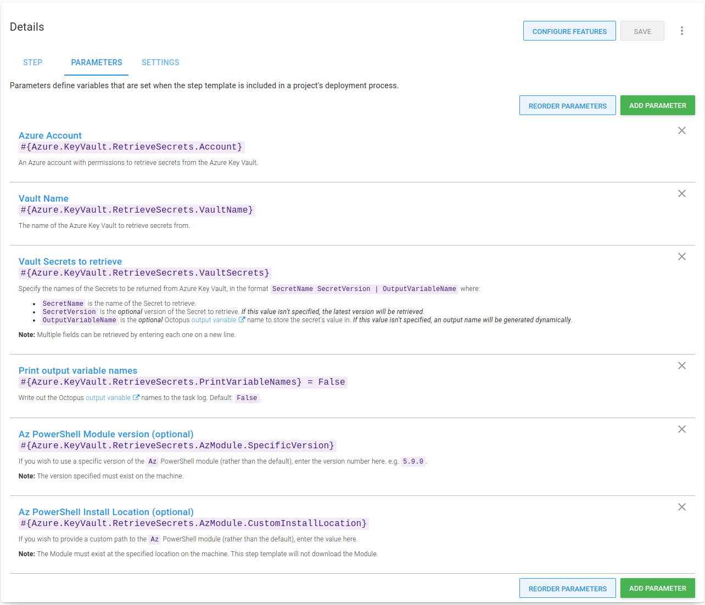
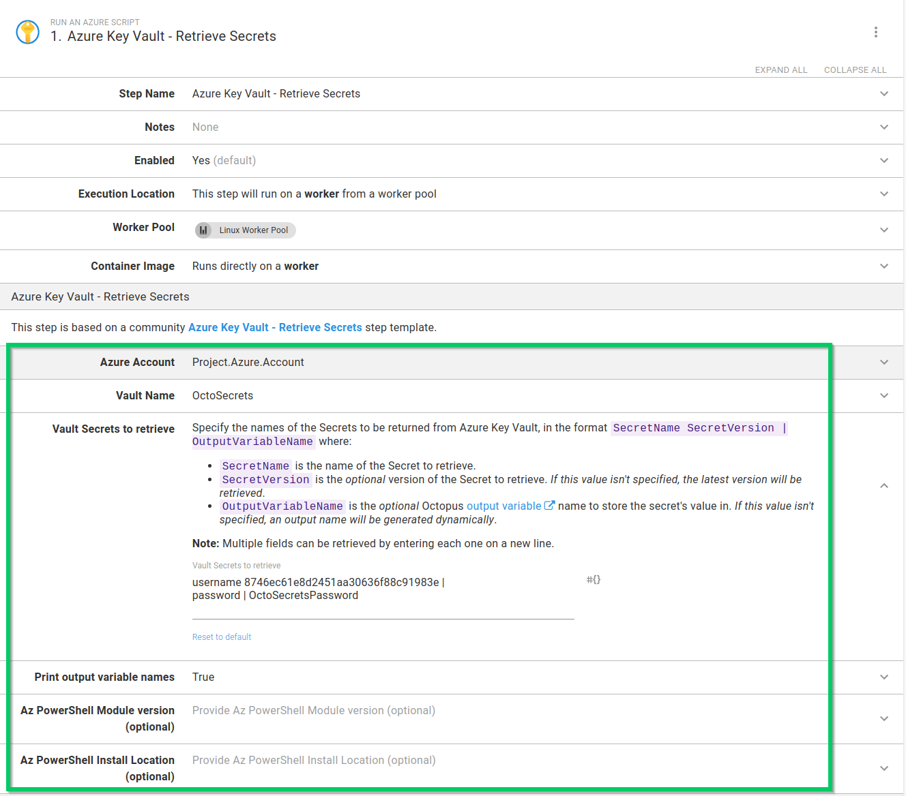
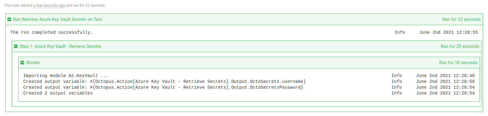

I recently wrote about [extending the functionality of Octopus to integrate with HashiCorp Vault](https://octopus.com/blog/using-hashicorp-vault-with-octopus-deploy) using step templates. Afterwards, several people asked if I plan to create step templates to integrate with other secret managers.

In this post, I walk through a new step template, [Azure Key Vault - Retrieve Secrets](https://library.octopus.com/step-templates/6f59f8aa-b2db-4f7a-b02d-a72c13d386f0/actiontemplate-azure-key-vault-retrieve-secrets), which is designed to retrieve secrets from an Azure Key Vault for use in your deployments or runbooks.

## Introduction

This post assumes some familiarity with [custom step templates](https://octopus.com/docs/projects/custom-step-templates) and the Octopus [Community Library](https://octopus.com/docs/projects/community-step-templates). 

In addition, this post doesn't go into great detail about Azure Key Vault concepts or how to set it up. You can learn more by reading the [Azure Key Vault basic concepts guide](https://docs.microsoft.com/en-us/azure/key-vault/general/basic-concepts) from Microsoft.

The step template in this post retrieves secrets from an [Azure Key Vault](https://azure.microsoft.com/en-gb/services/key-vault/) using the [Az.KeyVault](https://docs.microsoft.com/en-us/powershell/module/az.keyvault/) PowerShell module. The module must be downloaded and installed on the deployment target or worker before the step can retrieve secrets successfully. The step template has been tested on both Windows and Linux (with `PowerShell Core` installed).

## Authentication {#authentication}

Before you can retrieve secrets from Azure Key Vault, you must authenticate with Azure. In their [authentication concepts documentation](https://docs.microsoft.com/en-us/azure/key-vault/general/authentication), Microsoft note:

> Authentication with Key Vault works in conjunction with Azure Active Directory (Azure AD), which is responsible for authenticating the identity of any given security principal.

In Octopus, authentication with Azure Key Vault can be achieved with an [Azure Account](https://octopus.com/docs/infrastructure/accounts/azure), using a service principal.

:::hint
In addition to accessing resources in Azure, your service principal may need further permissions configured to access and retrieve secrets stored in Azure Key Vault. To learn more, read the [Azure Key Vault RBAC guide](https://docs.microsoft.com/en-us/azure/key-vault/general/rbac-guide) on how to provide access to keys, certificates, and secrets with an Azure role-based access control.
:::

## Retrieving secrets {#retrieving-secrets}

The [Azure Key Vault - Retrieve Secrets](https://library.octopus.com/step-templates/6f59f8aa-b2db-4f7a-b02d-a72c13d386f0/actiontemplate-azure-key-vault-retrieve-secrets) step template retrieves one or more secrets from an Azure Key Vault and creates sensitive output variables for each one retrieved. 

For each secret, you can optionally choose to retrieve a specific version, and provide a custom output variable name.

Retrieving a single secret requires:

- An Azure account with permission to access the secret.
- The name of the Azure Key Vault to retrieve the secret from.
- The name of the secret to retrieve.

An advanced feature of the step template offers support for retrieving multiple secrets at once. This requires entering each secret on a new line.

For each secret retrieved, a [sensitive output variable](https://octopus.com/docs/projects/variables/output-variables#sensitive-output-variables) is created for use in subsequent steps. By default, only a count of the number of variables created will be shown in the task log. To see the names of the variables in the task log, change the **Print output variable names** parameter to `True`.

### Step template parameters {#parameters}

The step template uses the following parameters:

- `Azure Account`: An Azure account with permissions to retrieve secrets from the Azure Key Vault.
- `Vault Name`: The name of the Azure Key Vault to retrieve secrets from.
- `Vault Secrets to retrieve`: Specify the names of the Secrets to be returned from Azure Key Vault, in the format: `SecretName SecretVersion | OutputVariableName` where:

    - `SecretName` is the name of the Secret to retrieve.
    - `SecretVersion` is the _optional_ version of the Secret to retrieve. *If this value isn't specified, the latest version will be retrieved*.
    - `OutputVariableName` is the _optional_ Octopus [output variable](https://octopus.com/docs/projects/variables/output-variables) name to store the secret's value in. *If this value isn't specified, an output name will be generated dynamically*.

    **Note:** Multiple fields can be retrieved by entering each one on a new line.
- `Print output variable names`: Write out the Octopus [output variable](https://octopus.com/docs/projects/variables/output-variables) names to the task log. Default: `False`.
- `Az PowerShell Module version (optional)`: If you wish to use a specific version of the `Az` PowerShell module (rather than the default), enter the version number here. e.g. `5.9.0`.

  **Note:** The version specified must exist on the machine.

- `Az PowerShell Install Location (optional)`: If you wish to provide a custom path to the `Az` PowerShell module (rather than the default), enter the value here.

  **Note:** The Module must exist at the specified location on the machine. This step template will not download the Module.

### Using the step {#using-the-step}

The **Azure Key Vault - Retrieve Secrets** step is added to deployment and runbook processes in the [same way as other steps](https://octopus.com/docs/projects/steps#adding-steps-to-your-deployment-processes).

After you've added the step to your process, fill out the parameters in the step:

After you've filled in the parameters, you can execute the step in a runbook or deployment process. On successful execution, any matching secrets will be stored as sensitive output variables. If you've configured your step to print the variable names, they'll appear in the task log:

In subsequent steps, output variables created from matching secrets can be used in your deployment or runbook.

:::hint
**Tip:** Remember to replace `Azure Key Vault - Retrieve Secrets` with the name of your step for any output variable names.
:::

## Conclusion

The step template covered in this post demonstrates that it's easy to integrate with Azure Key Vault, and make use of secrets stored there with your Octopus deployments or runbooks.

Happy deployments!
