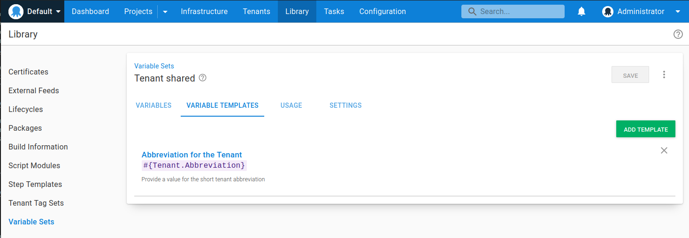

Most people using Octopus will deploy projects to one or more environments. For customers providing Software as a Service (SaaS) applications, they typically need to deploy multiple instances of the application for each of their customers.

Fortunately, there's a feature that's been around since [Octopus 3.4](https://octopus.com/blog/whats-new-multi-tenant-deployments) designed exactly for these types of deployments, [multi-tenancy](https://octopus.com/docs/tenants).

In this post, I look at 2 approaches to deploying applications without tenants, and discuss the benefits of using the multi-tenancy feature. 

!toc

## Introduction

This post assumes knowledge of some key Octopus concepts, including:

- Projects
- Environments
- Variables
- Lifecycles

If you're new to Octopus, I recommend reading our [Getting started with Octopus guide](https://octopus.com/docs/getting-started) and [tenanted deployments](https://octopus.com/use-case/tenanted-deployments) use case page. 

To demonstrate how you can model deployments of multiple instances of an application with Octopus, I use a fictitious company called **Vet Clinic**, deploying the Java application, [Pet Clinic](https://github.com/spring-projects/spring-petclinic). 

## Deploying without tenants {#deploying-without-tenants}

There are 2 main implementations we see when deploying multiple instances of the same application for each customer:

1. Using [multiple projects](#using-multiple-projects)
1. Using [multiple environments](#using-multiple-environments)

While easy to set up, they don't scale well and can result in duplication.

### Using multiple projects {#using-multiple-projects}

In this scenario, you configure Octopus with multiple projects, each one representing one of your customers. 

Onboarding a new customer typically requires creating all of the resources in Octopus needed for a successful deployment for the customer, including:

- A new set of [deployment targets](https://octopus.com/docs/infrastructure/deployment-targets)
- Common [project variables](https://octopus.com/docs/projects/variables)
- Any customer specific "paid-for" [environments](https://octopus.com/docs/infrastructure/environments)

In addition, any common steps across the application's deployment process need to be duplicated in the new project. These are usually manual intervention and notification steps.

#### Multiple projects pros {#multiple-projects-pros}

So why choose multiple Octopus projects to deploy instances of an application to each customer?

1. **Clear customer release dashboard overview**

    This approach lets you see which release has been deployed to which environment for each customer on the dashboard overview.

1. **Variable and deployment process isolation**

    Multiple projects allow for complete isolation of variables, and deployment process for a customer. For example, making a change to one project's process only affects that one customer. You can also tailor the deployment process for the customer depending on the features they signed up for. 

    In the below example, only **Capital Animal Hospital** has a step for applying custom branding:

    

1. **Simpler environment and variable scoping**

    Environments don't need to be duplicated per customer, resulting in simpler lifecycle configuration. Variables can also be scoped to each environment without the risk of choosing the wrong "customer" scoping.

    

#### Multiple projects cons {#multiple-projects-cons}

While multiple projects can be used to deploy customer instances separately, there are usually many problems associated with this approach.

1. **Duplicated project configuration**

    With every customer project, you end up duplicating project configuration. These include variables, deployment process steps, runbooks, channels and lifecycles. With duplication comes inconsistency and the overhead of managing that. For example, if you want to amend the deployment process for all of your customers, you need to change multiple projects.

1. **Different deployment target roles per customer**

    If your customers have isolated infrastructure, you need a unique way for Octopus to know which deployment targets belong to the customer you're deploying to. This results in each customers' deployment targets needing target roles that include a differentiator per customer. This is typically a customer name, code, or ID.

    

1. **Multiple projects per customer doesn't scale**

    The per-project approach doesn't scale well when you have more than a handful of customers. This can be problematic if you deploy many more applications per customer. Each application needs to be modeled `n times`, where `n` is the number of customers you have.

1. **No guard rails to ensure variables provided**

    Using multiple projects, there are no guard rails to ensure all project configuration is set correctly. For example, if a variable is not added (or has an incorrect value), you might not find out about the issue until the deployment of the customer's instance.

### Using multiple environments {#using-multiple-environments}

An alternative to deploying without tenants is using a single Octopus project per application, and modeling each customer with a set of environments they deploy to. 

Onboarding a new customer typically involves:

- Creating a new set of [environments](https://octopus.com/docs/infrastructure/environments), named after the customer.
- Creating a new set of [deployment targets](https://octopus.com/docs/infrastructure/deployment-targets), or re-using existing ones and tagging them with the associated customer environments.
- Adding new [environment-scoped variables](https://octopus.com/docs/projects/variables/#scoping-variables).
- Updating the project lifecycle to include the new customer environments.

#### Multiple environment pros {#multiple-environment-pros}

So why choose one or more environments to represent your customers in Octopus?

1. **Single set of project resources to manage**

    In contrast to multiple projects, with this approach there's just one project, one deployment process, one set of variables, and one lifecycle to manage. When a change is required, it can be made once instead of per project. 
    
    For example, if you want to add a step that's required for all customers, such as a **Manual intervention step** before deployments to production, it can be added quickly and easily. 

1. **Customer environments are modeled explicitly**

    With this approach customer environments have to be modeled explicitly. When a new customer is added, the environment they deploy to has to be created to allow deployment for that customer. It's also possible to see in a single row on the dashboard overview which environment a customer can deploy to.

#### Multiple environment cons {#multiple-environment-cons}

Although you can use multiple customer environments, there are usually many problems associated with this approach:

1. **Multiple environments created per customer**

    For each customer, you need to create a new environment record for each customer environment, which doesn't scale. For example, if you have 10 customers, and 4 environments (Development, Test, Staging, and Production), you need to create 40 customer environments.

1. **Complicated variable scoping**

    As there's a single project per application, handling multiple variable values per customer needs to be achieved using different environment scopes. This can quickly become overwhelming. Adding new values, or editing existing ones has to be done carefully to ensure correct scopes are applied to each value. There's a high risk of cross tenant communication in this model.

    

1. **Rigid deployment process** 

    Customizing the deployment process in a project using multiple customers requires you to add [environment run conditions](https://octopus.com/docs/projects/steps/conditions#environments) for each step that needs to be run for specific customers. This isn't flexible and doesn't scale as you need to modify these conditions per step, when you add a new customer or change your environments.

    

1.  **Unclear customer release dashboard overview**

    In contrast to the per-project customer model, it's difficult to see at a glance which release has been deployed to which customer on the dashboard and project overview screens, without endless scrolling.

1. **Complicated, unwieldy Lifecycle**

    As you onboard new customers, you typically add new customer environments to the project's lifecycle. You then have to define awkward lifecycle phases that fit the environments that are required for each customer (both existing and new). Typically this is handled with a phase that allows *any 1* customer environment to be deployed to before progressing to the next phase. As the number of customers grows, so does the complexity of the lifecycle and its phases.
    
    

## Deploying with tenants {#deploying-with-tenants}

Using tenants in Octopus lets you easily create customer specific deployment pipelines without duplicating project configuration. You can manage separate instances of your application in multiple environments in a single Octopus project.

Using our **Vet Clinic** company, here's what the dashboard overview might look like using tenants to model each customer:

This gives you a concise overview showing which release is in which environment. Instead of multiple rows per customer project, this is replaced with a discrete count of tenants who have been deployed to each environment.

If we navigate to the project, we see a more granular overview, this time showing which tenant has what release in each environment:

:::success
**Sample Octopus project**
You can see an example of the Vet Clinic tenanted project in our [samples instance](https://g.octopushq.com/PatternTenantsSampleVetClinic).
:::

There are a number of multi-tenancy features working together to make this happen:

- [Tenants](#tenants)
- [Tenant tags](#tenant-tags)
- [Tenant variables](#tenant-variables)
- [Tenanted deployment targets](#tenanted-deployment-targets)

### Tenants {#tenants}

Tenants in Octopus are the backbone of the Multi-tenancy feature. They usually represent the customers of your application, especially when it comes to SaaS products.

Although we discuss the use of tenants to model customers in this post, we designed tenants to be generic so they can satisfy multiple use cases. Tenants can also represent:

- Geographical regions or data centers
- Developers, testers, or teams
- Feature branches

:::hint
Learn more about types of tenancy in our [documentation](https://octopus.com/docs/tenants/tenant-types).
:::

The tenant overview provides a central place to manage which projects are connected to a tenant, and also which environment.

Note that each project can control its interaction with tenants. By default the multi-tenant deployment features are disabled. You can allow deployments with/without a tenant, which is a hybrid mode that's useful when you're transitioning to a fully multi-tenant project. 

There's also a mode where you can require a tenant for all deployments, which disables untenanted deployments for that project.

Onboarding a new customer as a tenant in Octopus can be as simple as creating your tenant, connecting your project to each applicable environment, and entering your variable values, then deploying.

### Tenant tags {#tenant-tags}

In Octopus, [tenant tags](https://octopus.com/docs/tenants/tenant-tags) help you classify your tenants using custom tags, and tailor tenanted deployments for your projects and environments. 

Tenant tags also make it easier to work with tenants as groups instead of individuals. As tenant tags are fully customizable, you can apply meaningful metadata to tenants. This lets you describe them using your own terminology, and tailor the deployment process to their needs.

In the tenant overview below, **Capital Animal Hospital** has the `Branding` tag included:

This indicates they've opted-in for customized branding of their instance of the **Vet Clinic** application.

When you build out the deployment process, you can include a tenant tag as a run condition to customize the process for your customers. By applying tags to steps, you can specify steps that should only run for customers that match selected tenant tags.

You can associate multiple tenants with the same tag. This automatically groups these tenants together and enables any tenant with the `Branding` tag to have the custom branding step included as part of any deployment for that tenant.

Tenant tags can also be used to associate multiple tenants with deployment targets and channels, and even choose which tenants to deploy to. They're a powerful way to help you simplify and scale your deployments.

### Tenant variables {#tenant-variables}

You often want to define variable values that are different for each customer. For example:

- A database server name or connection string
- A tenant-specific URL
- Contact details for a tenant

Using an untenanted project, you'd define these values in the project itself. With a tenanted project, you can set these values directly on the tenant for any connected projects.

With tenants, there are 2 types of variable you can specify: 

- **Project variable templates** 
- **Common variables**.

These both use the [variable templates](https://octopus.com/docs/projects/variables/variable-templates) feature.

#### Project variable templates {#project-variable-templates}

Project variables allow you to specify a variable which a tenant can change. A perfect example is a connection string or a database server. With project variables, you define them at the project level using [project templates](https://octopus.com/docs/projects/variables/variable-templates#project-templates).

You can specify the variable type for the project template, just like regular variables. You can also provide a default value which the tenant can overwrite.

Then, on the tenant variable screen, you can set those variables.

#### Common variables {#common-variables}

Common variables are similar to project variables. The main difference is that common variables can be used across multiple projects, and they aren't scoped to environments. Common variables are defined using [Library variable set templates](https://octopus.com/docs/projects/variables/variable-templates#adding-a-variable-template)

For example, to define an abbreviation for the tenant to use in a deployment or runbook, you can configure a variable template for the library set.

:::success
To include common variables for a tenant, you must add the library variable set in the tenant connected project.
:::

Just like project variables, common variable values are supplied at the tenant level.

#### Variable snapshot {#variable-snapshot}

When you [create a release](https://octopus.com/docs/octopus-rest-api/octopus-cli/create-release) Octopus takes a snapshot of the deployment process and the current state of the [project variables](https://octopus.com/docs/projects/variables). 

However, tenant variables *aren't* included in any snapshot. This is helpful as you can add new tenants at any time and deploy to them without creating a new release. 

This also means any changes you make to tenant variables will take immediate effect.

#### Missing variables {#missing-variables} 

One of the great things about tenant variables is the guard rails they put in place for your deployments. Defining either a project template or common variable without a default value means any tenant must provide a value for that variable. Octopus won't let a deployment occur without one:

But those guard rails don't start just at deployment. Octopus also warns you about any missing values in the tenant's variable overview too:

This level of safety reduces the chance of a failed deployment for a tenant due to a missing or incorrect variable value.

### Tenanted deployment targets {#tenanted-deployment-targets}

The way you host your infrastructure for multiple instances of the same project usually varies depending on your application and customers. Two common implementations we see are:

1. **Dedicated hosting**: You have dedicated deployment targets for each customer.
1. **Shared hosting**: You create farms or pools of servers to host all of your customers, achieving higher density.

:::hint
In this post, we focus on dedicated hosting, but you can design and implement both dedicated and shared multi-tenant hosting models in Octopus using [environments](https://octopus.com/docs/infrastructure/environments), [deployment targets](https://octopus.com/docs/infrastructure), and [tenant tags](https://octopus.com/docs/tenants/tenant-tags).
:::

If your customers have isolated infrastructure, in an untenanted configuration, you need to define unique target roles in Octopus to ensure there's no cross-customer communication in the form of deploying one customer's application to another customer's infrastructure.

Using tenants, customer-specific target roles aren't required. You can choose deployments that a target can be involved in:

- Exclude from tenanted deployments (default) - The deployment target will never be included in tenanted deployments.
- Include only in tenanted deployments - the deployment target will only be included in deployments to the associated tenants. It will be excluded from untenanted deployments.
- Include in both tenanted and untenanted deployments - The deployment target will be included in untenanted deployments, and deployments to the associated tenants.

To choose which tenants to associate with a deployment target:

1. Navigate to the **{{Restrictions > Associated Tenants}}** section of the deployment target. 
1. Select one or more tenants to allow to deploy to individually, or choose from any of the configured tenant tags.

We recommend keeping tenanted and untenanted deployment targets separate, particularly in Production. You could use the same deployment targets for other environments but it's generally better to avoid this situation.

## Conclusion {#conclusion}

This post covers common approaches when customers deploy multiple instances of the same application for each of their customers without tenants. It also details how you can use the multi-tenancy feature to model this too.

I hope you can see how the Octopus multi-tenancy feature solves some of the problems presented when deploying without tenants, and how it can be used for scalable, reusable, simplified deployments.

## Learn more {#learn-more}

- [Multi-tenancy documentation](https://octopus.com/docs/tenants)
- [Multi-tenancy guides](https://octopus.com/docs/tenants/guides)

## Watch the webinar: Better multi-tenancy deployments using Octopus Deploy

<iframe width="560" height="315" src="https://www.youtube.com/embed/dD8psiK1wL4" title="YouTube video player" frameborder="0" allow="accelerometer; autoplay; clipboard-write; encrypted-media; gyroscope; picture-in-picture" allowfullscreen></iframe>

Happy deployments!
