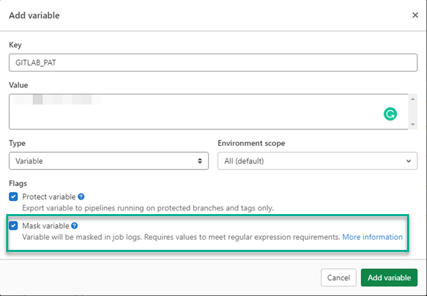

Build servers have traditionally been an on-premises tool, however, many organizations are making the decision to offload their builds to the cloud.  The big names such as Azure DevOps, Jenkins (CloudBees), and more recently, TeamCity, have created cloud versions of their popular build platforms.  Along with those, online-only technologies like AppVeyor, Travis CI, Circle CI, GitHub Actions, and GitLab have also increased in populatrity.  For the technologies where plugins or integrations have been developed, pushing build information is as simple as adding the task to the process.  Technologies where the only option is to integrate the Octopus CLI (runtime or container), it can be a little confusing how to get the commit information to show up.  In this post, I will demonstrate how to build the file needed to push the build information to Octopus Deploy.

## GitLab
For this post, I chose to use GitLab as the build server for no other reason than I hadn't used it before.  This post isn't going to focus on the building of an application using GitLab, rather the single task of generating [Build Information](https://octopus.com/docs/packaging-applications/build-servers/build-information) and uploading it to Octopus Depoloy.

### Variables
Before getting started on the build definition, we need to create some variables that we are going to be using in our process:
- GitLab Personal Access Token
- Octopus Deploy API Key
- Octopus Deploy Server URL
- Octopus Deploy Space Name

#### GitLab Personal Access Token
In order to gather the commits related to the build that we are executing, we need to make an API call to GitLab.  The API endpoint is protected and requires an Access Token in order to successfully call it.  

##### Creating a Personal Access Token
To create an Access Token, click on your profile in the upper right-hand corner and select **Edit profile**


Click on **Access Tokens** on the left-hand side.  Give your token a name and at least `read_api` permissions.  The `Expiration date` is optional, leaving it blank will create a token that will never expire.  Click the **Create personal access token** button.  When the token is displayed, make sure to store it in a safe place, this value will only be displayed once.


##### Create Variable for Personal Access Token
Now that we have the token, head back to the project and click **Settings** then **CI/CD**


Scroll to the Variables section and click **Expand**


Click the **Add variable** button and fill in the details.  For this example, I used `GITLAB_PAT` as the `key` and the token we generated above for the `value`.  Ensure that you tick the `Mask variable` option to ensure that the token doesn't get displayed in any messages during the build.



#### Octopus variables
Repeat the `Add variable` process from above for the Octopus variables.  This post assumes you're already framiliar with [creating an API key](https://octopus.com/docs/octopus-rest-api/how-to-create-an-api-key):
- Octopus Deploy API Key
- Octopus Deploy Server URL
- Octopus Deploy Space Name

### Build YAML
For GitLab, builds are defined using YAML in a special file, `.gitlab-ci.yml` located in the root of your repository.  Our process will consist of a `before_script` and two stages:
- build-information
- push-build-information

#### build-information
The build information stage will consist of constructing the file used for uploading build information.  I wanted to use PowerShell Core to build the file, which Ubuntu doesn't have by default.  Rather than installing PowerShell Core, I used the GitLab Docker runner functionality.  The image `mcr.microsoft.com/dotnet/core/sdk:3.1` comes with PowerShell Core installed.

```yaml
build-information:
    stage: build-information
    image: mcr.microsoft.com/dotnet/core/sdk:3.1
```

##### GitLab Commits API
The Commits API requires the access token that we created as a variable earlier.  This token will need to be provided as a Header to the API call in our process.  The variables are accessible by our code in the form of environment variables.  The variable `GITLAB_PAT` is the variable we created whereas the `CI_PROJECT_ID` is [predefined by GitLab](https://docs.gitlab.com/ee/ci/variables/predefined_variables.html).

```powershell
$headers = @{ "PRIVATE-TOKEN" = $env:GITLAB_PAT}
          
# Get commits from GitLab
$commits = (Invoke-RestMethod -Method Get -Uri "https://gitlab.com/api/v4/projects/$($env:CI_PROJECT_ID)/repository/commits?first_parent=true" -Headers $headers)
```

##### Build Information object
To store the build information, we create a PowerShell [Hashtable](https://docs.microsoft.com/en-us/powershell/scripting/learn/deep-dives/everything-about-hashtable) object.  The `Commits` portion is defined as an array within the Hashtable

```powershell
$jsonPayload = @{
    PackageId = "OctoPetShop.Web"
    Version = "1.0.21132.111113"
    Branch = $env:CI_COMMIT_BRANCH
    BuildUrl = $env:CI_JOB_URL
    BuildNumber = $env:CI_JOB_ID
    BuildEnvironment = "GitLabCI"
    VcsCommitNumber = $env:CI_COMMIT_SHA
    VcsType = "Git"
    VcsRoot = $env:CI_PROJECT_URL
    Commits = @()
}
```

Next we iterate through the results from commits API call and add them to the array

```powershell
foreach ($commit in $commits)
{
    $commitInfo = @{
        Id = $commit.id
        LinkUrl = $commit.web_url
        Comment = $commit.message
    }
    $jsonPayload.Commits += $commitInfo
}
```

Finally, we convert the PowerShell Hashtable to a JSON string and write it to a file.

```powershell
Add-Content -Path "BuildInformation.json" -Value "$($jsonPayload | ConvertTo-JSON -Depth 10)"
```

We need to include the file as an artifact that can be used later in the process.  This is done by including an `artifacts` component to the stage YAML.

```yaml
artifacts:
    paths: [ BuildInformation.json ]
```

#### push-build-information
Pushing the build information to Octopus consists of a single command in the script and will use the `BuildInformation.json` created in the previous stage.

```yaml
push-build-information:
    stage: push-build-information
    image: octopuslabs/gitlab-octocli
    script:
        - octo build-information --package-id=OctoPetShop.Web --version=1.0.21132.111113 --file=BuildInformation.json --server="$OCTOPUS_SERVER_URL" --apiKey="$OCTOPUS_API_KEY" --space="$OCTOPUS_SPACE_NAME"
```

#### .gitlab-ci.yml file
When complete, your YAML should look something like this

```yaml
image: ubuntu:latest

stages:
    - build-information
    - push-build-information

build-information:
    stage: build-information
    image: mcr.microsoft.com/dotnet/core/sdk:3.1
    script:
        - |
          pwsh -c '$headers = @{ "PRIVATE-TOKEN" = $env:GITLAB_PAT}
          
          # Get commits from GitLab
          $commits = (Invoke-RestMethod -Method Get -Uri "https://gitlab.com/api/v4/projects/$($env:CI_PROJECT_ID)/repository/commits?first_parent=true" -Headers $headers)

          # Create payload
          $jsonPayload = @{
            PackageId = "OctoPetShop.Web"
            Version = "1.0.21132.111113"
            Branch = $env:CI_COMMIT_BRANCH
            BuildUrl = $env:CI_JOB_URL
            BuildNumber = $env:CI_JOB_ID
            BuildEnvironment = "GitLabCI"
            VcsCommitNumber = $env:CI_COMMIT_SHA
            VcsType = "Git"
            VcsRoot = $env:CI_PROJECT_URL
            Commits = @()
          }

          # Loop through commits and add to collection
          foreach ($commit in $commits)
          {
            $commitInfo = @{
              Id = $commit.id
              LinkUrl = $commit.web_url
              Comment = $commit.message
            }
            $jsonPayload.Commits += $commitInfo
          }
          
          # Write information to file
          Add-Content -Path "BuildInformation.json" -Value "$($jsonPayload | ConvertTo-JSON -Depth 10)"'
    artifacts:
      paths: [ BuildInformation.json ]
      
push-build-information:
    stage: push-build-information
    image: octopuslabs/gitlab-octocli
    script:
        - octo build-information --package-id=OctoPetShop.Web --version=1.0.21132.111113 --file=BuildInformation.json --server="$OCTOPUS_SERVER_URL" --apiKey="$OCTOPUS_API_KEY" --space="$OCTOPUS_SPACE_NAME"
```
## Executing the build
When the build is triggered, you should see something like this (images show last part of log for brevity)

build-information


push-build-information


Navigating to the build information for OctoPetShop.Web in Octopus Deploy, we can see our build information has been uploaded.


## Conclusion
In this post, I demonstrated how to construct the file for build information and upload it using the Octopus Deploy CLI.

Happy Deployments!