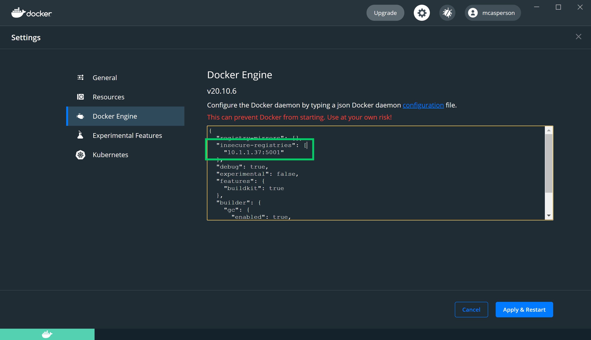
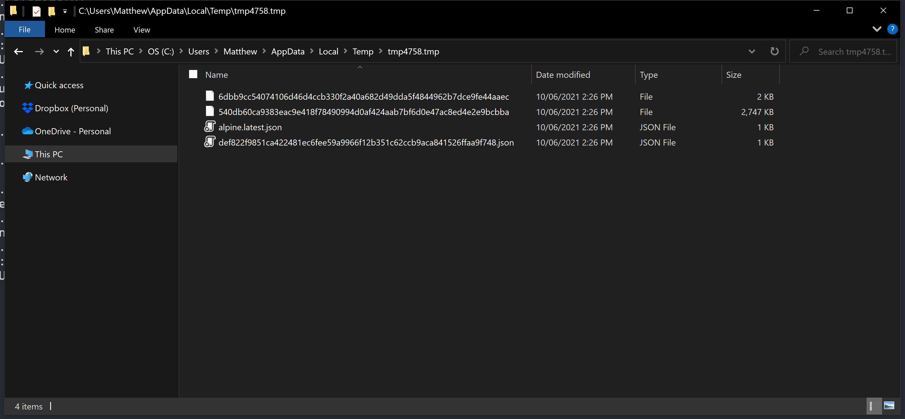

Do you wonder what happens when you do a `docker push` or `docker pull`? Behind the scenes, a repository, like Docker Hub, implementing the [Docker V2 HTTP API](https://docs.docker.com/registry/spec/api/) specification, is responding to these requests to receive or deliver Docker images. This specification is open for anyone to implement though, and you can learn much about Docker from a minimal docker registry implementation.

In this post, we create a C# server that successfully responds to the `docker push` or `docker pull` commands. In the process you get to see the individual components that make up a Docker image.

## Docker API for pushing and pulling images

These are the paths that our application must implement to support pushing and pulling images:

* GET `/v2`: Docker accesses this path to verify that the server supports version 2 of the Docker HTTP API.
* HEAD `{name}/blobs/{digest}`: This path is used to determine if the image layer exists on the server.
* GET `{name}/blobs/{digest}`: This path returns the layer once the client has determined it exists on the server.
* POST `{name}/blobs/uploads`: This path is called to initiate a layer upload.
* PATCH `{name}/blobs/uploads/{uuid}`: This path receives chunked layer uploads.
* PUT `{name}/blobs/uploads/{uuid}`: This path is called once a chunked layer upload has completed.
* HEAD `{name}/manifests/{reference}`: This path is called to determine if a manifest exists on the server.
* GET `{name}/manifests/{reference}`: This path returns a layer once the client has determined it exists on the server.
* PUT `{name}/manifests/{reference}`: This path creates a manifest on the server.

## Pushing an image

The process of pushing a Docker image is:

1. Contact `/v2` to confirm the server supports the correct API.
2. Perform a HEAD query on `{name}/blobs/{digest}`, where `name` is the image name like `alpine`, and `digest` is a hash of the layer.
3. If the layer does not exist, perform a POST to `{name}/blobs/uploads`. The response from this path includes a `Location` header in the format `{name}/blobs/uploads/{uuid}` where the layer upload is performed.
4. The layer is then uploaded, potentially as many small chunks, as PATCH requests to `{name}/blobs/uploads/{uuid}`. The data being sent is captured in the `Range` header, and the server is expected to incrementally populate the layer file with each incoming chunk.
5. When a layer is uploaded, a PUT call is made to `{name}/blobs/uploads/{uuid}`. This request includes a query parameter called `digest` whose value is the hash of the layer that was completed.
6. Once the layers are uploaded, a HEAD query on `{name}/manifests/{reference}` determines if the manifest already exists on the server.
7. If the manifest does not exist, a PUT request on `{name}/manifests/{reference}` creates it.

## Pulling an image

Pulling an image is easier than pushing one:

1. Contact `/v2` to confirm the server supports the correct API.
2. Perform a HEAD query on `{name}/manifests/{reference}` to determine if the manifest exists.
3. If the manifest exists, retrieve it with a GET request to `{name}/manifests/{reference}`.
4. For each image listed in the manifest, a HEAD query is performed on `{name}/blobs/{digest}` to verify it exists.
5. The image is then downloaded with a GET request to `{name}/blobs/{digest}`.

## The sample application

Our sample application isn't pretty, and you wouldn’t host production workloads with it. But it’s just functional enough to allow images to be pushed and pulled. This provides a great insight into what happens to Docker images behind the scenes.

The source code described here is available from [GitHub](https://github.com/OctopusSamples/DotNetCoreDockerRegistry).

Start with a controller that places all its methods under the `v2` root path. This root path is a hard requirement in the Docker spec. Some mixed artifact repositories expose a Docker registry on its own port to ensure this root path doesn't conflict with other APIs:

```csharp
namespace Controllers
{
    [Route("v2/")]
    public class DockerRegistry : ControllerBase
    {
```

Each time you start the application, create a new temporary directory to hold the Docker images and layers. This is great for testing, because you can restart the app and have an empty registry:

```csharp
        private static readonly string LayerPath;

        static DockerRegistry()
        {
            LayerPath = GetTemporaryDirectory();
            Console.Out.WriteLine($"Saving artifacts to {LayerPath}");
        }
        
        static string GetTemporaryDirectory()
        {
            var tempFolder = Path.GetTempFileName();
            System.IO.File.Delete(tempFolder);
            Directory.CreateDirectory(tempFolder);

            return tempFolder;
        }
```

This handler responds to GET requests on the `/v2` root path. You return a HTTP 200 OK response to let the client know you support the V2 API:

```csharp
        [HttpGet]
        public IActionResult Root(string path)
        {
            return Ok();
        }
```

Next, build up the handlers to allow images to be pushed to the server. You need to respond to a HEAD request, checking to see if an image already exists on the server. The `name` parameter is the image name (like `alpine`), and the `digest` parameter is a hash that identifies the layer, like `sha256:11ad9c3e3069bdb53ff873af66070ca6c4309e85581cf3befe05459f889fd729`.

Take a little shortcut here by saving layers as their SHA hash, minus the `sha256:` prefix. If the file exists, return 200 OK, with the `content-length` header indicating the size of the image. If the layer doesn't exist, return 404 NOT FOUND:

```csharp
        [HttpHead("{name}/blobs/{digest}")]
        public IActionResult Exists(string name, string digest)
        {
            var hash = digest.Split(":").Last();

            if (System.IO.File.Exists(LayerPath + "/" + hash))
            {
                Response.Headers.Add("content-length", new FileInfo(LayerPath + "/" + hash).Length.ToString());
                Response.Headers.Add("docker-content-digest", digest);
                return Ok();
            }

            return NotFound();
        }
```

If the layer does not exist, the client initiates an upload with this POST request. The response includes a `location` header with a unique URL that the actual layer data is sent to:

```csharp
        [HttpPost("{name}/blobs/uploads")]
        public IActionResult StartUpload(string name)
        {
            var guid = Guid.NewGuid().ToString();
            Response.Headers.Add("location", "/v2/" + name + "/blobs/uploads/" + guid);
            Response.Headers.Add("range", "0-0");
            Response.Headers.Add("content-length", "0");
            Response.Headers.Add("docker-upload-uuid", guid);
            return Accepted();
        }
```

Docker supports both [monolithic](https://docs.docker.com/registry/spec/api/#monolithic-upload) and [chunked](https://docs.docker.com/registry/spec/api/#chunked-upload) uploads. This handler supports the chunked upload method (the sample application doesn't support monolithic uploads).

The client may or may not supply a `content-range` header indicating the chunk that is being uploaded. Often the entire layer is uploaded as a single chunk, and no `content-range` header is provided.

In this method, you save the body of the request to a file with the random GUID that was generated in the `StartUpload` method:

```csharp
        [DisableRequestSizeLimit] 
        [HttpPatch("{name}/blobs/uploads/{uuid}")]
        public async Task<IActionResult> Upload(string name, string uuid)
        {
            var start = Request.Headers["content-range"].FirstOrDefault()?.Split("-")[0] ?? "0";
            await using (var fs = System.IO.File.OpenWrite(LayerPath + "/" + uuid))
            {
                fs.Seek(long.Parse(start), SeekOrigin.Begin);
                await Request.Body.CopyToAsync(fs);
                
                Response.Headers["range"] = "0-" + (fs.Position - 1);
            }
            
            Response.Headers["docker-upload-uuid"] = uuid;
            Response.Headers["location"] = $"/v2/{name}/blobs/uploads/{uuid}";
            Response.Headers["content-length"] = "0";
            Response.Headers["docker-distribution-api-version"] = "registry/2.0";
            return Accepted();
        }
```

After the layer is uploaded, this method is called to signify the upload completion. [The spec mentions that this method may be called with the final content chunk to be saved to the layer](https://docs.docker.com/registry/spec/api/#completed-upload), so you need to append anything in the PUT body to the layer file.

Now use the hash from the `digest` query parameter to rename the file from the temporary GUID to the hash:

```csharp
        [HttpPut("{name}/blobs/uploads/{uuid}")]
        public async Task<IActionResult> FinishUpload(string name, string uuid)
        {
            if (Request.Headers["content-length"].First() != "0")
            {
                var ranges = Request.Headers["content-range"].First().Split("-");
                await using var fs = System.IO.File.OpenWrite(LayerPath + "/" + uuid);
                fs.Seek(long.Parse(ranges[0]), SeekOrigin.Begin);
                await Request.Body.CopyToAsync(fs);
            }

            var rawDigest = Request.Query["digest"];
            var digest = Request.Query["digest"].First().Split(":").Last();
            System.IO.File.Move(LayerPath + "/" + uuid, LayerPath + "/" + digest);
            Response.Headers.Add("content-length", "0");
            Response.Headers.Add("docker-content-digest", rawDigest);

            return Created("/v2/" + name + "/blobs/" + digest, "");
        }
```

After the layers are uploaded, the manifest (which you can think of as the Docker image) is created. First, the client makes a HEAD request to see if the manifest exists.

One quirk here is that the `reference` could either be a tag name like `latest`, or a hash. For convenience, save manifests in two locations:

- One based on the tag name
- One based on the hash 

This isn't efficient but it's an easy solution for your sample application:

```csharp
        [HttpHead("{name}/manifests/{reference}")]
        public IActionResult ManifestExists(string name, string reference)
        {
            var hash = reference.Split(":").Last();
            var path = LayerPath + "/" + name + "." + reference + ".json";
            var hashPath = LayerPath + "/" + hash + ".json";
            var testedPath = System.IO.File.Exists(path) ? path :
                System.IO.File.Exists(hashPath) ? hashPath :
                null;

            if (testedPath != null)
            {
                Response.Headers.Add("docker-content-digest", "sha256:" + Sha256Hash(path));
                Response.Headers.Add("content-length", new FileInfo(path).Length.ToString());

                var content = System.IO.File.ReadAllText(path);
                var mediaType = JObject.Parse(content)["mediaType"].ToString();

                Response.Headers.Add("content-type", mediaType);

                return Ok();
            }

            return NotFound();
        }
```

If the manifest doesn't exist, save it with a PUT request to this method. Again note you have to save the manifest in two places: 

- One with the tag in the filename
- The other with the hash in the filename:

```csharp
        [HttpPut("{name}/manifests/{reference}")]
        public async Task<IActionResult> SaveManifest(string name, string reference)
        {
            var path = LayerPath + "/" + name + "." + reference + ".json";

            await using (var fs = System.IO.File.OpenWrite(path))
            {
                await Request.Body.CopyToAsync(fs);
            }
            
            var hash = Sha256Hash(path);
            Response.Headers.Add("docker-content-digest", "sha256:" + hash);

            System.IO.File.Copy(path, LayerPath + "/" + hash + ".json", true);

            return Created($"/v2/{name}/manifests/{reference}", null);
        }
```

These endpoints allow you to complete a `docker push` command. 

Pulling an image requires two more methods.

The first returns the layer data with a GET request to the following method:

```csharp
        [HttpGet("{name}/blobs/{digest}")]
        public async Task<IActionResult> GetLayer(string name, string digest)
        {
            var hash = digest.Split(":").Last();
            var path = LayerPath + "/" + hash;

            if (System.IO.File.Exists(LayerPath + "/" + hash))
            {
                Response.Headers.Add("content-length", new FileInfo(path).Length.ToString());
                await using (var fs = new FileStream(path, FileMode.Open))
                {
                    await fs.CopyToAsync(Response.Body);
                    return Ok();
                }
            }

            return NotFound();
        }
```

The manifest data is returned with a GET request to the following method. Just as with the HEAD request, you need to search for a manifest file based on the tag name or hash code, as `reference` could be either value.

Note here you load the manifest file, parse it as JSON, and extract the `mediaType` property. This is sent back to the client as the `content-type` header:

```csharp
        [HttpGet("{name}/manifests/{reference}")]
        public async Task<IActionResult> GetManifest(string name, string reference)
        {
            var hash = reference.Split(":").Last();
            var path = LayerPath + "/" + name + "." + reference + ".json";
            var hashPath = LayerPath + "/" + hash + ".json";
            var testedPath = System.IO.File.Exists(path) ? path :
                System.IO.File.Exists(hashPath) ? hashPath :
                null;

            if (testedPath != null)
            {
                Response.Headers.Add("docker-content-digest", "sha256:" + Sha256Hash(testedPath));

                var content = System.IO.File.ReadAllText(testedPath);
                var mediaType = JObject.Parse(content)["mediaType"].ToString();

                Response.Headers.Add("content-type", mediaType);
                Response.Headers.Add("content-length", new FileInfo(testedPath).Length.ToString());

                await using (var fs = new FileStream(testedPath, FileMode.Open))
                {
                    await fs.CopyToAsync(Response.Body);
                }

                return Ok();
            }

            return NotFound();
        }
```

And with that you have all the endpoints required to support pulling images.

## Testing the server

The web app has been configured via the `launchSettings.json` file to listen to all IP addresses. Here is the trimmed down file showing the `applicationUrl` setting, which has been configured to listen to `0.0.0.0`, meaning the app responds to requests on all IP addresses.

I found this necessary in testing as pushing to `localhost` didn't work on Windows based machines, and so instead I had to push to the machines local IP address:

```
{
...

  "profiles": {
    
    ...
    
    "dockerregistry": {
      "applicationUrl": "https://0.0.0.0:5002;http://0.0.0.0:5001",
    }
  }
}
```

By default Docker attempts to contact all external repositories via HTTPS. The web app has a self signed certificate, so for testing you want Docker to use HTTP.

My laptop has an IP address of 10.1.1.37. To instruct Docker to access the registry via your IP, you need to edit the `insecure-registries` array in the Docker configuration file:



Run the app with:

```powershell
dotnet run
```

The temporary directory holding our artifacts displays in the console:

```powershell
$ dotnet run
Building...
info: Microsoft.Hosting.Lifetime[0]
      Now listening on: https://0.0.0.0:5002
info: Microsoft.Hosting.Lifetime[0]
      Now listening on: http://0.0.0.0:5001
info: Microsoft.Hosting.Lifetime[0]
      Application started. Press Ctrl+C to shut down.
info: Microsoft.Hosting.Lifetime[0]
      Hosting environment: Development
info: Microsoft.Hosting.Lifetime[0]
      Content root path: C:\Users\Matthew\Octopus\dockerregistry
Saving artifacts to C:\Users\Matthew\AppData\Local\Temp\tmp5E8E.tmp
```

Download a Docker image and retag it against the local repository:

```powershell
$ docker pull alpine
$ docker tag alpine 10.1.1.37:5001/alpine
```

Then push the image to the local server:

```powershell
$ docker push 10.1.1.37:5001/alpine
```

Four files are created in the temporary directory: two image layers, and the manifest saved with the tag and with the hash:



Now delete the images from your local PC. This ensures any downloads of this image cannot reuse your previous cached images:

```
$ docker image rm 10.1.1.37:5001/alpine
$ docker image rm alpine
```

Download the image from your server with the command:

```
$ docker pull 10.1.1.37:5001/alpine
```

You have now pushed and pulled images from your minimal Docker repository. There is still functionality missing, such as deleting images and searching, but we'll leave our implementation here. 

## Conclusion

Docker is central to many development workflows, but interestingly there isn't much information on how to implement the Docker API. The [official documentation](https://docs.docker.com/registry/spec/api/#monolithic-upload) is a little dense (as specs usually are), so in this post we looked at a very minimal implementation that allowed Docker images to be pushed and pulled using the regular Docker client.

Hopefully this demystifies some of the process around transferring Docker images, and is a useful starting point if you're looking to integrate your own applications with the Docker client.

Happy deployments!
