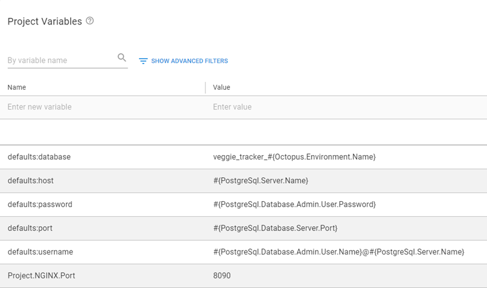
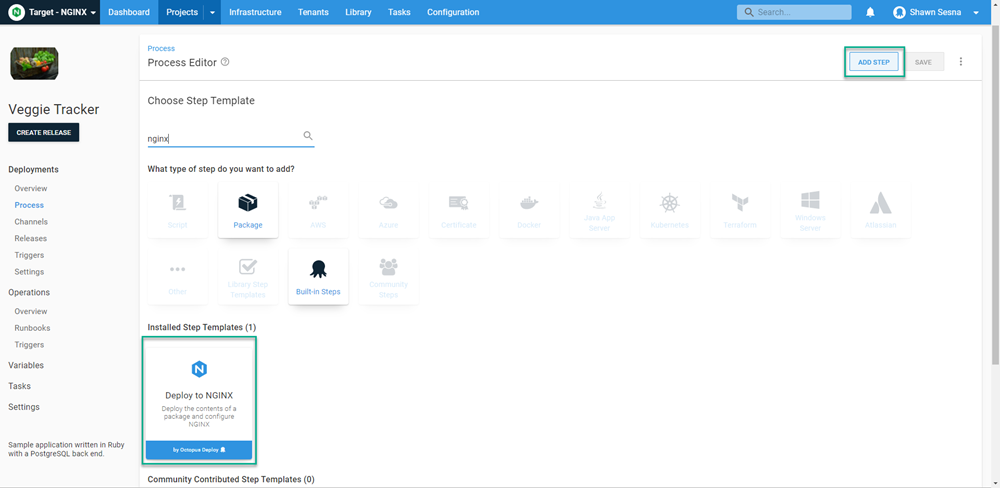
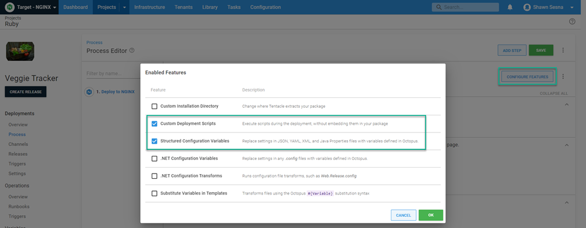
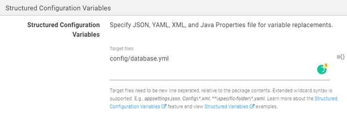
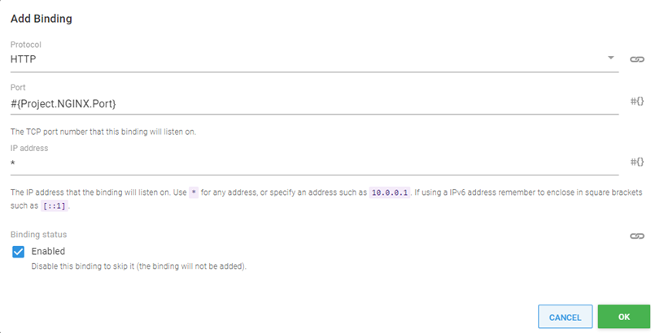
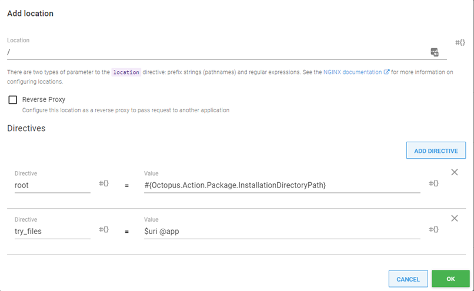
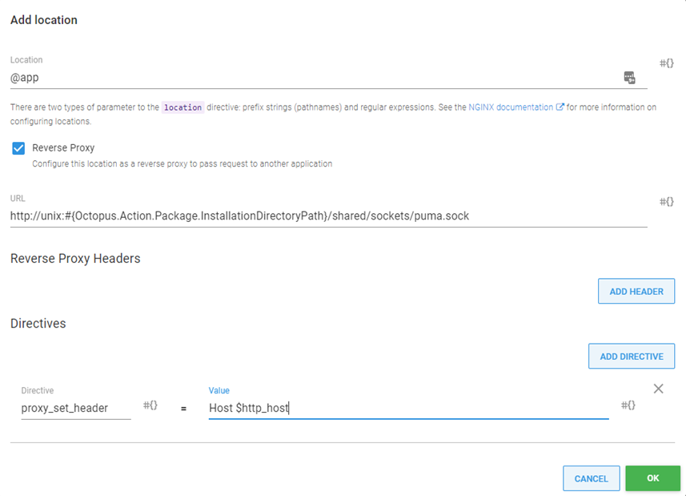
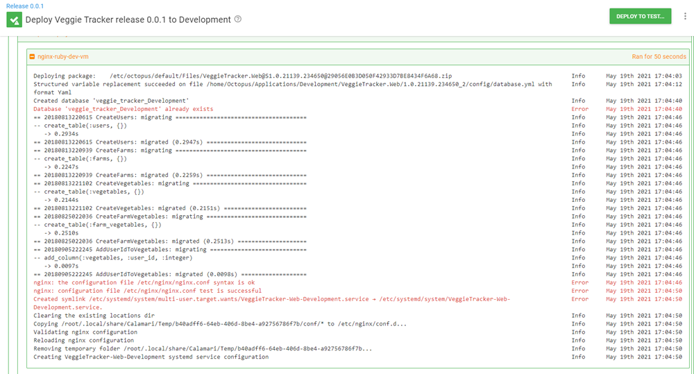
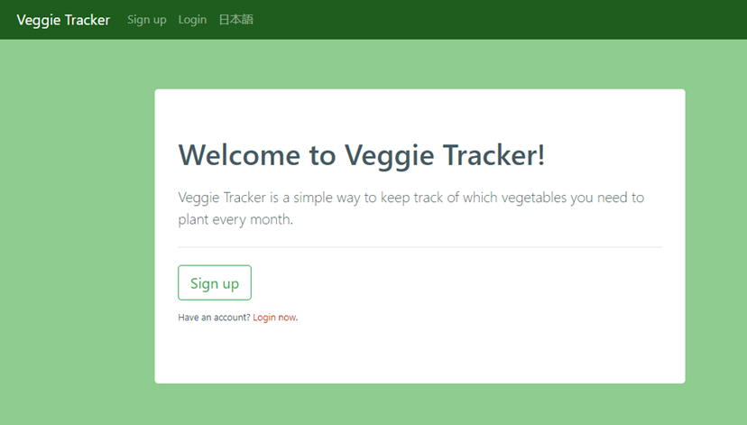

Twitter, Airbnb, Shopify, and GitHub are big names in the tech industry.  Along with being instantly recognizable, they have something else in common; they're all written in Ruby.  

In this post, I demonstrate how to deploy a web application written in Ruby, including database migrations, using Octopus Deploy.

## Sample application

For this post, I'm using the [Veggie Tracker](https://github.com/morinoko/veggie_tracker) sample application.  

This sample includes the web application and the code for creating a database and performing database migrations.  With some modifications to the project, I had this application running fairly quickly in my local environment (see [GitHub](https://github.com/OctopusSamples/VeggieTracker) for the modified version).

### Ruby Application servers and Web servers
With Ruby, it's important to understand the distinction between an **App Server** and a **Web Server**.  

An App Server runs the Ruby application, and usually works without having a Web Server in front of it.  The disadvantage to this approach is that the App Server can only serve the application it's running, versus being able to handle multiple applications like a Web Server.  

In addition, App Servers typically don't handle things like request compression or SSL/TLS.  For this reason, the most typical configuration for Ruby web applications is to have something like an Apache or NGINX Web Server in front of the App Server.

### Selecting an App Server
When developing in the Ruby language, you have many application servers to choose from, e.g. Unicorn, Thin, Puma, Passenger, etc.  

The original application server for the Veggie Tracker application is called **Shotgun**.  The README of the project states that you simply need to run `Shotgun` from the command-line to get the application running on your local machine.  This works if you're developing on Linux.
  
Although my server is Linux, my development machine is Windows, so I need something that works for both Windows and Linux. The **Puma** application server is both Linux and Windows compatible.  Switching to **Puma** is as simple as removing Shotgun from the Gemfile and adding `Puma`.

#### Configuring Puma for use with sockets
For this post, I want Puma to use sockets instead of another port on the server.  To configure Puma to use sockets, you need to create a `puma.rb` file in the `config` subfolder with the following contents:

```Ruby
# Change to match your CPU core count
#workers 2

# Min and Max threads per worker
threads 1, 6

app_dir = File.expand_path("../..", __FILE__)
shared_dir = "#{app_dir}/shared"

# Default to production
rails_env = ENV['RAILS_ENV'] || "production"
environment rails_env

# Set up socket location
bind "unix://#{shared_dir}/sockets/puma.sock"

# Logging
stdout_redirect "#{shared_dir}/logs/puma.stdout.log", "#{shared_dir}/logs/puma.stderr.log", true

# Set master PID and state locations
pidfile "#{shared_dir}/pids/puma.pid"
state_path "#{shared_dir}/pids/puma.state"
activate_control_app

on_worker_boot do
  require "active_record"
  ActiveRecord::Base.connection.disconnect! rescue ActiveRecord::ConnectionNotEstablished
  ActiveRecord::Base.establish_connection(YAML.load_file("#{app_dir}/config/database.yml")[rails_env])
end
```
:::hint
The above code is configured to work with the Linux NGINX server that it was going to be deployed to.  Remove this file to run it locally on Windows.
:::

#### Configuring database.yml
The original application is configured to use **SqlLite** as the database, however, it can easily be modified to use something like **Postgres**.  There are two modifications to achieve this: 

**1.** Add the reference to the Postgres gem in the `Gemfile`:

```Ruby
gem 'pg'
```

**2.** Create a `database.yml` file in the `config` folder:

```yaml
# If you want to change this file, please keep the changes in your working
# copy by using
#
#     git update-index --skip-worktree config/database.yml
#
# or just use DATABASE_URL, in which case Rails will happily skip the whole
# file.
#
# See https://github.com/coopdevs/timeoverflow/wiki/Keeping-your-local-files
# for more information
#

defaults: &defaults
  adapter: postgresql
  username: 'postgres'  # default is null
  database: 'veggietracker'
  password: 'mypassword'
  host: 'my posgresl server'
  port: 5432

development:
  <<: *defaults
  

test:
  <<: *defaults
  

staging:
  <<: *defaults
  
production:
  <<: *defaults
```
The `database.yml` file allows you to override the connection properties based on the defined environment.  For this post, however, I configured the `database.yml` file to inherit everything from the `defaults` as I will be using the [Structured configuration variables](https://octopus.com/docs/projects/steps/configuration-features/structured-configuration-variables-feature) feature in Octopus Deploy.

## Building your Ruby application
As Ruby is a scripting language, there's no need to build the application.  However, there are distinct advantages to using a build server with a Ruby application:

- Gathering all dependent gems for application execution
- Using the build server Octopus Deploy plugin or integration for ease of integration, such as:
  - Packing the application
  - Pushing the package to the Octopus Deploy server or third-party package solution (Nexus, Artifactory, etc.)
  - Pushing build information to Octopus Deploy
  - Creating the release
  - Deploying and or promoting releases

For this post, I'm using GitHub Actions as the build server.  Below is the YAML which does the following:

- Configures GitHub Actions to use Ruby
- Sets the package version number
- Installs dependent Gems, placing the Gems in the **vendor** subfolder -  this allows the application to contain all the dependencies it needs without installing Gems directly on the server
- Configures GitHub Actions to use the Octopus CLI
- Creates an artifacts folder
- Packages the VeggieTracker application and places the archive in the artifacts folder
- Pushes the VeggieTracker artifact to the Octopus Deploy server

```yaml
# This is a basic workflow to help you get started with Actions

name: CI

# Controls when the action will run. 
on:
  # Triggers the workflow on push or pull request events but only for the main branch
  push:
    branches: [ main ]
  pull_request:
    branches: [ main ]

  # Allows you to run this workflow manually from the Actions tab
  workflow_dispatch:

# A workflow run is made up of one or more jobs that can run sequentially or in parallel
jobs:
  # This workflow contains a single job called "build"
  build:
    # The type of runner that the job will run on
    runs-on: ubuntu-latest

    # Steps represent a sequence of tasks that will be executed as part of the job
    steps:
      # Checks-out your repository under $GITHUB_WORKSPACE, so your job can access it
      - uses: actions/checkout@v2
      
      - name: Setup Ruby
        uses: ruby/setup-ruby@v1
        with:
          ruby-version: 2.6

      # Set the build version number
      - name: Set Version
        run: echo "PACKAGE_VERSION=$(date +'%Y.%m.%d').$GITHUB_RUN_NUMBER" >> $GITHUB_ENV

      - name: Install dependencies
        run: |
          # Set the default gem installation path to a directory alongside the Ruby application code.
          # This allows the dependencies to be packaged with the application.
          export WORKSPACE="$(pwd)"
          export GEM_HOME="$WORKSPACE/vendor"
          export GEM_PATH="$WORKSPACE/vendor"
          export PATH="$PATH:$WORKSPACE/vendor/bin"

          # Install the specific version of Bundler defined in the Gemfile.lock file
          gem install bundler -v "$(grep -A 1 "BUNDLED WITH" Gemfile.lock | tail -n 1)"

          # Use bundler to install the other dependencies
          bundle install

      # Install Octopus action
      - name: Install Octopus CLI
        uses: OctopusDeploy/install-octopus-cli-action@v1.1.1
        with:
          version: latest

      # Create artifacts folder
      - name: Create artifacts folder
        run: mkdir "$GITHUB_WORKSPACE/artifacts"

      # Package VeggieTracker.Web
      - name: Package Flyway
        run: |
          octo pack --id="VeggieTracker.Web" --format="Zip" --version="$PACKAGE_VERSION" --basePath="$GITHUB_WORKSPACE" --outFolder="$GITHUB_WORKSPACE/artifacts"

      # Push packages to octopus deploy
      - name: Push packages to Octopus
        run: |
          octo push --package="$GITHUB_WORKSPACE/artifacts/VeggieTracker.Web.$PACKAGE_VERSION.zip" --server="${{ secrets.OCTOPUS_SERVER_URL }}" --apiKey="${{ secrets.OCTOPUS_API_KEY }}" --space="${{ secrets.OCTOPUS_SERVER_SPACE }}"      
```

With our build complete, we can focus on creating the deployment in Octopus Deploy.

## Deploying VeggieTracker with Octopus Deploy
This post assumes you're familiar with creating projects with Octopus Deploy.  

The deployment process for the Veggie Tracker application consists of a single step with multiple components, which I cover later.

### Variables
Before we define our process, let's create variables to use in our deployment:

- `Project.NGINX.Port` - Port NGINX will listen on.
- `defaults:database` - Name of the database for the VeggieTracker application.
- `defaults:host` - Hostname or IP address of the PostgreSQL server.
- `defaults:password` - Password for the user account for PostgreSQL.
- `defaults:port` - Port number the PostgreSQL server is listening on.
- `defaults:username` - Username for the account on the PostgreSQL server.



:::hint
The variables that begin with `defaults:` are the ones used with the **Structured Configuration Variables** feature.
:::

### Process
Add a **Deploy to NGINX** step.



Enable the **Custom Deployment Scripts** and **Structured Configuration Variables** features by clicking the **CONFIGURE FEATURES** button.



#### Package Details
Under the **Package Details** section, choose the VeggieTracker.Web package.


#### Custom Deployment Scripts
We'll run two scripts as part of the deployment process.

##### Deployment Scripts
A popular method for Ruby application database updates is defining the database updates in code.  The Veggie Tracker application includes a folder called **db** which defines the database structure using code.  

To perform both the database creation and migrations, place the following code in the **Deployment script** window. Be sure to select **Bash** as the language to use.

```bash
# Ensure the bin files are executable
sudo chmod +x -R "#{Octopus.Action[Deploy to Nginx].Output.Package.InstallationDirectoryPath}/vendor/bin"

# Set variables
ROOTDIR=#{Octopus.Action[Deploy to Nginx].Output.Package.InstallationDirectoryPath | Replace "%" "%%"}
export GEM_HOME="${ROOTDIR}/vendor"
export GEM_PATH="${ROOTDIR}/vendor"

# Install platform specific gems
gem install bcrypt
gem install bond
gem install nio4r
gem install pg
gem install puma

# Run database migrations
${ROOTDIR}/vendor/bin/rake db:create
${ROOTDIR}/vendor/bin/rake db:migrate
```
:::hint
This script installs some Ruby Gems.  This is required because GitHub Actions uses an Ubuntu based container to perform the build.  The platform for this is identified as `x86_64-linux` whereas an Ubuntu VM is identified as `x86_64-linux-gnu`.  Though similar, the compiler makes different binaries which are incompatible.  

The Gems this affects are identified in the build log with `Installing X with native extensions`, and those need to be built again on the target platform.
:::

##### Post-deployment script
The NGINX step configures NGINX to serve the Puma Ruby App Server, but we need something to start Puma, especially after a reboot.  

The following script configures the Puma App server to start as a Linux Service:

```bash
SYSTEMD_CONF=/etc/systemd/system
SERVICE_USER=$(whoami)
ENVIRONMENT=#{Octopus.Environment.Name}

# This is used to generate the systemd filename, so we remove any chars that might be problematic for filenames
APPNAME=#{Octopus.Action[Deploy to Nginx].Package.PackageId | Replace "[^a-zA-Z0-9]" -}-#{Octopus.Environment.Name}
# This path is referenced by the systemd service in multiple places, and systemd treats the % char as special,
# so it is escaped with a second % char
ROOTDIR=#{Octopus.Action[Deploy to Nginx].Output.Package.InstallationDirectoryPath | Replace "%" "%%"}
SYSTEMD_SERVICE_FILE=${SYSTEMD_CONF}/${APPNAME}.service

# Application systemd service configuration
echo "Creating ${APPNAME} systemd service configuration"
cat > "${APPNAME}.service" <<-EOF
[Unit]
Description=${APPNAME} service
After=network.target

[Service]
# Expose the gems that were bundled up with the application package
Environment="GEM_PATH=${ROOTDIR}/vendor"
Environment="GEM_HOME=${ROOTDIR}/vendor"
Environment="PATH=${PATH}:${ROOTDIR}/vendor/bin"
WorkingDirectory=${ROOTDIR}
User=${SERVICE_USER}
Group=${SERVICE_USER}
#ExecStart=${ROOTDIR}/vendor/bin/puma -C ${ROOTDIR}/config/puma.rb #-e ${ENVIRONMENT}
ExecStart=${ROOTDIR}/vendor/bin/puma
Restart=always
RestartSec=10
SyslogIdentifier=${APPNAME}
[Install]
WantedBy=multi-user.target
EOF
sudo mv "${APPNAME}.service" ${SYSTEMD_CONF}/${APPNAME}.service

# Ensure the bin files are executable
chmod +x -R "#{Octopus.Action[Deploy to Nginx].Output.Package.InstallationDirectoryPath}/vendor/bin"

# Any changes to a system file are picked up by reloading the systemd daemon
sudo systemctl daemon-reload
# Enable the service so it starts on boot
sudo systemctl enable "${APPNAME}.service"
# Start or restart the service to pick up any changes
sudo systemctl restart "${APPNAME}.service"
```
#### Structured Configuration Variables
We'll use the **Structured Configuration Variables** feature to replace the values in the `database.yml` so that we connect to the database server.  This file is located in the `config` folder of our application.  

For **Target files**, enter `config/database.yml`.



#### NGINX Web Server
Now we define items such as bindings and locations for NGINX.

##### Bindings
Remove the default binding and replace it with the port variable configured in our Project variables.



##### Locations
There are two locations to define for our application.  Both locations have some directives that will also be applied.  Click **ADD LOCATION** to get started.

###### Location /
The first location is `/` and needs two directives.  

Click the **ADD DIRECTIVE** button and enter the following:

- Directive: `root`
- Value: `#{Octopus.Action.Package.InstallationDirectoryPath}`

- Directive: `try_files`
- Value: `$uri @app`



###### Location @app
The second location is `@app`.  This location needs to be configured as a Reverse Proxy to `http://unix:#{Octopus.Action.Package.InstallationDirectoryPath}/shared/sockets/puma.sock` with a single directive.

- Directive: `proxy_set_header`
- Value: `Host $http_host`



After the locations are complete, we're finished with the deployment process. You can create a release and deploy.



:::info
Some programs on Linux write information messages to the stderr stream. Octopus interprets these as possible errors and displays them in red.  It's normal to see messages like this.
:::

Opening our browser, we can see the deployed application in action.



## Conclusion
In this post I demonstrated how to deploy a web application written in Ruby to an NGINX web server, including the database migration.  

Happy deployments!
