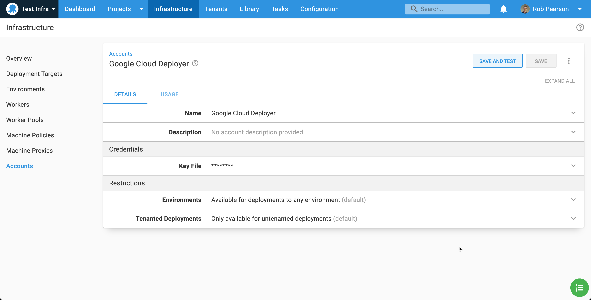
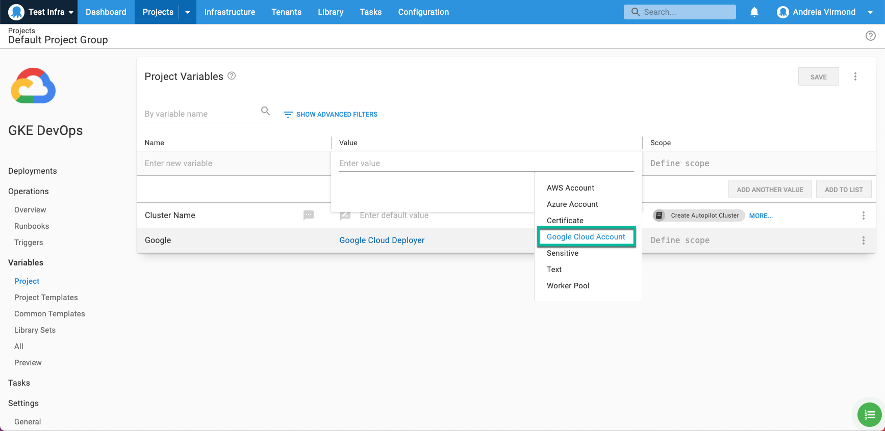
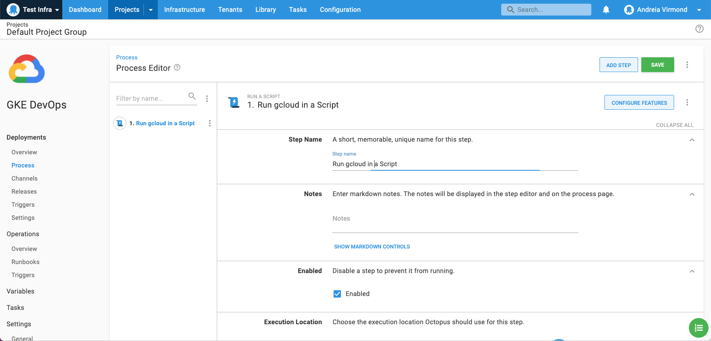
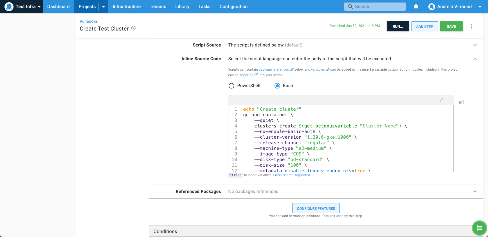

We're excited to introduce first-class support for Google Cloud Platform (GCP) as we continuously roll out cloud and on-premise improvements inline with our [public roadmap](https://octopus.com/company/roadmap).

This fresh addition means that Octopus now offers native support to the three major cloud providers ([AWS](https://aws.amazon.com), [Azure](https://azure.microsoft.com/), and now GCP(https://cloud.google.com/)), meeting the evolving needs of our customers, particularly those who have GCP Kubernetes (K8s) clusters and are running tentacles on GCP VMs. 

This native integration of Octopus with GCP will allow you to:
* Connect and authenticate with GCP via a dedicated account type. This allows you to centralise and secure your GCP authentication and use it in your deployment and runbooks.
* Use [gcloud](https://cloud.google.com/sdk/gcloud), the GCP command-line tool, out-of-the-box in custom scripts.
* Create and tear down GCP infrastructure with [Terraform](https://www.terraform.io/).
* Store and secure your Docker images within the [Google Container Registry (GCR)](https://cloud.google.com/container-registry).
* Deploy, scale and manage containerized applications on GCP with Octopus and Kubernetes.

GCP integration is available in Octopus Deploy 2021.2 and newer. Octopus cloud customers are already running this version and on-prem customers can [download it now](https://octopus.com/downloads).


## Walk through

To see this new integration in action, we'll walk through how to add a new Google Cloud account in Octopus and run a `gcloud` script to create a new Kubernetes cluster.

### Google Cloud accounts



To integrate with GCP, we need to first define a Google Cloud account in Octopus. This is done in the {{ Infrastructure, Accounts }} area along side any AWS or Azure accounts you already have. Octopus manages the GCP credentials used by the Google Cloud steps. This means you don't need to worry about authentication within a deployment process or runbook and you can run pre-authenticated `gcloud` scripts.

The Google Cloud account is secured by the JSON credentials key file that can be retrieved from the service account assigned to the instance that is executing the deployment.

Learn more about [creating a Google Cloud account](https://octopus.com/docs/infrastructure/accounts/google-cloud) and see the [Google cloud documentation](https://cloud.google.com/iam/docs/creating-managing-service-account-keys) for instructions to create a service account and download the key file.

### Google Cloud account variable



Once you have created Google Cloud accounts, they can be accessed in a project through a [project variable](https://octopus.com/docs/projects/variables) of the type Google Cloud account. 

Learn more about setting up [Google Cloud account variables](https://octopus.com/docs/projects/variables/google-cloud-account-variables).

**Running gcloud scripts**

Octopus Deploy can help you run scripts on targets with the Google Cloud platform. In this example, we'll explore the process of creating a new Kubernetes Cluster.

These scripts typically rely on tools being available on the target workers, however there are a few options to get started quickly. If you're Octopus Cloud, the built-in workers have `gcloud` pre-installed. Another option is to use the Octopus [`worker-tools`](https://hub.docker.com/r/octopusdeploy/worker-tools) Docker image with [execution containers for workers](https://octopus.com/docs/projects/steps/execution-containers-for-workers). That said, we recommend that you provision your own tools on your worker.  This gives you control over tool versions, and it can ensure their compatibility with the scripts you are trying to execute.

:::hint
Workers move deployment work off the Octopus Server and onto other machines running in worker pools. Octopus Cloud uses them to execute custom scripts and they're also commonly used to run deployment work and runbook scripts for cloud platforms and database deployments.

Learn more about [Workers](https://octopus.com/docs/infrastructure/workers) and [Worker pools](https://octopus.com/docs/infrastructure/workers/worker-pools).
:::

When executing a script against GCP, Octopus Deploy will automatically use your provided Google Cloud account details to authenticate you to the target instance, or you can choose to use the service account associated with the target instance.



In this example, we will add a new [runbook] process to create a new Kubernetes cluster using the `gcloud` command line interface. To do this, add a *Run gcloud in a Script* step to our automated process with a `gcloud container clusters create` command. 



The full script looks something like the following but you would need to update it to match your needs.

```sh
echo "Create cluster"
gcloud container \
	--quiet \
    clusters create $(get_octopusvariable "Cluster Name") \
    --no-enable-basic-auth \
    --cluster-version "1.20.6-gke.1000" \
    --release-channel "regular" \
    --machine-type "e2-medium" \
    --image-type "COS" \
    --disk-type "pd-standard" \
    --disk-size "100" \
    --metadata disable-legacy-endpoints=true \
    --scopes "https://www.googleapis.com/auth/devstorage.read_only","https://www.googleapis.com/auth/logging.write","https://www.googleapis.com/auth/monitoring","https://www.googleapis.com/auth/servicecontrol","https://www.googleapis.com/auth/service.management.readonly","https://www.googleapis.com/auth/trace.append" \
    --num-nodes "3" \
    --enable-stackdriver-kubernetes \
    --enable-ip-alias \
    --network "projects/<your project>/global/networks/default" \
    --subnetwork "projects/<your project>/regions/australia-southeast1/subnetworks/default" \
    --default-max-pods-per-node "110" \
    --no-enable-master-authorized-networks \
    --addons HorizontalPodAutoscaling,HttpLoadBalancing,GcePersistentDiskCsiDriver \
    --enable-autoupgrade \
    --enable-autorepair \
    --max-surge-upgrade 1 \
    --max-unavailable-upgrade 0 \
    --enable-shielded-nodes
```

## **Conclusion**

We hope you’ll enjoy the ability to deploy infrastructure to GCP. 

Give it a try and let us know what you think! If you have any questions or comments, we’d love to hear them. Please enter them below or join the conversation in the [Octopus community Slack](https://octopus.com/slack).

Happy deployments!
