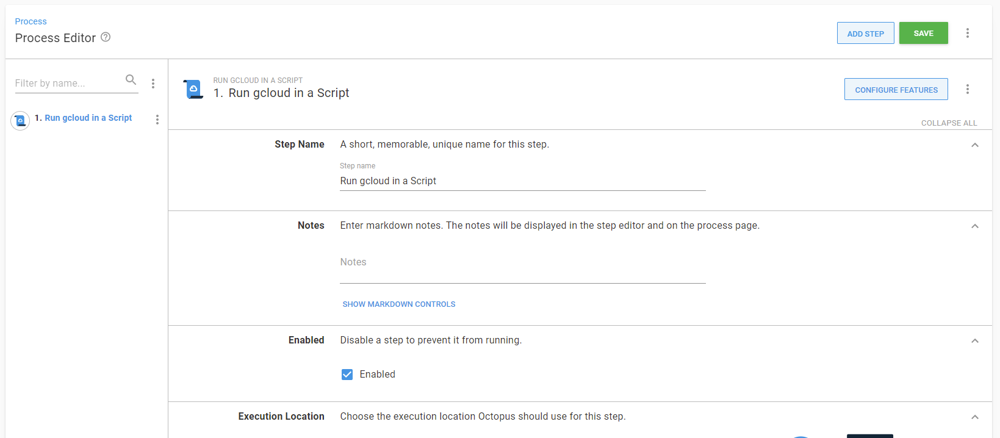

In line with our [public roadmap](https://octopus.com/company/roadmap), we’re continuously rolling out new cloud and on-premise improvements, and we’re excited to introduce first-class support for Google Cloud Platform (GCP).

This fresh addition means that Octopus now offers native support to the three major cloud providers (AWS, Azure, and now GCP), meeting the evolving needs of our customers, particularly those who have GCP Kubernetes (K8s) clusters and are running tentacles on GCP VMs. 

This native integration of Octopus with GCP will allow you to:
* Connect and authenticate with GCP via a dedicated account type. This allows you to centralise and secure your GCP authentication and use it in your deployment and runbooks.
* Use gcloud, the GCP command-line tool, out-of-the-box.
* Create and tear down GCP infrastructure with Terraform.
* Store and secure your Docker images within the Google Container Registry (GCR).
* Deploy, scale and manage containerized applications on GCP with Octopus and Kubernetes.

GCP integration is available in Octopus Deploy 2021.2 and newer. Octopus cloud customers are already running this version and on-prem customers can [download it now](https://octopus.com/downloads).

## **Walk through**

To see this new integration in action, we'll walk through how to add a new Google Cloud account in Octopus and run a `gcloud` script to create a new Kubernetes cluster.

**Google Cloud accounts**

To integrate with GCP, we need to first define a Google Cloud account in Octopus. This is done in the {{Infrastructure, Accounts} area along side any AWS or Azure accounts you already have.

Octopus manages the GCP credentials used by the Google Cloud steps. This means you don't need to worry about authentication within a deployment process or runbook and run pre-authenticated `gcloud` scripts.

The Google Cloud account is the JSON key file credentials that can be retrieved from the service account assigned to the instance that is executing the deployment.

Learn more about [creating a Google Cloud account](https://octopus.com/docs/infrastructure/accounts/google-cloud) and see the [Google cloud documentation](https://cloud.google.com/iam/docs/creating-managing-service-account-keys) for instructions to create a service account and download the key file.

**Google Cloud account variable**

Once you have created Google Cloud accounts, they can be accessed in a project through a project [variable](https://octopus.com/docs/projects/variables) of the type Google Cloud account. 

Learn more about setting up [Google Cloud account variables](https://octopus.com/docs/projects/variables/google-cloud-account-variables).

**Running gcloud scripts**

Octopus Deploy can help you run scripts on targets within Google cloud platforms. (NOTE: add a real-world scenario to help developers understand why this is valuable!!!)

These scripts typically rely on tools being available on the target worker.

We recommend that you provision your own tools on your worker - this way you can control what version of the tools are provisioned, and ensure their compatibility with the scripts you are trying to execute.

When executing a script against GCP, Octopus Deploy will automatically use your provided Google Cloud account details to authenticate you to the target instance, or you can choose to use the service account associated with the target instance.

This functionality requires the gcloud CLI to be installed on the worker.

To execute a script in the context of a Google cloud platform instance, Octopus provide a *Run gcloud in a Script* step. For information about adding a step to the deployment process, see the [add step](https://octopus.com/docs/projects/steps) section.

## **Conclusion**

We hope you’ll enjoy the ability to deploy infrastructure to GCP. 

Give it a try and let us know what you think! If you have any questions or comments, we’d love to hear them. Please enter them below or join the conversation in the [Octopus community Slack](https://octopususergroup.slack.com/join/shared_invite/zt-eowov3at-4OTwkT75Uqq7WuzvBskuFg#/).

Happy deployments!
