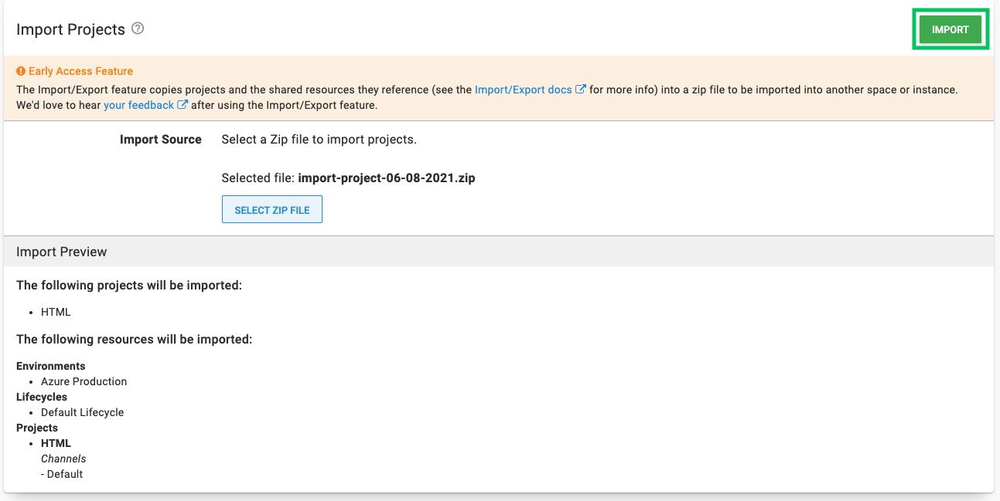
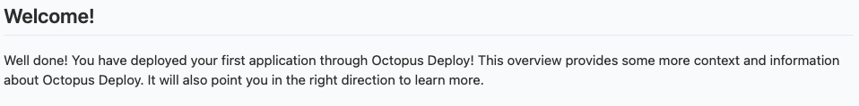

Setting up your first deployment can be a challenging process. There are new systems and many configurations that need to be set up. It can easily become overwhelming for first time users. This blog post is aimed at guiding you through this and reducing the difficulty in setting up your first project. We will do this by utilizing a new feature in Octopus Deploy 2021.1 named Project Bento. 

Project Bento is an import/export feature for projects that will automatically import many of the configurations needed to get a deployment working. You will use a previously exported project and deploy a sample application to an Azure web application. This application will be visible to you and sharable with your company. The only prerequisite is a running Octopus Deploy instance, either in Octopus Cloud or self-hosted.

These are the steps in Octopus Deploy to deploy the web application:

1. Import an existing project
2. Configure an Azure account 
3. Upload an existing package
4. Adding deployment targets
5. Deploy to Azure web application

If you haven't set up an Octopus Deploy instance, please do so by selecting one of the following options:

- [Octopus Cloud](https://octopus.com/start/cloud) -> we host the Octopus Deploy instance for you, it connects to your servers.
- [Self-hosted on a Windows Server](https://octopus.com/start/server) -> you host it on your infrastructure by [downloading our MSI](https://octopus.com/download) and installing it onto a Windows Server with a SQL Server backend.  Learn more about [our installation requirements](/docs/installation/requirements.md).
- [Self-hosted as a Docker container](https://octopus.com/blog/introducing-linux-docker-image) -> you run Octopus Deploy in a docker container (currently EAP).  You will still need a [free license](https://octopus.com/start/server).

In this blog post, you are going to use an Azure web application as a deployment target for your application. Octopus Deploy works with many different types of deployment targets and Azure is one of them. The first step is to import an existing project to your new Octopus Deploy instance.

## Import an existing project

:::hint
The Export/Import Projects feature was added in Octopus Deploy **2021.1**
:::

The `Export/Import Projects` feature can export one or more projects into a zip file, which can then be imported into other spaces.  The target space may be in a different Octopus Server instance, and projects can be exported and imported between self-hosted and Octopus Cloud instances (see below for some [specific considerations when moving a project to Octopus Cloud](#octopus-cloud)). 

Export/Import features are found in the overflow menu on the {{Projects}} page. 


The following is the project that you will be using to import to Octopus Deploy:

> [guide.1.0.0.zip](https://octopus.com/images/docs/hello-world.1.0.0.zip)

In your brand new instance, navigate to Projects → Import Project → Select zip file and upload the project zip. The zip file will be protected with a password.

:::hint 
The password for this project is **html**
::: 



The benefits of the `Export/Import Projects` feature is that you do not have to manually configure the environment and deployment steps of your project. Although this is a small project, some projects can be large and have complex deployment steps. Using the Export/Import feature ensures these steps are maintained across spaces.

:::hint
If you haven't upgraded to Octopus Deploy 2021.1 now is a great time to do so to use the Export/Import Project features
:::

You have successfully imported the project, good work! There are just a few other items to configure before deploying the web application. Exporting and importing a project does not capture the deployment targets or the required packages of the project. Deployment targets require a fresh connection on a new instance and packages are not captured to avoid extremely large files being part of the export process.

## Configure an Azure Account

We need to configure an Azure account and web application to act as a target for Octopus Deploy to deploy to. We could also do this for other deployment targets such as AWS or locally, but for now we will use Azure.

- Navigate to the Azure [portal](https://portal.azure.com/) to create an account in Azure. 

### Create an Azure Service Principal with the Azure Portal {#create-service-principal-account-in-azure}

<iframe width="560" height="315" src="https://www.youtube.com/embed/QDwDi17Dkfs" frameborder="0" allow="accelerometer; autoplay; encrypted-media; gyroscope; picture-in-picture" allowfullscreen></iframe>

1. In the Azure Portal, navigate to **{{Azure Active Directory,Properties}}** and copy the value from the **Tenant ID** field, this is your **Tenant ID**.
1. Next you need your **Application ID**.
  - If you have created an AAD registered application, navigate to **{{Azure Active Directory,App Registrations}}**, click **View all applications**, select the app and copy the **Application ID**.  Please note, the Azure UI defaults to **Owned Applications** tab.  Click the **All Applications** tab to view all app registrations. 
  - If you haven't created a registered app, navigate to **{{Azure Active Directory,App Registrations}}**, click on **New registration** and add the details for your app, and click **Save**. Make note of the **Application ID**.
1. Generate a one-time password by navigating to **{{Certificates & Secrets,Certificates & Secrets}}**. Add a new **secret**, enter a description, and click **Save**. Make note of the displayed application password for use in Octopus. If you don’t want to accept the default one year expiry for the password, you can change the expiry date.

You now have the following:

- **Tenant ID**
- **Application ID**
- **Application Password/secret**

Next, you need to configure your [resource permissions](#resource-permissions).

### Resource permissions {#resource-permissions}

Resource permissions ensure your registered app has permission to work with your Azure resources.

1. In the Azure Portal navigate to **Resource groups** and select the resource group(s) that you want the registered app to access.
2. Next, select the **Access Control (IAM)** option and if your app isn't listed, click **Add**. Select the appropriate role (**Contributor** is a common option) and search for your new application name. Select it from the search results and then click **Save**.

Next, you will set up an [Azure web application](#web-application-setup) and configure its properties.

### Web application setup {#web-application-setup}

1. In **Resource groups** click Create to create a Windows Node Application.
2. Once the web app is setup, route the path of the web application to default to the home path by navigating to **{{Configuration, Path Mappings, Virtual applications and directories}}**
3. Set the Physical path to ```site\wwwroot\guide``` and the Virtual Path to ```\``` 

Now, you can [add the Service Principal Account in Octopus](#add-service-principal-account).

### Add the Service Principal account in Octopus {#add-service-principal-account}

Now that you have the following values, you can add your account to Octopus:

- Application ID
- Tenant ID
- Application Password/Key

1. Navigate to **{{Infrastructure,Account}}**.
2. Select **{{ADD ACCOUNT,Azure Subscriptions}}**.
3. Give the account the name you want it to be known by in Octopus.
4. Give the account a description.
5. Add your Azure Subscription ID. This is found in the Azure portal under **Subscriptions**.
6. Add the **Application ID**, the **Tenant ID**, and the **Application Password/Keyword**.

Click **SAVE AND TEST** to confirm the account can interact with Azure. Octopus will then attempt to use the account credentials to access the Azure Resource Management (ARM) API and list the Resource Groups in that subscription. You may need to whitelist the IP Addresses for the Azure Data Center you are targeting. See [deploying to Azure via a Firewall](/docs/deployments/azure/index.md) for more details.

:::hint
A newly created Service Principal may take several minutes before the credential test passes. If you have double checked your credential values, wait 15 minutes and try again.
:::

Now that we have the Azure account set up in Azure and Octopus deploy we can add the package that will be deployed to Azure.

## Upload an existing package

The web application we are deploying requires some code to deploy. Octopus Deploy makes this code available to deployment targets through packages. A package is some code that will deploy to a target. In this case it will be a deployable tutorial that your web application can display. The package system makes it convienient to interchange or update packages for redeployment at a later stage. The following is the package that you will be using to deploy with Octopus Deploy:

> [guide.1.0.0.zip](https://octopus.com/images/docs/hello-world.1.0.0.zip)

You can manually upload that package to the Octopus built-in repository in the Octopus Web Portal.

1. Navigating to the **Library** tab.
1. Click **UPLOAD PACKAGE**.
1. Select the package you want to upload and click **UPLOAD**.

In the next step we will set up the deployment target that the application will be deployed to.

## Adding deployment targets

With Octopus Deploy, you can deploy software to Windows servers, Linux servers, Microsoft Azure, AWS, Kubernetes clusters, cloud regions, or an offline package drop. Regardless of where you're deploying your software, these machines and services are known as your deployment targets. Octopus organizes your deployment targets (the VMs, servers, and services where you deploy your software) into environments.

1. Go to **{{Infrastructure, Deployment Targets}}**.
2. Select an Azure Web App.
3. Enter a Display Name
4. Fill out the environment and target roles
5. Select the Azure Account and Web App created earlier


## Deploy to Azure Web Application

Now that we have imported a project, set up the Azure account, set up the deployment target and uploaded the package, everything is set for the deployment. 

1. Go to **{{Projects, HTML, create release}}** and step through to deploy the web application to Azure.


Upon success, the web application should now be deployed to your Azure Web Application. Check by going to [your-site].azurewebsites.net where you will see the following page:



Well done! You have taken a preexisting project and deployed a package to an Azure web application through Octupus Deploy. This deployed application can now be shared to other members of your company to teach them how to deploy their own Octopus Deployments. 

