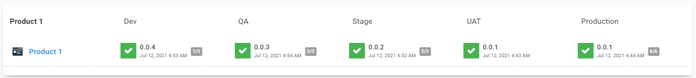
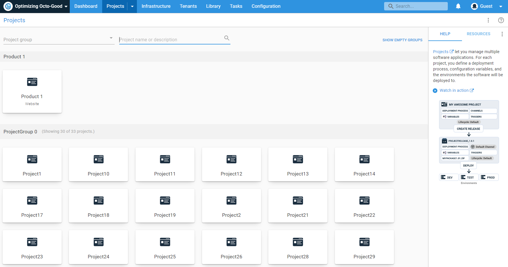
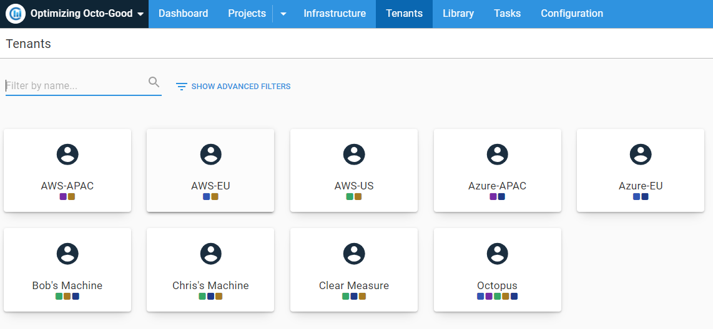
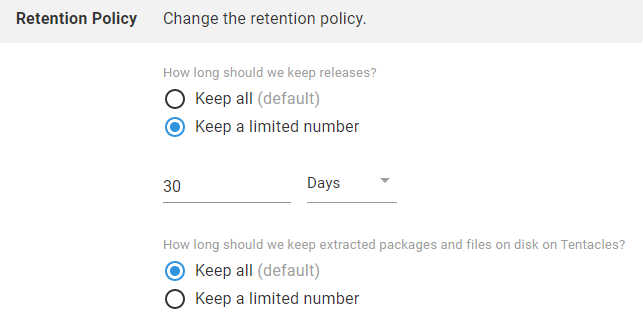

In [our recent webinar](https://octopus.com/events/optimizing-octopus-deploy-with-clear-measure), Clear Measure’s Chris Thomas joined Derek Campbell to talk about ways to optimize Octopus Deploy for the best possible experience.

With a little planning, maintenance and smart use of its features, you can keep Octopus running smoothly and make it easier to see what’s happening.

Watch the webinar below or keep scrolling for the webinar’s key insights.

<iframe width="560" height="315" src="https://www.youtube.com/embed/4T3vMBdTy9o" title="YouTube video player" frameborder="0" allow="accelerometer; autoplay; clipboard-write; encrypted-media; gyroscope; picture-in-picture" allowfullscreen></iframe>

## Database maintenance

As Chris notes in the webinar, it’s easy to forget Octopus Server runs on a SQL database. Some basic housekeeping with tools like **Microsoft SQL Server Management Studio (SSMS)** can boost speed for those battling a slow instance.

If you’re on [Octopus Cloud](https://octopus.com/docs/octopus-cloud), database maintenance is something you never need to worry about. See how to best [organize Octopus](#organize-octopus) instead.

### Check SQL reports for problems

Firstly, we recommend running a ‘Index Physical Statistics’ report in SSMS to look for problems. To run the report, right-click your database from the list and select {{ Reports,Standard Reports,Index Physical Statistics }}.

When the report opens, check the **Operation Recommended** column for suggestions.

You can also expand items in the **# Partitions** column to see fragmentation information. If fragmentation is over 35% you should schedule some time to defragment the database. Anything under 30% is usually okay, but there’s room for improvement as the percentage increases.

### Set a maintenance plan

You can use SSMS's **SQL Server Maintenance Plan Wizard** to optimize and maintain your SQL database.

Expand the **Management** folder in the left pane, right-click **Maintenance Plan** and select **Maintenance Plan Wizard**.

Set the plan to run on a schedule that suits your business and select the following maintenance tasks:

- Check Database Integrity
-	Reorganize Index
-	Rebuild Index
-	Update Statistics

Use others if needed, though we’d advise against shrinking the database for performance reasons.

As you progress through the wizard, you may want to change settings for each chosen task. We find the defaults are enough, but you can change things as you need. Run the maintenance plan once you’re happy.

If you prefer using scripts, try [Ola Hallengren’s SQL Server maintenance solution](https://ola.hallengren.com/), which achieves everything we’ve outlined above.

## Organize Octopus

Keeping Octopus well organized not only helps performance, but also makes it easier for teams to read and navigate the dashboard. Here are a few suggestions for a good practice setup.

### Don’t use more environments than you need

While you can create many environments, your environment number should mirror your development pipeline (Dev, QA, Staging, UAT and Production, for example).

We advise using fewer than 10 environments to reduce:

- performance problems
-	project redundancy and overlap
-	unnecessary clutter on the dashboard

We find some customers use more environments than needed to manage lots of projects or deployment targets. Octopus includes better options, such as Project groups and Tenants.

### Group your projects

If you have a lot of Projects, you can group them to help reduce visual noise on your dashboard.

To create a project group:

1.	Click **Projects** in Octopus’s top menu.
2.	Click **ADD GROUP** in the top right.
3.	Give your group a name and description, then click **SAVE**.

To add an existing project to a group:

1.	Click **Projects** in Octopus’s top menu.
2.	Click on the project you need to move to the new group.
3.	Click **Settings** at the bottom of the left menu.
4.	Click **Project Group**, then select the destination group from the **Project group** dropdown menu.

To add a new project to a group:

1.	Click **Projects** in Octopus’s top menu.
2.	Click **ADD PROJECT** in the top right.
3.	Give your new project a name and click **SHOW ADVANCED**.
4.	Select a group from the **Project group** dropdown menu.
5.	Click **SAVE** to finish creating your new project.

### Use Tenants

We’ve designed Tenants to help customers who deliver Software as a Service (SaaS), but they’re also useful to organize things like:

-	geographical regions or datacenters
-	developers, testers or teams
-	feature branches

Check out our [documentation on Tenants](https://octopus.com/docs/tenants) for more information. Also, watch our follow-up webinar with Adam Close and Mark Harrison, [Better multi-tenancy deployments using Octopus Deploy](https://octopus.com/events/better-multi-tenancy-deployments-using-octopus-deploy).

### Delete your old stuff

It’s great practice to delete anything you no longer need from Octopus. Octopus Server is set to keep everything by default (Octopus Cloud defaults to 30 days), but you can use Lifecycle retention policies to auto-prune old releases and builds.

To check your retention policies:

1.	Click **Library** in Octopus’s top menu.
2.	Click **Lifecycles** from the left menu.

Here you can change retention policies for existing and default Lifecycles, or create new ones.
By setting retention policies, files will disappear after the number of days or releases you set, saving you valuable disk space.

See our documentation for more detail on:

-	[Lifecycles](https://octopus.com/docs/releases/lifecycles)
-	[Retention policies](https://octopus.com/docs/administration/retention-policies)

## What next?

For help with anything else, look through the [Octopus Deploy documentation](https://octopus.com/docs) or reach out via our [support channels](https://octopus.com/support).

Happy deployments!