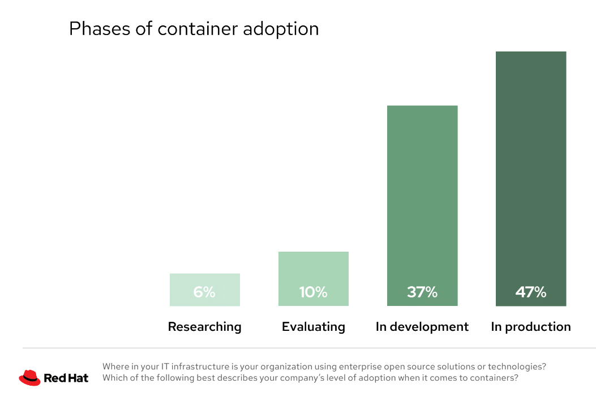
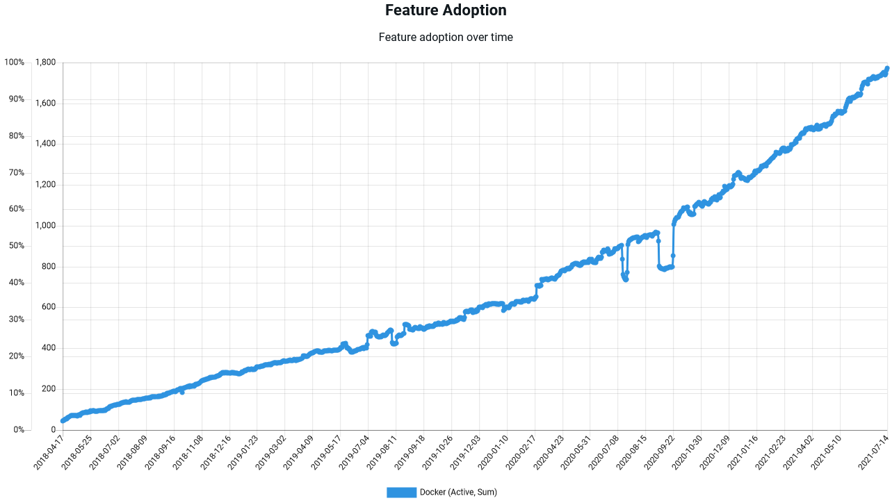
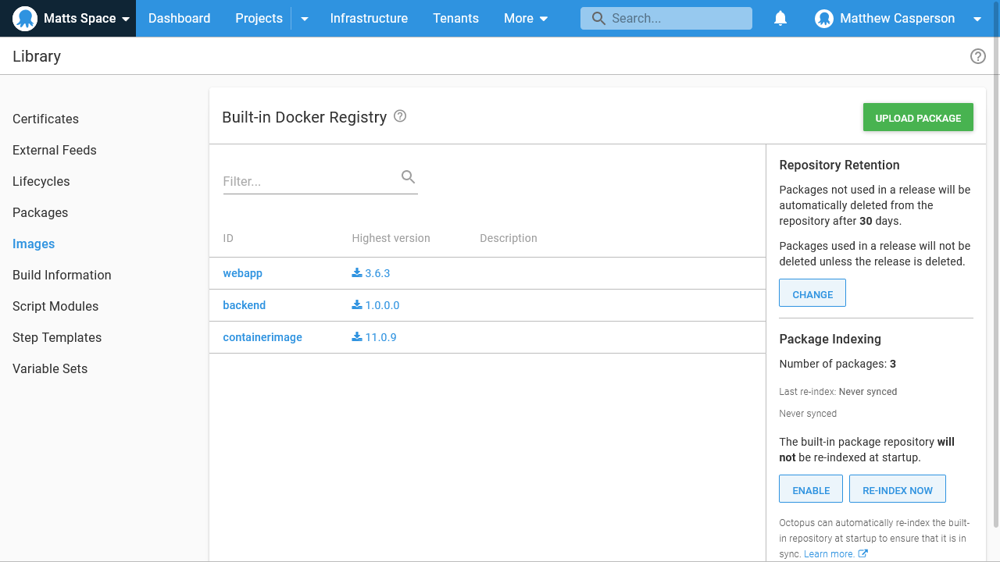

The use of containers is a clear trend in our industry. The [RedHat 2021 State of Enterprise Open Source report](https://www.dropbox.com/s/z12oem8a29lv1zc/rh-enterprise-open-source-report-f27565-202101-en.pdf?dl=0) states:

> Container adoption is already widespread; just under 50% of respondents worldwide use containers in production to at least some degree. 

*RedHat Docker usage graph.*

Octopus has similarly seen steadily increasing usage of Docker feeds:

*Octopus Docker feed usage.*

However, containers are typically stored in a container repository, which presents a challenge today as this requires an additional platform to be operated alongside Octopus.

This post proposes an integrated container repository within Octopus itself.

## What problems are we trying to solve?

This RFC aims to solve the overheads of maintaining an external Docker registry.

### Hosting Docker images directly

Deploying any container based application today requires orchestrating Docker image builds pushed to an external Docker registry, with the resulting images consumed by Octopus and passed along to the destination target. This means even the most simple of deployments involving Docker images requires three separate platforms to be configured correctly.

Providing a Docker registry has been suggested via UserVoice.

By integrating a Docker registry we remove the need for customers to implement an external registry, and provide the same kind of convenience as the current built-in feed.

## How might we solve the problem?

This RFC proposes the Octopus host an integrated Docker registry, much like the built-in feed provides hosting for traditional application packages.

## Built-in Docker registry

Each space would host a built-in Docker registry implementing the [Docker HTTP API](https://docs.docker.com/registry/spec/api/). This registry would allow [OCI artifacts](https://github.com/opencontainers/artifacts) (typically Docker images, but potentially hosting any kind of OCI artifact) to be pushed and pulled by clients:

*A mockup of an integrated Docker registry.*

## Benefits of the new features

With so many companies embracing containers as part of their deployment strategy, extending Octopus to remove barriers to container adoption makes strategic sense. We envisage the proposed features offering customers the following benefits.

### Deploy Docker images with fewer steps

By providing a built-in Docker registry, there is no longer any need to configure and maintain an external Docker registry. This means teams can quickly prototype new container deployment processes, and removes a significant point of friction for anyone trying to migrate to containers.

### Autodeploy triggers for Docker images

A built in Docker registry can be integrated with ARC like the built-in feed, bringing deployment triggers to Docker images.

## When are these features being delivered

This RFC has been written to gauge interest and collect feedback for possible strategies to pursue in 2022. We currently have no commitment to building these features.

## We want your feedback

We want your feedback to determine if this feature is a good fit for Octopus. Specifically we would like to know:

* Does a built in Docker registry make sense?
* Will these proposed features solve problems you have seen customers encountering?
* Would a built in Docker registry be valuable for your teams in terms of sales, marketing, or solutions?

Please leave your feedback on this GitHub issue. (TODO - create issue)