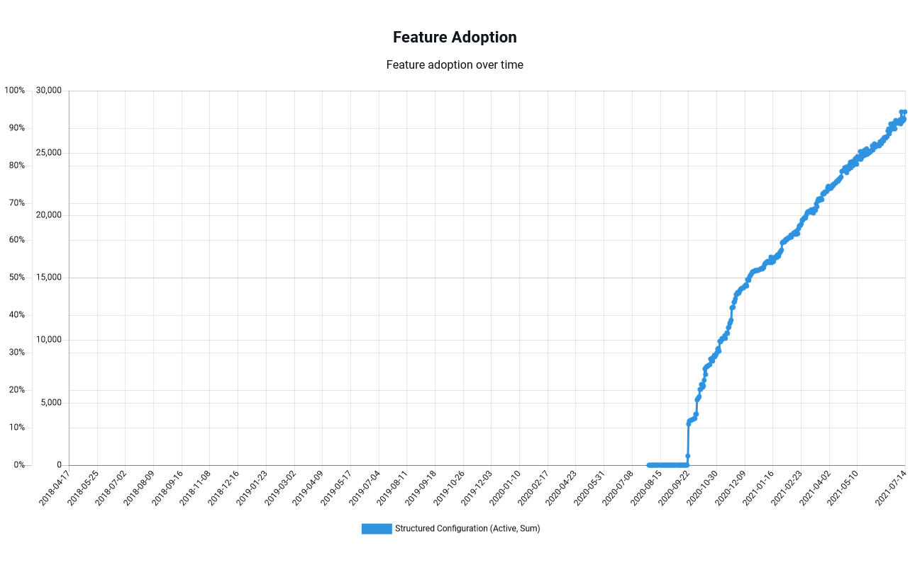

The use of containers is a clear trend in our industry. The [RedHat 2021 State of Enterprise Open Source report](https://www.dropbox.com/s/z12oem8a29lv1zc/rh-enterprise-open-source-report-f27565-202101-en.pdf?dl=0) states:

> Container adoption is already widespread; just under 50% of respondents worldwide use containers in production to at least some degree. 

Octopus has similarly seen steadily increasing usage of docker feeds:

However, containers are typically stored in a container repository, which presents a challenge today as this requires an additional platform to be operated alongside Octopus.

The post proposes an integrated container repository within Octopus itself.

## What problems are we trying to solve?

The two problems this RFC aims to solve are the overheads of maintaining an external Docker registry, and the limitations with externalizing all environment specific configuration from a Docker image.

### Hosting Docker images directly

Deploying any container based application today requires orchestrating Docker image builds pushed to an external Docker registry, with the resulting images consumed by Octopus and passed along to the destination target. This means even the most simple of deployments involving Docker images requires three separate platforms to be configured correctly.

Providing a Docker registry has been suggested via [UserVoice](https://octopusdeploy.uservoice.com/forums/170787-general/suggestions/18824059-provide-private-docker-registry).

By integrating a Docker registry we remove the need for customers to implement an external registry, and provide the same kind of convenience as the current built-in feed.

### Building environment specific Docker images

The traditional advice for building environment agnostic Docker images has been to [externalize all configuration via environment variables](https://12factor.net/config). This is certainly good advice for a number of scenarios, but does require many legacy applications to be redesigned to load external values, and does not support by the traditional (and much used) configuration file modification features in Octopus.

By having Octopus build Docker images for each environment, we offer a logical upgrade path for legacy applications, especially those that have relied configuration file modification.

## Built-in Docker registry

Each space would host a built-in Docker registry implementing the [Docker HTTP API](https://docs.docker.com/registry/spec/api/). This registry would allow [OCI artifacts](https://github.com/opencontainers/artifacts) (typically Docker images, but potentially hosting any kind of OCI artifact) to be pushed and pulled by clients:

## Hosting Dockerfiles rather than images

Octopus will be expanded to host special packages that contain a `Dockerfile` file and define dependencies to additional external packages. These will be called **Source Docker Images** (SDIs).

Any step that can reference a docker image file as part of its deployment can now also reference an SDI. During package acquisition, Octopus will peform the following steps:

1. Extract the SDI along with any additional packages it references.
2. Perform file modifications with traditional features such as **Structured Configuration Variables**, **Substitute Variables in Templates**, **.NET Configuration Variables**, and **.NET Configuration Transforms**.
3. Run `docker build`, and push the resulting image to the built-in Docker registry with a deployment specific tag like `1.2.0-deployments-75`.
4. The step referencing the SDI is then passed the image reference of `octopusserver:8080/mywebapp:1.2.0-deployments-75`.

## Benefits of the new features

With so many companies embracing containers as part of their deployment strategy, extending Octopus to remove barriers to container adoption makes strategic sense. We envisage the proposed features offering customers the following benefits.

### Deploy Docker images with fewer steps

By providing a built-in Docker registry, there is no longer any need to configure and maintain an external Docker registry. This means teams can quickly prototype new container deployment processes, and removes a significant point of friction for anyone trying to migrate to containers.

### Embracing environment specific Docker images

Octopus has always supported the idea of deploying a static binary with environment specific configuration to different environments. By extracting an artifact, processing configuration files with the **Structured Configuration Variables**, **Substitute Variables in Templates**, **.NET Configuration Variables**, and **.NET Configuration Transforms** features, and deploying the result, Octopus is effectively deploying environment specific artifacts.

This process is battle tested and widely adopted, with tens of thousands of deployments making use of these features:

SDIs embrace this process. They take static binaries from package references or are based on a "golden" Docker image, add processed configuration files, build a new Docker image, and pass the result to the deployment target.

Environment specific Docker images are considered an anti-pattern by some, but I suggest we have real world experience to prove that translating the deployment patterns of traditional artifacts to Docker is an example of best practice.

### Simplify rollbacks and scale events

The behavior of an application is the combination of the code it is running and the configuration it loaded. To reliably roll back a deployment or scale it up, you must be sure that the application code **and** the configuration are rolled back together or remain consistent while scaling up.

Baking environment specific configuration into an image guarantees that the application code and configuration is consistent. It removes the need to snapshot configuration values and removes a point of failure as settings are loaded from an external system.

### Not all configuration can be contained in environment variables

Environment variables are great for simple key/pair values, but not all configuration is that simple. Test scripts run with testing tools like [Cypress](https://hub.docker.com/r/cypress/included) or [Postman](https://hub.docker.com/r/postman/newman/) would not be placed in a environment variable. Making these scripts available to containers today often means having the container download scripts from an external file host or mapping shared volumes.

SDIs make running ad hoc scripts like quick and easy. The script is pushed as a regular package to the built in feed, an SDI includes the script in an environment specific image, and the self contained image is consumed by the hosting platform with no need for volume mounts or external downloads.

## When are these features being delivered

This RFC has been written to gauge interest and collect feedback for possible strategies to pursue in 2022. We currently have no commitment to building these features.

## We want your feedback

We want your feedback to determine if this feature is a good fit for Octopus. Specifically we would like to know:

* Does the idea of environment specific images make sense?
* Will these proposed features solve problems you have seen customers encountering?
* Would the concept of Source Docker Images be valuable for your teams in terms of sales, marketing, or solutions?

Please leave your feedback on this [GitHub issue](https://github.com/OctopusDeploy/StepsFeedback/issues/3) (TODO - create the issue).