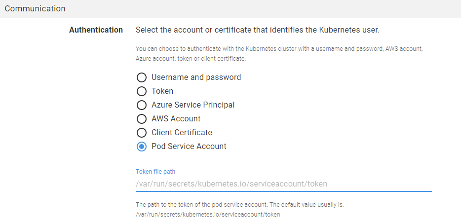
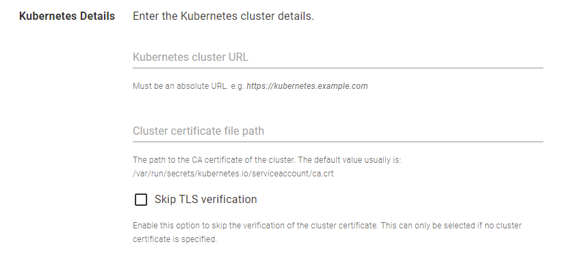
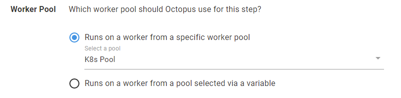

<Add blog image>

We're introducing simpler authentication for Octopus Workers running inside Kubernetes clusters, using the Kubernetes Pod Service Account's credentials. 

In this post, I introduce the new support and demonstrate how to take advantage of this update.

Octopus introduced Workers to shift deployment work off the Octopus Server, to pools of machines. Workers are helpful for teams in several scenarios, such as:

- Backing up databases
- Performing database schema migrations
- Configuring load balancers 

It's also possible for teams to create a pool of workers as a container running inside a Kubernetes cluster.

When running a pool of workers as a container in a Kubernetes cluster, the workers can now connect back to the parent cluster, using the Pod Service Account token and cluster certificate files mounted as files in the pod. This allows the workers to manage the cluster they're deploying to, without sending additional credentials to them from the Octopus Server.

## Creating a worker pool running inside a Kubernetes cluster

You can run a pool of Octopus workers inside a Kubernetes cluster. There are two reasons you'd want to do this: 

- To create a dedicated worker for that cluster
- To create a bunch of workers to use with Octopus Deploy 

This can be done by deploying the [Tentacle image](https://hub.docker.com/r/octopusdeploy/tentacle) hosted in Docker Hub, or using [Octopus Deploy Runbooks](https://octopus.com/docs/runbooks). Please refer to our post about [creating workers on a Kubernetes cluster](https://octopus.com/blog/kubernetes-workers) for comprehensive instructions on using Octopus Deploy to deploy a worker pool to Kubernetes clusters.

After you have a set of healthy workers running inside the Kubernetes cluster, you need to install `kubectl` in each Octopus worker. `kubectl` is the [Kubernetes command-line tool](https://kubernetes.io/docs/tasks/tools/) which allows you to run commands against Kubernetes clusters.

To do this, navigate to each worker's directory and run the commands below:

```bash
$ curl -LO "https://dl.k8s.io/release/$(curl -L -s https://dl.k8s.io/release/stable.txt)/bin/linux/amd64/kubectl"
$ chmod +x ./kubectl
$ mv ./kubectl /usr/local/bin
```

You can now verify that `kubectl` has been installed successfully by checking its version.

```bash
$ kubectl version
```

## Adding a Kubernetes target using Pod Service Account authentication

We now have a pool of healthy workers running inside the Kubernetes cluster. 

The next step is adding a deployment target using the new authentication mode, Pod Service Account.

1. Navigate to **Infrastructure** ➜ **Deployment Targets**, and click **ADD DEPLOYMENT TARGET**.
1. Select **KUBERNETES CLUSTER** and click **ADD** on the Kubernetes Cluster card.
1. Enter a display name for the Kubernetes Cluster.
1. Select at least one [environment](https://octopus.com/docs/infrastructure/environments) for the target.
1. Select at least one [target role](https://octopus.com/docs/infrastructure/deployment-targets#target-roles) for the target.
1. Select **Pod Service Account** as the Authentication mode.
1. Enter the path to the token file of the **Pod Service Account**. The default path is usually `/var/run/secrets/kubernetes.io/serviceaccount/token`. Please note that the path is relative to the pod's directory.



8. Enter the URL of the Kubernetes cluster. Each Kubernetes target in Octopus Deploy requires the cluster URL, which can be located by retrieving the cluster information (running `kubectl cluster-info` in the Kubernetes cluster).
8. Optionally, enter the path to the cluster certificate. The default path is usually `/var/run/secrets/kubernetes.io/serviceaccount/ca.crt`. Please note that the path is relative to the pod's directory. If you select **Skip TSL verification**, you're not required to enter this detail.

10. *Important*: Select the worker pool which contains the workers running inside the Kubernetes cluster. Otherwise, the health check for the deployment target will fail.


## Creating a deployment process

The deployment target is now ready to be used in Kubernetes deployment processes. 

You can create a [Deploy Kubernetes containers](https://octopus.com/docs/deployments/kubernetes/deploy-container) step to target the [target role](https://octopus.com/docs/infrastructure/deployment-targets#target-roles) of this deployment target.

Similar to the deployment target created earlier, the deployment steps require a worker pool running inside the Kubernetes cluster. Please ensure you select a valid **Worker Pool** for your steps.



## Conclusion

This post demonstrates how you can use the **Pod Service Account** authentication mode when creating a **Kubernetes deployment target**. 

One benefit of this authentication mode is enabling the workers to connect back to the parent cluster by themselves. This means you don't need certificate data of your cluster to be stored in the Octopus Server.

Happy deployments!
