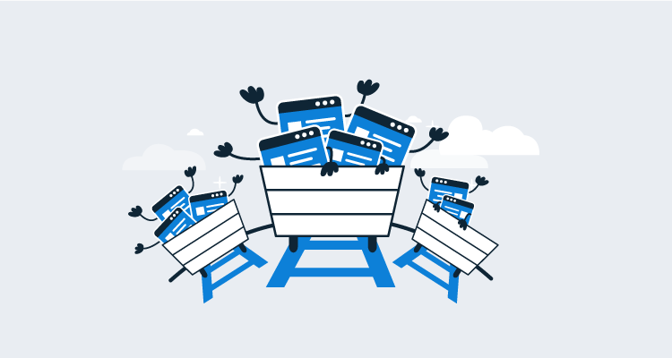

One of my favorite features in Octopus Deploy is [multi-tenancy](https://octopus.com/docs/deployments/patterns/multi-tenant-deployments). Each customer gets their own version of an application, either hosted on unique infrastructure per customer, or hosted by the customer themselves. The multi-tenancy feature in Octopus Deploy solves many problems.  

My [previous post](blog/2021-02/release-management-with-octopus/index.md) was a deep dive into the new [Deploy Child Octopus Deploy Project step template](https://library.octopus.com/step-templates/0dac2fe6-91d5-4c05-bdfb-1b97adf1e12e/actiontemplate-deploy-child-octopus-deploy-project) and covered a variety of scenarios, but it didn't include multi-tenancy.  

In this post, I cover the multi-tenancy functionality of the new step template, and how you can use it to better manage your multi-tenancy releases.

:::success
This post assumes you read the [previous post](blog/2021-02/release-management-with-octopus/index.md). It will touch on similar topics, but it isn't a full rehash.
:::

## Sample application

Like the previous post, I have a sample application where each component is an Octopus Deploy project.  

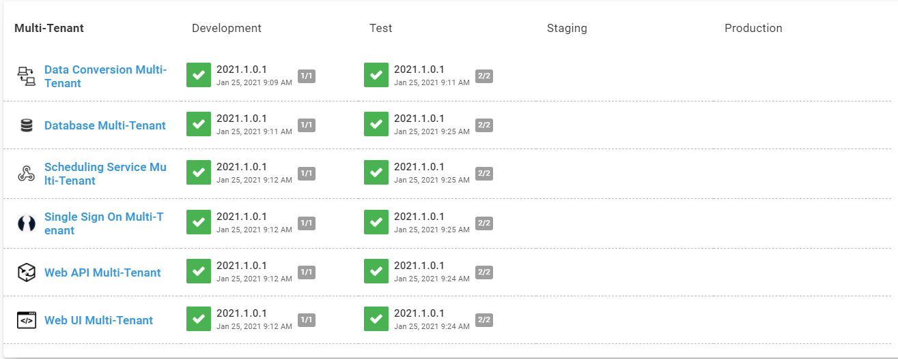

There are a few key differences:

- These projects have been updated to use [Octopus Deploy's multi-tenancy feature](https://octopus.com/docs/deployment-patterns/multi-tenant-deployments).
- Two additional projects have been added, a single sign-on project and a data conversion project.

The sample application is a SaaS application with the following business rules:

- Every customer gets the "core" product consisting of the Database, the Web API, and Web UI.
- Every customer gets a **Staging** and **Production** environment.  The **Staging** environment allows their engineers to test any changes before being deployed to **Production**.
- Customers can purchase the scheduling service, single sign-on app, and data conversion at an additional cost.
- Customers can pay extra for earlier access to changes deployed in the **Test** environment.
- Certain customers must give their consent before a release deployment to the **Production** environment.
- Purchasing a module requires a redeployment of the core components, configuration files need to be updated, and the services need to be recycled to pick up the new functionality.
- Customers want downtime kept to a minimum.

These rules replicate some of the complexity of the real-world.  

Here are our sample customers:

- **Internal**: This is an internal test customer used by everyone to test changes.  This customer exists across all four environments: **Development**, **Test**, **Staging**, and **Production**.
- **All Pets**: This customer has paid for all the extra components plus access to preview releases in the **Test** environment.
- **Pet Life**: The bare-bones customer only has the four "core" components in the **Staging** and **Production** environments.
- **Pet World**: This customer has purchased the scheduling service and single sign-on app for use in the **Staging** and **Production** environments.
- **Dogs Only**: This customer has purchased the scheduling service and data conversion service for use in the **Staging** and **Production** environments.

## Multi-tenancy and the Deploy Child Octopus Deploy Project step template

Some customers choose a single massive project to handle everything.  They deploy their software in one go, but outage windows are quite large because unchanged components are also redeployed.  

This can lead to the question, "How do I skip steps where the package hasn't changed?".

The problem with this approach is that a web deployment rarely "just" pushes out a server package.  Additional steps are needed to configure items such as branding or running integration tests.  

Each component in Octopus Deploy needs to be assigned to a unique project. A parent project will handle the orchestration. Until now, there hasn't been a step to solve several use cases seen in the real-world:

- Minimize downtime by only deploying what has changed.
- Minimize build time by only building what has changed.
- Minimize the number of decisions a person has to make.
- Single responsibility principle, each project deploys one thing to the best of its ability.
- Tenants are assigned to different projects.
- Tenants are assigned to different environments per project.
- Tenants are on different **Production** release schedules.
- Tenants have a different testing cycle.
- Tenants require their own set of approvals, but a person should only have to approve a release once.
- Applications have to be deployed to tenants in a specific order.
- A customer approves their change on Tuesday for a Thursday night deployment.

The new [Deploy Child Octopus Deploy Project](https://library.octopus.com/step-templates/0dac2fe6-91d5-4c05-bdfb-1b97adf1e12e/actiontemplate-deploy-child-octopus-deploy-project) step template helps solve these use cases.  

You'll have a parent project for your application with a single deployment process.  You shouldn't have to worry about tenant and project assignments.  It has the necessary guard clauses to ensure the same process will work for the **Internal Customer** with all the bells and whistles, _and_ for **Pet Life** with only the core components.

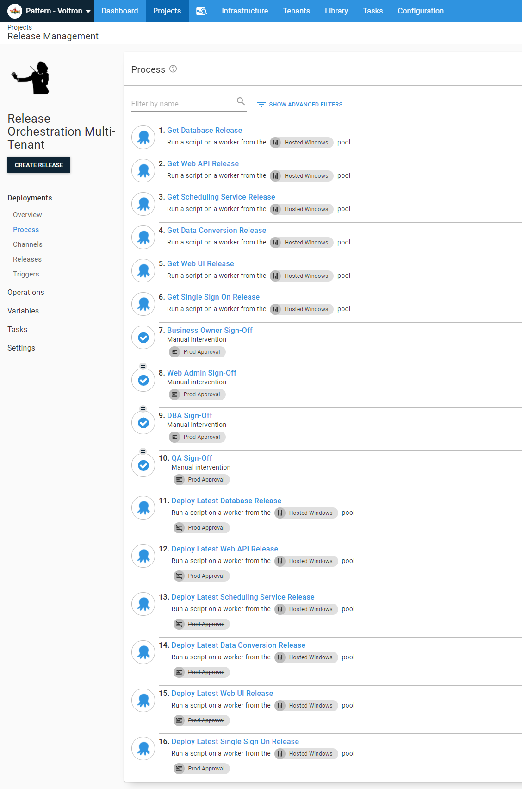

Before proceeding, let's examine how the step template handles different use cases for a multi-tenant parent project.

### Tenants not assigned to child projects

The step template will automatically handle all the possible multi-tenant use cases:

- Is the tenant assigned to the child project?  If no, exit the step, log a message and proceed onto the next step.
- Is the tenant assigned to the child project for that specific environment?  If no, exit the step, log a message, and proceed to the next step.
- Is the tenant assigned to the child project for that specific environment?  If yes, find the latest release and trigger a deployment.
- Is the child project configured to run multi-tenant?  If no, run the child project without supplying a tenant.

### Choosing a release

One of the step template's core business rules is to pick the last successfully deployed release in the source environment.  Most logic is focused on calculating that source environment, and runs through 4 logic gates:

- When the source environment is provided, use that.
- When the channel is provided, find the phase before the destination environment's phase.
- When no channel is provided, use the **Default** channel, then find the phase before the destination environment's phase.
- Once the source environment is known, find the latest _successful_ release.  

The step template uses the task log to calculate which release to promote.  Using the advanced search filters on the Tasks page, you see in real-time which release will be picked by the step template.

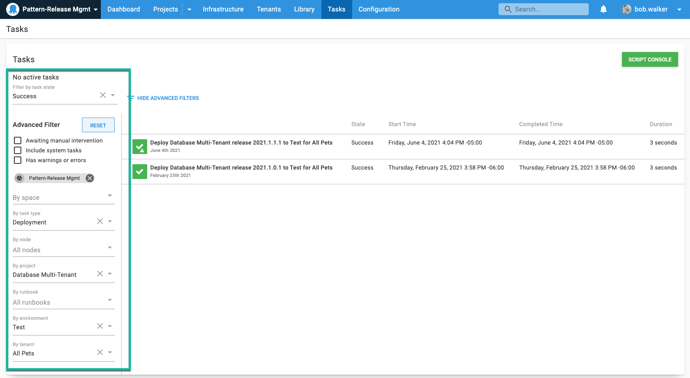

:::hint
When the destination environment is the first phase in the channel's lifecycle, it will find the newest release created for the channel matching the release pattern provided.
:::

Multi-tenancy adds a layer of complication.  Consider this scenario:

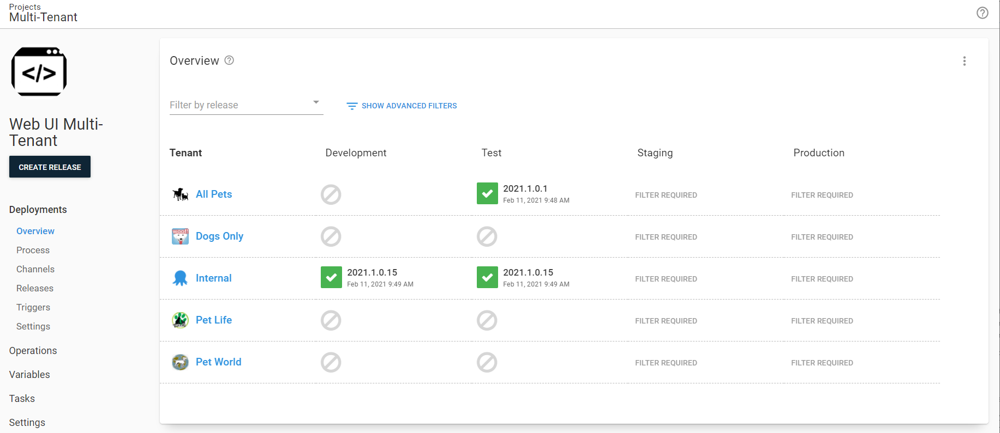

- **Internal**: Has the latest bleeding-edge release, `2021.1.0.15` ready to go to **Staging**.
- **All Pets**: Has an older release, `2021.1.0.1` ready to go to **Staging**.
- **Pet Life**, **Pet World**, and **Dogs Only** aren't assigned to the **Test** environment.

What release will be picked by the step template when it promotes the latest `2021.1.0.x` release to **Staging**?  The answer:

- **Internal**: 2021.1.0.15
- **Pet Life**: 2021.1.0.15
- **Pet World**: 2021.1.0.15
- **Dogs Only**: 2021.1.0.15
- **All Pets**: 2021.1.0.1

Multi-tenancy adds that complexity because:

- Only **All Pets** and **Internal** are assigned to the **Test** environment.
- Tenants can have different releases.

Fortunately, Octopus already figures this out for us.  If we pick the `2021.1.0.15` release from the **Filter by release** drop-down menu, the dashboard would change to this:

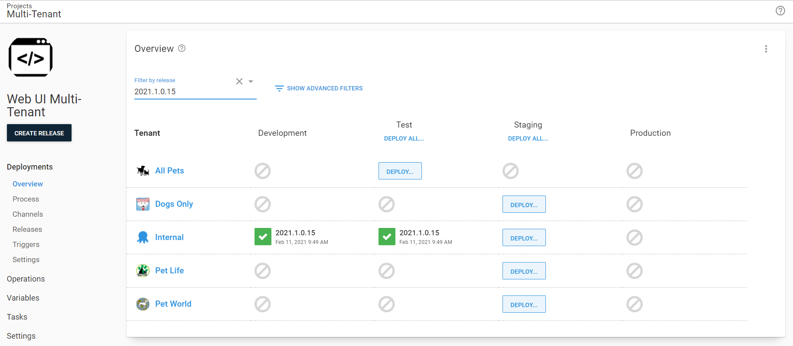

The step template hooks into that logic already provided by Octopus Deploy.  Internally, the logic looks at `2021.1.0.15` for **All Pets** and determines that is not the correct release to promote to **Staging**.  **All Pets** is assigned to the **Test** environment, and that release hasn't been deployed to that environment.  Whereas with **Internal**, that release has been deployed to **Test** so it can be deployed to **Staging**.

When the step template looks at **Pet Life**, it sees that tenant isn't assigned to the **Test** environment.  It will then pick the latest release from the  **Test** environment, regardless of the tenant.  

## Using the Deploy Child Octopus Deploy Project step template

This section walks through configuring some common parent project scenarios.  

You can view the final project on the [samples instance](https://samples.octopus.app/app#/Spaces-603/projects/release-orchestration-multi-tenant/deployments) by logging in as a guest.

### Scaffolding

There is some scaffolding to configure for users and lifecycles.  Please see the scaffolding section in the [previous post](blog/2021-02/release-management-with-octopus/index.md#scaffolding).  

After configuring the users and lifecycles, you need to create a project.  When creating the project, remember to select the new lifecycle created above.

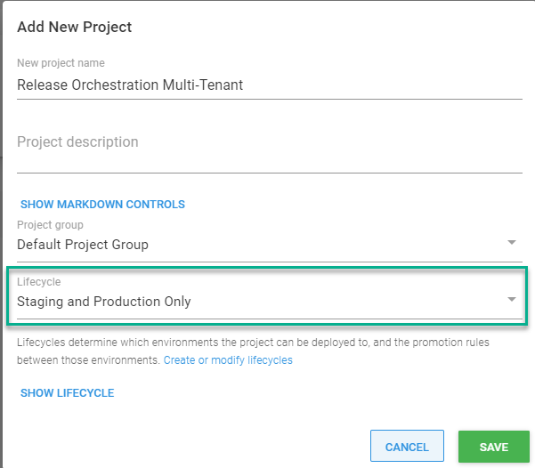

Ensure the project is configured to require a tenant for all deployments.

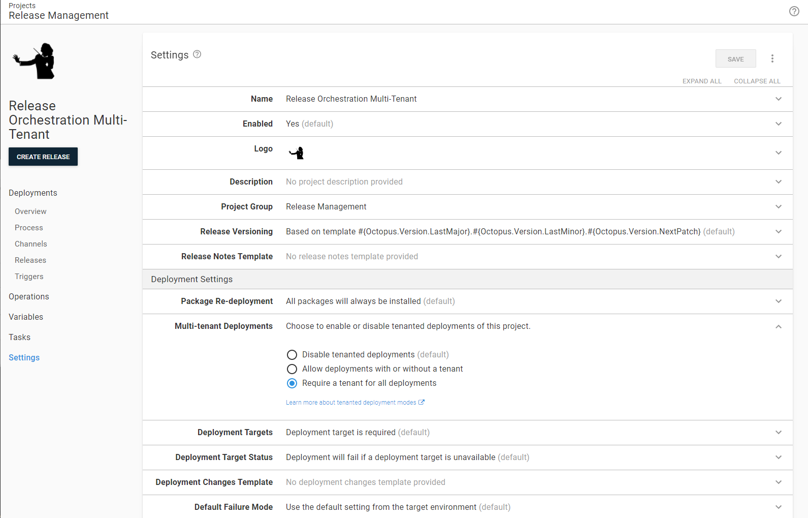

After that, navigate to the variables screen and add the API key and the release pattern.

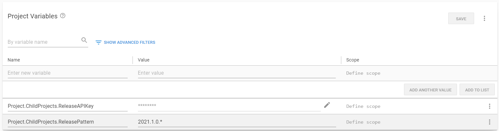

For each tenant, connect the newly created project for the **Staging** and **Production** environments.  

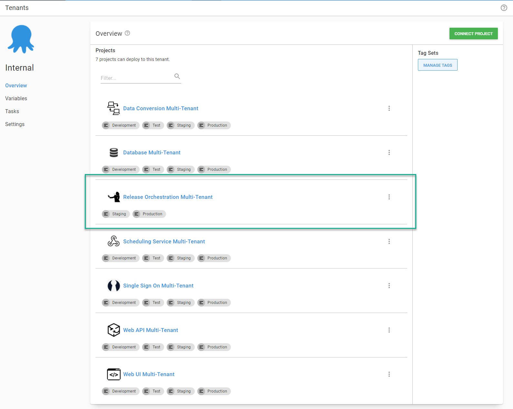

:::hint
The example scenarios assume a build server will deploy to all the tenants in **Development**.  The step template was not written with that assumption.  Because **Development** is the first phase in the channel's lifecycle, it will find the latest release created matching the release pattern provided.
:::

### Scenario: Deploying the latest release for the tenant from Test to Staging

In this scenario, we configure the parent project to deploy all the child components from **Test** to **Staging** in a specific order.  For now, we're not concerned with approvals.  

#### Add the steps

Go to the newly created project's deployment process and add a `Deploy Child Octopus Deploy Project` step for each child project.

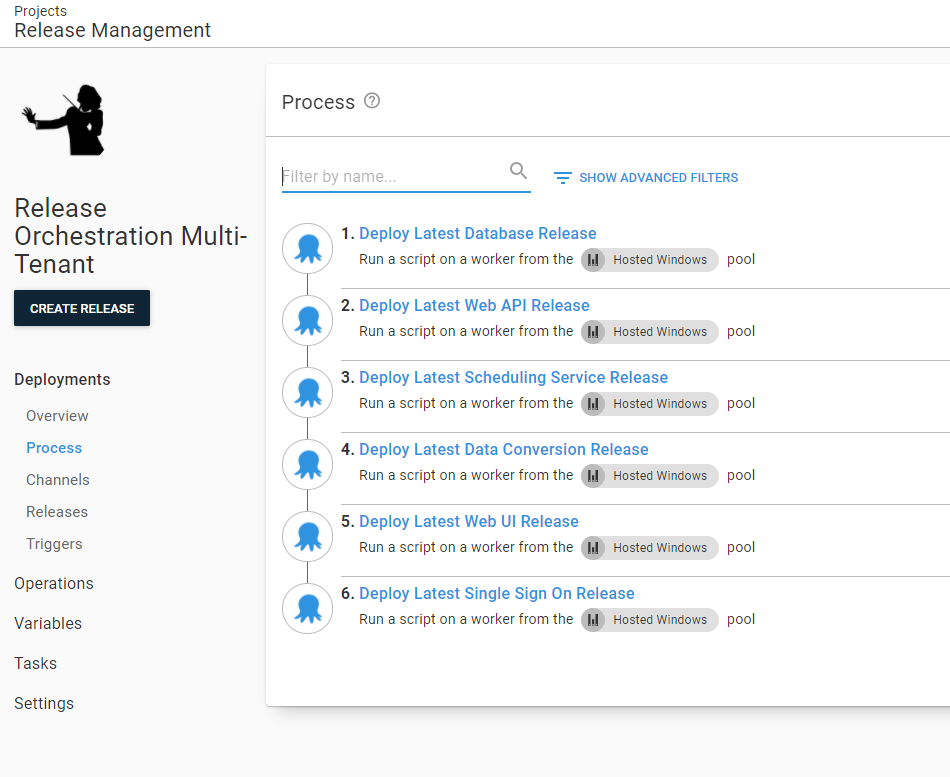

Here are the values for each parameter:

- **Octopus Base URL**: Accept the default value, `#{Octopus.Web.ServerUri}`.  You can configure that value at Configuration -> Nodes.  This is pre-configured for Octopus Cloud.
- **Octopus API Key**: The API key variable, `#{Project.ChildProjects.ReleaseAPIKey}`.
- **Child Project Space**: Accept the default value. This example isn't creating a release orchestration project in another space.
- **Child Project Name**: The name of the child project.
- **Child Project Release Number**: The release pattern variable, `#{Project.ChildProjects.ReleasePattern}`.
- **Child Project Release Not Found Error Handle**: Accept the default value, which says if the release doesn't exist, skip it.
- **Destination Environment Name**: Accept the default value. Use the same environment as the parent project. 
- **Source Environment Name**: Accept the default (empty) value This example will let the step template decide the source environment.
- **Child Project Channel**: Accept the default (empty) value The child project only has one channel.
- **Tenant Name**: Accept the default value, `#{Octopus.Deployment.Tenant.Name}`.
- **Child Project Prompted Variables**: Accept the default (empty) value. There are no prompted variables. 
- **Deployment Mode**: Accept the default value.  The example is doing a deployment not a redeploy.
- **Force Redeployment**: Accept the default value. The example won't redeploy an existing release.
- **Refresh Variable Snapshots**: Accept the default value.  The example won't refresh child project variable snapshots.
- **Specific Deployment Targets**: Accept the default value.  The example isn't deploying to specific machines.
- **Ignore Specific Machine Mismatch**: Accept the default value. We're not adding deployment target triggers yet.
- **Save Release Notes as Artifacts**: Accept the default value.
- **What If**: Accept the default value. We're not adding the approvals yet.
- **Wait for finish**: Accept the default value. This example will wait for the deployment to finish.
- **Wait for Deployment**: Accept the default value. 30 minutes should be ample.
- **Scheduling**: Accept the default value. This example requires a specific order for child projects.
- **Auto Approve Child Project Manual Interventions**: Accept the default value. This setting isn't needed right now as the example doesn't deal with manual interventions.
- **Approval Environment**: Accept the default value. This setting isn't needed right now as the example doesn't deal with manual interventions.
- **Approval Tenant**: Accept the default value. This setting isn't needed right now as the example don't deal with manual interventions. 

#### Create the release and deploy it

After adding and configuring the steps, you create a release.  I'll be making many changes to the parent project in this post; you might see `2021.1.0-RCx` for the release numbers.  

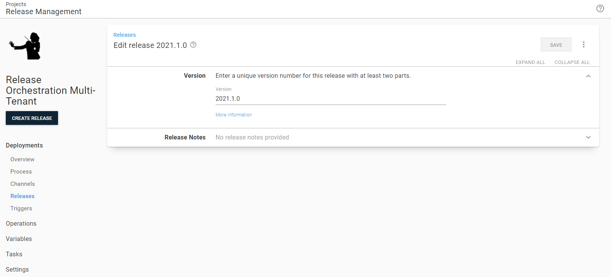

First, deploy the release to the **All Pets** tenant.  

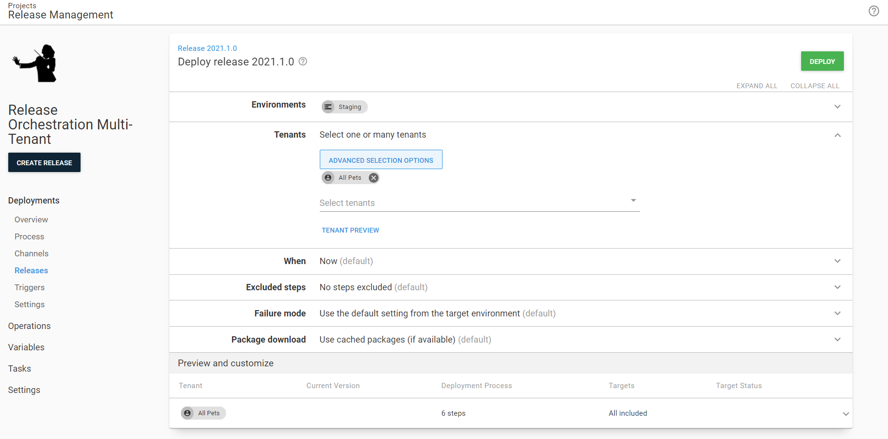

Wait for the release to finish.  For the Web UI project, you should see release `2021.1.0.1` get picked up to deploy.

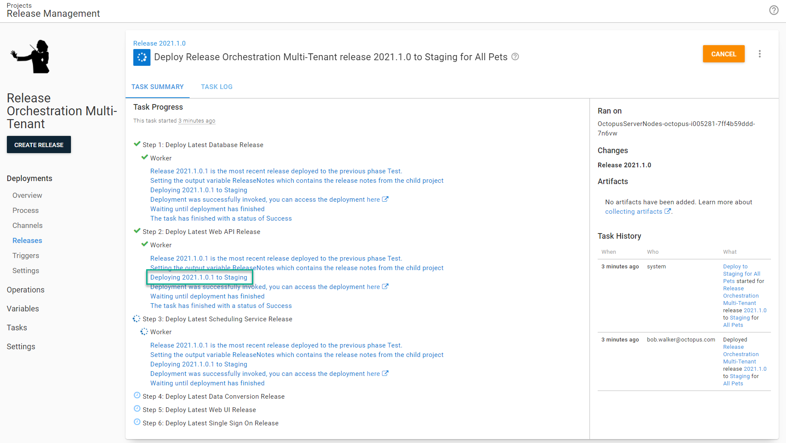

For the other projects, you should see `2021.1.0.15` get picked up.

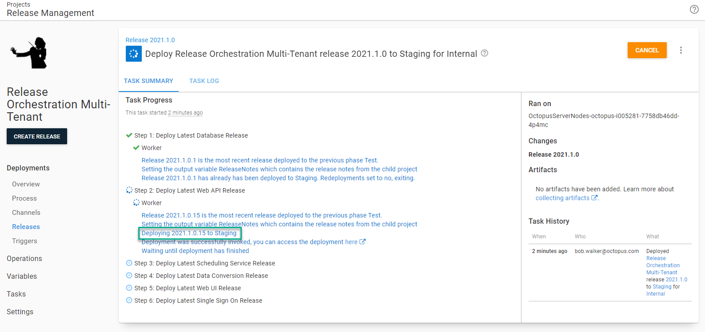

#### Deploy the release for tenants not assigned to Test

Now let's see when the tenant is _not_ assigned to **Test**, such as the case with **Pet Life**, **Pet World**, and **Dogs Only**.

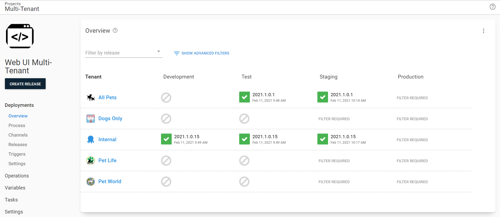

**Pet Life** is also not assigned to the scheduling service, single sign-on, or data conversion service projects.

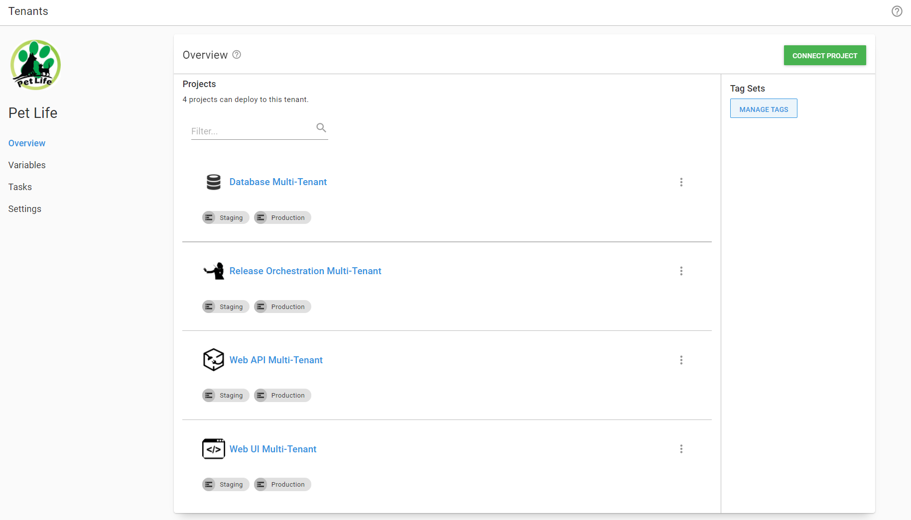

A couple of things will happen when deploying the parent project to **Staging** for **Pet Life**  

- Release `2021.1.0.15` for the Web UI project will be selected as it is the most recent successful release to **Test**.
- The scheduling service, data conversion service, and single sign-on projects will be skipped.

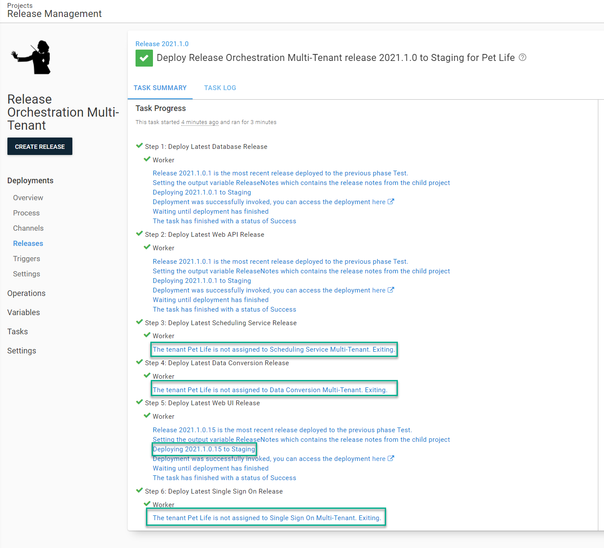

So far, we've configured the parent project to do deployments only.  If we stop here, we're in a better position than before.  We can push out all the components assigned to a tenant in a specific order.  Also, the process will skip steps not assigned to the tenant automatically.  When managing multi-tenant applications, this alone is a win.  But we can take this a step further.  Let's move to approvals.

### Scenario: Approval in the parent project

It's common to have manual interventions in child projects.  In this sample application's case, each component project has two or three manual interventions.  That means 8 to 18 approvals to submit, depending on the tenant. That is very tedious.

All the approvals are in the parent project and flow down to the child project in an ideal configuration.

What is being approved though?  With Octopus Deploy, all manual interventions occur as part of a deployment.  It's a chicken/egg scenario.  To solve this, the step template provides "what-if" functionality, which will do everything up to the point of deployment.  Also, the step template gathers all the release notes to aid in approvals.

The flow of the parent project is:

1. Run **Deploy Child Octopus Deploy Project** step templates in what-if mode.
2. Do all the necessary manual interventions.
3. Run **Deploy Child Octopus Deploy Project** step templates in normal mode.

When running in what-if mode, the following output parameters are set for use later in the process:

- **ReleaseToPromote**: The release number that meets all the requirements.  When no release is found, this is set to N/A.  When the release has already been deployed to the target environment, it will indicate that.
- **ReleaseNotes**: The release notes of the child project.  Includes the commit history and issues associated with the project when using build information.
- **ChildReleaseToDeploy**: Indicates if there is a child release to deploy.  It will either be True or False.  Use this variable in variable run conditions.

#### Create the what if steps

To configure this, first clone all the existing steps.  Do that by clicking on the overflow menu (three vertical ellipsis points) next to each step.

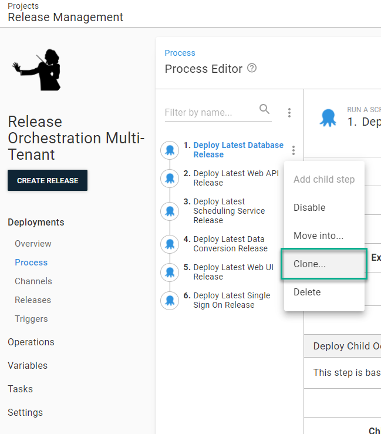

Rename each of the cloned steps.  Update the parameters in the cloned steps to:

- **Save Release Notes as Artifacts**: Set to `Yes`.
- **What If**: Set to `Yes`. 

#### Add the manual intervention steps

Before moving on, add the manual intervention steps.  One feature of the manual intervention step is it can provide instructions to the approvers.  We can use the output variables from the step template to create useful instructions.  For example:

```
Please approve releases for:

**Database: #{Octopus.Action[Get Database Release].Output.ReleaseToPromote}**
#{Octopus.Action[Get Database Release].Output.ReleaseNotes}

**Web API: #{Octopus.Action[Get Web API Release].Output.ReleaseToPromote}**
#{Octopus.Action[Get Web API Release].Output.ReleaseNotes}

**Scheduling Service: #{Octopus.Action[Get Scheduling Service Release].Output.ReleaseToPromote}**
#{Octopus.Action[Get Scheduling Service Release].Output.ReleaseNotes}

**Data Conversion: #{Octopus.Action[Get Data Conversion Release].Output.ReleaseToPromote}**
#{Octopus.Action[Get Data Conversion Release].Output.ReleaseNotes}

**Web UI: #{Octopus.Action[Get Web UI Release].Output.ReleaseToPromote}**
#{Octopus.Action[Get Web UI Release].Output.ReleaseNotes}

**Web UI: #{Octopus.Action[Get Sign Sign On Release].Output.ReleaseToPromote}**
#{Octopus.Action[Get Single Sign On Release].Output.ReleaseNotes}
```

I avoid duplicating effort. Let's add that as a variable.

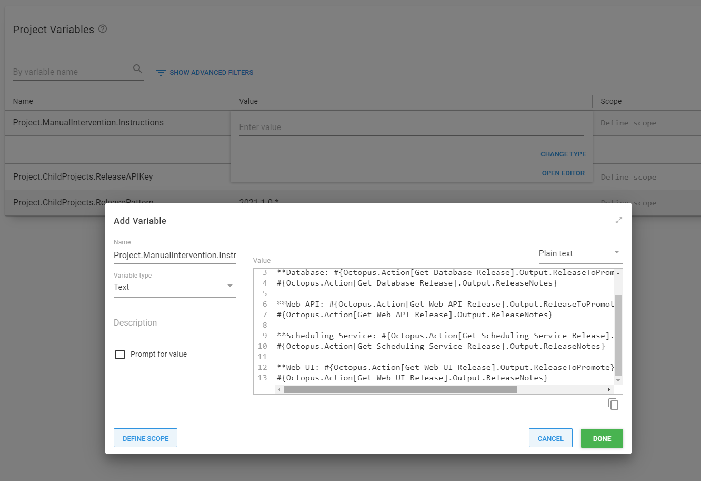

Now we can add the manual interventions with the instructions sent to that new variable and only run for the **Production** environment.

:::success
The responsible teams list in the manual intervention is combined with an OR.  Anyone from any team on that list can approve the manual intervention.  If you require approval from multiple teams, you'll need multiple manual intervention steps.
:::

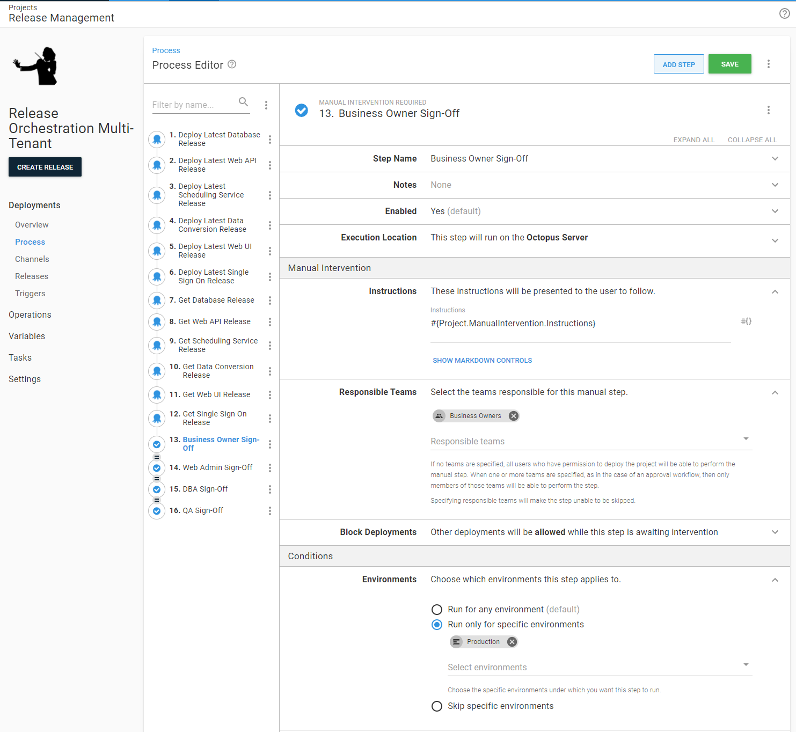

#### Reorder the steps

After the deployment, approvals don't make sense, so reorder the steps by clicking the overflow menu (three vertical ellipsis points) next to the **Filter by name** text box, and selecting the **Reorder** button.  

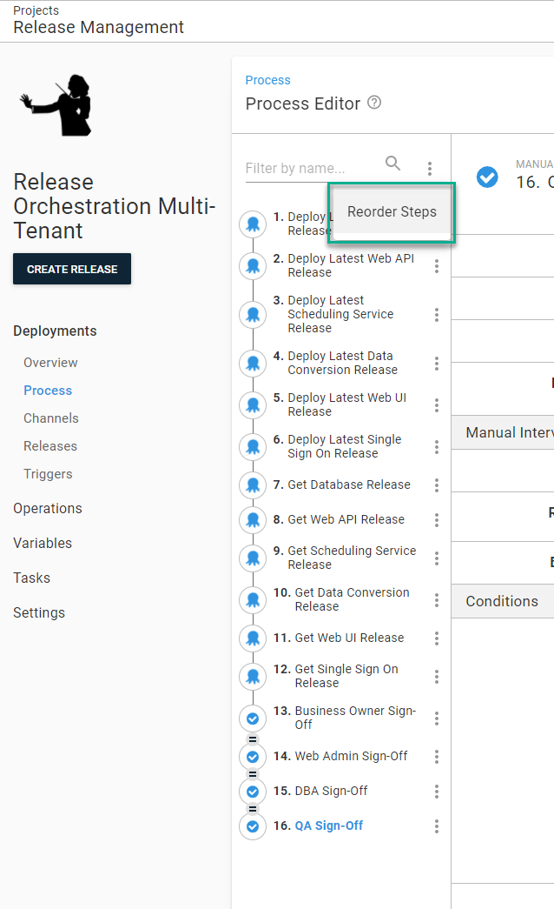

Move all the steps you set to do a "what if" above the "non-what if" steps.  When finished, your process should look similar to this:

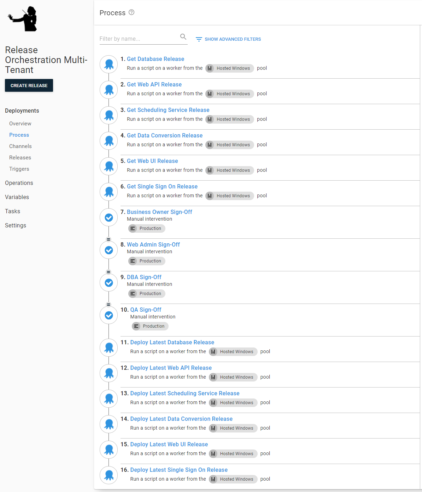

#### See auto-approvals in action

Create a new release and deploy it to **Staging** for one of the tenants.  Once that release is complete, promote it to release to **Production**.  

During this deployment, you'll see the manual interventions and auto-approvals in action.  First, the manual intervention should have the version being deployed along with the release notes:

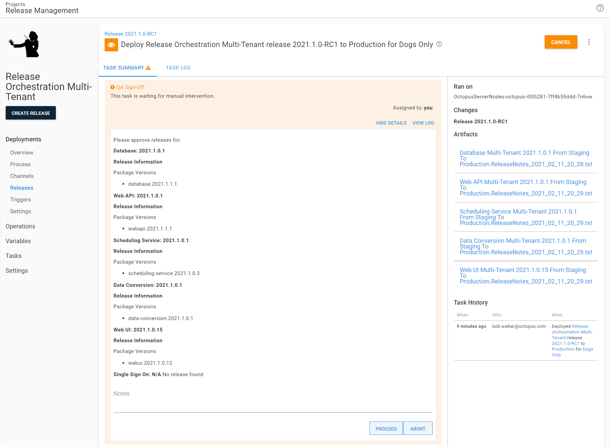

After every group has approved the release, the deployments will kick-off.  If you go to a specific deployment, you'll see a message similar to this in the child projects:

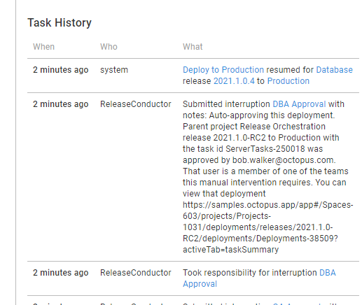

The release to **Production** is now complete.  You have a single place to approve all the child project deployments for a specific tenant.

### Scenario: Approve today, deploy tomorrow

Sometimes, specific customers are required to sign-off on a release before going to **Production**.  It's unlikely they'll approve a deployment _during_ the actual deployment.  More commonly, they'll approve on Tuesday for deployment on Thursday, for example. Also, let me remind you of this rule from earlier:

> Certain customers, such as **All Pets** and **Pet World** must give their consent before a release is deployed to the **Production** environment.

**All Pets** and **Pet World** require specific approval.  All the other customers only require a single approval, which will occur for the **Internal** tenant.  

To avoid a deployment sitting in **Production** awaiting manual intervention for days, you can have a **Prod Approval** environment that sits between **Staging** and **Production**.  

:::success
The **Prod Approval** environment will _only_ be used for parent projects.  Child project's lifecycles will remain the same.
:::

This scenario walks through the steps to add the **Prod Approval** environment to a multi-tenant application to meet those rules.

#### Add the new environment and configure the lifecycle

Add the **Prod Approval** environment.  You will notice this environment in my screenshot sits between **Staging** and **Production** on this page.  I clicked the overflow menu to reorder the environments on this page.

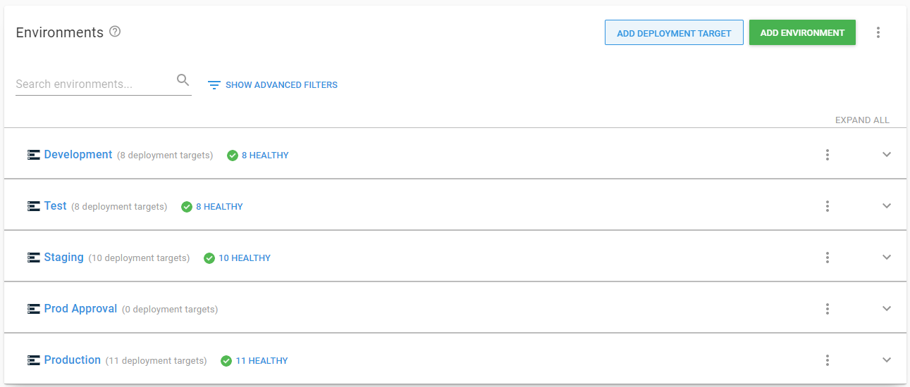

Now the new environment has been added, update the lifecycle used by this release orchestration project.

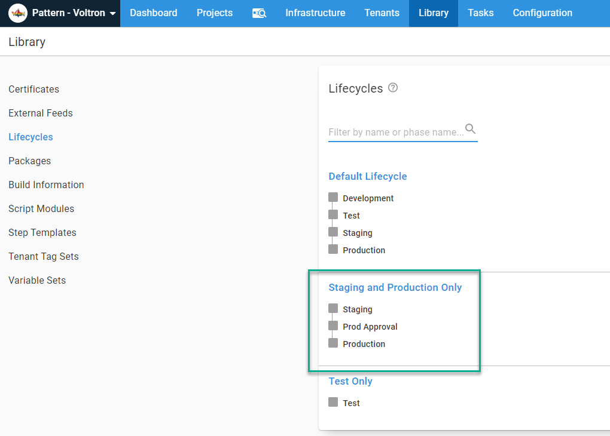

:::success
Keep an eye on the **Default Lifecycle.**  It doesn't have explicit phrases defined but instead auto-generates the phases using the entire environment list.  To remove **Prod Approval** from the **Default Lifecycle**, you will need to add explicit phases.
:::

#### Update the deployment process

Next, update the approval steps to only run in the **Prod Approval** environment.  Then configure the non-what-if steps to skip the **Prod Approval** environment.  The updated deployment process will look like this:

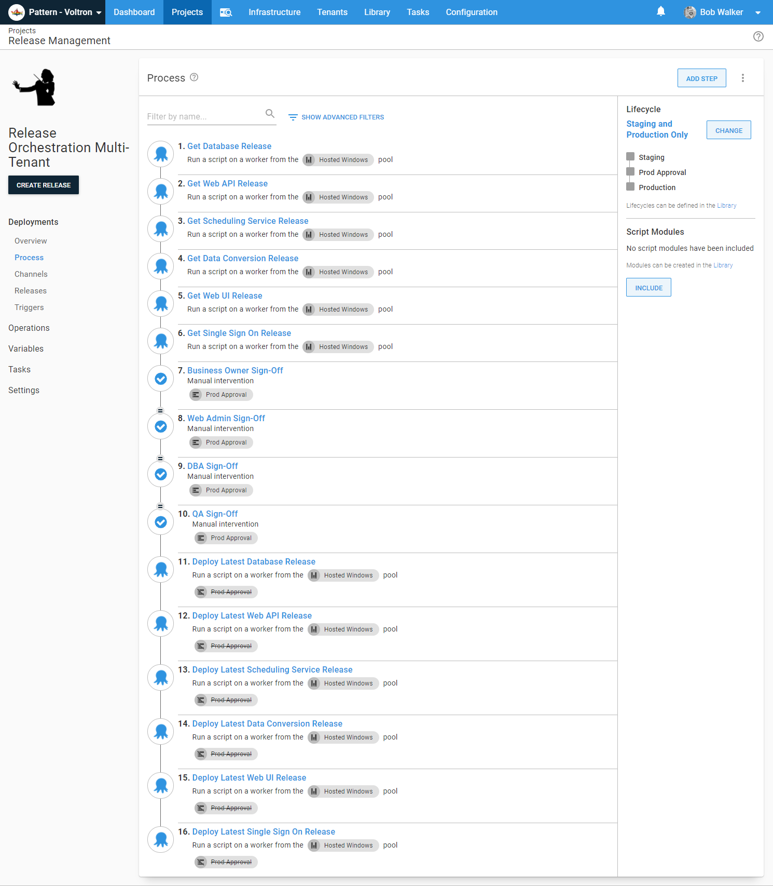

Next, navigate to the variables screen and add in two new variables:

- **Project.ChildProject.Approval.Environment.Name**: Stores the **Prod Approval** environment name.
- **Project.ChildProject.Deployment.Environment.Name**: Stores the name of the destination environment for the deployment.  For all environments except **Prod Approval**, the name will match the current environment.  When running this on the **Prod Approval** environment, the deployment environment name is **Production**.

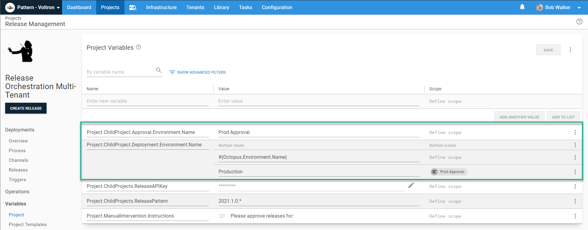

Go into each step implementing the **Deploy Child Octopus Deploy Project** and update the following parameters:

- **Destination Environment Name**: Update to `#{Project.ChildProject.Deployment.Environment.Name}`.
- **Approval Environment**: Update to `#{Project.ChildProject.Approval.Environment.Name}`.

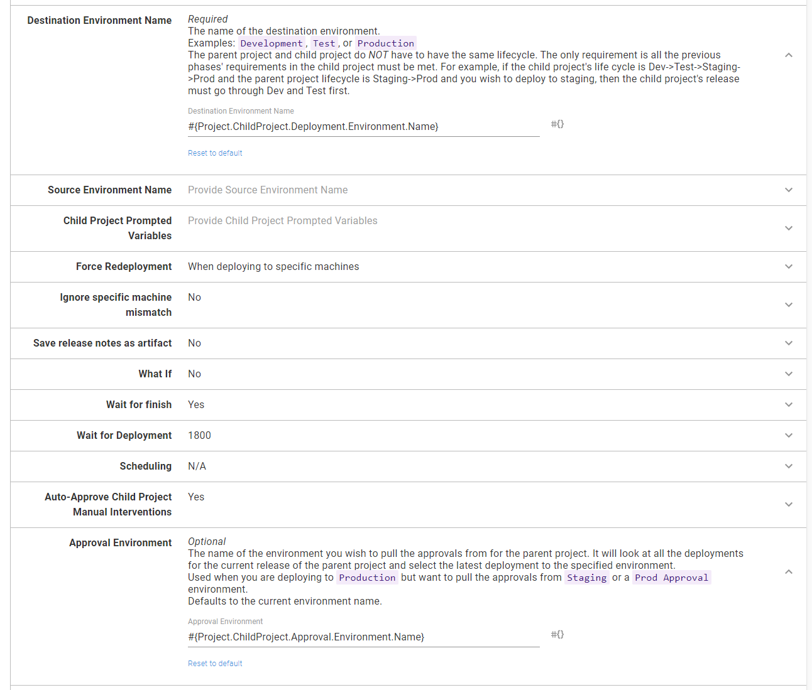

:::success
By doing this, we're telling the step template to pull approvals from the **Prod Approval** environment rather than the **Production** environment during a **Production** deployment.  That means we can approve at 11 AM and schedule it to deploy at 7 PM.
:::

#### Set the tenant approvals

Finally, set the approval tenant.  By default, the approval tenant is the current tenant's name.  That default will only apply to **All Pets**, **Pet World**, and **Internal**.  Everyone else will use **Internal**.  There are several ways to accomplish this.  I'm going to use a project variable template with the default value set to `Internal`:

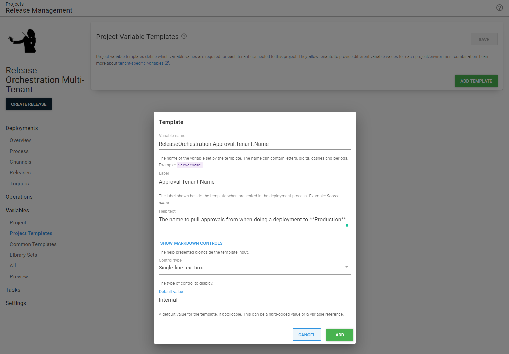

Go to **Internal**, **All Pets**, and **Pet World** and assign the **Prod Approval** environment for the Release Orchestration Project.

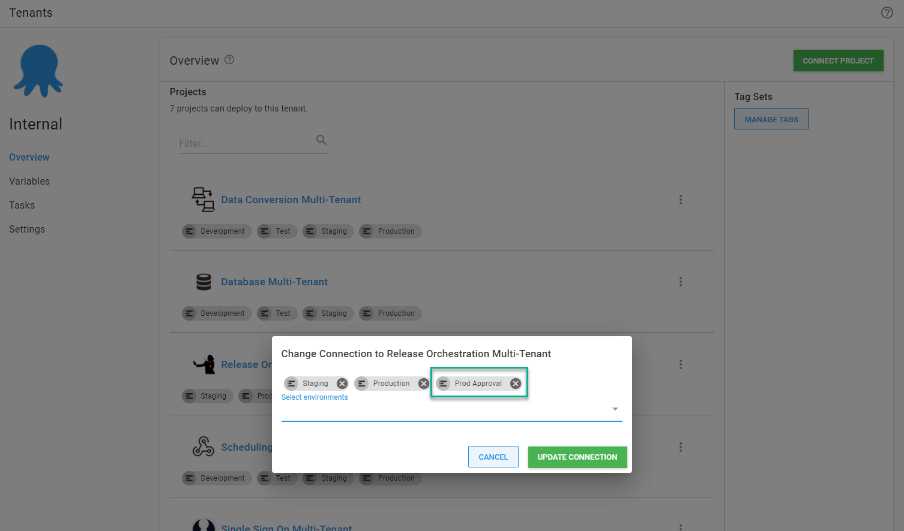

For **All Pets** and **Pet World**, change the approval tenant name to `Octopus.Deployment.Tenant.Name` in the **Production** environment. This is necessary because the **Production** environment is where we need to pull the approvals.

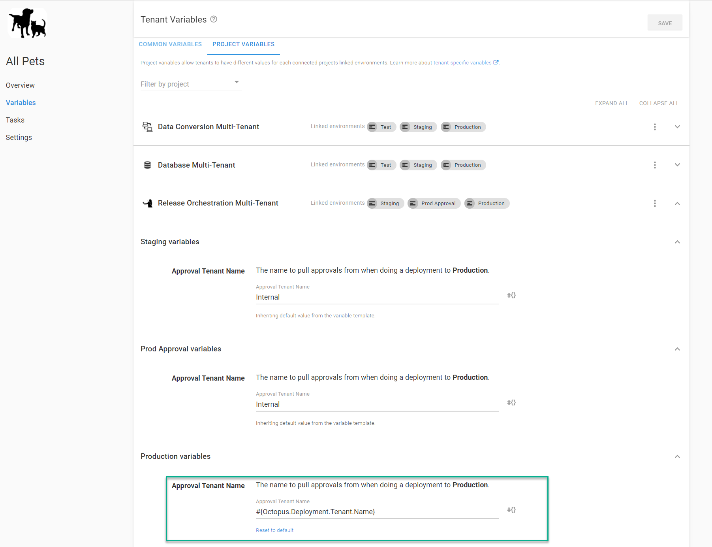

For each of the "non-whatif" steps, set the approval tenant to the variable created earlier.

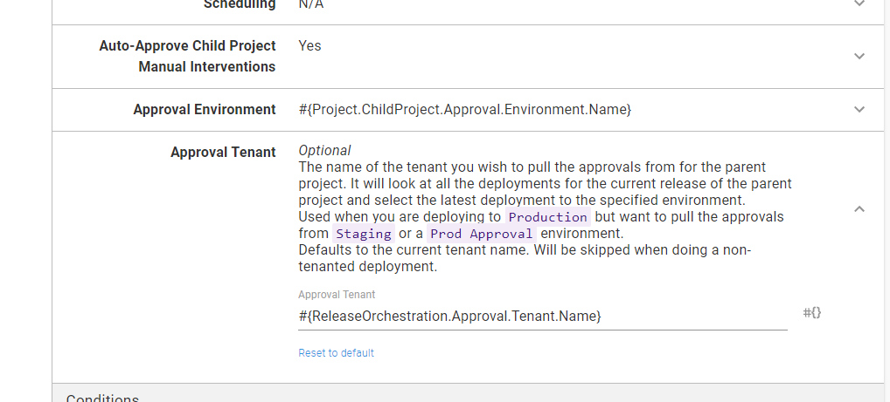

The approval screen will show **Pet Life** and **Dogs Only** don't run on the **Prod Approval** environment.  All the other tenants do.

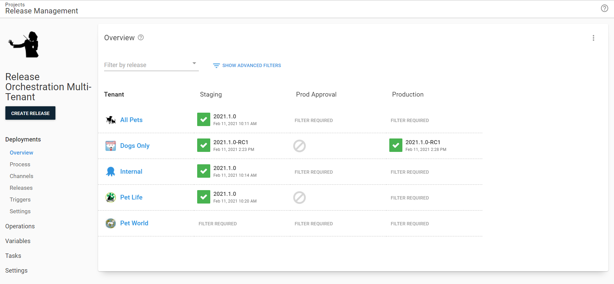

#### Seeing approvals in action

Let's see this all in action.  First, let's deploy the **Internal** through **Staging** and onto **Prod Approval**.  Only the what if steps and approval steps will run in the **Prod Approval** environment.

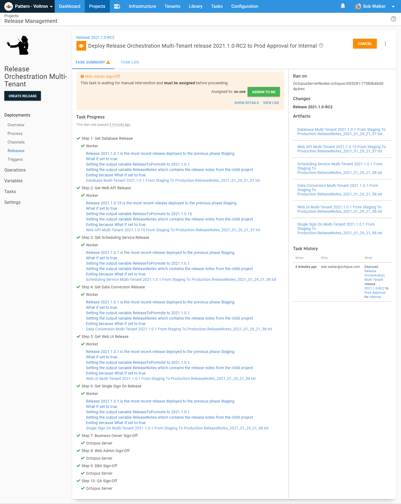

Now promote that release to **Production** for **Internal**.  The approvals are picked up from the **Prod Approval** environment for the **Internal** tenant.

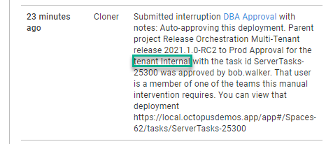

After **Internal** has been promoted through **Prod Approval**, we can move onto **Pet Life** and **Dogs Only**.  Promoting the release through **Staging** and onto **Production** shows the **Internal** tenant's approval.


When the same release is deployed to **Production** for **All Pets**, we see the approvals come from the **All Pets** tenant.

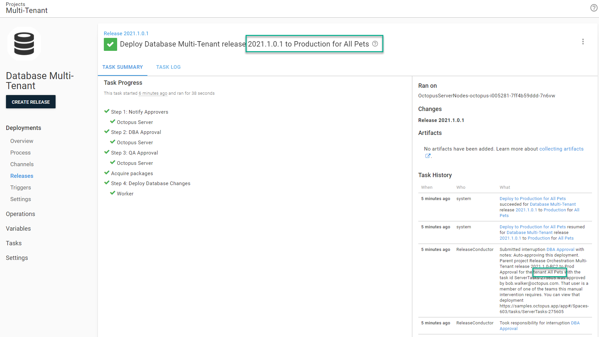

:::success
The step template looks for approvals for the current release only.  Creating a new release will require another round of approvals, even for a patch release, such as `2021.1.1`.  
:::

## Conclusion

This post covered some of the multi-tenancy scenarios for the [Deploy Child Octopus Deploy Project](https://library.octopus.com/step-templates/0dac2fe6-91d5-4c05-bdfb-1b97adf1e12e/actiontemplate-deploy-child-octopus-deploy-project) step template.  You can see more scenarios in my [previous post](blog/2021-02/release-management-with-octopus/index.md).

Octopus Deploy's multi-tenancy feature was designed to help companies who install software on distinct infrastructure.  I see and hear the various quirks customers run into with that model and they were my motivation for writing this step template. I want to help customers avoid errors in manual processes and remove as much psychological weight as possible from multi-tenant deployments.

I hope you find this step template useful for your multi-tenancy projects.

:::hint
The final guide in this three-part series is:

- [Release management with dynamic infrastructure](https://octopus.com/blog/release-management-with-dynamic-infrastructure)
:::

## Watch the webinar: Better multi-tenancy deployments using Octopus Deploy

<iframe width="560" height="315" src="https://www.youtube.com/embed/dD8psiK1wL4" title="YouTube video player" frameborder="0" allow="accelerometer; autoplay; clipboard-write; encrypted-media; gyroscope; picture-in-picture" allowfullscreen></iframe>

We host webinars regularly. See the [webinars page](https://octopus.com/events) for past webinars and details about upcoming webinars. 

Happy deployments!
