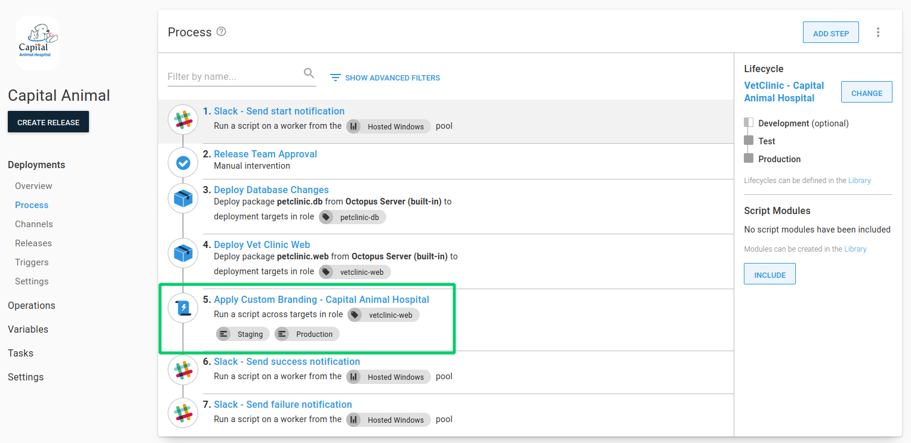
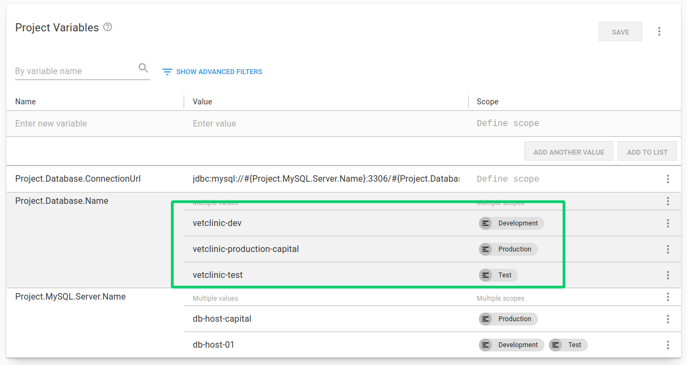
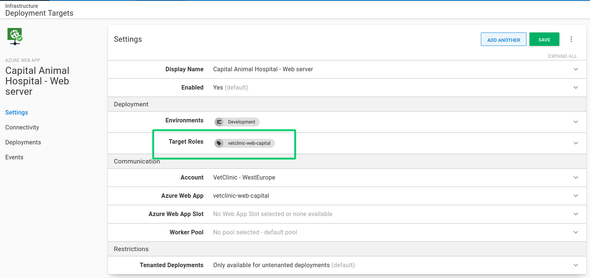

Most people who use Octopus use it to deploy projects to one or more environment. For customers who are providing Software as a Service (SaaS) applications, they'll typically need to deploy multiple instances of the application for each of their customers.

The good news is there's a feature thats been around since [Octopus 3.4](https://octopus.com/blog/whats-new-multi-tenant-deployments) designed exactly for these types of deployment, [multi-tenancy](https://octopus.com/docs/deployments/patterns/multi-tenant-deployments).

In this post, I give an overview of two different approaches to deploying applications without tenants, and then discuss the benefits of using the multi-tenancy feature.

!toc

## Deploying without tenants {#deploying-without-tenants}

There are two main ways we see implemented when deploying multiple instances of the same application for each customer:

- Using [multiple projects](#using-multiple-projects)
- Using [multiple environments](#uing-multiple-environments)

While easy to set up, in either case, this can quickly become overwhelming. It doesn't scale well and can result in duplication.

### Using multiple projects {#using-multiple-projects}

In this scenario, you would configure Octopus with multiple projects, each one representing one of your customers. 

Onboarding a new customer typically requires creating all of the resources in Octopus that's required for a successful deployment for the customer including:

- A new set of [deployment targets](https://octopus.com/docs/infrastructure/deployment-targets)
- Common [project variables](https://octopus.com/docs/projects/variables)
- Any customer specific "paid-for" [environments](https://octopus.com/docs/infrastructure/environments)

In addition, any common steps across the application's deployment process need to be duplicated in the new project. This is usually things like manual intervention and notification steps.

#### Multiple projects pros {#multiple-projects-pros}

So why would you choose multiple Octopus projects to deploy instances of an application to each customer?

1. **Clear customer release dashboard overview**

    This approach allows you to see exactly which release has been deployed to which environment, for each customer on the dashboard overview.

    

1. **Variable and Deployment process isolation**

    Multiple projects allow for complete isolation of variables, and deployment process for a customer. For example, making a change to one project's process only affects that one customer. You can also tailor the deployment process for the customer depending on what features they have signed up for. 

    In the below example, only **Capital Animal Hospital** has a step for applying custom branding:

    

1. **Simpler enviroment and variable scoping**

    Environments don't need to be duplicated per customer making for a simpler lifecycle configuration. Variables can also be scoped to each environment without risk of choosing the wrong "customer" scoping.

    

#### Multiple projects cons {#multiple-projects-cons}

Whilst multiple projects can be used as a way to deploy customer instances separately, there are a number of problems with this approach.

1. **Duplicated project configuration**

    With every customer project, you end up duplicating project configuration including variables, deployment process steps, runbooks, channels and lifecycles. With duplication comes inconsistency and the overhead of managing that. For example, if you wanted to amend the deployment process for all of your customers, this involves changing multiple projects.

1. **Different deployment target roles per customer**

    If your customers have isolated infrastructure, you need to establish a unique way for Octopus to know which deployment targets are for the customer you are deploying to. This results in each customers' deployment targets needing target roles that include some kind of differentiator per customer. This is typically a customer code or id.

    

1. **Multiple projects per customer doesn't scale well**

    The per-project approach doesn't scale well when you have more than a handful of customers. This issue is exacerbated if you deploy many more applications per customer. Each application potentially needs to be modelled `n times` where `n` is the number of customers you have.

1. **No guard rails to ensure variables provided**

    Using multiple projects, there are no guard rails to ensure all of the project configuration is set correctly. For example, if a variable is not added (or has an incorrect value), you might not find out about the issue until the deployment of the customer's instance.

### Using multiple environments {#using-multiple-environments}

Another is a single project deployed to many customer environments. 

- Pros: //TODO

- Cons: //TODO

## Deploying with tenants {#deploying-with-tenants}

Using Tenants in Octopus allow you to easily create customer specific deployment pipelines without duplicating project configuration. You can manage separate instances of your application in multiple environments in a single Octopus project.

//TODO

## Conclusion {#conclusion}

This post covered some of the common approaches we see when customers deploy projects to one or more environments.

I hope you can see how the Octopus multi-tenancy feature can be leveraged for scalable, reusable, simplified deployments

Happy deployments!

## Learn more {#learn-more}
