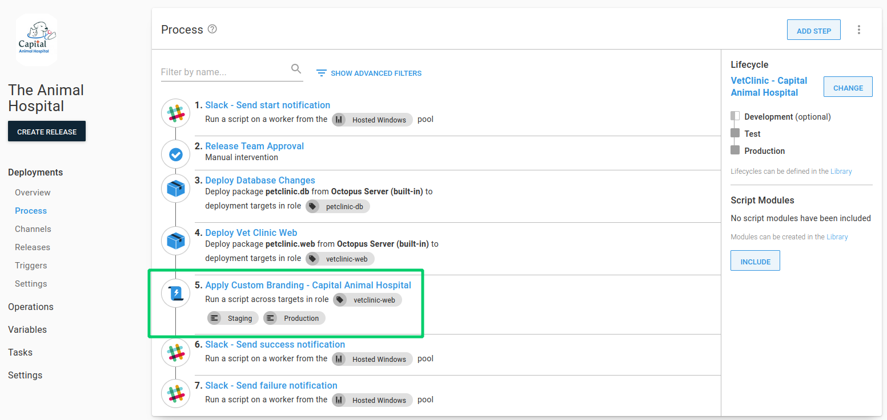
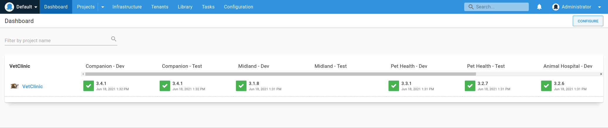

Most people who use Octopus use it to deploy projects to one or more environment. For customers who are providing Software as a Service (SaaS) applications, they'll typically need to deploy multiple instances of the application for each of their customers.

The good news is there's a feature thats been around since [Octopus 3.4](https://octopus.com/blog/whats-new-multi-tenant-deployments) designed exactly for these types of deployment, [multi-tenancy](https://octopus.com/docs/deployments/patterns/multi-tenant-deployments).

In this post, I give an overview of two different approaches to deploying applications without tenants, and then discuss the benefits of using the multi-tenancy feature. 

:::hint
This post assumes knowledge of key Octopus concepts, including projects, environments variables, and lifecycles. If you're new to Octopus, I recommend reading through our [Getting started with Octopus guide](https://octopus.com/docs/getting-started).
:::

## Deploying without tenants {#deploying-without-tenants}

There are two main ways we see implemented when deploying multiple instances of the same application for each customer:

- Using [multiple projects](#using-multiple-projects)
- Using [multiple environments](#uing-multiple-environments)

While easy to set up, in either case, this can quickly become overwhelming. It doesn't scale well and can result in duplication.

### Using multiple projects {#using-multiple-projects}

In this scenario, you would configure Octopus with multiple projects, each one representing one of your customers. 

Onboarding a new customer typically requires creating all of the resources in Octopus that's required for a successful deployment for the customer including:

- A new set of [deployment targets](https://octopus.com/docs/infrastructure/deployment-targets)
- Common [project variables](https://octopus.com/docs/projects/variables)
- Any customer specific "paid-for" [environments](https://octopus.com/docs/infrastructure/environments)

In addition, any common steps across the application's deployment process need to be duplicated in the new project. This is usually things like manual intervention and notification steps.

#### Multiple projects pros {#multiple-projects-pros}

So why might you choose multiple Octopus projects to deploy instances of an application to each customer?

1. **Clear customer release dashboard overview**

    This approach allows you to see exactly which release has been deployed to which environment, for each customer on the dashboard overview.

1. **Variable and Deployment process isolation**

    Multiple projects allow for complete isolation of variables, and deployment process for a customer. For example, making a change to one project's process only affects that one customer. You can also tailor the deployment process for the customer depending on what features they have signed up for. 

    In the below example, only **Capital Animal Hospital** has a step for applying custom branding:

    

1. **Simpler enviroment and variable scoping**

    Environments don't need to be duplicated per customer making for a simpler lifecycle configuration. Variables can also be scoped to each environment without risk of choosing the wrong "customer" scoping.

    

#### Multiple projects cons {#multiple-projects-cons}

Whilst multiple projects can be used as a way to deploy customer instances separately, there are a number of problems with this approach.

1. **Duplicated project configuration**

    With every customer project, you end up duplicating project configuration including variables, deployment process steps, runbooks, channels and lifecycles. With duplication comes inconsistency and the overhead of managing that. For example, if you wanted to amend the deployment process for all of your customers, this involves changing multiple projects.

1. **Different deployment target roles per customer**

    If your customers have isolated infrastructure, you need to establish a unique way for Octopus to know which deployment targets belong to the customer you are deploying to. This results in each customers' deployment targets needing target roles that include some kind of differentiator per customer. This is typically a customer name, code or ID.

    

1. **Multiple projects per customer doesn't scale**

    The per-project approach doesn't scale well when you have more than a handful of customers. This can be more problematic if you deploy many more applications per customer. Each application needs to be modelled `n times` where `n` is the number of customers you have.

1. **No guard rails to ensure variables provided**

    Using multiple projects, there are no guard rails to ensure all of the project configuration is set correctly. For example, if a variable is not added (or has an incorrect value), you might not find out about the issue until the deployment of the customer's instance.

### Using multiple environments {#using-multiple-environments}

An alternative approach to deploy without tenants is to use a single Octopus project per application, and instead model each customer with a set of environments they deploy to. 

Onboarding a new customer typically involves:

- Creating a new set of [environments](https://octopus.com/docs/infrastructure/environments), named after the customer.
- Creating a new set of [deployment targets](https://octopus.com/docs/infrastructure/deployment-targets), or re-using existing ones and tagging them with the associated customer environments.
- Adding new [environment-scoped variables](https://octopus.com/docs/projects/variables/#scoping-variables)
- Updating the project lifecycle to include the new customer environments

#### Multiple environment pros {#multiple-environment-pros}

So why might you choose one or more environments to represent your customers in Octopus?

1. **Single set of project resources to manage**

    In contrast to multiple projects, with this approach there is just one project, one deployment process, one set of variables, and one lifecycle to manage. When a change is required, it can be made once instead of per project. For example, if you wanted to add a step that was required for all customers, such as a Manual intervention step before deployments to production it can be added quickly and easily. 

1. **Customer environments are modelled explictly**

    With this approach it's easy to identify exactly which environment a customer deploys to. The dashboard overview shows in a single row which version has been deployed to which customer environment. When a new customer is added, the environment they deploy to has to be created to allow deployment for that customer.

#### Multiple environment cons {#multiple-environment-cons}

Although you can use multiple customer environments, there are usually a large number of problems associated with this approach:

1. **Multiple environments created per customer**

    The most obvious issue is that for each customer, you need to create a new environment for each environment, which doesn't scale. For example, if you have 10 customers, and 4 environments, Development, Test, Staging and Production, you'd need to create 40 customer environments.

1. **Complicated variable scoping**

    As there is a single project per application, handling multiple variable values per customer needs to be achieved using different environment scopes. This can quickly become overwhelming. Adding new values, or editing existing ones has to be done carefully to ensure correct scopes are applied to each value. The risk of cross tenant communication in this model can be high.

    

1. **Rigid deployment process** 

    Customising the deployment process in a project using multiple customers requires you to add [environment run conditions](https://octopus.com/docs/projects/steps/conditions#environments) for each step that needs to be run for specific customers. This isn't flexible and doesn't scale as you'd need to modify these conditions per step both when you add a new customer or change your environments.

    

1.  **Unclear customer release dashboard overview**

    In direct contrast to the per-project customer model, it's very difficult to see at a glance which release has been deployed to which customer on both the dashboard and project overview screens without endless scrolling.

1. **Complicated, unwieldy Lifecycle**

    As you onboard new customers, you typically have to add new customer environments to the project's lifecycle. By doing so, you have to define awkward lifecycle phases that fit the environments that are required for each customer (both existing and new). Typically this is handled with a phase that allows *any 1* customer environment to be deployed to before progressing to the next phase. As the number of customers grows, so does the complexity of the lifecycle and its phases.
    
    

## Deploying with tenants {#deploying-with-tenants}

Using Tenants in Octopus allow you to easily create customer specific deployment pipelines without duplicating project configuration. You can manage separate instances of your application in multiple environments in a single Octopus project.

//TODO

## Conclusion {#conclusion}

This post covered some of the common approaches we see when customers deploy projects to one or more environments.

I hope you can see how the Octopus multi-tenancy feature solves some of the problems with the common approaches, and can be leveraged for scalable, reusable, simplified deployments

Happy deployments!

## Learn more {#learn-more}

