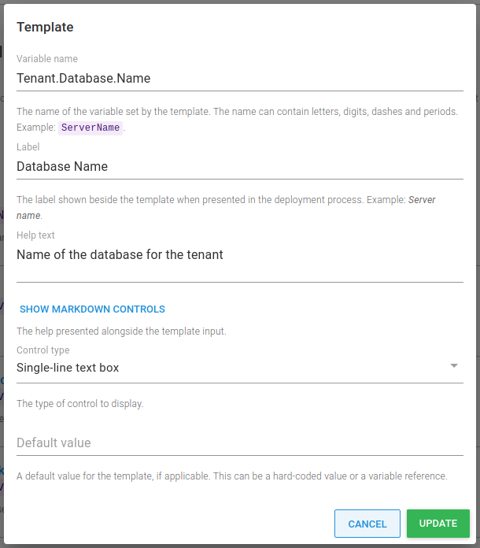

Most people who use Octopus use it to deploy projects to one or more environment. For customers who are providing Software as a Service (SaaS) applications, they'll typically need to deploy multiple instances of the application for each of their customers.

The good news is there's a feature thats been around since [Octopus 3.4](https://octopus.com/blog/whats-new-multi-tenant-deployments) designed exactly for these types of deployment, [multi-tenancy](https://octopus.com/docs/tenants).

In this post, I give an overview of two different approaches to deploying applications without tenants, and then discuss the benefits of using the multi-tenancy feature. 

!toc

## Introduction

This post assumes knowledge of some key Octopus concepts, including projects, environments, variables, and lifecycles. If you're new to Octopus, I recommend reading through our [Getting started with Octopus guide](https://octopus.com/docs/getting-started). 

I'm going to use a fictitious company called **Vet Clinic**, based on deploying the Java application, [Pet Clinic](https://github.com/spring-projects/spring-petclinic) to show the different ways you can model deployments of multiple instances of an application with Octopus.

## Deploying without tenants {#deploying-without-tenants}

There are two main ways we see implemented when deploying multiple instances of the same application for each customer:

1. Using [multiple projects](#using-multiple-projects)
1.  Using [multiple environments](#uing-multiple-environments)

While easy to set up, in either case, this can quickly become overwhelming. It doesn't scale well and can result in duplication.

### Using multiple projects {#using-multiple-projects}

In this scenario, you would configure Octopus with multiple projects, each one representing one of your customers. 

Onboarding a new customer typically requires creating all of the resources in Octopus that's required for a successful deployment for the customer including:

- A new set of [deployment targets](https://octopus.com/docs/infrastructure/deployment-targets)
- Common [project variables](https://octopus.com/docs/projects/variables)
- Any customer specific "paid-for" [environments](https://octopus.com/docs/infrastructure/environments)

In addition, any common steps across the application's deployment process need to be duplicated in the new project. This is usually things like manual intervention and notification steps.

#### Multiple projects pros {#multiple-projects-pros}

So why might you choose multiple Octopus projects to deploy instances of an application to each customer?

1. **Clear customer release dashboard overview**

    This approach allows you to see exactly which release has been deployed to which environment, for each customer on the dashboard overview.

1. **Variable and Deployment process isolation**

    Multiple projects allow for complete isolation of variables, and deployment process for a customer. For example, making a change to one project's process only affects that one customer. You can also tailor the deployment process for the customer depending on what features they have signed up for. 

    In the below example, only **Capital Animal Hospital** has a step for applying custom branding:

    

1. **Simpler environment and variable scoping**

    Environments don't need to be duplicated per customer making for a simpler lifecycle configuration. Variables can also be scoped to each environment without risk of choosing the wrong "customer" scoping.

    

#### Multiple projects cons {#multiple-projects-cons}

Whilst multiple projects can be used as a way to deploy customer instances separately, there are a number of problems with this approach.

1. **Duplicated project configuration**

    With every customer project, you end up duplicating project configuration including variables, deployment process steps, runbooks, channels and lifecycles. With duplication comes inconsistency and the overhead of managing that. For example, if you wanted to amend the deployment process for all of your customers, this involves changing multiple projects.

1. **Different deployment target roles per customer**

    If your customers have isolated infrastructure, you need to establish a unique way for Octopus to know which deployment targets belong to the customer you are deploying to. This results in each customers' deployment targets needing target roles that include some kind of differentiator per customer. This is typically a customer name, code or ID.

    

1. **Multiple projects per customer doesn't scale**

    The per-project approach doesn't scale well when you have more than a handful of customers. This can be more problematic if you deploy many more applications per customer. Each application needs to be modelled `n times`, where `n` is the number of customers you have.

1. **No guard rails to ensure variables provided**

    Using multiple projects, there are no guard rails to ensure all of the project configuration is set correctly. For example, if a variable is not added (or has an incorrect value), you might not find out about the issue until the deployment of the customer's instance.

### Using multiple environments {#using-multiple-environments}

An alternative approach to deploy without tenants is to use a single Octopus project per application, and instead model each customer with a set of environments they deploy to. 

Onboarding a new customer typically involves:

- Creating a new set of [environments](https://octopus.com/docs/infrastructure/environments), named after the customer.
- Creating a new set of [deployment targets](https://octopus.com/docs/infrastructure/deployment-targets), or re-using existing ones and tagging them with the associated customer environments.
- Adding new [environment-scoped variables](https://octopus.com/docs/projects/variables/#scoping-variables)
- Updating the project lifecycle to include the new customer environments

#### Multiple environment pros {#multiple-environment-pros}

So why might you choose one or more environments to represent your customers in Octopus?

1. **Single set of project resources to manage**

    In contrast to multiple projects, with this approach there is just one project, one deployment process, one set of variables, and one lifecycle to manage. When a change is required, it can be made once instead of per project. For example, if you wanted to add a step that was required for all customers, such as a Manual intervention step before deployments to production it can be added quickly and easily. 

1. **Customer environments are modelled explictly**

    With this approach customer environments have to be modelled explicitly. When a new customer is added, the environment they deploy to has to be created to allow deployment for that customer. It's also possible to see in a single row on the dashboard overview which environment a customer can deploy to.

#### Multiple environment cons {#multiple-environment-cons}

Although you can use multiple customer environments, there are usually a large number of problems associated with this approach:

1. **Multiple environments created per customer**

    The most obvious issue is that for each customer, you need to create a new environment record for each customer environment, which doesn't scale. For example, if you have 10 customers, and 4 environments, Development, Test, Staging and Production, you'd need to create 40 customer environments.

1. **Complicated variable scoping**

    As there is a single project per application, handling multiple variable values per customer needs to be achieved using different environment scopes. This can quickly become overwhelming. Adding new values, or editing existing ones has to be done carefully to ensure correct scopes are applied to each value. The risk of cross tenant communication in this model can be high.

    

1. **Rigid deployment process** 

    Customising the deployment process in a project using multiple customers requires you to add [environment run conditions](https://octopus.com/docs/projects/steps/conditions#environments) for each step that needs to be run for specific customers. This isn't flexible and doesn't scale as you'd need to modify these conditions per step both when you add a new customer or change your environments.

    

1.  **Unclear customer release dashboard overview**

    In direct contrast to the per-project customer model, it's very difficult to see at a glance which release has been deployed to which customer on both the dashboard and project overview screens without endless scrolling.

1. **Complicated, unwieldy Lifecycle**

    As you onboard new customers, you typically have to add new customer environments to the project's lifecycle. By doing so, you have to define awkward lifecycle phases that fit the environments that are required for each customer (both existing and new). Typically this is handled with a phase that allows *any 1* customer environment to be deployed to before progressing to the next phase. As the number of customers grows, so does the complexity of the lifecycle and its phases.
    
    

## Deploying with tenants {#deploying-with-tenants}

Using tenants in Octopus allow you to easily create customer specific deployment pipelines without duplicating project configuration. You can manage separate instances of your application in multiple environments in a single Octopus project.

Keeping with our **Vet Clinic** fictitious company, here's what the dashboard overview might look like using tenants to model each customer:

This gives us a nice concise overview showing which release is in which environment. Instead of multiple rows per customer project, this is replaced with a discrete count of the number of tenants who have been deployed to each environment.

If we navigate into the project, we see a much more granular overview, this time showing which tenant has what release in each environment:

:::success
**Sample Octopus project**
You can see an example of the Vet Clinic tenanted project in our [samples instance](https://g.octopushq.com/PatternTenantsSampleVetClinic).
:::

There are a number of multi-tenancy features working together to make this happen:

- [Tenants](#tenants)
- [Tenant tags](#tenant-tags)
- [Tenant variables](#tenant-variables)
- [Tenanted deployment targets](#tenanted-deployment-targets)

### Tenants {#tenants}

Tenants in Octopus are the backbone of the multi-tenancy feature. They usually represent the customers of your application, especially when it comes to SaaS products.

Although we discuss the use of tenants to model customers in this post, we designed tenants to be generic so that they can satisfy multiple use cases. Tenants can also represent:

- Geographical regions or datacenters
- Developers, testers, or Teams
- Feature branches

:::hint
Learn more about types of tenancy in our [documentation](https://octopus.com/docs/tenants/tenant-types).
:::

The tenant overview provides a central place to manage which projects are connected to a tenant, and also which environment too.

It's worth mentioning that each project can control its interaction with tenants. By default the multi-tenant deployment features are disabled. You can allow deployments with/without a tenant, which is a hybrid mode that is useful when you are transitioning to a fully multi-tenant project. There is also a mode where you can require a tenant for all deployments, which disables untenanted deployments for that project.

Onboarding a new customer as a tenant in Octopus can be as simple as creating your tenant, connecting your project to each applicable environment and entering your variable values, and deploying.

### Tenant tags {#tenant-tags}

In Octopus, [tenant tags](https://octopus.com/docs/tenants/tenant-tags) help you to classify your tenants using custom tags that meet your needs, and tailor tenanted deployments for your projects and environments. 

Tenant tags also make it easier to work with tenants as groups instead of individuals. As tenant tags are fully customisable, you can apply meaningful metadata to tenants, allowing you to describe them using your own terminology, and tailor the deployment process to their needs.

In the tenant overview below, **Capital Animal Hospital** has the `Branding` tag included:

This is used to indicate that they have opted-in for customised branding of their instance of the **Vet Clinic** application.

When you build out the deployment process, you can include a tenant tag as a run condition to customise the process for your customers. By applying tags to steps, you are able to specify steps that should only run for customers that match selected tenant tags.

You can associate multiple tenants with the same tag. By doing so, this automatically groups these tenants together and enables any tenant with the `Branding` tag to have the custom branding step included as part of any deployment for that tenant.

Tenant tags can also be used to associate multiple tenants with deployment targets, channels and even choosing which tenants to deploy to. They are a powerful way to help you simplify and scale your deployments.

### Tenant variables {#tenant-variables}

You often want to define variable values that are different for each customer. For example:

- A database server name or connection string
- A tenant-specific URL
- Contact details for a tenant

Using an untenanted project, you would define these values in the project itself. With a tenanted project, you can set these values directly on the tenant for any connected projects.

With tenants, there are two types of variable you can specify; **project variable templates** and **common variables**.

Both of these types use the [variable templates](https://octopus.com/docs/projects/variables/variable-templates) feature.

#### Project variable templates {#project-variable-templates}

Project variables allow you to specify a variable which a tenant can change. A perfect example would be a connection string or a database server. With project variables you define them at the project level using [project templates](https://octopus.com/docs/projects/variables/variable-templates#project-templates).

You can specify the variable type for the project template, just like regular variables. You can also provide a default value which the tenant can overwrite.

Then, on the tenant variable screen, you can set those variables.

#### Common variables {#common-variables}

Common variables are similar to project variables. The main difference between the two is that common variables can be used across multiple projects, and they aren't scoped to environments. Common variables are defined using [Library variable set templates](https://octopus.com/docs/projects/variables/variable-templates#adding-a-variable-template)

For example, if we wanted to define an abbreviation for the tenant to use in a deployment or runbook, we can configure a variable template for the library set.

:::success
To include common variables for a tenant, you must add the library variable set in the tenant connected project.
:::

Just like project variables, common variable values are supplied at the tenant level.

#### Variable snapshot {#variable-snapshot}

When you [create a release](https://octopus.com/docs/octopus-rest-api/octopus-cli/create-release) Octopus takes a snapshot of the deployment process and the current state of the [project variables](https://octopus.com/docs/projects/variables). 

However, tenant variables *aren't* included in any snapshot. This is probably my favourite feature of multi-tenancy as it enables you to add new tenants at any time and deploy to them without creating a new release. 

This also means any changes you make to tenant variables will take immediate effect.

#### Missing variables {#missing-variables} 

One of the great things about tenant variables is the guard rails they put in place for your deployments. Defining either a project template or common variable without a default value means that any tenant must provide a value for that variable. Octopus won't allow a deployment to occur without one:

But those guard rails don't start just at deployment. Octopus will also warn you about any missing values in the tenant's variable overview too:

With this level of safety, you have a higher chance of successful deployment for a tenant without a missing or incorrect variable value.

### Tenanted deployment targets {#tenanted-deployment-targets}

The way you host your infrastructure for multiple instances of the same project typically varies depending on your application and customers. Two of the most common implementations we see are:

1. **Dedicated hosting**: You have dedicated deployment targets for each customer.
1. **Shared hosting**: You create farms or pools of servers to host all of your customers, achieving higher density.

:::hint
In this post, we'll focus on dedicated hosting, but it's worth stating that you can design and implement both dedicated and shared multi-tenant hosting models in Octopus using [environments](https://octopus.com/docs/infrastructure/environments), [deployment targets](https://octopus.com/docs/infrastructure), and [tenant tags](https://octopus.com/docs/tenants/tenant-tags).
:::

If your customers have isolated infrastructure, in an untenanted configuration, you'd need to define unique target roles in Octopus to ensure there was no cross-customer communication in the form of deploying one customers application to another customers infrastructure.

Using tenants, customer-specific target roles aren't required. You can choose the kinds of deployments that a target can be involved in:

- Exclude from tenanted deployments (default) - the deployment target will never be included in tenanted deployments.
- Include only in tenanted deployments - the deployment target will only be included in deployments to the associated tenants. It will be excluded from untenanted deployments.
- Include in both tenanted and untenanted deployments - The deployment target will be included in untenanted deployments, and deployments to the associated tenants.

To choose which tenants to associate with a deployment target navigate to the **{{Restrictions, Associated Tenant}}** section of the deployment target. You can select one or more tenants to allow to deploy to individually, or you can choose from any of the configured tenant tags.

We recommend keeping tenanted and untenanted deployment targets separate, particularly in Production. You could use the same deployment targets for other environments but it's generally better to avoid this situation.

## Conclusion {#conclusion}

This post covered some common approaches we see when customers deploy multiple instances of the same application for each of their customers without tenants, as well as how you can use the multi-tenancy feature to model this too.

I hope you can see how the Octopus multi-tenancy feature solves some of the problems presented when deploying without tenants, and how it can be leveraged for scalable, reusable, simplified deployments.

Happy deployments!

## Learn more {#learn-more}

- [Multi-tenancy documentation](https://octopus.com/docs/tenants)
- [Multi-tenancy guides](https://octopus.com/docs/tenants/guides)
