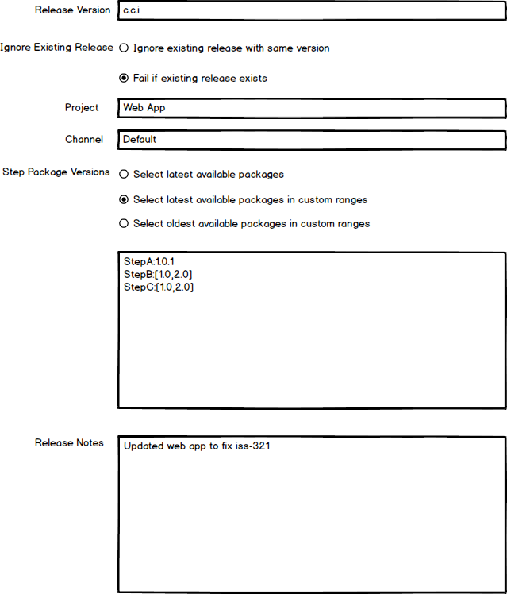
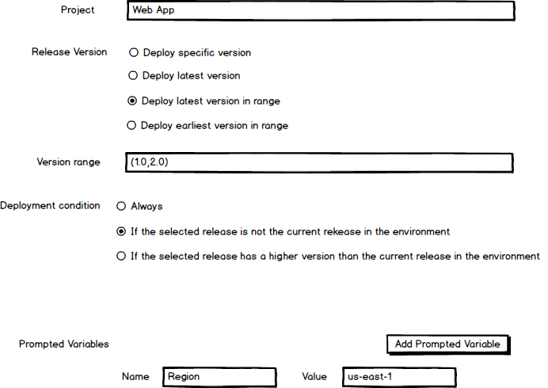
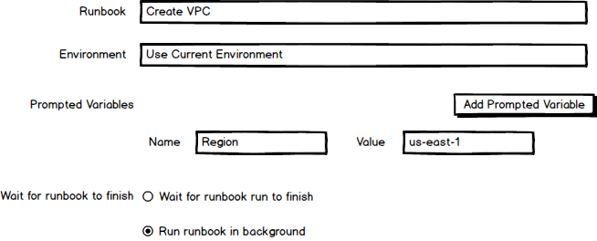
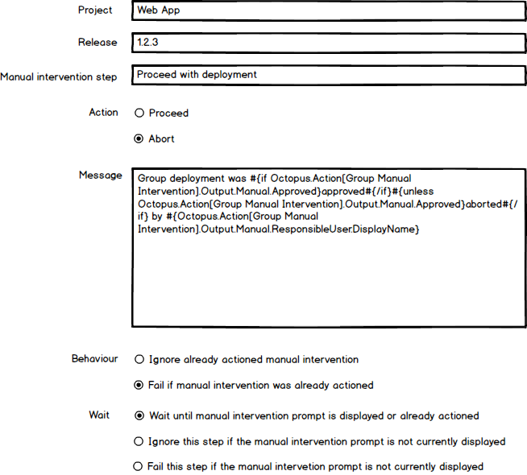

Octopus has evolved over the years to make complex deployments easy with best practice features such as environments and targets, unique concepts like tenants and runbooks, and useful management tools like spaces.

However, while Octopus is one of the best tools available for managing external platforms and deployments, it has become clear that there is one complex platform companies are increasingly relying on for their operations that Octopus is not well suited to managing: Octopus itself. 

Complex deployments often mean thousands of tenants, targets, projects, environments, and spaces, and the only solution today to managing these resources as a group is by directly scripting the Octopus API. [The vision statement for the deploy group](https://docs.google.com/document/d/1Se7ALUyJM6zlXSJYxG_Ay7gHAaggGn8XBfgLr_VmjW0/edit) highlights that Octopus must be democratic, so allowing people from various disciplines and teams to participate in releasing and deploying software is a core value for us. API scripts require a very specialized skill set, and present a roadblock to operating Octopus at scale.

To make Octopus the best tool for managing Octopus, we're proposing a new feature set called "Octopus as a target", with the motto "if you can click it in the UI, you can automate it with a step".

## What problems are we trying to solve?

Customer solutions have identified a number of issues when running Octopus at scale, including:

* [How can I add/update/remove a tenant tag or project to 1000 tenants?](https://trello.com/c/aDij9iLl/148-how-can-i-add-update-remove-a-tenant-tag-or-project-to-1000-tenants)
* [How can I add/update/remove a role or environment to 100 targets?](https://trello.com/c/7Fr0VMDo/149-how-can-i-add-update-remove-a-role-or-environment-to-100-targets)
* [How can I add 40 people to a new team when I am not using external authentication?](https://trello.com/c/R9ZYofD2/164-how-can-i-add-40-people-to-a-new-team-when-i-am-not-using-external-authentication)
* [How can I convert my 200 projects to use execution containers/new azure app service step/workers?](https://trello.com/c/iIUhKHuo/217-how-can-i-convert-my-200-projects-to-use-execution-containers-new-azure-app-service-step-workers)
* [How can I add a new notification step to 200 of my projects?](https://trello.com/c/sIq3nh9q/166-how-can-i-add-a-new-notification-step-to-200-of-my-projects)
* [How can I easily coordinate multiple project deployments?](https://trello.com/c/9IZmL1Oa/159-how-can-i-easily-coordinate-multiple-project-deployments)
* [How can I see and promote all the releases in test not currently in staging?](https://trello.com/c/4IokRDDO/162-how-can-i-see-and-promote-all-the-releases-in-test-not-currently-in-staging)

There is a common pattern to these issues. Interacting with ten things (tenants, roles, projects, deployments etc) is manageable, if tedious. Interacting with hundreds of resources is time consuming and frustrating. Scaling up to thousands of resources and Octopus becomes almost impossible to maintain via the web UI, and requires complex custom scripts.

We know Octopus is the best tool for deploying to thousands of targets. We have seen runbooks empowering teams to manage that same infrastructure. By taking the next logical step and allowing Octopus itself to be managed through these proven processes, we can ensure Octopus will scale to meet enterprise requirements.

## What is out of scope

The proposed steps deliberately do not attempt to introduce any new processes or paradigms to deployment processes or runbooks. They are focused on automating the same interactions typically performed through the UI, likely as part of a runbook.

## The new target

An Octopus instance is represented as a target. It defines the Octopus server URL, a default space, and an API key used to perform actions against the server.

By exposing Octopus as a target and requiring an API key to perform management tasks, Octopus is treated like any other target, and can be placed in the same security contexts such as environments and tenants. Octopus is not given any special access to itself or other instances, and so Octopus targets are managed and restricted like any other target.

## The new steps

The motto "if you can click it in the UI, you can automate it with a step" is an ambitious goal, and will be broken down into areas of common functionality, largely grouped by their placement in the UI. Some examples include:

* Deployments / Runbook runs: Creating releases, deploying releases, responding to manual intervention prompts, running runbooks.
* Tenants: Creating, updating, and deleting tenants. Associating tenants with projects and environments. Adding or removing tenant tags. Defining tenant variables.
* Targets: Creating, updating, and deleting targets. Adding or removing roles. Associating with environments and tenants.
* Users / Teams: Creating, updating, and deleting users and teams. Adding or removing users from teams.
* Certificates: Creating, updating, and deleting certificates. This would likely be paired with scripts using libraries such as [Posh-ACME](https://github.com/rmbolger/Posh-ACME).

The first milestone focuses on automating the process of creating and deploying releases, running runbooks, and interacting with manual interventions.

## Create a release

*I want to automate the process of clicking the **CREATE RELEASE** button.*

Automating the creation of releases allow multiple project releases to be defined with a common set of channels, package versions, and release notes. The **Automate Create Release** step exposes the fields that are defined when clicking the **CREATE RELEASE** button, while also exposing flexible logic when it comes to selecting package versions:

## Deploy a release

*I want to automate the process of clicking the **DEPLOY** button.*

The deployment dashboard provides a grid of environments and project releases, with a handy **DEPLOY** button in the intersection. This makes promoting the release of one project through environments easy. However, it does involve a lot of clicking around when promoting multiple projects to a new environment.

The **Automate Deploy Release** step automates the process usually initiated by clicking the **DEPLOY** button. Unlike the **Deploy a release** step, which treats a project's releases as a feed with versions to be selected at release creation time, the **Automate Deploy Release** step models the actions of an end user, which is usually to deploy the latest release available for a given environment at the current point in time:

## Running runbooks

*I want to automate the process of clicking the **RUN** button.*

Runbooks provide a great way to encapsulate shared functionality. The new **Run a Runbook** step allows a runbook to be executed from a deployment process or runbook:

## Interacting with manual intervention prompts

*I want to automate the process of clicking the manual intervention **PROCEED** or **CANCEL** buttons.*

Manual intervention steps provide the opportunity to verify a deployment through manual testing or prompt to allow a deployment to proceed. When used at scale though it can be hard to know which manual intervention prompts require action, and in which order.

The new **Automate Manual Intervention** step provides the ability to interact with a pending manual intervention in another project. By creating a runbook with many **Automate Manual Intervention** steps, multiple deployments can be allowed to proceed or halted without manually clicking through each project:

## Benefits of the new steps

Octopus does a fantastic job of modeling complex infrastructure, deploying applications to thousands of machines distributed across multiple environments, and running runbooks when and where there are needed. You can orchestrate almost any kind of deployment process or management task with Octopus, so long as you are happy to have someone click the right buttons in the right order at the right time.

From the very beginning, runbooks have been designed to free DevOps teams from disconnected and untested documentation describing a sequence of tasks. Unfortunately, any complex deployment process in Octopus requiring a specific and coordinated sequence of release creations, deployments, and interventions requires advanced API scripting, or some kind of external runbook document and a lot of manual clicking.

The four steps described above are the first of many to allow Octopus itself to be automated from a runbook like any other system. Specifically, we forsee the following benefits for customers deploying at scale:

### The same proven processes, now automated at scale

These steps deliberately don't introduce any new paradigms or concepts for customers to learn and incorporate into their processes. They simply describe the same buttons customers have been clicking and form fields they have been populating all along, allowing them to automate their existing proven and familiar processes, and providing a natural path forward as deployment complexity increases.

### Automation without scripts

Writing custom scripts to automate Octopus is a highly specialized task. It requires a decent level of proficiency writing code and a deep understanding of the internals of Octopus. 

Octopus has always prided itself on making complex deployments easy, and these new steps take that same principal and applies it to Octopus itself. This allows us to fulfil the vision of orchestrating deployments without custom scripts.

### Simple security model

By exposing an Octopus instance as a target, all existing security boundaries are respected and preserved, and all actions will be performed via regular API calls with API keys. These steps won't use any privileged access paths within Octopus, so customers retain complete control.

## What are the next steps

Subsequent milestones would likely focus on delivering steps to automate other Octopus resources that can be hard to manage at scale. These may include resources like tenants, targets, library variable sets etc.

## When are these features being delivered

This RFC has been written to gauge interest and collect feedback for possible strategies to pursue in 2022. We currently have no commitment to building these features.

## We want your feedback

We want your feedback to determine if this feature is a good fit for Octopus. Specifically we would like to know:

* Does it makes sense for Octopus to be able to automate itself or other Octopus instances?
* Will these proposed steps solve problems you have seen customers encountering?
* Would the concept of "Octopus as a target" (once rounded out with additional similar steps) be valuable for your teams in terms of sales, marketing, or solutions?

Please leave your feedback on this [GitHub issue](https://github.com/OctopusDeploy/StepsFeedback/issues/2).