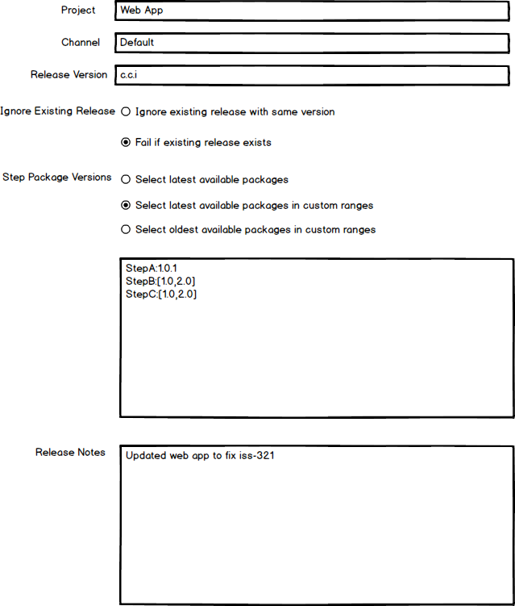
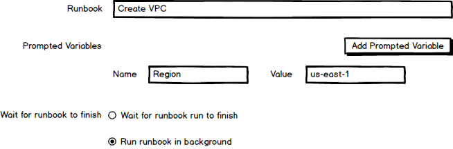

Octopus has evolved over the years to make complex deployments easy with best practice features such as environments and targets, unique concepts like tenants and runbooks, and useful management tools like spaces.

However, while Octopus is one of the best tools available for managing external platforms and deployments, it has become clear that there is one complex platform companies are increasingly relying on for their operations that Octopus is not well suited to managing: Octopus itself. 

Complex deployments often mean thousands of tenants, targets, projects, environments, and spaces, and the only solution today to managing these resources as a group is by directly scripting the Octopus API. [The vision statement for the deploy group](https://docs.google.com/document/d/1Se7ALUyJM6zlXSJYxG_Ay7gHAaggGn8XBfgLr_VmjW0/edit) highlights that Octopus must be democratic, allowing people from various disciplines and teams to participate in releasing and deploying software is a core value for us. API scripts require a very specialized skill set, and so prevent many from operating Octopus at scale.

To make Octopus the best tool for managing Octopus, we're proposing a new feature set called "Octopus as a target" with the motto "if you can click in in the UI, you can automate it with a step".

## What problems are we trying to solve?

Customer solutions have identified a number of issues when running Octopus as scale including:

* [How can I add/update/remove a tenant tag or project to 1000 tenants?](https://trello.com/c/aDij9iLl/148-how-can-i-add-update-remove-a-tenant-tag-or-project-to-1000-tenants)
* [How can I add/update/remove a role or environment to 100 targets?](https://trello.com/c/7Fr0VMDo/149-how-can-i-add-update-remove-a-role-or-environment-to-100-targets)
* [How can I add 40 people to a new team when I am not using external authentication?](https://trello.com/c/R9ZYofD2/164-how-can-i-add-40-people-to-a-new-team-when-i-am-not-using-external-authentication)
* [How can I convert my 200 projects to use execution containers/new azure app service step/workers?](https://trello.com/c/iIUhKHuo/217-how-can-i-convert-my-200-projects-to-use-execution-containers-new-azure-app-service-step-workers)
* [How can I add a new notification step to 200 of my projects?](https://trello.com/c/sIq3nh9q/166-how-can-i-add-a-new-notification-step-to-200-of-my-projects)
* [How can I easily coordinate multiple project deployments?](https://trello.com/c/9IZmL1Oa/159-how-can-i-easily-coordinate-multiple-project-deployments)
* [How can I see and promote all the releases in test not currently in staging?](https://trello.com/c/4IokRDDO/162-how-can-i-see-and-promote-all-the-releases-in-test-not-currently-in-staging)

There is a common pattern to these issues. Configuring 10 things (tenants, roles, projects, deployments etc) is manageable, if tedious. Configuring 100's of resources is time consuming and frustrating. Scaling up to 1000 resources and Octopus becomes almost impossible to maintain.

We know Octopus is the best tool for deploying to thousands of targets. We have seen runbooks allowing teams to manage that same infrastructure. By taking the next logical step and allowing Octopus itself to be managed though a familiar and proven paradigm, we can ensure Octopus will scale to meet enterprise requirements.

## The new target

An Octopus instance is represented as a target. It defines the Octopus server URL, a default space, and an API key used to perform actions against the server.

By exposing Octopus as a target and requiring an API key to perform management tasks, Octopus is treated like any other target, and can be placed in the same security contexts such as environments and tenants. Octopus is not given any special access to itself or other instances, and so Octopus targets are managed and restricted like any other target.

## The new steps

The motto "if you can click in in the UI, you can automate it with a step" is an ambitious goal, and will be broken down into areas of common functionality. The following groups allow us to address the issues of configuring and managing Octopus resources that increase in number as enterprises orchestrate more deployments through Octopus:

* Deployments / Runbook runs - Creating releases, deploying releases, responding to manual intervention prompts. Running runbooks.
* Deployment processes / Runbooks - Creating, updating, and deleting steps in a deployment process. Applying cross cutting configuration like execution containers, target roles, environment conditions, tenant conditions, run conditions etc.
* Tenants - Creating, updating, and deleting tenants. Associating tenants with projects and environments. Adding or removing tenant tags. Defining tenant variables.
* Targets - Creating, updating, and deleting targets. Adding or removing roles. Associating with environments and tenants.
* Users / Teams - Creating, updating, and deleting users and teams. Adding or removing users from teams.

## Create a release

Automating the creation of releases allow multiple applications releases to be created with a common set of channels, package versions, and release notes. The **Create a Release** step exposes the fields that are defined when clicking the **CREATE RELEASE** button, while also exposing some flexible logic when it comes to selecting package versions:

The existing **Deploy a Release** step will be updated to allow the release version to be defined in the step, allowing administrators to chain the **Create a Release** and **Deploy a Release** steps.

By capturing the details of release creation in a step, common values can be extracted and shared as variables, and multiple releases can be created and deployed with a single runbook run.

## Running runbooks

Runbooks provide a great way to encapsulate common functionality. The new **Run a Runbook** step allows a runbook to be executed from a deployment process or runbook:

## Interacting with manual intervention prompts

Manual intervention steps provide the opportunity to verify a deployment through manual testing or prompt to allow a deployment to proceed. When used at scale though it can be hard to know which manual intervention prompts require action, and in which order.

The new **Action a Manual Intervention** step provides the ability to interact with a pending manual intervention in another project. By creating a runbook with many **Action a Manual Intervention** steps, multiple deployments can be allowed to proceed or halted without manually clicking through each project:

