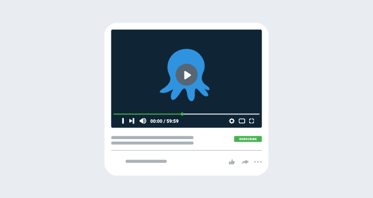

June was a busy month for Octopus Deploy. In this post, I share some of our latest content and resources I think you'll find useful. 

## Webinars

We held two webinars in June. You can see the replays for both below. We've also been busy creating a new and improved [Webinar page](https://octopus.com/events) where you can see our upcoming webinars and the recordings. 

### What's new in Octopus 2020.6 and 2021.1

In this webinar, we share the new features from our first two releases of 2021. 

2020.6 is a transition release, as it's the last release of 2020 and the first release of 2021. You can read more about this in our [2021 Q1 release blog](https://octopus.com/blog/octopus-release-2021-q1).

In 2020.6 and 2021.1, we added:

- Octopus Server Linux Docker Image
- Tentacle for ARM/ARM64
- Global Search
- API Keys improvements
- Project Migrations
- New and improved Azure App Service step
- Github Actions for Octopus Deploy

<iframe width="560" height="315" src="https://www.youtube.com/embed/Dm4vOwuo9GI" frameborder="0" allowfullscreen></iframe>

### Self-hosting Octopus on Linux

Containers are a hot topic. Octopus Cloud has been using Linux containers for over a year, and from 2020.6, it is the recommended way to run Octopus in a container.

In this webinar, Octopus Deploy's Solutions Architects, Derek Campbell and Adam Close, run the Octopus Linux container locally, then upgrade the container to 2021.1. They explain the concepts involved and deploy the container onto Microsoft's cloud-managed Azure Kubernetes Service (AKS).

<iframe width="560" height="315" src="https://www.youtube.com/embed/UhR2QppsJ08" frameborder="0" allowfullscreen></iframe>

## Step Templates of the month

Mark Harrison, a Solutions Architect at Octopus Deploy, has been busy creating new secrets retrieval step templates. If you're using [Azure Key Vault](https://azure.microsoft.com/en-au/services/key-vault/) or [Vault for Hashicorp](https://www.vaultproject.io/), you might find the new community step templates useful:

- [Azure Key Vault - Retrieve Secrets](https://library.octopus.com/step-templates/6f59f8aa-b2db-4f7a-b02d-a72c13d386f0/actiontemplate-azure-key-vault-retrieve-secrets)
- [HashiCorp Vault - AppRole Get Wrapped Secret ID](https://library.octopus.com/step-templates/76827264-af27-46d0-913a-e093a4f0db48/actiontemplate-hashicorp-vault-approle-get-wrapped-secret-id)
- [HashiCorp Vault - AppRole Login](https://library.octopus.com/step-templates/e04a9cec-f04a-4da2-849b-1aed0fd408f0/actiontemplate-hashicorp-vault-approle-login)
- [HashiCorp Vault - AppRole Unwrap Secret ID](https://library.octopus.com/step-templates/c1f56030-0bcd-458d-bc70-b4f43ec0d30f/actiontemplate-hashicorp-vault-approle-unwrap-secret-id)
- [HashiCorp Vault - AppRole Unwrap Secret ID and Login](https://library.octopus.com/step-templates/aa113393-e615-40ed-9c5a-f95f471d728f/actiontemplate-hashicorp-vault-approle-unwrap-secret-id-and-login)
- [HashiCorp Vault - Key Value (v1) retrieve secrets](https://library.octopus.com/step-templates/9aab9522-25e0-4539-841c-8b726e6b1520/actiontemplate-hashicorp-vault-key-value-(v1)-retrieve-secrets)
- [HashiCorp Vault - Key Value (v2) retrieve secrets](https://library.octopus.com/step-templates/337f1b67-cdb0-4f33-9e08-6bf804f672d2/actiontemplate-hashicorp-vault-key-value-(v2)-retrieve-secrets)
- [HashiCorp Vault - LDAP Login](https://library.octopus.com/step-templates/de807003-3b05-4649-9af3-11a2c7722b3f/actiontemplate-hashicorp-vault-ldap-login)

## Documentation updates

We're constantly reviewing and improving our docs. These are some of our most recent updates:

- The Octopus [upgrade guide](https://octopus.com/docs/administration/upgrading/guide/automate-upgrades) now includes scripts to allow a fully automated process to upgrade an Octopus instance.
- We've updated the Octopus [High Availability docs](https://octopus.com/docs/administration/high-availability) to include detailed guides for On-Premises, AWS, and Azure.
- Our guidance for using the tools bundled with both the [AWS PowerShell](https://octopus.com/docs/deployments/custom-scripts/aws-cli-scripts) and [Azure PowerShell](https://octopus.com/docs/deployments/azure/running-azure-powershell) built-in Octopus steps has now changed. We now recommend you configure Octopus Deploy to use your versions of the required tools.
- We've added a section to the Linux Tentacle page about [creating a Tentacle instance without requiring root or sudo privileges](https://octopus.com/docs/infrastructure/deployment-targets/linux/tentacle#rootless-instance-creation).

## Conclusion

I hope these resources are helpful. If there are any topics you’d like us to cover in our blog, or any great third-party content about Octopus Deploy you think we should include, please reach out to me at <derek.campbell@octopus.com>.

Happy deployments!
