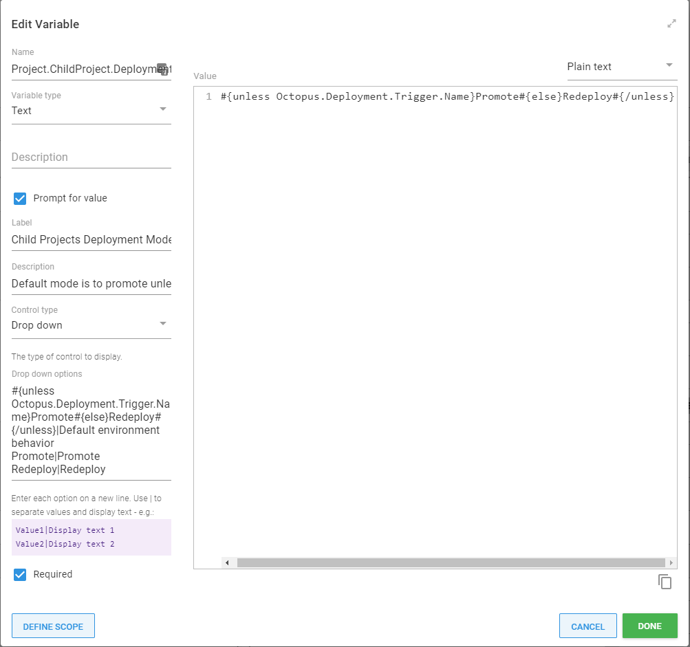
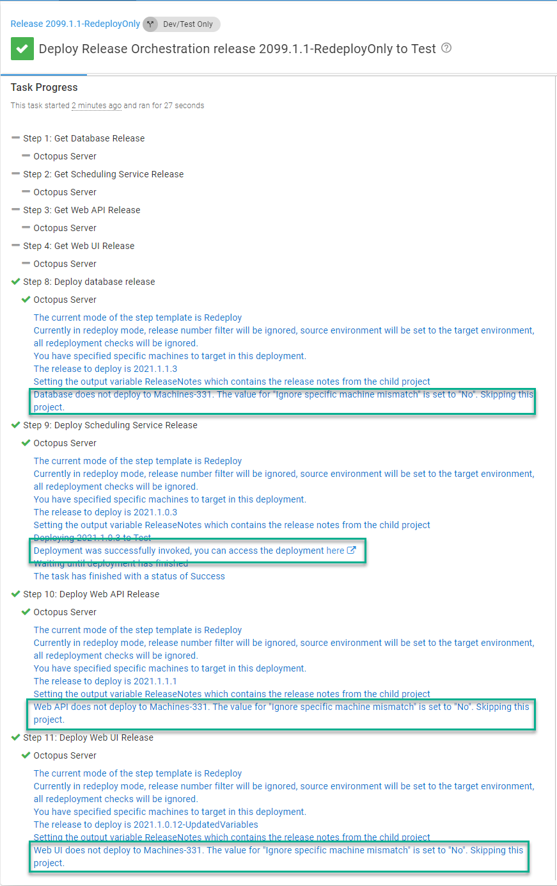

In this post, I talk about release management with dynamic infrastructure and demonstrate how to use the [Deploy Child Octopus Deploy Project](https://library.octopus.com/step-templates/0dac2fe6-91d5-4c05-bdfb-1b97adf1e12e/actiontemplate-deploy-child-octopus-deploy-project) step template.

This is the third post in a series about release management. The previous posts are:

- [Better release management with Octopus Deploy](blog/2021-02/release-management-with-octopus/index.md)
- [Multi-tenancy release management with Octopus Deploy](https://octopus.com/blog/multi-tenancy-release-management)

## Release management and dynamic infrastructure

After reading my first post, a customer asked how to use my step to _redeploy_ a suite of application components, not _promote_ from one environment to another.  I hadn't considered that as a use case when writing the step template, but I should have.  

The customer was rebuilding their test servers periodically, and after some discussion, we landed on these requirements:

- Redeploy the last successful release found in the destination environment.
- The rebuilt server shouldn't host all the components, only run applicable child projects.
- The same project should both redeploy and promote.
- At first, it's okay to enter the target name manually; later, a deployment target trigger should redeploy automatically.

## Child project target filter

Not all applications are hosted on a single deployment target. Consider this example for staging:

- **Database**: No targets, only workers
- **Scheduling Service**: `s-app-service-01`
- **Web API**: `s-web-api-01` and `s-web-api-02`
- **Web UI**: `s-web-ui-01` and `s-web-ui-02`

To rebuild `s-web-api-01` and `s-app-service-01`, I only want to redeploy the **Scheduling Service** and **Web API** projects.  But only for the related project/server combination.  I don't want to deploy the **Scheduling Service** to `s-web-api-01` or the **Web API** to `s-app-service-01`.  

One objective with the [Deploy Child Octopus Deploy Project step template](https://library.octopus.com/step-templates/0dac2fe6-91d5-4c05-bdfb-1b97adf1e12e/actiontemplate-deploy-child-octopus-deploy-project) is that it will _just work_.  I want to remove as much psychological weight as possible when promoting/deploying an application suite.  

That objective applies to this scenario.  When the parent/release orchestration project is given a specific set of machines to deploy, it will compare that list with the machines the child project can deploy to.  Using the same scenario:

- **Database**: No targets; the project is skipped.
- **Scheduling Service**: Deploys to only `s-app-service-01`.  It will remove `s-web-api-01` from the list of targets before redeploying the child project.
- **Web API**: deploys to only `s-web-api-01` and `s-web-api-02`.  It will remove `s-app-service-01` from the list of targets and only deploy to `s-web-api-01` when the redeployment occurs.
- **Web UI**: The two rebuilt servers do not match any servers this project deploys to.  The Web UI project will be skipped.

This functionality is multi-tenant aware.  It filters out all unrelated targets for that tenant when filtering out the deployment targets for a multi-tenant child project.

## Deployment mode
The step template has been updated to support two deployment modes:

- **Promote**: Default behavior promotes the latest successful release from the source environment to the target environment.
- **Redeploy**: Take the most recent successful release found in the destination environment and redeploy it.

Although I didn't want to add another parameter, I couldn't find another solution.  There are too many edge cases.  It made more sense to let you choose the mode.

This functionality is also multi-tenant aware; if you're redeploying a multi-tenant project, it finds the most recent successful release for that tenant in the destination environment.  

:::hint
I recommend setting this to a [prompted variable](https://octopus.com/docs/projects/variables/prompted-variables) with the default set to **Promote**.  This lets you change the behavior of the parent/release orchestration project on the fly.
:::

## Examples

For this post, I will convert the project I created in the [first post](https://octopus.com/blog/release-management-with-octopus) of this series.  When complete, the project will:

- Redeploy the latest release in **Development**, **Test**, **Staging** and **Production**.
- Redeploy to a specific target or all targets.
- Configure a deployment target trigger to handle auto-scaling.
- Allow releases to **Staging** and **Production** to be configured for redeployments or promotion.

When we finished the first post, we had a release orchestration project that deployed to **Staging**, **Prod Approval**, and **Production**.


The deployment process will:

1. Determine the releases to promote and gather all the release notes for each child project. 
1. Approve the releases to promote (**Prod Approval** environment only).
1. Promote the child project releases from **Test** to **Staging**, or **Staging** to **Production**.


The [Deploy Child Octopus Deploy Project step template](https://library.octopus.com/step-templates/0dac2fe6-91d5-4c05-bdfb-1b97adf1e12e/actiontemplate-deploy-child-octopus-deploy-project) has the following parameters set:  


The only difference between each step is:

- The `What if` parameter is set to `Yes` on all the **Get [Child Project Name] Release** steps.
- The child project name is different on each step.

As you can see, this process makes heavy use of variables.  Those variable definitions are:


## Scenario #1: Manual redeployments

A release usually promotes from **Test** to **Staging**, or **Staging** to **Production**.  In some scenarios though, it also makes sense to redeploy what is in **Staging** or in **Production**.  

For example:

- During a **Staging** environment refresh, when data is copied and sanitized from **Production** to **Staging**.  When complete, a redeployment occurs to ensure the latest database and code changes are on **Staging**.
- A new server is added in **Production** to handle an increase in traffic.
- A server isn't responding as expected and needs to be _kicked_.

### Variables

I am going to update my variables so that the process:

- Only allows promotion in **Prod Approval**.
- Allows both redeployments and promotion via a prompted variable in **Staging** and **Production**.  
- Allows the user to select the machine they want to redeploy via a prompted variable for **Staging** and **Production**.  **Prod Approval** does not allow that functionality.
- Creates a variable to use as a run condition for the **Get [component] release** steps.  It will return `True` (the step will run) when in promotion mode.  It will return `False` (the step will be skipped) when in redeploy mode.


:::hint
The specific machine variable is set to `N/A` because that's the default value for the step template.  The step template will see that and ignore the specific machine functionality.  The value `N/A` should make it easier for prompted variables.
:::

### Deployment Process

In all the **Get [component] release steps**, I update the deployment mode, specific machines, and run conditions to use the new variables created.


For the deployment steps, only the deployment mode and specific machines parameters are updated.


### Create the release

Creating a release to **Staging**, **Prod Approval**, and **Production** is the same as before.  


### Promoting the release

Most of the time, users will leave the prompted variables as they are and run a promotion.  


That will continue to function as it always has.


### Triggering a redeployment

You can also opt to do a redeployment by changing the prompted variable to redeploy.


That triggers a redeployment of releases in **Staging** or **Production**.


If that release has already been deployed to a specific environment, you can click the overflow menu (three vertical ellipsis points) in the top-right menu and select **Re-deploy...**.


### Redeploying to a specific machine

You can also opt to redeploy to a specific machine.  


When the deployment runs, the step template will skip any projects not associated with the selected machine.


## Scenario #2: Automatic redeployments when scaling out

The first scenario covered manually selecting deployment targets.  You can also leverage this functionality with a deployment target trigger.  

When a new deployment target is created, you can automatically deploy everything associated with that target.  To do this, we need to make a minor modification to the variables and deployment process.

### Variable changes

In my scenario, I want to support both manual and automatic redeployments.  Supporting both modes still requires a prompted variable, however the default value will change to:

```
#{unless Octopus.Deployment.Trigger.Name}Promote#{else}Redeploy#{/unless}
```

This indicates that when anything but a deployment target trigger is what triggers the deployment, then run a promotion.  If a deployment target trigger is what triggers the deployment, then run a redeploy.  The prompted variable ends up looking like this:



### Create a trigger

Create a trigger for the roles for all the various component projects, `App-Service`, `App-WebApi`, and `App-WebUI`.  It's possible to add a trigger in each of those component projects, however that is extra overhead and maintenance. It's preferable to have one trigger for all, to the release orchestration project.


### Deployment process modifications

There is one problem with the trigger and the existing deployment process, which I'll explain. I also demonstrate how to avoid the problem.  

First, I add a new target for one of those roles in **Staging**.


The trigger will never fire because the release orchestration project doesn't have any steps that specifically target those roles.  You can see it on the deployment screen.  There are no targets.


The solution is adding a simple script step that targets all those roles.


### Testing the trigger

Now when we're ready to deploy a release, we can see all the deployment targets the script will run on.


When I add a new machine to staging, the trigger will fire.  It will skip over projects the new machine won't deploy to, like when we manually selected a deployment target.


It will also only send in that specific machine to the component project.


## Scenario #3: Redeployments with build servers

The final scenario is when external tools, such as a build server, trigger the deployments to all the component projects.  

In this example, the build server automatically triggers deployments to **Development** and **Test**.  While this works for code changes, it has limitations when a new server comes online:

- With an Octopus project per component, the build server is only updating one component at a time.  You need a way to deploy all projects at once.
- Projects not currently being worked on will never get a deployment triggered. A mechanism is needed to redeploy everything when a new server comes online.

We don't want to change the build server integration. Instead, we update the existing process to allow for redeployment only releases for **Development** and **Test**.

### Create new lifecycle

The current lifecycle in the project only allows deployments to **Staging**, **Prod Approval**, and **Production**.  In this scenario, I want to keep that lifecycle and create a new lifecycle.  

The release orchestration project will be used to promote from **Test** to **Staging** and **Staging** to **Production** the majority of the time.  The redeployments to **Development** and **Test** are the exception, rather than the norm.

:::hint
You might find it easier to add **Development** and **Test** to your lifecycle and mark them as optional.
:::

Now create that new lifecycle and configure it to deploy to **Development** and **Test**:


After the lifecycle has been created, we can add a channel to the project:


Finally, update the **Discrete Channel Releases** project setting to **Treat independently of other channels**.  


### Update variables
I update my variables to:

- Only allow redeployments in **Development** and **Test**.
- Allow the user to select the machine they want to redeploy to via a prompted variable for **Development** and **Test** just like they can in **Staging**, and **Production**.  **Prod Approval** remains the same and does not allow that functionality.


:::hint
Specific machine variable is set to **N/A** because it's the default value for the step template.  The step template will see that and ignore the specific machine functionality.  It was set to a value to make it easier for prompted variables.
:::

### Release for redeployment only

For **Development** and **Test** environments, I create a redeploy only release.  The step template ignores the version filter and redeploys the latest release.  This means I can enter any release number I want.


### Deploying the redeployment only release

When I specify a machine name in my prompted variable, as per the screenshot below, the step template translates that into the appropriate Octopus ID and then ensures the child project can deploy to any specified machines.


If it does, the deployment will be triggered, but just for that machine.  If it does not, the deployment will be skipped.



If I don't specify a machine, the redeployment will deploy to all machines for the child projects in that environment.


## Conclusion

When I started writing the step template, [Deploy Child Octopus Deploy Project](https://library.octopus.com/step-templates/0dac2fe6-91d5-4c05-bdfb-1b97adf1e12e/actiontemplate-deploy-child-octopus-deploy-project), my goal was to help with promoting from one environment to another. After receiving feedback though, I realized that supporting redeployments for a suite of application components was useful too.

I hope that with a few modifications to your deployment process, you can take advantage of this redeploy functionality.

Happy deployments!
