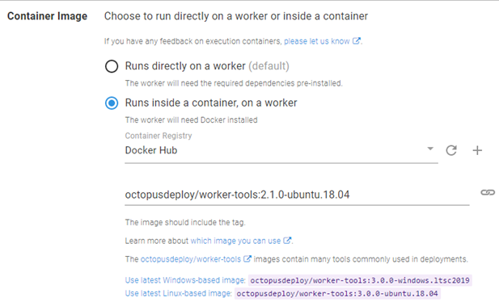
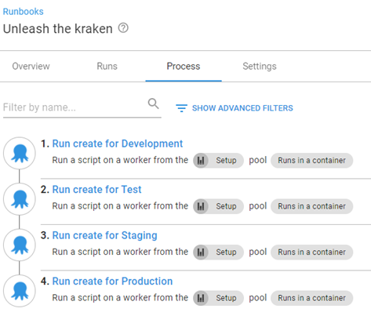
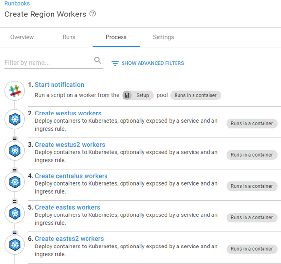
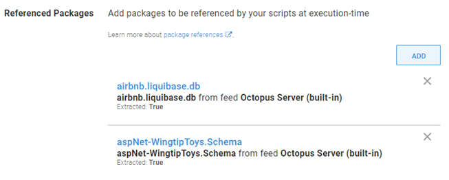
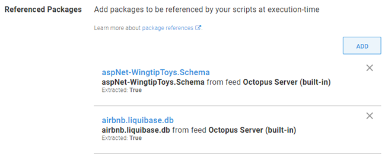

As the Octopus Deploy product evolved, more and more demands were being made on the server in which it was installed.  In those early days, any step that didn't execute directly on a [Target](https://octopus.com/docs/infrastructure/deployment-targets) was executed on the server itself.  To address the growing list of tasks executing directly on the server, Octopus came up with the concept of workers.  In this post, I'll address some common questions about workers and how they operate.

## What exactly is a worker?
In essence, a worker is a tentacle.  It runs the same tentacle software as a deployment target, however, is registered with the server in worker pools.  Worker pools are a collection of worker machines.

### If a worker is a tentacle, does it count as a target for licensing?
Despite running the tentacle software, workers are viewed as an extension of the Octopus Server and are therefore not counted as targets.  Under the current licensing model, there is no limit to how many worker machines you can have.

## What can a worker be used for?
Workers can be used with steps that don't _need_ to be executed on a target.  The most common use cases are:
- Database deployments 
- API or Web Service calls
- Running scripts
- Kubernetes deployments
- Execution containers

### Database deployments
Deploying database updates only requires a connection string to the database server and database you are working with.  Workers provide a means to performing database deployments without having to install any additional software on the database server.

### API or Web Service calls
Activities such as sending emails, Slack notifications, or messages on Teams don't need a target to run on.  This is a perfect use case for using workers.

### Running scripts
Running scripts is another use case that workers can be used for.  Process intensive operations can be offloaded to run on a worker instead of bogging down the Octopus Server.

### Kubernetes deployments
Kubernetes (K8s) targets are the only target type that require the use of workers. Workers for K8s targets must have the `kubectl` CLI installed.  For this reason, you have the ability to select a worker pool to use during Health Check operations on the K8s target screen.  

Kubernetes Deployments interact with an API, providing instructions to the K8s cluster rather than deploying files directly to it.  This makes a perfect use case for workers.

### Execution containers
A byproduct of the evolution of Octopus is the increasing number of technologies supported by the tool.  As this list continued to grow, we were required to bundle more and more software components into Octopus.  For various reasons, some customers were unable to keep up with the release cycle of Octopus and encountered issues running older versions of Octopus, but needing modern versions of the bundled software.  In addition, not all projects in an Octopus instance may be using the same version of the bundled sofware so installing directly on a worker would introduce a different set of problems.  [Execution containers](https://octopus.com/docs/projects/steps/execution-containers-for-workers) was introduced so that workers running docker can run specific versions of software for their deployment activities.



## Specifying a step to use a worker
When defining a step in a [Runbook](https://octopus.com/docs/runbooks) or [Project Deployment Process](https://octopus.com/docs/projects/deployment-process), you are able to tell Octopus that this step will run on a worker and select a pool.


### Worker pool variable
The keen eyed observer would have noticed there is a second selection for the `Worker Pool` section, `Runs on a worker from a pool selected via a variable`.  The [worker pool variable](https://octopus.com/docs/projects/variables/worker-pool-variables) was created to solve issues where customers needed a different worker pool for different situations, such as environments.  Some customers have security segregated in such a way that workers in Development were not allowed to touch resources in Test.  Using a worker pool variable, you can scope pools to environments or even [Tenant Tags](https://octopus.com/docs/deployments/patterns/multi-tenant-deployments/tenant-tags) denoting things like specific Azure regions


## How do workers execute differently than targets?
If you've ever attempted to execute two deployments against the same target machine, you may have noticed that the deployments seem to bounce back and forth between the tasks, executing one step at a time.  This behavior is by design to protect the target from multiple deployments attempting to update the same resource at the same time, such as an IIS metabase.  Workers, on the other hand, are configured to be able to handle multiple tasks simultaneously.

:::information
Activities such as `Acquire Packages` will result in a worker being locked and any other deployment/runbook using the same worker will be in a wait state.
:::

### How is a worker selected from the pool?
Workers are selected from a pool in a round-robin fashion.  It is important to note that the workers are selected at the **beginning** of a deployment or runbook run and not at each step.  There are some caveats to this that I will explain later in this post.

Consider the following scenario:
Worker Pool `Setup` consists of
- worker1
- worker2
- worker3

Runbook `Unleash the kraken` calls the runbook `Create AWS RDS` for environments Development, Test, Staging, and Production.



All steps in the process execute sequentually, but are configured not to wait for the runbook to complete before moving on to the next step (see [Run Octopus Deploy Runbook step](https://library.octopus.com/step-templates/0444b0b3-088e-4689-b755-112d1360ffe3/actiontemplate-run-octopus-deploy-runbook) for details).  Worker selection would be as follows

```
Unleash the kraken
|
+-- worker1
|    |
     Create AWS RDS Development
     |
     +-- worker1
     |
     Create AWS RDS Test
     |
     +-- worker2
     |
     Create AWS RDS Staging
     |
     +-- worker3
     |
     Create AWS RDS Production
     |
     +-- worker1
```
#### Worker selection caveats
Steps that reference packages can have an affect on worker selection.  Any step that uses the same package will execute on the same worker machine.  For example, runbook `Create Region workers` deploys a Tentacle image to a Kubernetes cluster in different Azure regions.  Because steps 2 through 6 all use the same package (image), they will all use the same worker



Package reference ordering will affect worker selection.  For example, if you have two steps that reference the same packages in the same order, Octopus will run both steps on the same woker.



However, if the ordering of the packages are different, Octopus will select different workers for each step.



A worker is selected from the pool at the beginning of a deployment or runbook run.  The same worker will be used for the entire deployment process, the exception being when a [Manual Intervention](https://octopus.com/docs/projects/built-in-step-templates/manual-intervention-and-approvals) step is encountered and the task is removed from the queue.  Once the task has been placed back into the queue, a worker is selected again to continue processing.

#### I'm using Octopus Cloud, how are dynamic workers selected?
Octopus Deploy maintains a set of workers that customers can use as dyanamic workers available in the following pools:
- Default worker pool (Windows Server 2016)
- Hosted Windows (Windows Server 2019 with Docker)
- Hosted Ubuntu (Ubuntu 18.04 with Docker)

Each cloud instance can lease one worker per pool.  The lease is exclusive to that cloud instance and is destroyed once the lease time has expired (see [this](https://help.octopus.com/t/how-do-dynamic-workers-work-in-octopus-cloud/25228/2) kb article for time expiration.)

## Conclusion
I hope that this post clarifies what workers are and how they are used and selected.  I certainly learned quite a bit writing this post!

Happy Deployments!