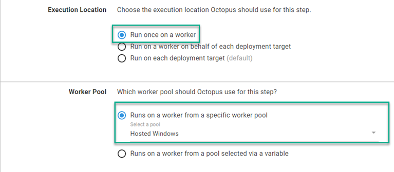
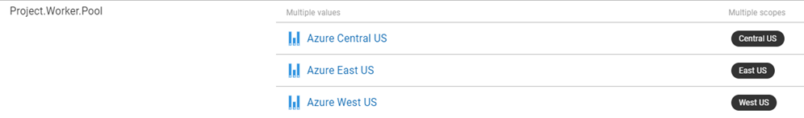

As the Octopus Deploy product evolved, more and more demands were being made on the server in which it was installed.  In those early days, any step that didn't execute directly on a [Target](https://octopus.com/docs/infrastructure/deployment-targets) were executed on the server itself.  To address the growing list of tasks executing directly on the server, Octopus came up with the concept of workers.  In this post, I'll address some common questions and misconceptions of workers.

## What exactly is a worker?
In essence, a worker is a tentacle.  It runs the same tentacle software as a deployment target, however, is registered with the server in worker pools.  Worker pools are a collection of worker machines.

## How can I use a worker?
When defining a step in a [Runbook](https://octopus.com/docs/runbooks) or [Project Deployment Process](https://octopus.com/docs/projects/deployment-process), you are able to tell Octopus that this step will run on a worker and select a pool.

Workers can be used with steps that only require connection string and don't _need_ the files contained within the package on the server being deployed to.  The most common use case of this is database deployments.  Database Administrators prefer no other software be installed on a database server.  Using workers, you can perform database deployments without having to install anything on the database server itself.

The keen eyed observer would have noticed there is a second selection for the `Worker Pool` section, `Runs on a worker from a pool selected via a variable`.

### Worker pool variable
The [worker pool variable](https://octopus.com/docs/projects/variables/worker-pool-variables) was created to solve issues where customers needed a different worker pool for different situations, such as environments.  Some customers had security segregated in such a way that workers in Development were not allowed to touch resources in Test.  Using a worker pool variable, you can scope pools to environments or even [Tenant Tags](https://octopus.com/docs/deployments/patterns/multi-tenant-deployments/tenant-tags) denoting specific Azure regions

