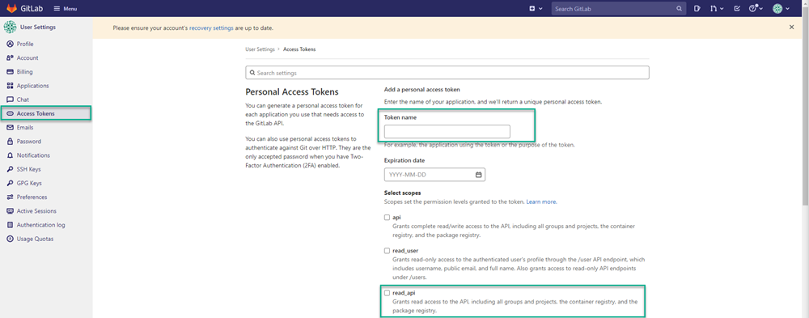
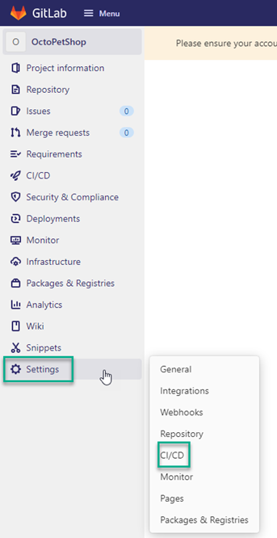
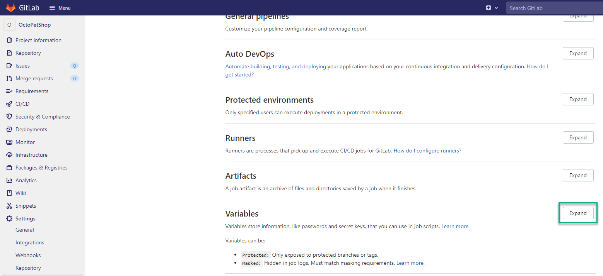
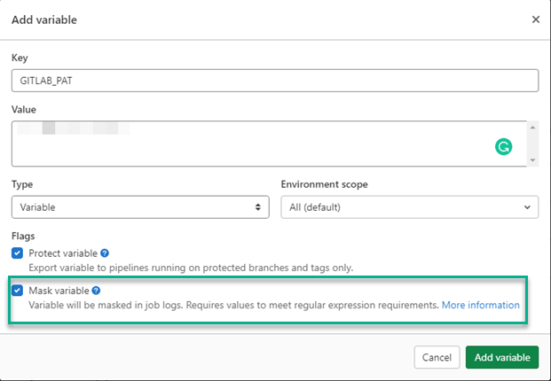
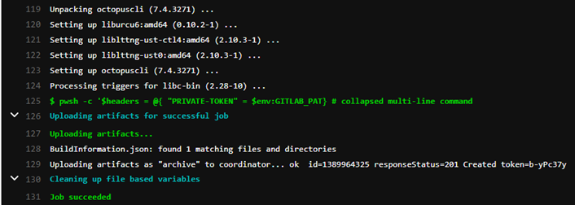
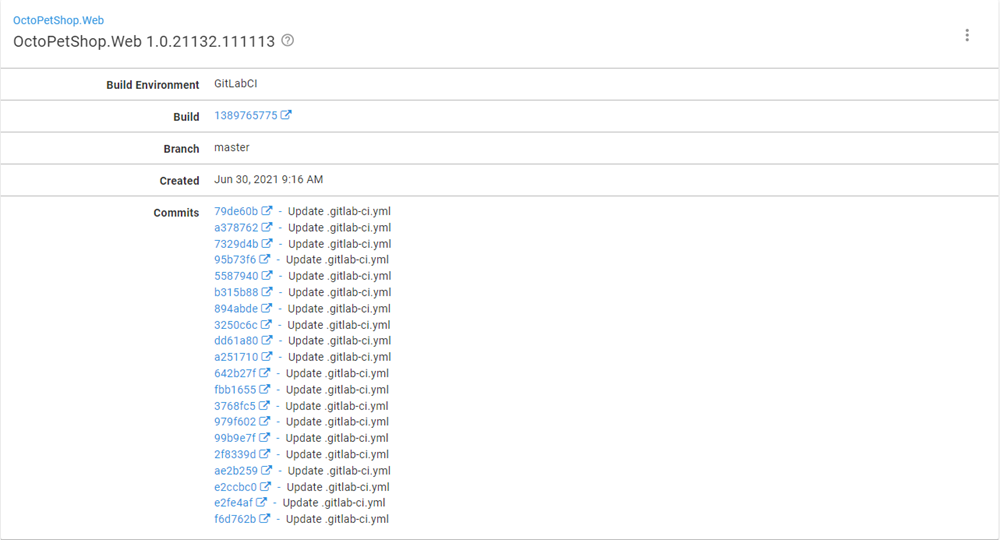

Build servers were traditionally an on-premises tool, however, many organizations are deciding to offload their builds to the cloud.  

The big names such as Azure DevOps, Jenkins (CloudBees), and recently, TeamCity, have created cloud versions of their popular build platforms.  Online-only technologies like AppVeyor, Travis CI, Circle CI, GitHub Actions, and GitLab have also increased in popularity.  

For the technologies where plugins or integrations have been developed, pushing build information is as simple as adding the task to the process.  

For technologies where the only option is to integrate the Octopus CLI (runtime or container), it can be confusing getting the commit information to show up.  

In this post, I demonstrate how to build the file needed to push the build information to Octopus Deploy.

## GitLab
For this post, I'm using GitLab as the build server simply because I haven't used it before. 

This post focuses on the single task of generating [Build Information](https://octopus.com/docs/packaging-applications/build-servers/build-information) and uploading it to Octopus Deploy. It doesn't cover building an application using GitLab. 

### Variables
Before getting started on the build definition, you need to create variables that you're going to use in your process:

- GitLab Personal Access Token
- Octopus Deploy API Key
- Octopus Deploy Server URL
- Octopus Deploy Space Name

#### GitLab Personal Access Token
To gather the commits for the build that you're executing, you need to make an API call to GitLab.  The API endpoint is protected and requires an Access Token to successfully call it.  

##### Creating a Personal Access Token
To create an Access Token, click your profile in the upper right-hand corner and select **Edit profile**.


Click **Access Tokens** in the left-hand menu. Give your token a name and at least **read_api** permissions.  

The **Expiration date** is optional. Leaving it blank creates a token that never expires.  

Click **Create personal access token**.  When the token is displayed, store it in a safe place - this value is only displayed once.



##### Creating a Variable for Personal Access Token
Now you have the token, navigate back to the project and click **Settings** then **CI/CD**.



Scroll to the **Variables** section and click **Expand**.



Click **Add variable** and fill in the details.  For this example, I'm using `GITLAB_PAT` as the **Key** and the token we generated above for the **Value**.  

Tick the **Mask variable** option to ensure the token doesn't get displayed in any messages during the build.



#### Octopus variables
Repeat the **Add variable** process from above for the Octopus variables.  This post assumes you're familiar with [creating an API key](https://octopus.com/docs/octopus-rest-api/how-to-create-an-api-key):

- Octopus Deploy API Key
- Octopus Deploy Server URL
- Octopus Deploy Space Name

### Build YAML
For GitLab, builds are defined using YAML in a special file, `.gitlab-ci.yml` located in the root of your repository.  Your process will consist of a `before_script` and two stages:

- build-information
- push-build-information

#### build-information
The build information stage consists of constructing the file used for uploading build information.  I'm using PowerShell Core to build the file, which Ubuntu doesn't have by default.  Rather than installing PowerShell Core, I'm using the GitLab Docker runner functionality.  The image `mcr.microsoft.com/dotnet/core/sdk:3.1` comes with PowerShell Core installed.

```yaml
build-information:
    stage: build-information
    image: mcr.microsoft.com/dotnet/core/sdk:3.1
```

##### GitLab Commits API
The Commits API requires the access token that you created as a variable earlier.  This token needs to be provided as a Header to the API call in your process.  The variables are accessible in your code in the form of environment variables.  The variable `GITLAB_PAT` is the variable we created whereas the `CI_PROJECT_ID` is [predefined by GitLab](https://docs.gitlab.com/ee/ci/variables/predefined_variables.html).

```powershell
$headers = @{ "PRIVATE-TOKEN" = $env:GITLAB_PAT}
          
# Get commits from GitLab
$commits = (Invoke-RestMethod -Method Get -Uri "https://gitlab.com/api/v4/projects/$($env:CI_PROJECT_ID)/repository/commits?first_parent=true" -Headers $headers)
```

##### Build Information object
To store the build information, create a PowerShell [Hashtable](https://docs.microsoft.com/en-us/powershell/scripting/learn/deep-dives/everything-about-hashtable) object.  The `Commits` portion is defined as an array within the Hashtable:

```powershell
$jsonPayload = @{
    PackageId = "OctoPetShop.Web"
    Version = "1.0.21132.111113"
    Branch = $env:CI_COMMIT_BRANCH
    BuildUrl = $env:CI_JOB_URL
    BuildNumber = $env:CI_JOB_ID
    BuildEnvironment = "GitLabCI"
    VcsCommitNumber = $env:CI_COMMIT_SHA
    VcsType = "Git"
    VcsRoot = $env:CI_PROJECT_URL
    Commits = @()
}
```

Next, iterate through the results from commits API call and add them to the array:

```powershell
foreach ($commit in $commits)
{
    $commitInfo = @{
        Id = $commit.id
        LinkUrl = $commit.web_url
        Comment = $commit.message
    }
    $jsonPayload.Commits += $commitInfo
}
```

Finally, convert the PowerShell Hashtable to a JSON string and write it to a file.

```powershell
Add-Content -Path "BuildInformation.json" -Value "$($jsonPayload | ConvertTo-JSON -Depth 10)"
```

You need to include the file as an artifact that can be used later in the process.  Do this by including an `artifacts` component to the stage YAML.

```yaml
artifacts:
    paths: [ BuildInformation.json ]
```

#### push-build-information
Pushing the build information to Octopus consists of a single command in the script and uses the `BuildInformation.json` created in the previous stage.

```yaml
push-build-information:
    stage: push-build-information
    image: octopuslabs/gitlab-octocli
    script:
        - octo build-information --package-id=OctoPetShop.Web --version=1.0.21132.111113 --file=BuildInformation.json --server="$OCTOPUS_SERVER_URL" --apiKey="$OCTOPUS_API_KEY" --space="$OCTOPUS_SPACE_NAME"
```

#### .gitlab-ci.yml file
When complete, your YAML should look something like this:

```yaml
image: ubuntu:latest

stages:
    - build-information
    - push-build-information

build-information:
    stage: build-information
    image: mcr.microsoft.com/dotnet/core/sdk:3.1
    script:
        - |
          pwsh -c '$headers = @{ "PRIVATE-TOKEN" = $env:GITLAB_PAT}
          
          # Get commits from GitLab
          $commits = (Invoke-RestMethod -Method Get -Uri "https://gitlab.com/api/v4/projects/$($env:CI_PROJECT_ID)/repository/commits?first_parent=true" -Headers $headers)

          # Create payload
          $jsonPayload = @{
            PackageId = "OctoPetShop.Web"
            Version = "1.0.21132.111113"
            Branch = $env:CI_COMMIT_BRANCH
            BuildUrl = $env:CI_JOB_URL
            BuildNumber = $env:CI_JOB_ID
            BuildEnvironment = "GitLabCI"
            VcsCommitNumber = $env:CI_COMMIT_SHA
            VcsType = "Git"
            VcsRoot = $env:CI_PROJECT_URL
            Commits = @()
          }

          # Loop through commits and add to collection
          foreach ($commit in $commits)
          {
            $commitInfo = @{
              Id = $commit.id
              LinkUrl = $commit.web_url
              Comment = $commit.message
            }
            $jsonPayload.Commits += $commitInfo
          }
          
          # Write information to file
          Add-Content -Path "BuildInformation.json" -Value "$($jsonPayload | ConvertTo-JSON -Depth 10)"'
    artifacts:
      paths: [ BuildInformation.json ]
      
push-build-information:
    stage: push-build-information
    image: octopuslabs/gitlab-octocli
    script:
        - octo build-information --package-id=OctoPetShop.Web --version=1.0.21132.111113 --file=BuildInformation.json --server="$OCTOPUS_SERVER_URL" --apiKey="$OCTOPUS_API_KEY" --space="$OCTOPUS_SPACE_NAME"
```
## Executing the build
After the build is triggered, you'll see something like this (images show the last part of the log for brevity):

build-information


push-build-information


Navigating to the build information for OctoPetShop.Web in Octopus Deploy, you can see your build information has been uploaded.



## Conclusion
In this post, I demonstrated how to construct the file for build information and uploading it using the Octopus Deploy CLI.

Happy deployments!