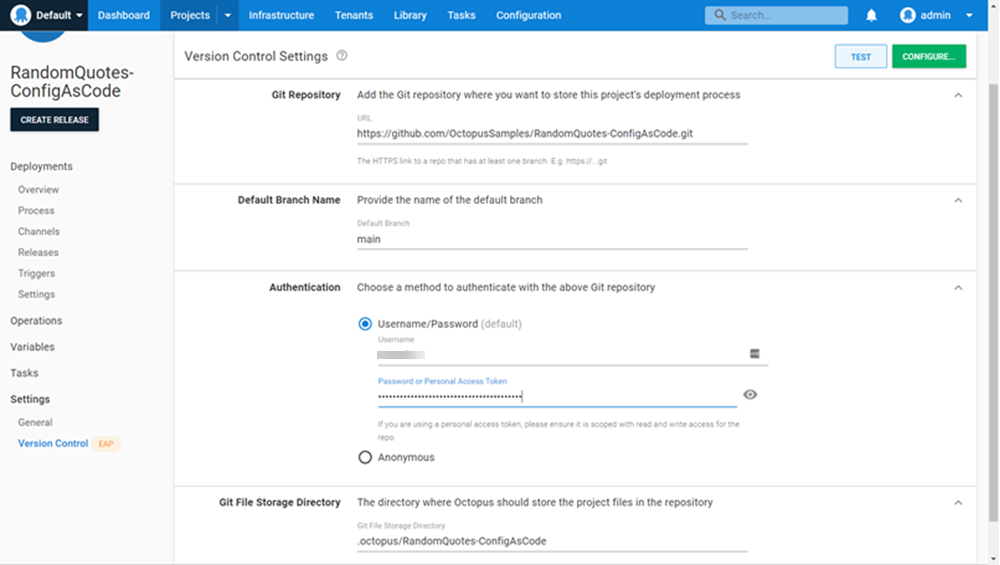

Configuration as Code offers many benefits such as Security, Traceability, and Manageability as discussed in a previous post on [Config as Code](/blog/2021-07/config-as-code-what-is-it-how-is-it-beneficial/index.md). If you've been following along with the [shaping](/blog/2020-11/shaping-config-as-code/index.md) of this feature, you may be excited to see it in action.

In this post, I'm going to show you how to convert a project to start using the new Config as Code feature and perform our first pull request for changes to the deployment process. This post assumes some basic familiarity with Git, such as branching, committing, and performing pull requests.


:::warning
As of this writing, the Config as Code feature is an Early Access Program (EAP). I encourage you to play with the feature and provide feedback, but please do so in a safe environment. DO NOT use this on any production-critical projects!
:::

:::warning
Currently, setting up projects to use Version Control is a one-way process. You will not be able to go back to the project configuration being stored in the database. You can help mitigate this concern by [cloning](https://octopus.com/docs/projects#clone-a-project) any project you want to test this with under {{Settings, General}}.
:::


## Sample application

We'll use our trusty [Random Quotes](https://github.com/octopussamples/randomquotes) web application in our example. This web application is a simple ASP.NET application that randomly retrieves quotes from SQL Server and displays them. However, the application isn't the important part here. The deployment process and new Config as Code workflow are what we'll focus on. 


Our current deployment process has two steps:
1. Deploy Database Changes
2. Deploy to IIS


Once we're done, our deployment process will add in a Manual Intervention step and change our web application deploy to be a rolling deployment with child steps:
1. Approve Production Release
2. Deploy Database Changes
3. Deploy to IIS
   1. Take Site Offline
   2. Deploy to IIS

In between these modifications we'll use Config as Code features to test our changes and then perform a pull request on our proposed changes so that the rest of our team has a chance to review them. Lastly, we'll be using Github as our backing Git repository and will perform branching and pull requests there.

## Configure Version Control Settings

Configuration as Code is set up on a per-project basis and so you'll find the Version Control Settings under each project's Settings: {{ Settings, Version Control }}. This is where you can point each project to a repository to store the configuration.



1. Specify the HTTPS link to your Git repository.
2. Provide the default branch name (ie. main, master, etc).
3. Configure the Authentication method needed to read and write to your repository.
4. Specify the directory which Octopus will use to store the configuration files.


Click the **Test** button to verify everything is configured correctly. If you see a success message like above, click **OK**.


Click the **Configure...** button.

This is where you can provide a Git commit message and optional description. Once you are satisfied, click **Commit**. This will convert your project and commit the configuration files into your repository.


You will now see **Enabled** next to the Version Control Settings header and back on the **Process** page, you will see a drop-down to select branches near the Process title.

## Modify deployment process configuration ##

Now that we have our project set up to use Config as Code, let's enhance our deployment process using familiar Git processes.

First, we'll create a branch to separate our work in progress from the regular flow of our release pipeline. This will also allow us to test our process before merging the changes into our main branch. Our other teammates and CI/CD pipelines can continue using the *unchanged* main branch deployment process.

### Create new branch ###


We'll create the branch *releaseEnhancement* from within Github.


Back in Octopus, we'll perform a **Fetch**, and then we will see our newly created branch. Select the new branch.

### Make modifications ###

With the new branch selected, let's begin modifying our process. We've had a request to allow our Web Administrators to approve all releases to the Production environment. We also desire to make our deployment to IIS be rolling so that we don't take down all of Production at one time.


Start by adding a Manual Intervention step targetting the Production environment so that our Web Administrators can approve any releases to that environment. We'll make this step the first step in our process. In this example, I set the following:
- Step Name: Approve Production Release
- Instructions: Please provide approval for this release to execute.
- Responsible Teams: Web Administrators
- Environments: Production

Next, let's convert our *Deploy to IIS* step into a [rolling deploy](https://octopus.com/docs/deployments/patterns/rolling-deployments) and add a *Run a Script* child step. We'll configure this child step to add an offline page before we deploy the site. In this example, I set the following on the *Run a Script* child step:
- Step Name: Take Site Offline
- Inline Source Code: 

```ps
Import-Module WebAdministration

$directory = (Get-Website -Name $WebsiteName).physicalPath
if( $directory ){
    'This application is temporarily offline for maintenance' | Out-File (Join-Path $directory 'app_offline.htm') -Encoding ascii -Force
}
```

### Save (commit) our modifications ###


In sticking with Git concepts, to save our process we need to perform a commit. Clicking the green **Commit** button will perform an immediate commit with a default message *"Update deployment process"*. If you want to specify a message, use the green dialog button to the right of the Commit button. This will allow you to specify a commit message and optional description, as seen above. Finally, perform the commit by clicking the **Commit** button.


If you want to view the raw [Octopus Configuration Language](https://github.com/OctopusDeploy/Ocl) (OCL) after committing your changes you can click the three vertical dots next to the Add Step button and select **View/Edit OCL**. This is another option to see the output of your changes in the OCL format. This is what gets stored in your Git repository.

## Test modified process ##

Let's test our newly modified process by creating a release off of this branch. 


Once you click the **Create Release** button you will now have the option to select which branch you want to create the release from. This will snapshot the release process along with variables similar to what happened previously.

We'll deploy this release and verify our changes work as expected.


The **Overview** dashboard now shows the branches that releases were created from. Here we can see our release created off of our *releaseEnhancement* branch in Development.

## Merge changes ##


Once we've verified our changes, we'll create a [pull request](https://github.com/OctopusSamples/RandomQuotes-ConfigAsCode/pull/1) to get our changes merged into the main branch. One of the benefits of Config as Code is you can easily see what has changed in our process and allow our other teammates to review our changes.

Once the pull request is approved and merged, our changes will be on main and any new releases created will include our new process steps.

## Conclusion

In this post, I showed you how to convert a project to use the new Config as Code feature and perform your first pull request of changes. We performed these changes from within the Octopus UI as that is easiest and most familiar. Once we're comfortable with the configuration, we could use a text editor and push changes to our repository using Git as well.

Happy deployments!

## Learn more

- [Github repo with deployment configuration](https://github.com/OctopusSamples/RandomQuotes-ConfigAsCode)
