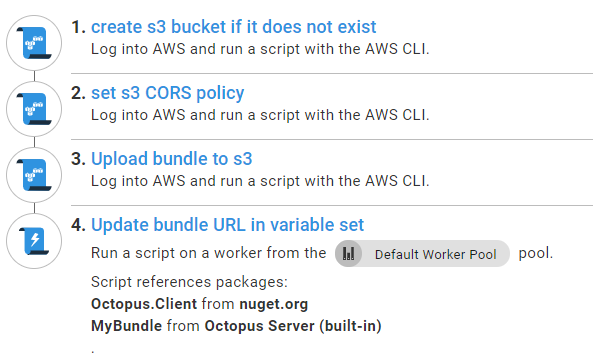

A frontend dev pattern I've seen at many companies starts with the best of intentions, but it can lead to pain if not handled well. You see a need for reuse of frontend code across multiple projects, possibly maintained by different teams using different tech on the server. You create a shared JavaScript bundle project with its own repo and release process. It's a sensible idea, but it opens questions we need good answers for, to stop our little bundle of joy growing into a monster. In this post, I'll explain a simple example of how to manage the deployment process for a shared JavaScript project that is simple to reference from other Octopus projects. My example is using a Vue JS bundle deployed to an Amazon S3 bucket, but I hope you'll see how the same principles could be applied to any combination of frontend framework and hosting provider. 

## The process

Our finished deployment process will look like this in Octopus.

## How do we do cache busting?
The CLIs that come with the major frontend frameworks will generate an index file that references our hash-named production bundle. Unfortunately, we probably cannot use that index file in legacy systems that want to consume our bundle. It can be unclear [which of the many cache busting strategies](https://css-tricks.com/strategies-for-cache-busting-css/) will suit best. You want to avoid anything that requires the consumer to know too much about the bundle, or the bundler to know too much about the consumer. The whole point is reuse - the last thing you need is each consumer implementing its own way of referencing the latest bundle. We also don't want the build process for our JavaScript containing special casing for the sake of different consumers. You'll score bonus pain points if you try to introduce runtime logic in the consumer to figure out which bundle to use. In my opinion, the perfect world is one where consumers know only that they have a config setting with a bundle URL.

Octopus Deploy can provide us with just that with using variable sets.

### What about configuration?
The boring issue of config might not be front of mind when you are in the honeymoon phase of your relationship with a shiny new JavaScript framework, but it's going to be less fun to work with if  

## Conclusion
I hope this post clarifies how we can apply the concepts of scoped variables, servers as cattle, and variable sets to achieve sane management of a shared JavaScript project. 

I've had good results following this strategy in production compared to other solutions I have tried for managing JavaScript projects. I did find myself explaining a few times to frontend specialists that they have to re-release the consumer project on test server to make it upgrade itself to the latest version of the bundle, but it's logical once they get the hang of it, but I've had very good feedback from the frontend specialists on my team on the way this deployment process pattern works.

Happy bundling!
