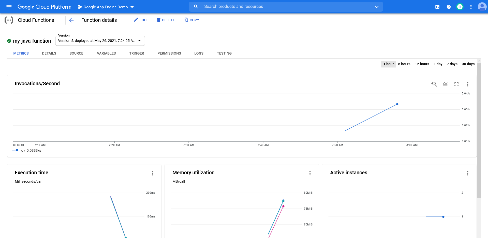
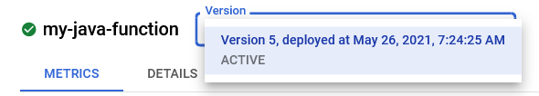

Google Cloud Functions (GCF) is Google's Function as a Service (FaaS) platform. It allows simple applications to run on demand in response to events triggered via external sources such as HTTP requests, or from events triggered from other Google Cloud Platform (GCP) services such as files being uploaded to a bucket.

GCF supports functions written in: 

- Node.js
- Python
- Go
- Java
- .NET Core
- Ruby
- PHP

Like [Google App Engine (GAE)](https://octopus.com/blog/deploying-to-google-app-engine), GCF mostly expects raw source code to be uploaded to the platform. There is an exception for Java applications, which support the [deployment of JAR files](https://cloud.google.com/functions/docs/concepts/java-deploy#deploy_from_a_jar). However, other compiled languages like Go and C# require the source code to be uploaded, and GCF will take responsibility for downloading dependencies and compiling the code.

In this post, I demonstrate how a simple Java application is deployed to GCF, and explore options for advanced deployment patterns.

## The sample application

Our sample application implements an API for the Random Quotes web app. The source code can be found on [GitHub](https://github.com/OctopusSamples/RandomQuotesAPI-Java-Google-Cloud-Functions). The API's only job is to return a JSON blob with a famous quote attributed to its author. An example of this JSON is shown below:

```json
{
    "quote": "Everything should be made as simple as possible, but not simpler.", 
    "author": "Albert Einstein", 
    "appVersion": "1.0.22", 
    "environmentName": "Google Cloud Functions", 
    "quoteCount": "0" 
}
```

The JSON also includes the version of the function that generated the response, and a counter that indicates how many times this instance of the function has been called. The counter allows you to track wether GCF created a new instance of the function for your request, or reused an existing instance.

This API will be consumed by a simple web application. For convenience the frontend has been published as a Docker image, which you can run with the following command, where `Your GCP Project ID` will be replaced by the ID of the GCP project that the function has been deployed to:

```
docker run \
    -p 8080:8080 \
    -e APIENDPOINT=https://us-central1-[Your GCP Project ID].cloudfunctions.net/my-java-function \
    octopussamples/randomquotesgo
```

The web app can then be opened at http://localhost:8080/index.html.

## Deploying the function

As noted in the introduction, GCF mostly expects that you deploy the function source code rather than a compiled application. This is convenient as it allows you to deploy the contents of a Git repository directly. 

GitHub makes this particularly easy by capturing the code in a zip file with each [release](https://github.com/OctopusSamples/RandomQuotesAPI-Java-Google-Cloud-Functions/releases). This provides you with a robust workflow where: 

1. The Git repository is tagged with a given release
1. GitHub creates a release with the associated zip file
1. You upload the source code package to GCF

Download and extract the latest [release](https://github.com/OctopusSamples/RandomQuotesAPI-Java-Google-Cloud-Functions/releases). You can then deploy it with the command:

```bash
gcloud functions deploy my-java-function \
    --entry-point com.octopus.RandomQuotes \
    --runtime java11 \
    --trigger-http \
    --allow-unauthenticated
```

The `--entry-point` argument defines the class that will be run in response to the trigger. The runtime is defined with the `--runtime` argument. You need to enable this function to be executed via HTTP with the `--trigger-http` argument. 

Finally you allow anonymous users to execute this function with the `--allow-unauthenticated` argument.

After the function is deployed, it's displayed in the GCP console:



## Advanced deployment strategies

Other platforms offered by GCP, such as Google App Engine and Google Cloud Run, provide the ability to deploy revisions or versions, each with unique endpoints. 

[Google App Engine](https://octopus.com/blog/deploying-to-google-app-engine) has native functionality to split traffic between versions, while offering version specific URLs like https://\[version\]-dot-\[projectname\].uc.r.appspot.com/ allowing individual versions to be accessed independently. 

[Google Cloud Run](https://octopus.com/blog/deploying-to-google-cloud-run) allows named revisions to be deployed via tags, with traffic able to be split between tags, and direct access to a tagged revision with a URL like https://\[tagname\]---randomquotes-5od2layuca-ts.a.run.app/.

GCF does not offer similar functionality. The console provides a drop down list showing function revisions, but from my experience this list only shows failed deployments. In the screenshot below you can see a function with multiple deployments, and the version list only shows the latest:



This means it's not possible to directly interact with previous revisions of functions, nor run two versions side by side. Any deployment strategies like blue/green, canary, or feature branching, rely on deploying functions with unique names and directing traffic to them via a secondary load balancing service.

## Conclusion

Google Cloud Functions is a convenient solution for anyone looking to quickly deploy simple applications, either to support public facing interactions via HTTP, or to respond to events in the GCP ecosystem. 

Unlike other application hosting platforms provided by GCP, Cloud Functions offers very simple versioning and networking options. This means advanced deployment strategies must be orchestrated externally through naming conventions. However, for more traditional deployments, this lack of flexibility can be a blessing, as function deployments require very little effort, especially when you consider that Google takes care of compiling your code for you.

Happy deployments!
