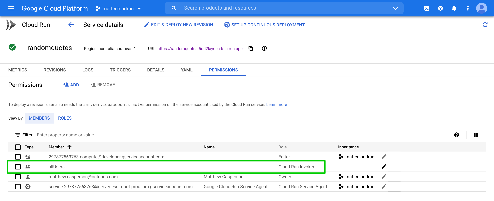
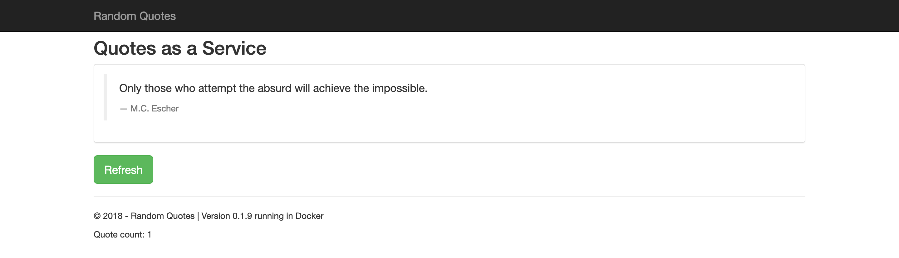
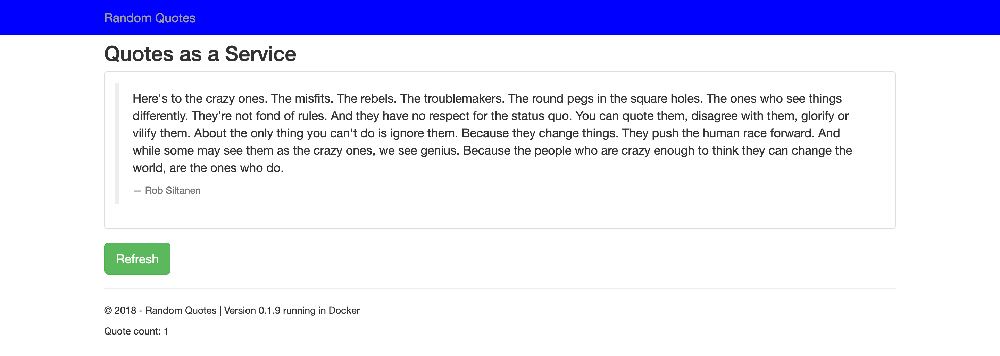
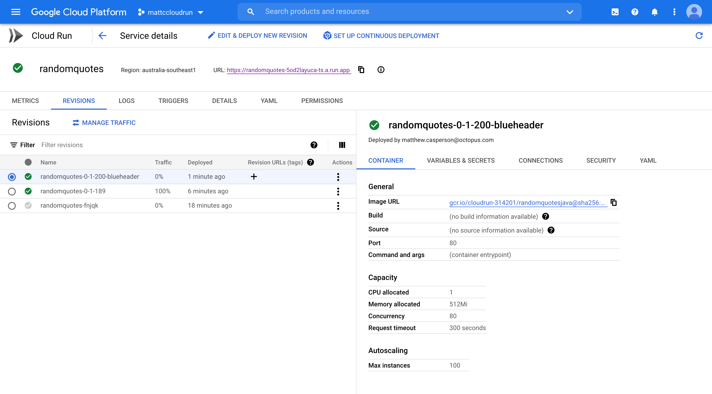
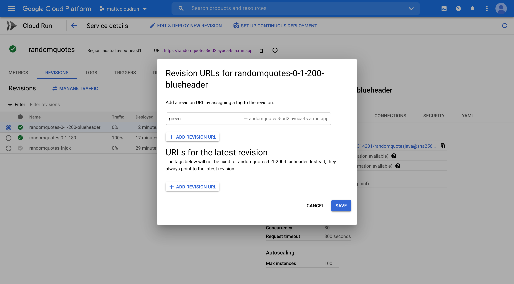

Google Cloud Run is a relatively new Platform as a Service (PaaS) offering on the Google Cloud Platform (GCP). It allows you to run and scale container images while only paying for the time that a request is being processed.

In this post, I look at how to deploy a sample application in Cloud Run, and use the traffic shaping rules to perform deployment strategies like feature branches, canary, and blue/green.

## Deploying a sample application

Let's start by deploying a sample application called [Random Quotes](https://github.com/OctopusSamples/RandomQuotes-Java). This Java Spring web application has been pushed to Docker Hub, and I use the latest tag at the time of writing which is `octopussamples/randomquotesjava:0.1.189`.

When deploying to Cloud Run, you need to start by pushing the Docker image to a Google Container Registry (GCR). Cloud Run doesn't support external registries.

Using the traditional `docker` CLI tool, you can pull and push an image with the following commands, making sure to replace `cloudrun-314201` with the project ID that holds your Cloud Run services:

```
docker pull octopussamples/randomquotesjava:0.1.189
docker tag octopussamples/randomquotesjava:0.1.189 gcr.io/cloudrun-314201/randomquotesjava:0.1.189
docker push gcr.io/cloudrun-314201/randomquotesjava:0.1.189
```

Other tools like `skopeo` are more convenient for copying Docker images. The command below will directly copy the image from the Docker Hub registry to GCR:

```
skopeo copy docker://octopussamples/randomquotesjava:0.1.189 docker://gcr.io/cloudrun-314201/randomquotesjava:0.1.189
```

:::hint
If you try to reference a Docker image from an external registry, you receive the error:

```
ERROR: (gcloud.beta.run.services.replace) Expected a Container Registry image path like [region.]gcr.io/repo-path[:tag and/or @digest] or an Artifact Registry image path like [region-]docker.pkg.dev/repo-path[:tag and/or @digest], but obtained octopussamples/randomquotesjava:0.1.189
```
:::

Next, define a service YAML resource in a file called `service.yaml`. 

If you're familiar with Kubernetes, the structure of the YAML will look familiar. It follows the `apiVersion`, `kind`, `metadata`, and `spec` layout that all Kubernetes resources use. In fact, the service you're defining here is part of [Knative](https://knative.dev/docs/reference/api/serving-api/), due to the fact that Cloud Run is a managed implementation of the Knative service:

```yaml
apiVersion: serving.knative.dev/v1
kind: Service
metadata:
  name: randomquotes
spec:
  template:
    spec:
      containers:
        - image: gcr.io/cloudrun-314201/randomquotesjava:0.1.189
          ports:
            - name: http1
              containerPort: 80
```

- The `metadata.name` property defines the name of the service. 
- The `spec.template.spec.containers[0].image` property references the Docker image we copied into GCR. 
- The `spec.template.spec.containers[0].ports.name` property can either be set to `h2c` to indicate that the port is exposed by HTTP2, or `http1` to indicate that the port is exposed by HTTP1. 
- The `spec.template.spec.containers[0].ports.containerPort` property defines the port that is exposed by the container to receive web traffic on.

To deploy this service, run the command:

```bash
gcloud beta run services replace service.yaml --platform managed
```

After the service is deployed, you receive a URL like `https://randomquotes-5od2layuca-ts.a.run.app` that can be used to access it. Opening the URL will likely result in the following error being displayed:


The solution is to give the `allUsers` user the `Cloud Run Invoker` permission:



You can then open your web app:



## Feature branch deployments

To deploy an image created from a feature branch, first copy it into GCR. Here you have a feature branch image with the tag `0.1.200-blueheader`, which you copy into GCR with the command:

```
skopeo copy docker://octopussamples/randomquotesjava:0.1.200-blueheader docker://gcr.io/cloudrun-314201/randomquotesjava:0.1.200-blueheader
```

The URL assigned to your service is based on the service name. In the YAML below, you need to change the name of the service to include the feature branch name:

```yaml
apiVersion: serving.knative.dev/v1
kind: Service
metadata:
  name: randomquotes-blueheader
spec:
  template:
    spec:
      containers:
        - image: gcr.io/cloudrun-314201/randomquotesjava:0.1.200-blueheader
          ports:
            - name: http1
              containerPort: 80
```

Again, you deploy this service with the command:

```bash
gcloud beta run services replace service.yaml --platform managed
```

The returned URL will be something like `https://randomquotes-blueheader-5od2layuca-ts.a.run.app`. 

By renaming the service you can now run the feature branch side by side with the mainline deployment:



## Canary and blue/green deployments

To perform a canary or blue green deployment, you make use of service revisions. The name of a revision is defined in the `spec.template.metadata.name` property. It must be prefixed with the name of the service, and can only use lower case letters, numbers, or the dash. 

Here we have defined a revision called `randomquotes-0-1-189`:

```yaml
apiVersion: serving.knative.dev/v1
kind: Service
metadata:
  name: randomquotes
spec:
  template:
    metadata:
      name: randomquotes-0-1-189
    spec:
      containers:
        - image: gcr.io/cloudrun-314201/randomquotesjava:0.1.189
          ports:
            - name: http1
              containerPort: 80
```

By default, this revision will receive 100% of the traffic when it's deployed.

Now let's deploy a new revision:

```yaml
apiVersion: serving.knative.dev/v1
kind: Service
metadata:
  name: randomquotes
spec:
  template:
    metadata:
      name: randomquotes-0-1-200-blueheader
    spec:
      containers:
        - image: gcr.io/cloudrun-314201/randomquotesjava:0.1.200-blueheader
          ports:
            - name: http1
              containerPort: 80
  traffic:
  - revisionName: randomquotes-0-1-200-blueheader
    percent: 0
  - revisionName: randomquotes-0-1-189
    percent: 100
```

This new revision has been set to receive no traffic, instead redirecting 100% of the traffic to the previous revision:



If you consider the previous revision to be the blue half of a blue green deployment, the new revision will be the green half. You can access this new revision by assigning it a tag:



This new revision can be opened via a URL like https://green---randomquotes-5od2layuca-ts.a.run.app/ to test it before directing any main traffic to it.

A canary deployment can be achieved by gradually directing more traffic to the green stack. The command below directs 10% of traffic to the new revision:

```
gcloud run services update-traffic randomquotes --platform managed --to-revisions=randomquotes-0-1-200-blueheader=10,randomquotes-0-1-189=90
```

This command can be repeated until 100% of traffic is directed to the new revision. A more traditional blue/green deployment would see 100% of traffic cut over to the new revision immediately after any testing on the new stack is complete.

After testing is complete, we can remove the `green` tag with the command:

```
gcloud run services update-traffic randomquotes --platform managed --remove-tags green
```

## Conclusion

Google Cloud Run is a convenient platform for deploying web applications that incur charges only while processing requests. Cloud Run provides automatic scaling to handle incoming requests, and traffic routing rules allow you to implement blue/green and canary style deployments.

This post looked at how to copy Docker images into GCR and then deploy a service. We manipulated the revisions and traffic rules to implement blue/green and canary deployments. We also looked at how tags can be used to gain access to a revision that otherwise has no traffic directed to it.

Happy deployments!
