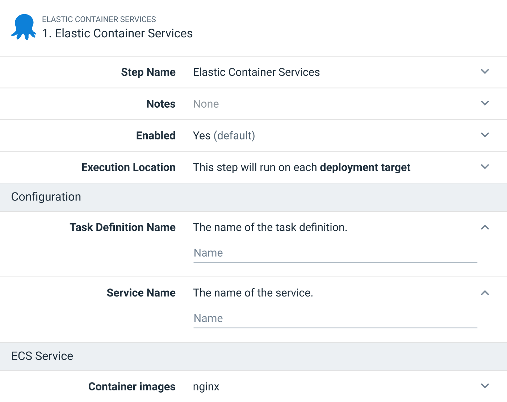
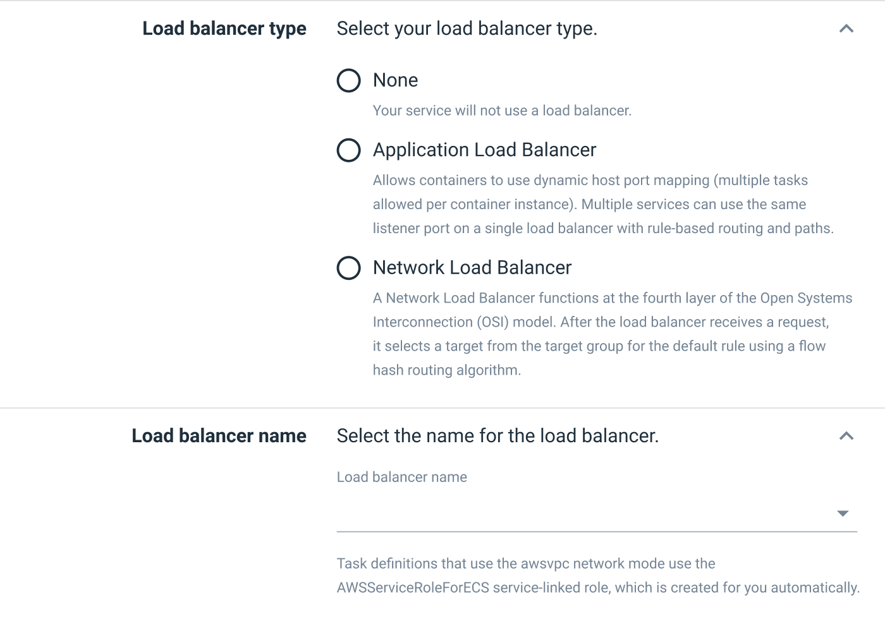

The [first ECS integration milestone in Octopus](https://octopus.com/blog/rfc-ecs-integration-with-octopus) is currently under development, and will deliver new steps and a new target to make it easy to deploy your first ECS service through Octopus. This first milestone will create and manage an opinionated CloudFormation template for you, freeing developers and administrators from writing what can be a fairly verbose template for themselves.

However, one clear piece of feedback we received early on from teams already deploying to ECS was that they were already successfully managing existing ECS deployments, either with manually created services, or through tools like Terraform. The challenge faced by these teams wasn't creating services, but updating them with new images as part of their CI/CD pipelines.

For milestone two of our ECS integration, we are proposing steps that update existing ECS services without the need to take ownership of them through a CloudFormation template. This gives teams with an established ECS cluster the opportunity to orchestrate the deployment of new image versions to their services while retaining control over how the services are created.

## How we propose to support established ECS clusters

This RFC proposes a new step, integrated with the ECS target introduced by the first milestone, that creates a new task definition revision with a new image tag, and then updates a service with the task definition revision.

This milestone will also enhance the step delivered in milestone one by exposing the ability to link existing load balancers.

### The new step

A new step will be created to support those deploying new images to an existing task definition and service.

The step will define the name of the task definition and it's associated service. It will also define a number of containers that will be updated in the associated task definition:

An ECS deployment to an existing task definition and service will then execute the following process:

1. A new task definition revision will be created based on the latest revision.
2. The image versions in the task definition revision with matching container definitions from the step will be updated.
3. The service is then updated with the new task definition revision.

### Linking to load balancers

Most services deployed to ECS are exposed to network traffic, which means they receive traffic from a load balancer. Milestone two will update the step introduced in milestone one to allow an existing load balancer to be linked to a service:

## Benefits of the proposed approach

We expect this new step to allow customers with established ECS clusters to orchestrate image deployments through Octopus while still retaining control over any existing infrastructure scripts. Octopus will expose image versions at release creation time, with all the associated functionality of channels and version rules, and then update the minimum settings required to deploy the new image or images to ECS, without attempting to own the task definition or service through an associated CloudFormation template.

This decouples deployment time concerns, such as deploying a new image, from infrastructure concerns, such as creating the initial task definition and service.

## What is the scope of the second ECS milestone?

Milestone two is focused on supporting teams with established ECS clusters. It also includes some minor updates to existing steps.

The limitations from [milestone one](https://octopus.com/blog/rfc-ecs-integration-with-octopus#what-is-the-scope-of-the-first-ecs-milestone) still apply to milestone two:

* Limiting the step to deploying to Fargate only.
* Only supporting rolling deployments, and not supporting integrated CodeDeploy blue/green deployments.
* Not providing the ability to build a new load balancer.
* Exclude auto-scaling settings.
* Exclude App Mesh and FireLens settings.
* Exclude service auto-discovery settings.
* Only creating a service, and not supporting tasks or scheduled tasks.

## When will this be released?

Work on milestone two is scheduled to start once milestone one has been completed. We do not have a release date at this point in the schedule, so keep an eye on the [blog](https://octopus.com/blog/) for further announcements.

## We want your feedback

The second milestone is still in the planning phases, so now is a great time to help shape this new feature with your feedback. We have created a GitHub issue to capture the discussion.

Specifically, we want to know:

* Will the ability to update an existing task definition and service support your existing ECS clusters?
* What further ECS deployment challenges do you wish Octopus could solve for you?

This feedback will help us deliver the best solution we can.

## Conclusion

In summary, the second milestone of our proposed ECS support includes:

* A new step to deploy images to existing task definitions and services.
* The ability to link existing load balancers to services deployed by the

Thanks for reading this post. We hope you're as excited about the proposed new ECS functionality as we are.

Any feedback you have is greatly appreciated.

Happy deployments!