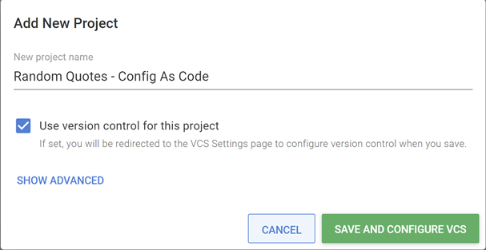
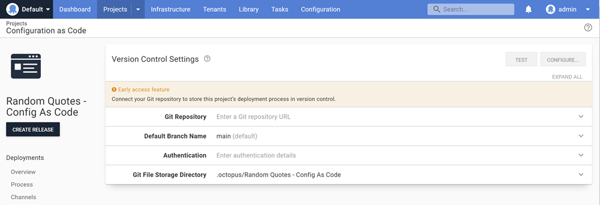
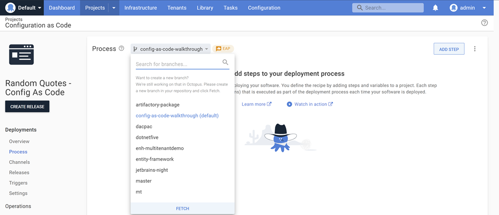
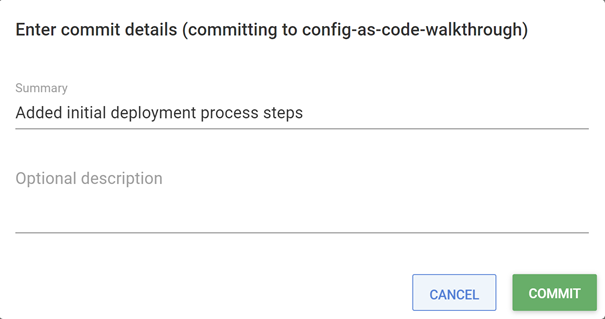
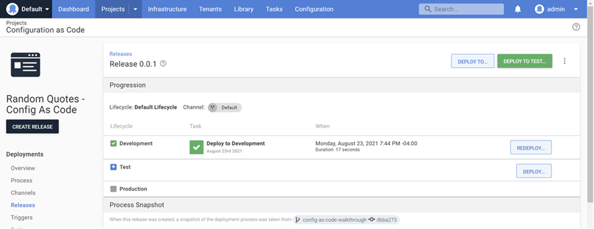

In the last several years, *everything* has been turned into code. Infrastructure, build pipelines, server configuration, and now Octopus projects!

The introduction of configuration as code and version control settings in Octopus Deploy has been highly anticipated. In this post, I walk through how to set up a new project utilizing source control backed code for both the application build pipeline in Jenkins as well as the deployment pipeline in Octopus.

## Sample application

For this post, we'll be building and deploying a [.Net Core application called RandomQuotes](<!--ADD URL HERE-->). This application is simple, and uses a flat file to build a quotes list instead of connecting to a database, which makes it ideal for local testing of new features in our CI/CD pipeline.

## Building the application

To build our .Net Core application, we're going to use a Jenkins pipeline to run a standard .Net build process, then push the published package to our Octopus instance for deployment.

### Configuring Jenkins and Octopus Deploy

I won't delve too deeply into the finer details of integrating your Octopus Deploy instance and Jenkins. There are great resources in the Octopus Documentation on [installing and connecting Jenkins to your Octopus server](https://octopus.com/docs/packaging-applications/build-servers/jenkins#configure-the-octopus-deploy-plugin).

### Creating a Jenkinsfile

For the purposes of this post, we are going to use a simple Jenkins pipeline with three stages to build and deploy our source code:

* Preparation (Workspace clean, Git checkout)
* Dotnet (Building the application) 
* Deploy (Pushing the package to Octopus)

Let's take a look at the whole Jenkinsfile, which is also present in the finished repository [here]()

```groovy  
pipeline{
  agent any

  environment {
    // Primary .csproj location
    projectLocation = "src\\RandomQuotes\\RandomQuotes.csproj"
    // Default publish location
    publishedPath = ".\\src\\RandomQuotes\\bin\\Debug\\net5.0\\publish\\"
    // Git location for checkout
    gitUrl = "https://github.com/coryreid/RandomQuotes_CaC.git"
    // ServerId from Configure System -> Octopus Deploy Plugin
    octopusServerId = "NewLocal"
  }

  stages{

    stage('Prep - Clean/Checkout'){
      steps{
          cleanWs deleteDirs: true
          git credentialsId: 'GitHub-PAT', url: "${env.gitUrl}", branch: 'main'
      }
    } 

    stage('Dotnet - Restore/Clean/Build/Publish'){
      steps{
        bat "dotnet restore ${env.projectLocation}"
        bat "dotnet clean ${env.projectLocation}"
        bat "dotnet publish ${env.projectLocation}"
      }
    }

    stage('Octopus'){
      steps{
          octopusPack additionalArgs: '', includePaths: '', outputPath: '', packageFormat: 'zip', packageId: "${JOB_NAME}", packageVersion: "${BUILD_NUMBER}", sourcePath: "${publishedPath}", toolId: 'Default', verboseLogging: true
          octopusPushPackage additionalArgs: '', overwriteMode: 'FailIfExists', packagePaths: "${JOB_NAME}.${BUILD_NUMBER}.zip", serverId: "${octopusServerId}", spaceId: 'Spaces-1', toolId: 'Default'
      }
    }
  }
}
```

The pipeline is pretty straightforward - we are cleaning the workspace, checking out the latest tip of main, and then using the dotnet tools to build and publish the app. With everything compiled, we are packing it all into a ZIP folder and pushing it to our Octopus server. Worth noting are the 4 parameters at the top of the pipeline, which are useful for quickly updating parts of the pipeline that may change - in this case, they are all set to relatively sane defaults for our sample application, and shouldn't need modification. However, you may want to update the `gitUrl` or `octopusServerId` if you're following along and using your own repository/Jenkins instance.

### Creating the Jenkinsfile project in Jenkins

Now that we have a starting pipeline, let's create the build definition in Jenkins to use it for building our application. 

1. From the Jenkins dashboard, click **New Item**, then create a new Pipeline named *RandomQuotes*
2. Then, in the general settings, mark the pipeline as a **GitHub project** and enter the repository URL


3. For the **Pipeline Definition**, select *Pipeline script from SCM* in the dropdown and fill out the repository information: Repository URL, Credentials, and the Script Path 


With these items configured, your Jenkins instance should be set to build the RandomQuotes app and send it over to your Octopus server so it can be deployed - after saving the configuration, click the **Build Now** button in the left menu to test it out!

## Deploying RandomQuotes using Octopus Deploy and configuration as code

Now that we have our application built, published, and pushed into our Octopus instance, let's get it deployed! The process for standing up a project using configuration as code is reasonably close to the current process for standard Octopus usage, but we'll cover all the new steps for the process below.

### Configuring version control settings

The first step when creating new deployments using configuration as code comes as soon as you click the **Add Project** button from the Projects overview:



With that option selected, you'll be taken to a new **Project Settings** page to configure the version control settings for your project. This includes not only the location of your repository for source control, but also the authentication details for that repository.



Let's walk through filling those values out:

- **Git Repository**: This is the URL to your git repository, ending in `.git`. From GitHub, you can click the green **Code** button and get the web URL from the HTTPS selector on the dropdown. For this example, our URL is `https://github.com/OctopusSamples/RandomQuotes.git`
- **Default Branch Name**: Since we're backing our deployment process in source control, we need to define the default branch that our deployment process will pull from. For this example, we'll be using the `config-as-code-walkthrough` branch.
- **Authentication**: There are two options for authentication - Username/Password and Personal Access Token. Personally, I've always preferred using PATs with GitHub, and will do so here as well. For instructions on creating a Personal Access Token, GitHub has a guide published [here](https://docs.github.com/en/github/authenticating-to-github/keeping-your-account-and-data-secure/creating-a-personal-access-token).
- **Git File Storage Directory**: This is the location in your repository where the deployment process files will be stored. It defaults to a folder called `.octopus` and a subfolder titled after the project name. We'll leave the default for now, but you could also customize it to contain your `.jenkins` and `.octopus` folders under a shared CI/CD directory in your repository for easy organization!

Once the details are filled in, you can use the **Test** button to confirm that the project has access to your git repository. A successful test means you can click **Configure** and get to the next part of defining the process.

### The first commit

Once you've clicked **Configure**, you'll be prompted to enter the details for the initial commit to your repository, which will add the specified folders and files to store your deployment process configuration. We'll just click the **Commit** button and leave the default message for now. Once complete, if you navigate back to your repository, you'll see the folder specified (`.octopus/Random Quotes - Config As Code` in my case), with a handful of files included that use Octopus Configuration Language, or OCL:

- `channels.ocl` - Channel information for the project. Currently, this just contains our default channel for the project.
- `deployment_process.ocl` - Deployment process steps for the project, including package information and related properties.
- `deployment_settings.ocl` - Project settings represented by the Deployments -> Settings sub menu. Currently, this includes default versioning information.
- `schema-version.ocl` - Schema version to ensure compatibility with OCL parsing, primarily for internal use.

This is a lot to think through, we'll revisit these files once we've made some changes worth looking at!

### Defining a deployment process

Now let's take a look at defining our deployment process. RandomQuotes is a very simple application, and doesn't require much heavy lifting to successfully deploy. Let's start by adding our variables, which will be replaced in the `appsettings.json` file during the deployment. We're going to define two variables for replacement, `AppVersion` and `EnvironmentName`. We'll use some handy [system variables](https://octopus.com/docs/projects/variables/system-variables) to make sure they stay in sync with our deployment.


With those configured, we'll move over to defining the deployment process steps for this application.

The first thing to notice about the new configuration as code supported deployment process is the branch selector at the top of the screen:



This allows you to choose the branch of your repository that you want to use the deployment process from. Since we configured `main` as our default branch, that's what's selected by default here. When adding new branches to your repository, Octopus will sync new branches on a regular interval. However, if you'd like to refresh your branch list, you can use the **Fetch** button here to trigger an explicit resync for this repository.

### Defining the IIS deployment step

Beyond the branch selector, the set up for deployment process steps is exactly like the Octopus experience without configuration as code. For this application, we're going to set up an intentionally simple IIS deployment to test this against a Windows deployment target. The configuration for our IIS step looks like this:


A couple of quick notes about the IIS deployment configuration:

- We're using the `#{Octopus.Project.Name}` variable for the Web Site and Application Pool Name to make it simple to identify this in our IIS manager.
- We're removing the default HTTP binding for port 80 and adding one for port 8001. This is completely configurable to your use case, but must be on an empty port that's not serving any other web traffic
- The target file `**\appsettings.json` will allow for the [Structured Configuration Variable](https://octopus.com/docs/projects/steps/configuration-features/structured-configuration-variables-feature) feature to replace our project variables into our deployed files as expected.

With our deployment process defined, let's revisit the **Commit** button at the top of the screen. This has replaced the save button, but provides identical functionality. Clicking the button will automatically commit the current state of your deployment process to your repository, with a default commit message of "Update deployment process". However, right next to the default commit button is a smaller button with the message icon. Upon clicking the message icon button, we'll see the same modal as when we initially set up our version control settings, including customizing the commit message that will show up in our repository. For now, I'm committing these changes with the message "Added initial deployment process steps".



### Reviewing the repository files

With our step defined for our deployment process, let's take a look at the real magic, where that process is stored in code. If you navigate to the repository folder storing your configuration (`.octopus` by default), you'll see that some of the files added earlier have been updated with our new deployment process. Specifically, [let's look at the `deployment_process.ocl`](<!--ADD URL HERE-->), which represents the IIS step we configured for our deployment.

Right away, there are some easily identifiable matches between the generated OCL and the step defined in the UI. For example, it's easy to see that the step name matches what was specified, as well as the action properties lining up with the remaining configuration for our IIS step. It's plain to see that the step defined in our UI has been deconstructed here and stored in code for reference and incorporation in normal CI/CD pipelines for the deployment process!

With that complete, let's fire off our deployment process and give it a test run. In my example, I'll be deploying to a single Windows deployment target in my Development environment. After clicking **Create Release**, there's one more change worth noting in the process - a branch selector for your deployment!


This means you can easily test variations on your deployment process by branching your changes and selecting the appropriate branch when you create your release. Much like the existing release snapshots, that branch reference is attached to the snapshot, ensuring that all subsequent deployments of this release will also use that branches deployment process. Once the release is created, you can see the branch and commit hash that the snapshot is referencing in the UI.



## Conclusion

In this post, I've walked through the process for creating and deploying a new project utilizing Configuration as Code in Octopus, backed by a Jenkinsfile build pipeline that allows for defining your entire CI/CD in your source control repository. The addition of source controlled code backing offers incredible flexibility for updating and testing different permutations of your deployment process.

Happy deployments!