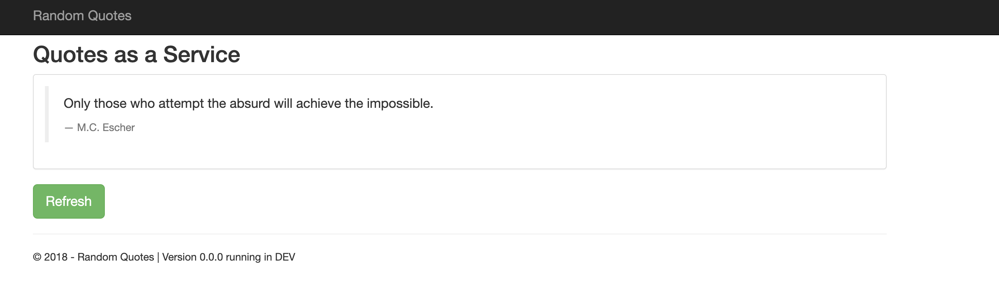

Kubernetes is a powerful container orchestration tool. 

Kubernetes reads YAML files that define the resources you are deploying to. Of course, not everybody loves writing YAML. To help make this easier, we've released a tool that helps developers build YAML files for Kubernetes cluster deployments. You can find the tool at https://k8syaml.com/.

## Overview

A YAML file is a human-readable configuration file that will tell Kubernetes how to provision and deploy a service. The left-hand side of the tool contains the various options for the YAML file. Each option has a drop-down menu that is populated. The right-hand side contains the YAML file that Kubernetes will use. Two features built into the k8syaml tool are live updates and two-way sync.

### Live updates

When changing fields on the left-hand side of the tool, the YAML file on the right-hand side will also update to match. Changing the resource type from Deployment to StatefulSet on the left-hand side will change the YAML file to match the new option. Live updates can add new options to the YAML file that were not there before.

*Deployment resource type*

*Stateful set resource type*

## Two-way sync

You can edit the YAML in the k8yaml tool by selecting the  **EDIT YAML** button.

In the edit pane, you can edit any field. Here I will edit the name of the deployment to test-deployment and click done.

Two-way sync will update the left-hand side of the tool to match the edits made. 

## More Information

There are several configurable options in a Kubernetes YAML file. Rather than explaining them in detail here, the tool gives links to the official Kubernetes documentation. Most options will have a 'More information link that will link directly to the documentation.

## Use Case

To show the YAML file in action, I will use it to deploy a Web Application to an Azure Kubernetes Service with Octopus Deploy.  Feel free to follow along!

Fill out the fields according to the image by populating the left-hand side. 

Deployment - Change the value of the app to randomquotes

**Containers** - Delete the nginx default container and add a new container with: 
- **Name**: `randomquotes`
- **Package Image**: `terenceocto/randomquotes-js`
- **Add Port**: `TCP:80`

Click **OK** to confirm.

The text on the right is the YAML file we will use to deploy to Azure. Copy this file for use later.

## Configuring an Azure Account

You need to configure an Azure account and web application to act as a target for the deployment from Octopus. Other targets are possible, such as AWS or local.

Next, you need to create an account in Azure, by navigating to the [Azure portal](https://portal.azure.com/). 

### Creating an Azure Service Principal with the Azure Portal {#create-service-principal-account-in-azure}

<iframe width="560" height="315" src="https://www.youtube.com/embed/QDwDi17Dkfs" frameborder="0" allow="accelerometer; autoplay; encrypted-media; gyroscope; picture-in-picture" allowfullscreen></iframe>

1. In the Azure Portal, open the menu, , navigate to **{{Azure Active Directory,Properties}}** and copy the value from the **Tenant ID** field. This is your **Tenant ID**.
1. Next you need your **Application ID**.
  - If you created an AAD registered application, navigate to **{{Azure Active Directory,App Registrations}}**, click **View all applications**, select the app and copy the **Application ID**.  Please note, the Azure UI defaults to **Owned Applications** tab.  Click the **All Applications** tab to view all app registrations. 
  - If you haven't created a registered app, navigate to **{{Azure Active Directory,App Registrations}}**, click on **New registration** and add the details for your app, and click **Save**. Make note of the **Application ID**.
1. Generate a one-time password by navigating to **{{Certificates & Secrets > New client secret}}**. Add a new **secret**, enter a description, and click **Save**. Make note of the displayed application password for use in Octopus. If you don’t want to accept the default one year expiry for the password, you can change the expiry date.

You now have the following:

- **Tenant ID**
- **Application ID**
- **Application Password/secret**

This means you can [add the Service Principal Account in Octopus](#add-service-principal-account).

Next, you need to configure your [resource permissions](#resource-permissions).

### Resource permissions {#resource-permissions}

Resource permissions ensure your registered app has permission to work with your Azure resources.

1. In the Azure Portal navigate to **Resource groups** and select the resource group(s) that you want the registered app to access. If a resource group doesn't exist, create one by going to **{{Home > Resource groups > Create}}**. After it's created, take note of the Azure subscription ID of the resource group.
2. Click the **Access Control (IAM)** option. Under **Role assignments**, if your app isn't listed, click **Add role assignment**. Select the appropriate role (**Contributor** is a common option) and search for your new application name. Select it from the search results and then click **Save**.

The next step is setting up an [Azure web application](#web-application-setup) and configuring its properties.

### Web application setup {#web-application-setup}

1. In your **Resource group** click **{{Create > Kubernetes Service}}**
2. Give the cluster a name and select an appropriate region. 
3. Accept the default options and click through to Create.
4. The cluster name will be the AKS cluster name in Octopus Deploy. Make note of the resource-group name.

### Add the Service Principal account in Octopus {#add-service-principal-account}

With the following values, you can add your account to Octopus:

- Application ID
- Tenant ID
- Application Password/Key

1. Navigate to **{{Infrastructure > Account}}**.
2. Select **{{ADD ACCOUNT > Azure Subscriptions}}**.
3. Give the account the name you want it to be known by in Octopus.
4. Give the account a description.
5. Add your Azure Subscription ID. This is found in the Azure portal under **Subscriptions**.
6. Add the **Application ID**, the **Tenant ID**, and the **Application Password/Keyword**.

Click **SAVE AND TEST** to confirm the account can interact with Azure. Octopus will attempt to use the account credentials to access the Azure Resource Management (ARM) API and list the Resource Groups in that subscription. 

You may need to whitelist the IP addresses for the Azure Data Center that you're targeting. See [deploying to Azure via a Firewall](https://octopus.com/docs/deployments/azure) for more details.

:::hint
A newly created Service Principal can take several minutes before the credential test passes. If you've double-checked your credential values, wait 15 minutes and try again.
:::

Next, we will set up Octopus Deploy to load the YAML file to set up a Kubernetes cluster.

## Octopus Deploy Setup

Create a project with a production environment in your Octopus Deploy instance. To do this, go to **{{Infrastructure, Environments, Add Environments}}** to add the production environment. Then, go to **{{Projects, Add Project}}** to add a project.

Go to **{{Library, External Feeds}}** and set up a docker registry. Since we are using the public repository, you can leave credentials blank.

Set up the Kubernetes target by going to **{{Infrastructure Deployment Targets, Add Deployment Target, Kubernetes Cluster}}**. Fill out the step according to the image below, replacing the account, AKS cluster name, and resource group with your values. Click Save to finish.

In your new project, create a deploy Kubernetes container step by going to **{{Process, Add Step, Kubernetes, Deploy Kubernetes Containers}}**. 

Make sure to add the 'kube' role under the on behalf of option to trigger the build for the Kubernetes deployment target. Paste the YAML file from the k8yaml tool into the edit YAML section. Click SAVE to finish.

Click create a release and click the deploy steps to deploy the release. Wait for the success message. Now that the deployment is successful, we will access the Web Application by exposing the cluster to the internet. Go to the Azure portal and bring up the Powershell Azure CLI.

    az aks get-credentials --resource-group myResourceGroup --name myAKSCluster
    
This command will point the CLI to your cluster.

    kubectl get deployments

Running this command will get the list of deployments on the cluster. You should see the deployment 'octopus-deployment'. We will use this name to expose the Web Application.

    kubectl expose deployment octopus-deployment --type=LoadBalancer --name=my-service
    
This command will create a service named 'my-service' that will generate a public IP to view the Web Application.

    kubectl get services

Run this command, and you will see "pending" under the External-IP. Wait 1 minute, run again, and you should see a public IP in that field. Go to the IP address in the browser to view your Web Application.

In this blog post, you have learned about the new k8yaml tool with live updates and two-way sync. Developers can use the tool to generate a YAML file that is compatible with Kubernetes. You ran through a simple use case with Octopus Deploy and Azure Kubernetes service. You deployed a web application using the YAML file generated by k8yaml.

Happy Deployments!

